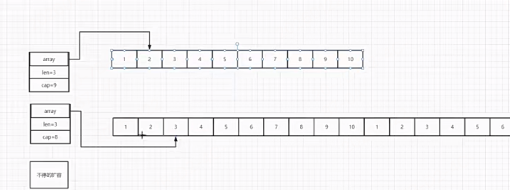

# jilu

1. go 语言 提供了哪些集合类型的数据结构：数组，切片slice，映射map，集合，通道  ==== （slice和map最常用，重点掌握）
2. : 切片的原理图
3. go语言中有一个空的类型叫：nil，nil可以用来表示map、slice、channel等引用类型的零值，表示它们没有被初始化或者没有分配内存空间。（类似于js的null）
   1. 当你声明一个map但没有使用make函数初始化它时，这个map的值就是nil。对于一个nil map，你不能直接向它添加键值对，因为它没有底层的数据结构来存储这些数据。如果你尝试向一个nil map添加键值对，会导致运行时错误（panic）。因此，在使用map之前，必须先使用make函数或字面量语法来初始化它，以确保它不是nil。
4. 集合类型总结
   1. 数组：不同长度的数组类型是不一样的，比如：[10]int 和 [20]int 是两个不同的类型。
   2. 切片：动态数组，用起来方便，性能高，尽量使用
   3. map：
   4. list：链表，性能一般，不建议使用

## go的语法常识

1. 在 Go 文件的包级（顶层）只能出现声明（package、import、const、var、type、func 等）。你当前文件在包级处写了一个普通语句： fmt.Println(add(1, 2)) 这是一个表达式语句，不是声明。编译器在解析文件会报错
   1. 变量的声明:= 这种写法也不能在顶层，必须在函数定义局部变量时使用
2. Go 支持 多重赋值
   1. 左边多个变量，右边多个值，同时赋值，不需要临时变量
   2. 【x, y = y, x     // 交换普通变量】
3. go的继承说法：go语言没有继承的概念，但是可以通过组合来实现继承
   1. Go 没有传统意义上的类继承
   2. Go 实现 “继承效果” 的唯一方式：结构体嵌入匿名字段
   3. 除此之外，没有任何其他继承方式
   4. Go 的设计哲学：组合优于继承
4. go的接收器：接收器可以绑定在「任何命名类型」上，不只是结构体！只要是你用 type xxx 定义的命名类型，都能挂方法,,,,没有接收器，Go 就没有接口，没有多态
   1. 最常见：给基础类型包一层，绑定方法
   2. 语法：type Age int; func (a Age) IsAdult() bool {return a >= 18}