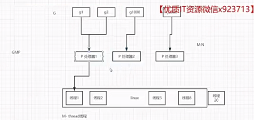

# 03并发编程

1. 概念
   1. 进程 = 独立工厂资源隔离，占地大，搬家（切换）极慢。
      1. 进程：操作系统资源分配最小单位，完全独立内存空间
      2. 线程：进程内执行单元，共享进程内存，OS 内核调度
   2. 线程 = 工厂里的工人一个工厂多个工人，工人换岗需要领导（操作系统）调度，成本高。
   3. 协程 = 同一个工人「多任务穿插干活」
2. 协程概念：同一根线程里面，人为分出多个「独立的代码执行流」，可以手动 / 自动 挂起、暂停、恢复，在单线程内实现并发，切换开销几乎为 0，
   1. 跑在单个线程里
   2. 多段代码交替执行
   3. 切换不用内核、不用系统调用
   4. 开销极小、内存极小、几万 / 几十万随便开

## 传统语言和方案演进

其他语言中的并发编程一般是通过多线程或多进程来实现，操作系统级别上：多线程或多进程存在的问题，很多时候如web2.0场景力不从心
1. 耗费内存，内存占用很大
2. 线程切换的开销大

Go语言中，并发编程是通过协程（Goroutine）来实现的。很多语言也都有协程，如python的asyncio，php-swoole，java的虚拟线程是协程netty，C++的libuv，Rust的tokio，**Go语言的Goroutine**。go语言中没有提供线程的，因为他是web2.0后的新语言，一开始设计时就没有设计线程，所有的库都是协程级，没有线程级。

1. 线程级的核心痛点（Web2.0 高并发场景致命短板）
   1. 内存占用极高
      1. 单个 OS 线程默认栈内存通常 1MB～8MB
      2. 上万并发连接 = 上万线程，内存直接爆炸，服务器上限极低
   2. 上下文切换开销大
      1. 线程切换需要：内核态 / 用户态切换、寄存器保存、页表刷新、全局资源调度
      2. 高并发下，大量 CPU 资源浪费在切换而非业务计算
   3. 调度由内核全权接管
      1. 内核调度粒度粗，无法针对业务轻量任务优化
      2. 海量阻塞线程会拖慢整体调度效率
   4. 开发成本高
      1. 需手动控制锁、竞争、死锁、上下文隔离
      2. 线程池容量固定，伸缩性差
----

- 几乎所有主流语言，都是 线程 + 协程 同时支持，只有 Go 语言是特例：完全不暴露系统线程，只给你用 Goroutine（协程）
- nodejs中也没有真正意义上的协程，只是伪协程，只有异步事件循环，nodejs支持高并发，是因为单线程+非阻塞IO=能抗大量链接，但它不是靠协程，是靠事件驱动
  - 因为 async/await 写法长得像协程，但底层完全不是一回事。
- 协程（Goroutine / PHP 协程 / Python 协程）的特点：
  - 用户态切换
  - 可以挂起 / 恢复
  - 多个执行流并发跑在单线程里
  - 有独立栈、独立上下文
- Node.js 的 Promise /async-await 特点：
  - 还是单线程
  - 还是事件循环
  - 还是回调包装
  - 没有栈切换、没有上下文保存、没有真正挂起

## go语言中的协程

- 协程（goroutine）是Go语言中的一种轻量级线程，它与线程相比，具有以下特点：
  - 主要是：内存占用小，切换快（因为不是操作系统线程级切换，而是函数式切换），执行效率高
  - 依附于线程，用户态调度
    - 不经过操作系统内核，语言 / 框架自己调度，切换极快。
  - 可挂起、可暂停、可恢复
    - 遇到 IO（数据库、网络、等待）主动让出执行权，不卡死线程。
  - 轻量极致
    - 系统线程：默认栈 1MB～8MB
    - 协程：栈 2KB～几 KB，单机轻松十万级并发

1. 主流语言协程实现
   1. Python：asyncio 单线程异步协程
   2. Java：Netty 基于 Reactor 事件循环 + 异步模型
   3. C++/PHP：libuv、Swoole 协程
   4. Rust：tokio 异步运行时
   5. Node.js：底层 libuv 事件驱动的asyncawait等伪协程
   6. Go：Goroutine 原生语言级协程
2. 协程通用优势
   1. 用户态调度：不陷入内核，切换开销极小
   2. 极小内存：初始栈内存 KB 级别，支持动态伸缩
   3. 轻量化：单机轻松支撑十万、百万级并发
3. goroutine的特点
   1. 无原生线程模型，全链路协程化
      1. Go 诞生于 Web2.0 高并发时代，设计之初就摒弃传统线程模型
      2. 标准库、网络库、IO 操作、定时器全部基于 Goroutine 设计
      3. 没有暴露系统线程 API，业务层只能使用 Goroutine
   2. GMP 自研调度器（Go 运行时级别）
      1. G：Goroutine（轻量任务）
      2. M：OS 系统线程
      3. P：逻辑处理器（调度上下文）
      4. 由 Go 运行时 自主调度，而非操作系统内核
      5. 多路复用：少量 OS 线程 承载 海量 Goroutine
   3. 极致低开销
      1. Goroutine 初始栈仅 2KB，运行时动态扩容 / 缩容
      2. 上下文切换仅需保存少量寄存器，无内核态切换
      3. 单机轻松开启 百万级 Goroutine
   4. 配套原生并发能力
      1. channel 实现协程通信，共享内存不用乱加锁
      2. sync 基础原语、CSP 并发模型
      3. 网络 IO 自动多路复用、阻塞协程自动调度挂起

## 3-2 gmp的调度原理

g：goroutine协程程序代码层
m：操作系统级线程层
p：逻辑处理器中间层

1. GMP的调度原理视频大概讲讲goroutine的调度原理，与传统的线程切换有区别
   1. 传统线程切换需要操作系统级去调度，还得协同寄存器，来回切换，性能较差，
   2. 协程：相当于是在系统级线程和程序代码中加了一层封装的调度层，通过一些调度算法，减少系统级thread的切换开销
   3. 就是整体gmp3层，实现的go中的协程调度
   4. 具体逻辑处理器调度原理和考虑各方面细节，后续可以找下详细的博客文章补充TODO
## 3-3 通过waitgroup等待协程执行

wait group主要用于goroutine的执行等待，Add方法必须与Done方法配套成对使用

