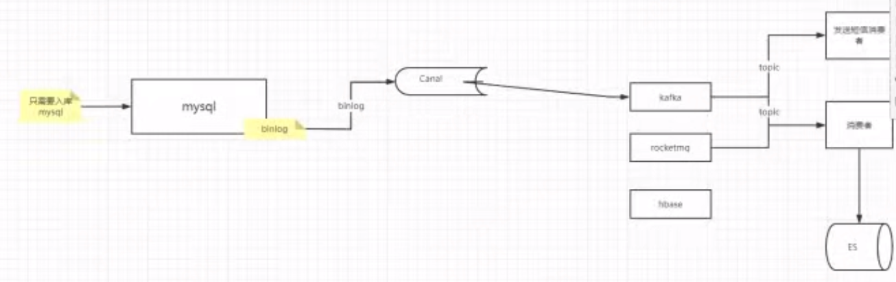
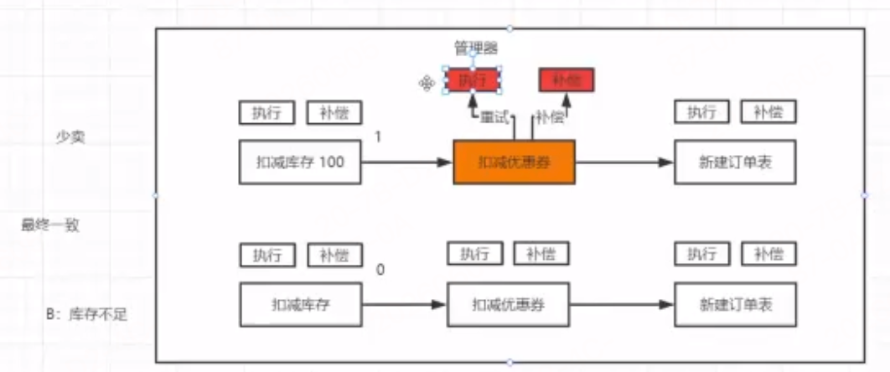

# 阶段10 基于gmicro重构项目

1. DO模型和DTO模型后续规范化统一单独维护到`domain`目录（专门放领域信息，do，dto等），data/v1目录只负责维护接口，做到了更好的职责划分 ---- **更符合DDD规范**，后面的微服务都按这种结构来
   1. domain/do:每个do文件就代表一个表结构文件，设置好对应的表名
   2. domain/dto：dto模型

## 第32周 用户商品服务重构

### 1-1 data层接口设计
主药完成`jieduan9-自研微服务框架-gmicro/mxshop/app/user/srv`下的微服务重构迁移
代码主药改动见`jieduan9-自研微服务框架-gmicro/mxshop/app/user/srv/data/v1/user.go`
### 1-2 userstore接口的实现

- 主药完成`jieduan9-自研微服务框架-gmicro/mxshop/app/user/srv/data/v1/db/user.go`data层接口的具体结构体方法实现
### 1-3 重构service层接口实现

- 主药实现`jieduan9-自研微服务框架-gmicro/mxshop/app/user/srv/service/v1/user.go`

### 1-4 重构controller层代码，list和通过id查询用户

- 见`jieduan9-自研微服务框架-gmicro/mxshop/app/user/srv/controller/user/list.go`
- 见`jieduan9-自研微服务框架-gmicro/mxshop/app/user/srv/controller/user/by_id.go`
### 1-5 重构controlle层代码，通过mobile查询用户
- `jieduan9-自研微服务框架-gmicro/mxshop/app/user/srv/controller/user/by_mobile.go`
### 1-6 重构controller层代码，用户更新和密码校验
- `jieduan9-自研微服务框架-gmicro/mxshop/app/user/srv/controller/user/update.go`
- `jieduan9-自研微服务框架-gmicro/mxshop/app/user/srv/controller/user/password.go`
### 1-7&8 底层数据库的连接封装
- `jieduan9-自研微服务框架-gmicro/mxshop/app/user/srv/data/v1/db/mysql.go`
- `jieduan9-自研微服务框架-gmicro/mxshop/app/pkg/options/mysql.go`
- `jieduan9-自研微服务框架-gmicro/mxshop/app/user/srv/config/config.go`
  - `jieduan9-自研微服务框架-gmicro/mxshop/configs/user/srv.yaml`
### 1-9&10 mysql配置文件映射启动测试运行和bug修复


---
### 1-11 用户服务的api层服务初始化

主药针对电商系统api目录名：登录注册，个人信息修改
admin后台管理系统：用户列表接口

我们以产品的维度在一个微服务中统一进行调用rpcserver，不再以原来的每一个都做成api微服务了

- 代码主要见：`jieduan9-自研微服务框架-gmicro/mxshop/app/mxshop/api`
### 1-12 重构login接口
- 代码见`jieduan9-自研微服务框架-gmicro/mxshop/app/mxshop/api/internal/controller/user/v1/login.go`
### 1-13 用户服务的data层重构
- `jieduan9-自研微服务框架-gmicro/mxshop/app/mxshop/api/internal/service/user/v1/user.go`
- `jieduan9-自研微服务框架-gmicro/mxshop/app/mxshop/api/internal/data`
### 1-14&15 重构login的service等代码
### 1-16 封装底层的rpc链接

- `jieduan9-自研微服务框架-gmicro/mxshop/app/mxshop/api/internal/service/service.go`
- `jieduan9-自研微服务框架-gmicro/mxshop/app/mxshop/api/router.go`
- `jieduan9-自研微服务框架-gmicro/mxshop/app/mxshop/api/internal/data/rpc/rpc.go`
### 1-17 封装rpc服务的client端tracing拦截器

- 拦截器封装：`jieduan9-自研微服务框架-gmicro/mxshop/gmicro/server/rpcserver/clientinterceptors/tracinginterceptor.go`
- 在`jieduan9-自研微服务框架-gmicro/mxshop/app/mxshop/api/internal/data/rpc/user.go`中使用
- 在`jieduan9-自研微服务框架-gmicro/mxshop/app/mxshop/api/router.go`使用
### 1-18 重构短信发送逻辑
- 见`jieduan9-自研微服务框架-gmicro/mxshop/app/mxshop/api/internal/controller/sms`
  - 短信逻辑中，需要用到redis的使用，下节讲封装redis链接和在sms中使用redis
- `jieduan9-自研微服务框架-gmicro/mxshop/app/mxshop/api/router.go`中的`POST("send_sms", smsCtl.SendSms)`使用
### 1-19 基于redis的封装

- 这个封装库，与业务无关的，我们把它放到根目录下的pkg下公用：`jieduan9-自研微服务框架-gmicro/mxshop/pkg/storage`的核心redis_cluster.go文件
  - 基于 `go-redis/redis v9` 实现上层封装的redis链接库
  - 这是项目统一 Redis 存储层封装，统一配置驱动，自动适配-屏蔽 Redis 多种部署形态差异（单机 / 哨兵 / 集群），对外提供统一的 CRUD、集合、列表、有序集合、发布订阅、管道、滑动窗口等通用。
    - 上层业务（短信、登录、缓存、限流）无需关心底层是哪种 Redis 架构，直接调用 RedisCluster 方法即可
  - 这个封装库使用了`"github.com/go-redis/redis/extra/redisotel/v9"` redis专门的otel库，集成了opentelemetray
- 这个库在业务层中怎么使用的
  - `jieduan9-自研微服务框架-gmicro/mxshop/app/pkg/options/cache.go`中建立其配置选项
  - `jieduan9-自研微服务框架-gmicro/mxshop/app/mxshop/api/config/config.go`配置初始化
  - `jieduan9-自研微服务框架-gmicro/mxshop/app/mxshop/api/app.go`的NewAPIApp方法封装链接redis
  - `jieduan9-自研微服务框架-gmicro/mxshop/app/mxshop/api/internal/controller/sms/v1/sms.go`就可以使用redis的具体API了
### 1-20 测试api层服务&重构注册接口

- 想测试从头开始启动用户服务的api层服务
  - 先设置配置文件：`jieduan9-自研微服务框架-gmicro/mxshop/configs/shop/api.yaml`
  - 最后在`jieduan9-自研微服务框架-gmicro/mxshop/cmd/shop/api.go`入口cmd启动api层服务
- 接着来看注册接口的实现
  - 完成controller层`jieduan9-自研微服务框架-gmicro/mxshop/app/mxshop/api/internal/controller/user/v1/register.go`
### 1-21 登录校验

- 先完成用户信息详情的接口：`jieduan9-自研微服务框架-gmicro/mxshop/app/mxshop/api/internal/controller/user/v1/info.go`
- 主要完成 `jieduan9-自研微服务框架-gmicro/mxshop/app/mxshop/api/auth.go`，相关使用
  - 然后在`jieduan9-自研微服务框架-gmicro/mxshop/app/mxshop/api/router.go`中以中间件方式使用auth认证
### 1-22 调试token解析
### 1-23 更新用户信息接口重构
`jieduan9-自研微服务框架-gmicro/mxshop/app/mxshop/api/internal/controller/user/v1/update.go`

### 2-1 定义商品服务的DO模型

- 主要完成`jieduan9-自研微服务框架-gmicro/mxshop/app/goods` 商品相关的微服务

- 完成`jieduan9-自研微服务框架-gmicro/mxshop/app/goods/srv/internal/data/v1/`的所有商品，分类等各种的DO模型和接口结构定义
  - 相关的DO模型和DTO模型与user服务不太一样，是单独维护到了`domain`目录（专门放领域信息，do，dto等），data/v1目录只负责维护接口，做到了更好的职责划分 ---- **更符合DDD规范**，后面的微服务都按这种结构来

### 2-2&3 重构商品相关的data-DB接口

- 主要完成`jieduan9-自研微服务框架-gmicro/mxshop/app/goods/srv/internal/data/v1/db`相关DB接口实现

### 2-4 商品列表页重构需求分析

- 主药完成`jieduan9-自研微服务框架-gmicro/mxshop/app/goods/srv/internal/service`
  - 需要先实现DDD规范下的dto接口到`jieduan9-自研微服务框架-gmicro/mxshop/app/goods/srv/internal/domain/dto`目录下
### 2-5 重构商品服务的ES接口
`jieduan9-自研微服务框架-gmicro/mxshop/app/goods/srv/internal/data_search`
- 面向接口编程，先实现接口，再实现es目录具体实现结构体，与data/v1目录规范一样
### 2-6 重构商品服务的ES查询接口
- 实现`jieduan9-自研微服务框架-gmicro/mxshop/app/goods/srv/internal/data_search/v1/es/goods.go`
### 2-7 重构service层商品列表页接口
### 2-8 基于事务完成商品的创建

- 业务：新增商品
- MySQL 落库（强事务、核心数据）
- ES 写入索引（检索、查询用）
- 诉求：尽量保证 MySQL 成功 ↔ ES 成功，避免两边数据不一致。

- `jieduan9-自研微服务框架-gmicro/mxshop/app/goods/srv/internal/service/v1/goods.go`
- 重点是数据库与es同步的事务问题
  - 方案1:之前的入es的方案是给gorm添加aftercreate
    - 流程
      - GORM 执行 Create → MySQL 事务提交成功
      - 触发 AfterCreate 钩子 → 同步调用 ES 写入
    - 问题（致命）
      - MySQL 已经落库成功，ES 写入失败 / 超时 / 网络断 → MySQL 有数据、ES 无数据，永久不一致。
      - 钩子内部拿不到外层事务的控制权，你无法在钩子内部决定 “要不要提交事务”；
      - 无法回滚 MySQL，属于先库后索引，无任何补偿。
    - 适用：完全不关心检索一致性、临时测试
  - 方案2:原来做的 分布式事务， 异构数据库的事务， 基于可靠消息强最终一致性方案 ---- 也是比较重的方案： 每次都要发送一个事务消息
  - 方案3:弱最终一致性方案共用 GORM 事务对象 CreateInTxn（同事务内串行 DB + ES），即下面这种方案通过获取全局的数据库事务对象来解决数据库和es的同步问题------ 这种方案是不是就没有问题了呢，还是有缺点的，最终一致性比可靠消息稍微弱一点
    - ---- 因为操作es时，万一es接口1秒超时了，但网络延迟2秒后已经通知到es了，那么此时就不一致了，还是没有RocketMQ的事务消息机制可靠方案强，
    - ---- 对于一致性不高的场景，可以简单用这个
    - ✅ 优点
      - 架构极简：不依赖 MQ、不写消费者、不用事务监听，代码量少、维护简单
      - 同步执行：调用返回后，主流程就能保证 “两边都成 / 两边都败”（绝大多数正常网络场景）
      - 开发成本极低，适合快速迭代、内部系统、低一致性要求业务
    - ❌ 缺点（本质短板）
      - 无法处理「调用超时但远端实际执行成功」，这是异步 HTTP 调用天生的不确定性
      - 服务宕机、网络延迟会造成不可逆数据不一致
      - ES 同步阻塞 MySQL 事务，长事务影响 DB 性能
      - 没有重试、回查、巡检等兜底机制，故障后只能人工修复
  - 目前是方案3的代码实现：`jieduan9-自研微服务框架-gmicro/mxshop/app/goods/srv/internal/data/v1/goods.go`
    - 方案3的做法因为与es操作需要同步在事务中去提交创建,所以增加这个事务控制的创建接口方法：`CreateInTxn(ctx context.Context, txn *gorm.DB, goods *do.GoodsDO) error`
- 下节讲一个事务最终一致性的生产级新方案，
### 2-9 通过canal消费mysql的binlog完成数据最终一致性的方案

这是异构数据同步（MySQL→ES）业界主流生产方案，彻底解决之前 AfterCreate、事务串行、MQ 事务消息的各类痛点
 - 只适用解决MySQL → 其他系统的最终一致
 - 
#### 一、核心概念铺垫
1. Binlog（MySQL 二进制日志）
MySQL 所有 DDL/DML 写操作（增、删、改）都会记录到 Binlog，特点：
顺序写入、持久化、不可篡改
记录完整数据变更前后镜像
主从复制、数据同步、灾备的底层依赖
2. Canal 是什么？
Canal 是阿里开源的 MySQL Binlog 增量订阅 & 消费组件：
伪装成 MySQL 从库，向主库请求 Binlog
解析 Binlog 事件（INSERT/UPDATE/DELETE），封装成结构化数据
对外提供 TCP/HTTP/MQ 接口，业务服务拉取变更事件
3. 方案核心思想
业务只管操作 MySQL，数据同步交给 Canal 异步消费 Binlog 完成。
业务服务：只做核心业务 + MySQL 事务，完全不感知 ES；
Canal的消费方：监听 MySQL 数据变更，自动同步到 ES；
依靠 Binlog 持久化 + 消费重试，保证强最终一致性。
4. 方案对比
   1. Canal+Binlog：数据库增量数据同步工具（MySQL CDC 方案）
      1. 原理：伪装成 MySQL 从库，拉取 binlog → 解析成 INSERT/UPDATE/DELETE → 投递到 MQ/Kafka
      2. 核心：被动监听数据库变更，业务代码完全无侵入，**这一点在这个场景下比RocketMQ 事务消息方案好**
      3. 范围：仅限 MySQL / MariaDB
      4. 优点：零代码、无侵入、无锁、高可用、高可靠
   2. RocketMQ 事务消息（可靠消息最终一致性）分布式事务方案（解决「本地事务 + 发消息」原子性）
      1. 原理：半消息 → 本地事务 → commit/rollback → 回查兜底
      2. 核心：业务主动发消息，保证「DB 事务成功 ⇔ 消息一定发出」
      3. 范围：与数据库无关，任何系统（Java/Go/PHP/…）、任何 DB（MySQL/Oracle/PG/Mongo）都能用
      4. 一致性：业务级最终一致；业务失败消息不发，业务成功消息必达
#### 架构
```js
// 架构
客户端请求 → 商品微服务 → MySQL（主库）
                      ↓ (Binlog 日志)
                ┌── Canal Server（解析Binlog）
                │
                ↓ 推送变更事件
        消息队列(RocketMQ/Kafka)
                ↓
        同步消费服务 → 写入 ES
// 消息队列（RocketMQ/Kafka）：解耦 Canal 与消费服务，削峰、重试、堆积兜底。
// 同步消费服务：消费 Canal 推送的数据变更，根据事件类型（增 / 改 / 删）执行 ES 索引操作。
```


1. 异常兜底流程（核心：保证最终一致）
   1. 场景 1：ES 宕机 / 网络故障，写入失败
      1. 消费服务写入 ES 报错，不提交 MQ 位移。
      2. MQ 触发重试投递，多次重试仍失败则进入死信队列。
         1. 死信队列：普通消息队列的附属队列。当一条消息重试达到最大次数，依然消费失败，MQ 不会再继续重试，而是把这条消息转发到专门的死信队列中。后续等待人工介入查看修复
      3. 运维修复 ES 后，手动重放死信消息，数据最终同步。
   2. 场景 2：Canal 服务宕机
      1. MySQL Binlog 持续累积，Canal 重启后从上次消费位置继续拉取，不会丢数据。
   3. 场景 3：MySQL 主库宕机 / 切换主从
      1. Binlog 完整保留，Canal 切换数据源后继续消费，数据不丢失。
   4. 场景 4：重复消费
      1. MQ 重试、网络抖动会导致消息重复，利用 商品 ID 作为 ES 文档 ID 天然幂等，重复写入只会覆盖，不会产生脏数据。
2. canal一般大数据团队常用
### 2-10 通过map-reduce包完成并发调用控制
重点完成通过id批量查询商品信息的`BatchGet`接口

- `jieduan9-自研微服务框架-gmicro/mxshop/app/goods/srv/internal/service/v1/goods.go`
- 重点：如果不想用底层提供的批量接口，可以用这个包进行并发查询，帮我封装了很多细节
  - go-zero提供了一个包`map-reduce`非常好用， 但是我们自己去做并发的话 - 一次性启动多个goroutine
  - map-reduce: `"github.com/zeromicro/go-zero/core/mr"`
  - 使用时注意点：必须保证线程安全和变量的引用关系

### 2-11 启动goods的service服务

同样的想要启动，也需要在`jieduan9-自研微服务框架-gmicro/mxshop/app/goods/srv`下创建`app.go` 和 `rpc.go`文件

- 主要完成这2个文件的逻辑和相关关联逻辑
- `jieduan9-自研微服务框架-gmicro/mxshop/app/goods/srv/internal/controller/v1/goods.go`创建相关文件
- 重点：本节的rpc.go逻辑，稍显繁琐，下列是待优化的点，下节进行具体优化实现
  - 优化1:当前是手动依赖注入，层级一多组装代码变冗长。
    - 服务变复杂（新增缓存、MQ、中间件）后，NewGoodsRPCServer 会越来越长。
    - 优化方向：引入 Google Wire 做自动依赖注入，自动生成组装代码；使用 Wire / ioc-golang 自动依赖注入，减少手动组装代码。
  - 优化2:多个服务的构造初始化，逻辑繁琐需要一个工厂模式，统一构造
### 2-12 通过工厂模式改造service和data层

> 面向接口编程

- 先定义一个data级别的工厂的接口`jieduan9-自研微服务框架-gmicro/mxshop/app/goods/srv/internal/data/v1/data.go`
  - 在db接口实现层：先在mysql中实现这个抽象工厂：`jieduan9-自研微服务框架-gmicro/mxshop/app/goods/srv/internal/data/v1/db/mysql.go`
  - db下的每个表do实现：如`v1/db/banner.go`都从参数中接受工厂统一维护的db对象使用
- 然后在service层使用db时，统一使用工厂的db服务入口去操作do
  - 如`gs.data.Categorys()`方式
- 同样的在data_search也做抽象工厂模式
### 2-13 启动商品服务

- 创建个cmd：`jieduan9-自研微服务框架-gmicro/mxshop/cmd/goods/goods.go`
  - 相关文件串联逻辑自己看
### 2-14 完成controller层的商品列表接口
- `jieduan9-自研微服务框架-gmicro/mxshop/app/goods/srv/internal/controller/v1/goods.go`
### 2-15 调试商品列表页接口

- 先自己创建client目录进行微服务测试：`jieduan9-自研微服务框架-gmicro/mxshop/app/goods/client/client.go`
- 排查启动bug
  - 如空指针问题：`panic: runtime error: invalid memory address or nil pointer dereference`
    - `jieduan9-自研微服务框架-gmicro/mxshop/app/goods/srv/internal/domain/do/goods.go`
- 后续生产环境直接用gin服务调用

### 2-16 gorm打印日志的集成

gorm默认有一个logger实现，我们自己实现了统一logger，我们可以集成到gorm中，本节简单点先使用它内置的
- `jieduan9-自研微服务框架-gmicro/mxshop/app/goods/srv/internal/data/v1/db/mysql.go`
### 2-17&18 商品服务的api接口重构

- 主要实现api层的商品服务的整个3层代码结构的代码编写
- `jieduan9-自研微服务框架-gmicro/mxshop/app/mxshop/api/internal/controller/goods/v1/goods.go`
- `jieduan9-自研微服务框架-gmicro/mxshop/app/mxshop/api/internal/service/goods/v1/goods.go`
- `jieduan9-自研微服务框架-gmicro/mxshop/app/mxshop/api/internal/data/rpc/goods.go`

## 第33周 订单，库存等服务重构
因为这俩微服务订单依赖库存，先实现独立依赖少的库存服务，订单服务依赖他后实现
### 1-1 api服务的service层重构
完成前面的一些整个链路串联启动的逻辑完善

如：`jieduan9-自研微服务框架-gmicro/mxshop/app/mxshop/api/router.go`相关逻辑
### 1-2 重构库存服务的data层接口实现

- 先创建`jieduan9-自研微服务框架-gmicro/mxshop/app/inventory`大目录
- 创建`jieduan9-自研微服务框架-gmicro/mxshop/api/inventory`
### 1-3 service层重构get和create

- 重点完成`jieduan9-自研微服务框架-gmicro/mxshop/app/inventory/srv/internal/service`
- 先完成Create和get方法
### 1-4 库存扣减接口重构
- 重点完成`jieduan9-自研微服务框架-gmicro/mxshop/app/inventory/srv/internal/service`
- 重点讲下的Sell方法
  - 把当前订单里的商品按 商品 ID 从小到大排序，这是经典防死锁手段。
  - 处理批量扣减库存时订单时需要使用`go自带的"sort"`包进行排序
    - Go 标准 sort 包不是不能对切片排序，而是不能「直接用一行代码无脑排序任意切片」，它要求类型实现指定接口
    - sort 包内置了常用基础类型的专用排序函数，无需实现接口，直接调用
    - 如果是结构体切片、自定义类型切片，直接调用 sort 会编译报错，需要满足特定的接口
    - 代码见：`jieduan9-自研微服务框架-gmicro/mxshop/app/inventory/srv/internal/domain/do/inventory.go`
  - 当前加redi分布式锁位置（循环内部）
    - 锁放循环内部（商品级锁）：串行执行、防超卖、并发性能最优，生产首选。
      - 放内部锁力度细，以商品为维度，
    - 锁放循环外层（订单级锁）：功能正常，但锁持有久、性能差，不推荐
  -  全局数据库事务，整个订单所有商品扣减，共用同一个 DB 事务，要么全部扣减成功，要么全部回滚
### 1-5 重构reback库存归还接口

代码见搜：` (is *inventoryService) Reback(ctx context.Context, ordersn str`

1. 库存归还的时候有不少细节
   1. 1. 主动取消 2. 网络问题引起的重试 3. 超时取消 4. 退款取消
   2. -- 也应该加分布式锁：防止并发请求重复归还
   3. 一定要考虑并发安全的问题

- 最终再测试启动：`jieduan9-自研微服务框架-gmicro/mxshop/cmd/inventory/inventory.go`

### 2-1&2 saga分布式事务解决方案的原理

- 长事务、跨多个微服务 / 数据库，无法用本地事务、2PC 的场景（电商下单、库存、订单、支付、物流等链路）。
  - SAGA和TCC和基于可靠消息如RocketMQ最终一致性方案同个级别也是 属于 最终一致性 分布式事务方案，不追求强一致，保证最终数据一致。
- 10分钟说透Saga分布式事务解决方案：https://cloud.tencent.com/developer/article/1839642
  - https://dtm.pub/practice/saga.html#%E5%A6%82%E4%BD%95%E5%81%9A%E8%A1%A5%E5%81%BF
  - https://cloud.tencent.com/developer/article/2048777?policyId=1004
  - saga的一致性是弱于TCC的，它简化成了2个步骤：执行和补偿，没有了TCC的confirm步骤，它内部有个管理调度器负责执行和补偿。
- 

#### Go生态有专属的分布式事务框架
主要2大类：
1. DTM (Distributed Transaction Manager)
   1. 定位：目前 Go 语言生态最强、最流行 的分布式事务框架
   2. 官网：纯 Go 开发，轻量、易部署、API 极简
   3. 支持模式：TCC、SAGA、二阶段消息、XA等分布式解决方案
2. Seata（原 Fescar）阿里生态跨语言
   1. 定位：国内第一分布式事务框架，全方案支持，企业标准选型
   2. 支持模式：AT、TCC、SAGA、XA、事务消息 全覆盖，等分布式解决方案
   3. 角色：TC (协调器) + TM (事务管理器) + RM (资源管理器)
### 2-3 dtm的安装

- 官方文档：https://dtm.pub/guide/why.html#%E7%8E%B0%E5%AE%9E%E9%97%AE%E9%A2%98

1. 安装dtm：https://dtm.pub/guide/install.html
2. 线上部署后注意事项：https://dtm.pub/deploy/base.html#%E6%A6%82%E8%A7%88
3. dtm只支持http和grpc协议,后面我们对这两个协议进行demo演示测试

### 2-4 dtm快速体验http的saga分布式事务
- 参考：https://dtm.pub/guide/e-saga.html例子快速体验

- 代码见`jieduan10-基于gmicro重构项目/dtm/main.go`

### 2-5 Http的转账服务的saga事务调试
- 代码见`jieduan10-基于gmicro重构项目/dtm/main.go`
**注意细节：**
1. 切记接口操作失败时，一定要返回状态码：否则dtm服务不知道你这个接口成功还是失败 
2. 当返回失败如500时，它会默认触发重试策略：采用退避算法
   1. https://dtm.pub/ref/options.html#%E9%87%8D%E8%AF%95%E6%97%B6%E9%97%B4
3. 当业务上余额不足，不想进入重试，直接进入补偿
   1. 参考http响应协议：https://dtm.pub/practice/arch.html#proto，返回409状态码即可
5. 测试强行制造user1转入失败时：执行`user3先转出到user1，user1再转入`能否金额恢复正常
```js
SUCCESS
HTTP：200，且 body 含 "dtm_result":"SUCCESS"
gRPC：code=OK
含义：分支成功 → 继续下一个 action
FAILURE（你关心的 409）
HTTP：409 Conflict，或 200 含 "dtm_result":"FAILURE"
gRPC：code=Aborted
含义：确定性业务失败，不重试，触发全局回滚（补偿）
ONGOING
HTTP：425 Too Early，或 200 含 "dtm_result":"ONGOING"
gRPC：code=FailedPrecondition
含义：未完成，需要重试
所有非 409/425/200-SUCCESS 的错误（500、网络超时、连接失败等）：
DTM 视为未知异常 → 自动重试（指数退避）----- 走配置的重试策略，如触发告警规则等
```
### 2-6 grpc的事务编排

- 代码见`jieduan10-基于gmicro重构项目/dtm/rpc/main.go`
  - `qsBusi := "127.0.0.1:8019" // 默认直连的话直接写库存微服务的端口号连grpc，下节讲链接consul的服务发现的方式`
- DTM 对 gRPC 状态码有明确约定，只认 gRPC standard code，自定义业务 error 无效。
  - 先记住两个核心结论：
  - 触发补偿（回滚）：返回 codes.Aborted
  - 触发重试：返回 codes.Unavailable / codes.DeadlineExceeded
  - 文档说明：https://dtm.pub/practice/arch.html#proto
- 制造异常，测试补偿机制：`jieduan9-自研微服务框架-gmicro/mxshop/app/inventory/srv/internal/controller/v1/inventory.go`
  - 的`Sell(`方法
```js
codes.OK（0）
→ dtm_result=SUCCESS
→ 继续执行下一个 action
codes.Aborted（10）
→ 对应 HTTP 409 / FAILURE
→ 不重试、直接全局回滚（补偿）
其他状态码（Unavailable、DeadlineExceeded、Unknown 等）
→ 视为未知异常
→ DTM 自动重试（指数退避），直到成功或超时；重试期间不补偿,走配置的重试策略，如触发告警规则等
```
### 2-7 基于服务发现完成分布式事务的调度

- 需要根据微服务kartos接入文档中接入，我们的mxshop基本与kartoa源码一致，所以可以直接用kratos的driver
  - https://dtm.pub/ref/kratos.html
  - 需要在conf.yml中添加如下内容：
  ```js
  MicroService:
    Driver: 'dtm-driver-kratos' # name of the driver to handle register/discover
    Target: 'consul://127.0.0.1:2379/dtmservice' # register dtm server to this url
    EndPoint: 'grpc://localhost:36790'
  ```
  - 源码方式启动dtm：`go run app/main.go -c conf.yml # conf.yml 为你对应的 dtm 配置文件`
- 然后代码见`jieduan10-基于gmicro重构项目/dtm/rpc/main.go`

### 2-8 子事务屏障和gin集成测试

- 在 Saga/TCC 里，网络、超时、重试会导致：
  - 重复调用（幂等问题）
    - DTM 重试，你的接口被调多次
    - 比如扣钱 / 减库存，不能扣多次
  - 空补偿（补偿时机乱了）
    - 正向操作还没执行，补偿先来了
    - 没扣钱，却执行 “加钱补偿” → 数据错
  - 悬挂（正向晚到）  
    - 补偿执行完了，正向请求才到
    - 补偿已经回滚，正向又执行 → 数据错
- 这些情况自己写代码判断非常复杂，DTM 直接用子事务屏障帮你搞定。


- 子事务屏障是 DTM 核心机制，解决分布式事务中幂等、空补偿、悬挂三大问题。
- 原理：本地库需要提前建 dtm_barrier 表，用 gid+branchid+op 唯一键拦截非法请求。
  - 子事务屏障 = 本地数据库一张状态表 + 唯一键拦截 + 本地事务包裹
  - 表名：dtm_barrier
  - 唯一键：gid + branchid + op（全局事务 ID + 分支 ID + 操作类型）
  - 每次执行分支 / 补偿时：
    - 开本地事务
    - 尝试插入唯一键记录
    - 插入失败 → 说明已执行过 / 非法请求 → 直接返回，不执行业务
    - 插入成功 → 执行业务，一起提交
- 效果：
  - 重复请求 → 被过滤
  - 空补偿 → 被过滤
  - 悬挂 → 被过滤
  - 正常请求 → 放行

```js
// DTM 回调你的 gRPC/Gin 接口时，会在 URL Query 里带上：
// gid：全局事务 ID
// branchid：当前分支 ID
// op：操作类型（try/compensate）
// trans_type：事务类型（saga/tcc）
// BarrierFromQuery：把这些参数解析出来，生成子事务屏障对象。
// 后面你调 barrier.CallWithDB，它就会：
// 自动管理 dtm_barrier 表
// 自动拦截幂等 / 空补偿 / 悬挂
// 保证业务逻辑最多执行一次
func MustBarrierFromGin(c *gin.Context) *dtmcli.BranchBarrier {
	ti, err := dtmcli.BarrierFromQuery(c.Request.URL.Query())
	fmt.Println(err)
	return ti
}

// 业务代码用法
func DecrStock(c *gin.Context) {
    bb := MustBarrierFromGin(c) // 拿到屏障
    db := GetDB()

    // 屏障包裹业务：自动处理幂等/空补偿/悬挂
    err := bb.CallWithDB(db, func(tx *sql.Tx) error {
        // 你的正常业务：扣库存
        return DecrStockTx(tx, 1001, 10)
    })
    if err != nil {
        c.JSON(500, gin.H{"err": err.Error()})
        return
    }
    c.JSON(200, gin.H{"msg": "ok"})
}
```
## 第34周 订单服务重构，wire进行ioc控制


### 1-1 订单系统data层数据接口定义

