# 阶段11 基于k8s部署项目

## 34周 通过k8s部署服务
### 1章 持续集成
#### 1-1 基于docker进行go build构建
`jieduan11-基于k8s部署项目/build/build/main.go`
演示只使用1个阶段，镜像很大，含了go编译环境，下节解决
#### 1-2 通过多阶段构建对go镜像瘦身

- alpine3.17 是什么？
  - Alpine Linux：面向容器 / 嵌入式的极简轻量 Linux 发行版，主打：
    - 极小体积（基础镜像 ~5MB）
    - 安全（默认 musl libc + BusyBox + OpenRC，攻击面小）
    - 容器生态标配（Docker/K8s 最常用基础镜像）
  - Go 最佳实践：CGO_ENABLED=0 静态编译，生成 纯静态二进制，可直接跑在 alpine 上，无依赖问题
- golang:1.19.4-alpine3.17：
  - 自带 Go 1.19.4 工具链，可直接编译
  - 基于 alpine，比 Debian 版小 2/3，构建更快
  - 可 apk add 安装依赖（如 git、make、gcc）
- 纯 alpine:3.17：
  - 最终镜像 ~5MB + 二进制（几 MB）
  - 无 Go 工具链、无源码、无依赖，安全、启动快、拉取快
- Docker 镜像不是凭空创建的，所有镜像都依赖「基础镜像」，必须指定基础镜像，而绝大多数基础镜像本身就是一个微型操作系统环境。

- `jieduan11-基于k8s部署项目/build/build/Dockerfile`
- 「编译阶段 + 运行阶段」分离方案
- 第一阶段：基于 golang 镜像编译源码，生成可执行文件；
  - 如果只用一个阶段的话，编译出来的镜像会很大300多M，包含了go的基础编译环境，所以需要使用多阶段进行瘦身
- 第二阶段：基于轻量 alpine 镜像只运行程序，剔除编译环境、依赖、源码，最终镜像体积极小
#### 1-3 完善多阶段构建的dockerfile
缓存优化：
```js
先拷贝依赖文件，利用 Docker 缓存：依赖不变就不重复 download时就会直接读取缓存
COPY go.mod .
COPY go.sum .
RUN go mod download
# 拷贝项目全部源码到容器 /build
```

#### 1-4 devops、ci、cd和gitops等概念

- 概念参考文档
  - 大妈都能看懂的 GitOps 入门指南：https://www.51cto.com/article/713049.html
  - DevOps 与 CICD 详解：https://www.cnblogs.com/qingqing-919/p/15136818.html
  - 持续集成：主药就是把我们的代码自动上传，编译构建自动化测试代码分析扫描等，打包成镜像
  - 持续部署：主药就是把镜像部署到k8s中
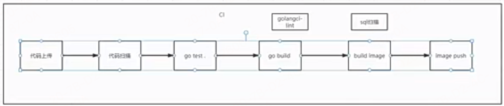

#### 1-5 安装git parameter插件
> 主要完成通过jekins完成go build镜像的过程

- 主要跟之前一样，在一个新云服务器上安装jekeins和汉化插件等，
  - 注意：不需要装ssh插件了，我们之前是把代码推送到线上服务器，我们现在要使用docker了直接上传镜像仓库了，不需要ssh了
- 再安装一个git parameter插件
#### 1-6 如何构建一个生产环境的镜像
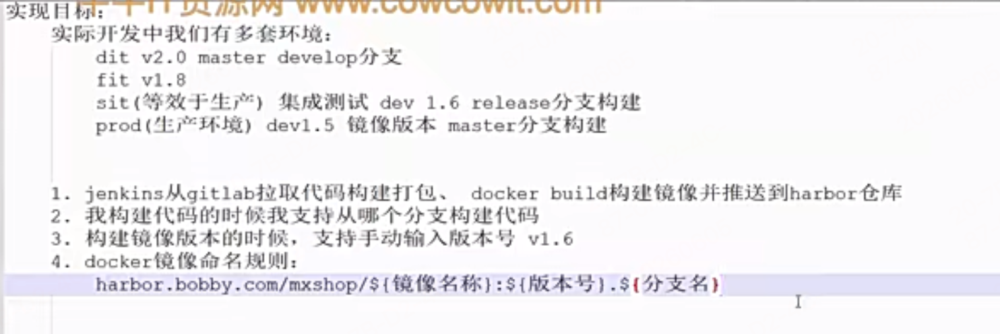
#### 1-7 pipeline参数化构建

- 现在jekins中插件管理中安装一个pipeline插件，因为它默认只有默认模式
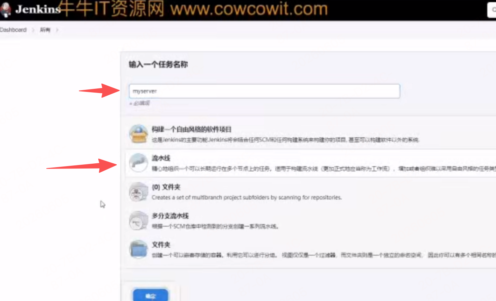
- 创建一个流水线任务，选择参数化构建，
  - 选择git参数模式：用来支持分支变量的，就是我们之前安装的gitt parameter插件支持的
    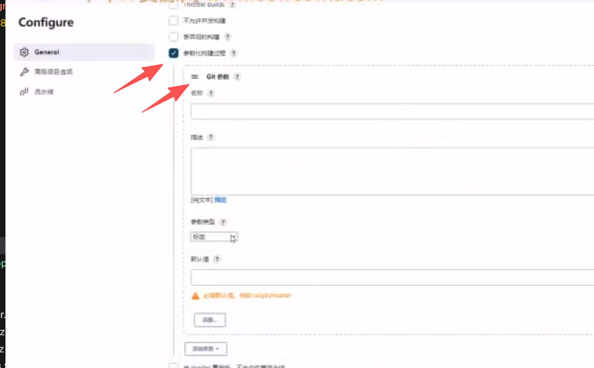
  - 再选择个字符参数：用来支持版本号变量的
  - 接着选择流水线配置的定义
    - 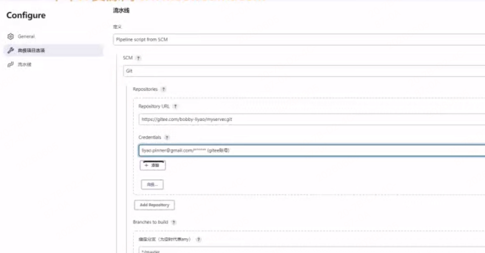
    - 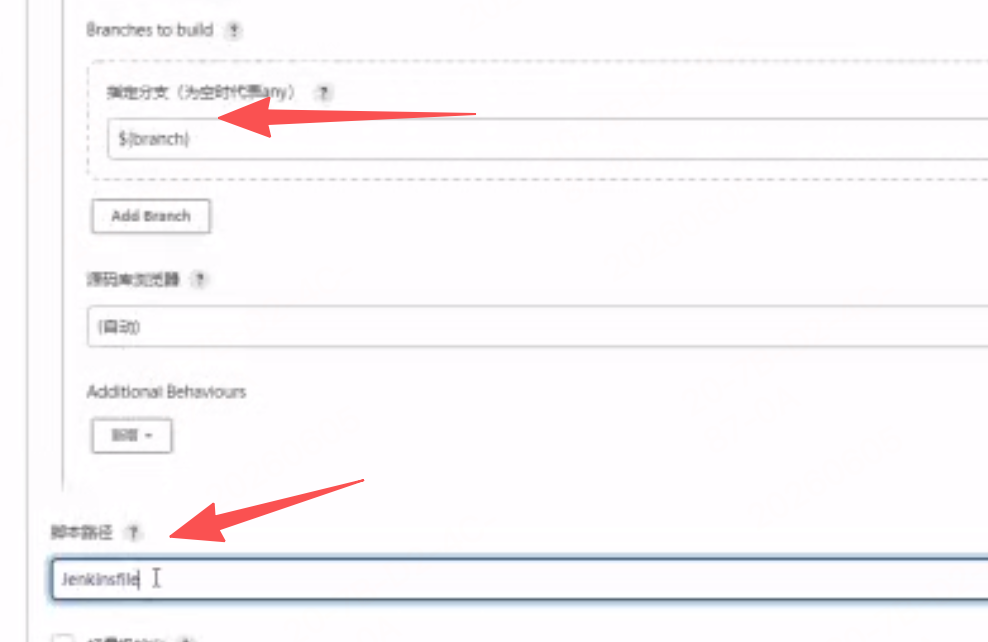
      - 注意这个指定分支写的变量，是与之前的git参数设定的参数变量一样，指定要拉取的分支，
    - 后续进行构建任务时，会让你写这些前置变量
      - 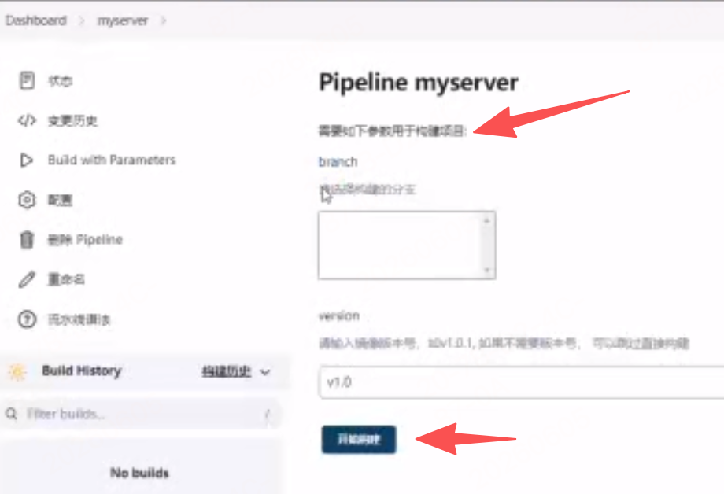 
  - 接下来重点开发脚本文件jekeinsfile


**命令积累**
`git config --unset credential.helper --system`

配置项名称：凭证助手，作用是保存 Git 账号密码、免重复输入账号密码

--system
配置作用域（三选一）：
--system：系统全局级别，对整台服务器所有用户生效，配置文件在 /etc/gitconfig
--global：当前登录用户级别，只对当前用户生效（~/.gitconfig）
无参数：仅当前仓库生效（仓库内 .git/config）

- 系统级开启凭证助手
  - Git 的 credential.helper 凭证缓存，核心就是记住 Git 账号 / 密码 / Token，实现一次输入、长期免密。
  - 日常场景：使用 `HTTPS协议时的免密方案,ssh协议默认就是免密`， 地址拉取、推送代码时，不用反复输账号密码
`git config --system credential.helper store`

- 用户级开启（推荐）
`git config --global credential.helper store`

- 镜像名：hello-go ，容器命名为 myserver
  - `docker run --rm -P --name myserver hello-go`
  - -P（大写 P）
    - 全称：--publish-all
    - 作用：自动映射端口
    - 读取镜像里 EXPOSE 声明的所有端口，随机分配宿主机高端口（32768~60999）做转发。
    - 对比小写 -p：手动指定端口映射（生产常用）
  - --rm
    - 作用：容器停止 / 退出后，自动删除容器本身
    - 适用：临时测试、一次性运行的容器，不用手动 docker rm 清理残留容器
    - 注意：不要用于生产常驻服务，意外停服会直接销毁容器
#### 1-8 编写Dockefile
- 参见jenkis流水线的示例git项目：`jieduan11-基于k8s部署项目/myserver-master`
#### 1-9 编写Jenkinsfile完成docker构建和发布

- 需要先去docker登录，为什么
  - `docker login -u admin -p Harbor12345 http://47.99.50.241:30002`
    - `-u`：指定用户名，这里是 zqxkingmm789
    - `-p`：指定密码，这里是 zxc@asd123
    - `http://47.99.50.241:30002`: 登录的哈勃私有部署的镜像仓库地址
      - 未写仓库地址，默认登录 Docker Hub（官方公共镜像仓库 docker.io）
    - 执行后会把凭证加密存入 ~/.docker/config.json，后续拉 / 推 Docker Hub 镜像自动鉴权
  - Docker 登录 docker login，本质是给本地 Docker 客户端，绑定镜像仓库的账号身份。
  - 镜像仓库分两类，规则完全不同：
    - 1. 公有镜像（公共仓库）
      - 以 Docker Hub、阿里云镜像仓库公共镜像为例：
      - 公开镜像：不用登录也能拉取
      - 任何人都可以 docker pull 镜像名，比如 docker pull nginx。
      - 为什么有时依然要求登录？
        - 限流 / 配额限制
        - Docker Hub 对匿名拉取有严格频率、IP 配额，频繁拉取会被拦截、报错 pull rate limited；登录个人账号后，配额会放宽。
        - 部分官方 / 精选镜像限制，少数镜像要求登录后才能下载。
    - 2. 私有镜像（企业 / 个人私有仓库）
      - 这是登录最主要的使用场景：
      - 私有镜像 = 加密资源，外人看不到、拉不了；
      - 必须 docker login 认证身份，仓库校验账号权限，合法用户才能拉取 / 推送镜像。
      - 典型场景：公司内部私有镜像仓库、个人私有仓库、Harbor、Registry、阿里云私有镜像。 
4. `docker build -f build/Dockerfile  -t $REGISTRY/mxshop/myserver:\${version}.\${branch}`
   1. -t 镜像名称拆解
      1. $REGISTRY → 镜像仓库地址 + 命名空间（私有仓库 / 组织）
      2. mxshop/myserver → 镜像名称（唯一标识这个应用镜像）
      3. v1.0.main → 冒号后面的都是标签（tag）（版本、环境、分支、构建编号）
   2. 该阶段执行 Docker 镜像构建，指定自定义 Dockerfile 路径，并按「仓库 / 项目 / 服务：版本。分支」规则打镜像标签。
   3. 转义 \${}
      1. jenkins的流水线里，$ 是变量符；Shell 中也要用变量，因此反斜杠转义，最终传给 Shell 的是 ${version}、${branch}
#### 1-10 jenkins构建后发布到k8s中
**1、通过jenkins界面中构建任务把基于jenkinsfile将构建好的镜像上传到了harbor中了**
- git仓库已提前在流水线配置界面中配置了git仓库地址了，它会自动在默认的runner机拉取执行git仓库里的jenkinsfile
- jenkins系统用户问题：操作系统里的 jenkins 用户
  - 是服务器的系统用户，和 root、www、nginx 一样，是 Linux 系统层面的账号。
  - 谁创建的？
  - 安装 Jenkins 时（yum /apt/ 官方包），安装脚本自动创建的，不是你手动建的。
  - 作用：Jenkins 服务默认用这个系统用户启动、运行，所有构建过程、文件读写、执行命令，都是以 jenkins 系统用户身份跑的。
- 服务器中默认jenkins构建docker会失败
  - 流程
    - 启动 Jenkins 服务 → 进程身份 = 系统用户 jenkins
    - 构建任务执行 docker ps / docker build
    - docker 命令实际要连接 /var/run/docker.sock
    - 该文件只允许 root 和 docker 组用户访问
    - jenkins用户默认 不在 docker 组 → 连接被拒绝 → 构建失败
  - Docker基础架构：是典型客户端 / 服务端（C/S）架构，两部分独立运行：
    - Docker Client（客户端）
      - 就是你日常敲的 docker build / docker run / docker ps 等命令
      - 只负责发送请求，本身不干活
      - 通过 Unix 域套接字 /var/run/docker.sock 和服务端通信
        - **该文件只允许 root 和 docker 组用户访问**
    - Docker Daemon（服务端，dockerd）
      - Docker 后台守护进程，系统服务：docker.service
      - 真正负责：拉镜像、构建容器、启停容器、管理网络 / 存储
      - 监听 /var/run/docker.sock，接收客户端请求并执行
- 所以jenkins默认构建docker会报权限错误：permission denied while trying to connect to the Docker daemon socket at unix:///var/run/docker.sock
  - 解决：
  - grep docker /etc/group
    - 检查 docker 用户组是否存在及其成员信息
    - 原理：在 Linux 系统中，所有的用户组定义都存储在 /etc/group 文件中。该命令会在该文件中搜索包含 docker 的行。如果存在，通常会输出类似 docker:x:999:jenkins 的结果，其中最后一个字段就是当前属于该组的用户列表
  - sudo usermod -aG docker jenkins
    - 将 jenkins 用户追加到 docker 用户组中
    - usermod：用于修改用户账户属性的命令。
    - -aG：-a 代表 Append（追加），-G 代表指定附加组（Supplementary Groups）。必须组合使用，表示将用户追加到指定的附加组中，而不会覆盖或移除该用户原本所属的其他组
  - systemctl restart jenkins
    - 重启 Jenkins 服务。
- 使用dockerlogin后还是会失败：由于本地部署的harbor镜像仓库服务是http的，docker会认为不安全，禁止访问
  - Docker 守护进程（dockerd）出于安全考虑，默认强制要求与镜像仓库通过 HTTPS 协议进行通信。当本地部署的 Harbor 使用 HTTP 时，Docker 会拒绝连接并抛出类似 http: server gave HTTP response to HTTPS client 的错误
  - 解决：
    - `sudo vim /etc/docker/daemon.json`
    -  添加这个配置项："insecure-registries": ["<Harbor服务器IP>:<端口>"]
    -  重载配置并重启 Docker 服务
       -  sudo systemctl daemon-reload
       -  sudo systemctl restart docker
- 然后就成功通过jenkins构建任务把镜像上传到了harbor中了
  - 访问harbor，查看镜像确实存在了

**2、接着考虑用kubesphere部署镜像发布到k8s，支持访问**

1. KubeSphere 连接 K8s → 从仓库拉取镜像部署应用 → 配置网络实现外部访问
2. KubeSphere 是基于 Kubernetes（K8s）的开源企业级容器云平台，可以理解为：给 K8s 装了一个强大的可视化操作界面 + 一站式云原生运维能力，降低 K8s 的使用门槛。
   1. kubectl标准 CLI / Dashboard旧官方UI / Headlamp官方UI：K8s 官方原生工具，只做基础集群管理，无内置 CI/CD、多租户、监控告警、应用商店等企业能力。
   2. KubeSphere：第三方企业级平台，在 K8s 之上加了一整套 “开箱即用” 的运维 / DevOps / 多租户能力，不是官方。
3. **KubeSphere基本使用流程：**
   1. 可参考博客链接：https://juejin.cn/post/7345660202714775562
      1. 官方文档：https://docs.kubesphere.com.cn/v4.2.1/
    ```js
    应用负载下的工作负载（Workload）：是 K8s 里运行应用实例的统称也对应控制器类型，KubeSphere或k8s 把它分成三类控制器类型：
        - 部署（Deployment）：无状态服务用，比如你的 gRPC/HTTP 服务，支持多副本扩缩容、滚动更新。
        - 有状态副本集（StatefulSet）：有状态服务用，比如数据库、消息队列，保证实例有固定的网络标识和存储。
        - 守护进程集（DaemonSet）：集群每个节点上都会跑一个实例，比如日志采集、监控 agent。

    部署（Deployment）：属于一种控制器类型
        它的核心任务：创建并管理 Pod容器组（也就是你真正的应用进程），
        创建Deployment部署，是用来往上抽象一层的管理pod容器组的，创建时需要选择管理哪些pod容器组
              比如你部署的 user-service，会被它拉成 3 个运行中的 Pod 实例
        它负责扩缩容、滚动更新、故障重启这些，保证你的服务有实例在跑
        它的特点：
        Pod 的 IP 是动态变化的，重启、扩缩容后 IP 都会变
        它只管 “让实例活着”，不管 “别人怎么找到我”
    服务（Service）：创建服务时，需要指定对应的工作负载即控制器
        它的核心任务：给一组 Pod 提供一个固定的访问入口
        它会分配一个固定的 ClusterIP（集群内虚拟 IP），或者 NodePort 外网端口
        它会自动维护一个「可用 Pod 列表」（也就是 Endpoint），Pod 挂了、扩缩容了，它都会自动更新
        它的特点：
        地址是固定不变的，客户端只需要记住服务名 （名称填 user-service-svc）/ ClusterIP 就行
        它只管 “流量怎么进来、怎么转发”，不管 “实例怎么运行”
        - KubeSphere 为了新手方便，在「服务」页面做了一个一键打包：
                你在「服务 → 创建」→ 选「无状态服务」→ 填镜像、副本、端口
                后台自动：
                创建一个 Deployment（干活的）
                创建一个 Service（入口）
                自动把两者用标签绑定好
                所以你看到 “服务里也能设容器、副本”，只是界面简化，不是 Service 能干 Deployment 的活
    关系：服务（Service）通过标签选择器找到部署（Deployment）创建的 Pod：
        你创建部署时，会给 Pod 打上标签，比如 app: user-service
        创建服务时，配置选择器 app: user-service
        服务会自动把所有带这个标签的 Pod 加入到自己的后端列表里，给它们做流量转发
        一句话：部署负责造实例，服务负责给这些实例开一个固定的门。

    测试访问
        - 集群内测试：可以临时部署一个 busybox 测试 Pod，用 grpcurl 或 curl 访问 user-service-svc:8021。
        - 外网测试（NodePort 模式）：用任意集群节点的公网 IP + NodePort 端口，直接访问你的服务，比如 grpcurl -insecure 47.99.50.241:30877 list。
    ```

#### 1-11 对user服务进行CI构建

- 代码见：`jieduan9-自研微服务框架-gmicro/mxshop/build/docker/user`
  - 编写dockfile，jenkinsfile
- 在jenkins流水线配置界面中配置user服务的git仓库地址，它会自动在默认的runner机拉取执行git仓库里的jenkinsfile
- 走完构建流程后，成功在harbor中上传了user新镜像
- 下节讲部署服务
#### 1-12 KubeSphere部署用户服务
- KubeSphere中有个配置字典：
  - ConfigMap = K8s 专门存放「应用配置文件 / 配置参数」的内置配置字典
  - 作用：把配置和容器镜像解耦
  - 存放内容：普通文本、配置项、完整配置文件、环境变量
  - 特点：纯明文、非加密（密码 / 密钥用 Secret，别放这里）
  - 对应你之前 Dockerfile 里的：
    - CMD ["-c", "configs/user/srv.yaml"]
    - 这个 srv.yaml 配置文件，必须放到 ConfigMap 里统一管理，否则报错
    - 否则运行镜像时，它已经脱离了原项目了，是找不到configs/user/srv.yaml源码文件的
#### 1-13 修改user服务的配置

- 逐个将配置里的各个依赖的服务配置改成k8s内部的服务地址
  - 如mysql，nacos等 
#### 1-14 解决gemicro的ip地址的bug

- `jieduan9-自研微服务框架-gmicro/mxshop/gmicro/app/app.go`
  - 主要修改buildInstance函数中的`a.opts.rpcServer.Address()`相关逻辑
  - 会优先读取a.opts.rpcServer.Endpoint()进行设置ip，这个endpoint值是`listenAndEndpoint方法`代码自动解析出来的实际ip地址
  - 默认的内部服务都是分配的集群虚拟ip和内部端口或内部服务名，要想外部可访问，必须通过NodePort配置暴露外部可访问
#### 1-15 测试用户服务
- 参考这个客户端文件：jieduan9-自研微服务框架-gmicro/mxshop/app/user/client/client.go
  - 本地链接k8s中grpc服务测试一下，注意本地只能使用ip端口号直连，不能使用服务发现
    - 因为本地不在集群环境中，访问不到注册中心的，只能通过暴漏的ip和端口号去测试访问
#### 前置k8s基本概念流程

1. Pod容器组
   1. K8s 最小调度 / 运行单元，一个 Pod 内运行一组容器（你的 gRPC 服务就跑在容器里）。
   2. 每个 Pod 拥有独立 IP（PodIP），集群内唯一。
   3. Pod 生命周期不稳定：扩缩容、节点宕机、重启后，PodIP 大概率会变。
   4. 你的多副本 = 多个独立 Pod，每个都有自己的 PodIP。
2. Endpoint（端点，隐藏对象）
   1. 由 K8s 控制器自动维护，你一般不用手动创建。
   2. 作用：记录「一个 Service 对应哪些后端可用 Pod 的 IP + 端口」。
   3. 规则：
   4. Service 通过 selector 标签筛选 Pod，只要 Pod 标签匹配，就会被加入 Endpoint 列表；Pod 异常 / 删除，自动从列表剔除。
   5. 简单理解：Endpoint = Service 的后端地址清单。
3. 普通 Service（ClusterIP 类型）
   1. 作用：给一组 Pod 提供固定访问入口，屏蔽 PodIP 频繁变化的问题。
   2. 自动分配一个 ClusterIP（集群虚拟 IP），这个 IP 生命周期极长，删除 Service 才会改变。
   3. 本身不运行进程，是 K8s 集群层面的流量转发规则集合。
   4. 支持负载均衡：普通 Service 依靠集群节点上的 kube-proxy 实现转发，**转发粒度：基于 TCP 连接，而非单个请求。**
      1. 客户端发起 TCP 握手，目标地址是 ClusterIP:端口。
      2. kube-proxy 拿到连接请求，查询当前 Endpoint 里的可用 Pod 列表，按算法（轮询 / 随机）选中一个 PodIP，完成 TCP 三次握手。
      3. 连接建立完成后，这条 TCP 通道会永久绑定刚才选中的那个 Pod
      4. 它的负载均衡是对http那种短连接生效的，对http2那种长链接是不生效的，包括grpc的拨号和后续请求
4. 场景举例：
   1. 假设环境信息：K8s 集群有两台【节点】：
      1. 【节点】 1：公网 / 外网 IP 110.1.1.1
      2. 【节点】 2：公网 / 外网 IP 110.1.1.2
      3. Service 配置：
         1. 内部 ClusterIP：10.233.37.14（集群虚拟 IP，仅集群内可见）
         2. 内部端口：8021
         3. NodePort 外部端口：20877（所有【节点】都会监听这个端口）
         4. 后端两个业务 Pod：
            1. Pod-A：10.244.0.10:8021
            2. Pod-B：10.244.0.11:8021
   2. 客户端 → 最终 Pod完整请求链路：外网客户端或用户 → 访问任意一节点IP:20877 → 本机ClusterIP:8021 → kube-proxy → 业务Pod
      1. 节点 110.1.1.1 上的操作系统，已经开启了 20877 端口监听（NodePort 特性：所有【节点】都统一开这个端口）。
         1. 你也可以访问 110.1.1.2:20877，效果完全一样，任意节点都能接入
      2. 节点收到 20877 端口的流量后，节点内部做一次转发：把流量从 本机IP:20877 转发到本机的 ClusterIP:8021（10.233.37.14:8021）。
      3. 10.233.37.14:8021 的流量，会被节点上的 kube-proxy 捕获：
         1. kube-proxy 查询这个 Service 对应的后端 Pod 列表（Pod-A、Pod-B）；
         2. 新建 TCP 连接这一刻，按照规则选其中一个 Pod（比如 Pod-A）；
         3. 把数据包转发到选中的 Pod 内部


#### 1-16 k8s的service的负载均衡和本地负载均衡的区别
**1、启动多个副本**：
- 之前本地开发时，启动多个实例了，需要自己在多个终端窗口中启动多个进程并指定不同端口号，基于k8s的容器技术，自动扩容和启动多个副本是非常容易的
- K8s 为什么不用改端口、一键多副本？
  - 你只需要设置 replicas: N，K8s 控制器自动：
    - 拉起 N 个 Pod，每个独立Pod 拥有独立网络栈
      - Pod：每一个实例都像一台独立虚拟机，各自用自己的端口，互不干扰
    - 节点调度、故障重启、扩缩容全部自动化
    - 不用开终端、不用手动启动进程

**3、负载均衡**：

- 原始本地grpc的负载均衡整体流程（全局只 Dial 一次）：
  - 程序启动，执行一次 grpc.Dial，传入服务名（而非单个固定 IP）；
  - Resolver 定时拉取全量服务节点列表（节点上下线自动更新）；
  - gRPC 内部为每个节点建立长连接，形成全局连接池；
  - 每一次 gRPC 调用时**真正做负载均衡**，由 Balancer 从节点列表里选一个节点分发请求，实现负载均衡；
  - 节点故障时，Resolver 自动摘除异常节点，LB 不再转发流量。
- 对接k8s的负载均衡，小总结
  - 由于k8s的普通Services转发粒度：基于 TCP 连接，而非单个请求，如下代码就会产生问题
    ```go
    // 错误用法：一次 Dial，所有请求打一个 Pod
    func main() {
        // 只 Dial 一次,只在这一次触发k8s的普通Service的负载均衡
        conn, _ := grpc.Dial(
            "my-grpc-svc.default.svc.cluster.local:50051",
            grpc.WithTransportCredentials(insecure.NewCredentials()),
        )
        client := pb.NewGreeterClient(conn)

        // 100 次请求 → 全部落在同一个 Pod
        for i := 0; i < 100; i++ {
            client.SayHello(context.Background(), &pb.HelloRequest{Name: "x"})
        }
        conn.Close()
    }
    // 伪“负载均衡”：靠多次 Dial 建新连接，这样能实现k8s的负载均衡，但是这样废掉了gRPC 长连接的正确用法，完全废掉 HTTP/2 多路复用和连接池
    func main() {
        for i := 0; i < 100; i++ {
            // 每次都重新 Dial → 每次新建 TCP 连接
            conn, _ := grpc.Dial(
                "my-grpc-svc.default.svc.cluster.local:50051",
                grpc.WithTransportCredentials(insecure.NewCredentials()),
            )
            client := pb.NewGreeterClient(conn)
            client.SayHello(context.Background(), &pb.HelloRequest{Name: "x"})
            conn.Close()
        }
    }

    // 总结：
    // 1. 如果想实现负载均衡：就抛弃的k8s的普通Service的负载均衡功能继续用原有的grpc+consul，如果后面支持了grpc的这种长链接的负载均衡，就可以不用consul了，直接替换为k8s的接口实现即可，所以我们gemicro框架为什么要对服务发现实现成面向接口编程，因为可以快速替换
    // 2. k8s好像有另一种Service：Headless Service（无头服务，clusterIP: None），这种能支持对接你现有的grpc负载均衡链路
    ```
#### 1-17 部署admin的api服务
- `jieduan9-自研微服务框架-gmicro/mxshop/build/docker/admin`
部署这个api层的服务，为了后面讲解k8s的网关功能使用，都不需要kong网关了
#### 1-18 通过ingress暴漏service
- 为Service服务配置路由，与之前的kong网关是相似的。k8s的网关叫ingress，页面中叫应用路由菜单名。
  - 和kong一样本质上都是基于nginx封装的，ingress和kong可以相互替代，但是kong功能更强大
  - 路由是针对服务的路由，都是路由到对应服务
- 创建路由，填写表单：
  - 配置域名，路径，对应的服务名
    - 域名临时测试可以改本地hosts`47.99.50.241 admin.mxshop.com`

### 2章 k8s


#### 2-1 k8s学习路线
k8s非常庞大，课只是简单日常开发常用，运维级别需要深入了解和二次开发的能力，建议本节学完，有兴趣的可以学习下kubesphere官方介绍云原生实战课程或k8s深入资料等专门的大课资料

#### 2-2 什么是Pod

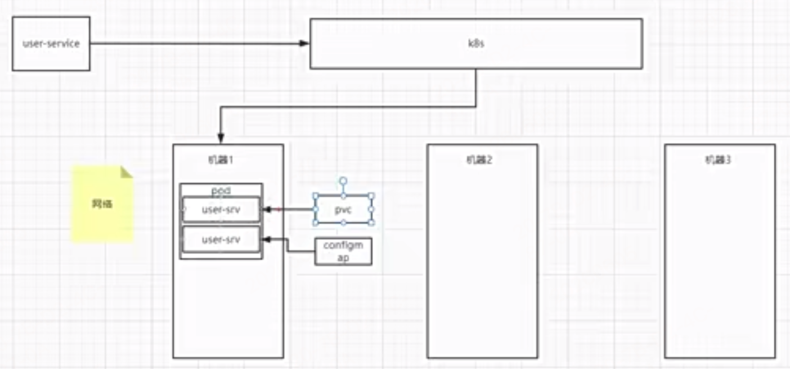

- Pod是最小运行单元，一个 `Pod` 内可包含一个或多个紧密协作的docker镜像容器，pod也叫`容器组`，配置字典或pvc数据卷 可以挂载到Pod维度，里面的容器都可以共享
  - Deployment部署：创建Deployment部署，是用来往上抽象一层的管理pod容器组的控制器概念。

#### 2-3 kubectl 相关的pods命令

相关的官方文档命令：https://kubernetes.io/zh-cn/docs/reference/kubectl/quick-reference/

1. 查看命名空间 & 全命名空间 Pod
```bash
# 查看所有命名空间
kubectl get namespaces
# 等价简写
kubectl get ns

# 查看所有命名空间下的 Pod（两种等价写法）
kubectl get pods --all-namespaces
kubectl get pods -A
```

2. 在 mxshop 命名空间部署 Nginx
```bash
# 先确认命名空间存在，不存在则先创建
kubectl create namespace mxshop

# 在 mxshop 命名空间运行 nginx Pod
kubectl run nginx --image=nginx --namespace=mxshop
# 运行后，就会启动一个pod容器组，此时删除不会自动创建，必须通过Deployment(部署)管理后才会重启
```

3. 通过 Label 筛选 Pod
筛选语法：`-l`（小写L，不是数字1），格式 `key=value`
```bash
# 在 mxshop 命名空间，筛选 label 为 app=user-service 的 Pod
kubectl get pods -n mxshop -l "app=user-service"

# 全局所有命名空间按 label 筛选
kubectl get pods -A -l "app=user-service"

# 多标签同时匹配（and 关系）
kubectl get pods -n mxshop -l "app=user-service,env=prod"
```
```bash
# 查看 Pod 完整标签
kubectl get pods -n mxshop --show-labels

# 给已有 Pod 追加/修改标签
kubectl label pod <pod名称> env=test -n mxshop
```
4. 查看 Pod 日志
```bash
# 按标签筛选并查看日志
kubectl logs -n mxshop -l "app=user-service"

# 实时滚动查看日志（常用）
kubectl logs -n mxshop -l "app=user-service" -f

# 查看最近100行日志
kubectl logs -n mxshop -l "app=user-service" --tail=100
```
5. 查看pod详细信息
```bash
# 基础详细信息（IP、节点、启动时间等）
kubectl get pods -n mxshop -l "app=user-service" -o wide

# 查看完整 YAML 配置
kubectl get pods -n mxshop -l "app=user-service" -o yaml

# 查看单个Pod完整详情（排错核心）
kubectl describe pod <pod名称> -n mxshop
```

#### 2-4 k8s的控制器-如deployment
- 官方文档：https://kubernetes.io/zh-cn/docs/concepts/workloads/controllers/deployment/
- Kubemetes中内建了**很多controller(控制器)**，这些相当于一个状态机，用来控制Pod的具体状态和行为，有以下5种控制器
  1. Deployment:适合无状态的服务部署
     1. 这个部署就是容器组Pod的控制器，对应控制一类Pod实例同配置的镜像，
     2. 一个Deployment只能对应多个同配置的Pod实例即副本的意思；不同配置就只能新建不同 Deployment，各自维护副本，相互独立。
     3. 示例：
        1. deploy-v1：镜像 nginx:1.24
        2. deploy-v2：镜像 nginx:1.26
        3. 适用：版本灰度、多环境配置、差异化实例。
     4. 同一个 Service 通过selector可以关联多个 Deployment
只要 Pod 标签相同，一个 Service 可以同时对接多个不同配置的 Deployment，实现流量统一入口
  1. StatefullSet:适合有状态的服务部署
  2. DaemonSet:一次部署，所有的node节点都会部署，例一些典型的应用场景:
      1. 运行集群存储daemon，例在每个Node上运行glusterd、ceph
      2. 在每个Node上运行日志收集daemon，例fluentd logstash，
      3. 在每个Node上运行监控 daemon,例 Prometheus Node Exporter
  3. Job:一次性的执行任务
  4. Cronjob:周期性的执行任务
- 控制器下负责管理着Pod容器组

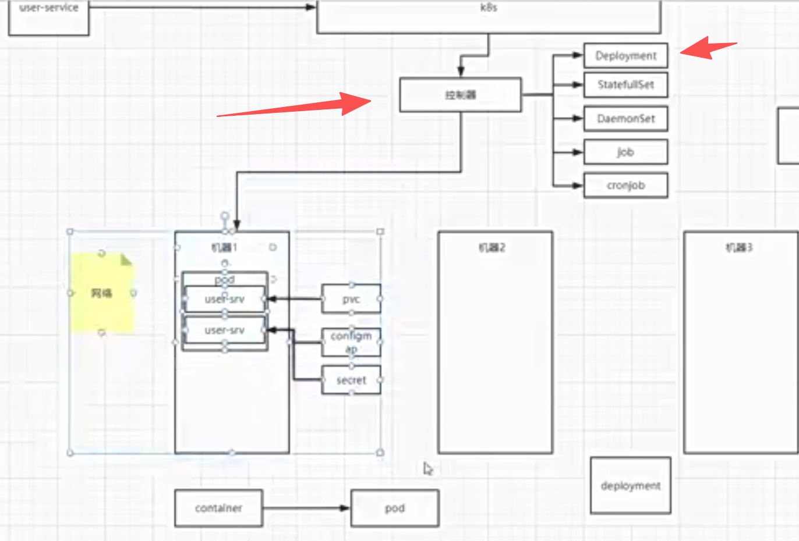


一、Deployment 核心要点（修正 + 完善）
副本数 replicas
字段 replicas 定义期望运行的 Pod 实例数量，实现多实例部署、负载分摊。
spec 配置段
用来定义容器核心配置：镜像、CPU / 内存资源限制、容器端口、数据卷挂载、启动参数等。
更新策略
重建更新（Recreate）：先销毁旧版本所有 Pod，再创建新版本，更新期间服务中断。
滚动更新（RollingUpdate，默认策略）：逐批替换 Pod，新旧版本并行运行，服务零中断，支持灰度发布。
结合前面内容，整理 **Deployment 全套常用实操命令**，按场景分类，语法标准、可直接执行，命名空间统一为 `mxshop`。

一、基础查看
```bash
# 查看当前命名空间所有 Deployment
kubectl get deploy -n mxshop

# 查看详情（更新记录、事件、副本状态，排错首选）
kubectl describe deploy 服务名 -n mxshop

# 按标签筛选 Deployment
kubectl get deploy -n mxshop -l "app=user-service"

# 导出配置到本地 YAML
kubectl get deploy -n mxshop -l "app=user-service" -o yaml > user-service.yaml
```

二、创建 & 运行
```bash
# 命令行快速创建 Deployment
# user-service ：Deployment 资源名称，自定义命名，后续操作（扩缩容、更新、删除）都靠这个名称定位
kubectl create deploy user-service --image=nginx -n mxshop

# 基于本地 YAML 文件创建/更新应用（最常用）
kubectl apply -f user-service.yaml -n mxshop
```

三、副本扩缩容
```bash
# 调整副本数
kubectl scale deploy user-service --replicas=3 -n mxshop
```

四、版本更新（滚动更新）
```bash
# 修改镜像版本，触发滚动更新
kubectl set image deploy user-service 容器名=镜像名:版本 -n mxshop

# 查看更新实时进度
kubectl rollout status deploy user-service -n mxshop
```

五、版本回滚

先删除，再重新 apply/create（彻底重建资源），revision 修订号：会重置，旧的滚动历史全部清空，新 Deployment 从 revision=1 重新开始
```bash
# rollout：专门管理 Deployment/DaemonSet 滚动更新、历史、回滚
# 查看更新历史版本
kubectl rollout history deploy user-service -n mxshop

# 回滚到上一个版本
kubectl rollout undo deploy user-service -n mxshop

# 回滚到指定历史版本
kubectl rollout undo deploy user-service --to-revision=2 -n mxshop
```

六、删除应用
```bash
# 删除指定 Deployment（连带下属 Pod 一起删除）
kubectl delete deploy user-service -n mxshop

# 通过 YAML 文件删除
kubectl delete -f user-service.yaml -n mxshop
```

七、配套 Pod 联动命令（日常组合使用）
```bash
# 查看该应用下所有 Pod
kubectl get pods -n mxshop -l "app=user-service"

# 查看日志
kubectl logs -f -n mxshop -l "app=user-service"

# 进入 Pod 内部
kubectl exec -it Pod名称 -n mxshop -- /bin/sh
```
##### 配置文件的字段

- apiVersion：有以下4种值类型
```bash
# Pod、Namespace、Service、ConfigMap、Secret
apiVersion: v1

# Deployment / StatefulSet / DaemonSet
apiVersion: apps/v1

# HPA 自动扩缩容
apiVersion: autoscaling/v2

# Job、CronJob
apiVersion: batch/v1
```

#### 2-5 k8s的service

- 关联关系：页面上创建服务，创建服务时，需要指定对应的工作负载即那5种控制器，控制器下管理自己的pod容器组
  - 只要 Pod 标签命中 selector，就会被纳入 Service 流量转发，和它由哪个 Deployment 创建无关。
- 常见组合场景
  - 1. 1 个 Deployment → 多个副本的Pod → 1 个 Service（主流）
    - Service 通过标签匹配这 3 个 Pod，外部请求会被轮询分发到不同 Pod。
    - 适用：所有常规业务服务。
  - 2. 1 个 Deployment → 1 个 Pod → 1 个 Service
    - 适用：测试服务、单实例应用。
  - 3. 多个 Deployment → 共用 1 个 Service
    - 只要两个 Deployment 的 Pod 标签相同，就能被同一个 Service 接管。
      - 例：灰度发布（v1、v2 版本 Pod 共存），流量同时打给新旧版本。
  - 4. 1 个 Deployment → 多个 Service
    - 同一个 Pod，可创建多个不同类型 / 端口的 Service，分别对内、对外暴露。
    - 例：一个服务，用 ClusterIP 供集群内部调用，同时用 NodePort 供外部测试访问。

- 配置示例：
```yaml
apiVersion: v1
kind: Service
metadata:
  name: user-service-svc
  namespace: mxshop
  labels:
    app: user-service-nodeport
spec:
  type: NodePort       # 节点端口类型，集群外可通过节点IP+端口访问
  selector:
    app: user-service  # 匹配业务Pod的标签，关联后端Pod
  ports:
  - port: 80           # Service 内部端口（集群内访问）
    targetPort: 80     # 容器端口，和Pod内服务端口一致
    nodePort: 30080    # 节点暴露端口，范围 30000-32767
```

- 应用配置，创建/更新 Service
`kubectl apply -f svc-user-service.yaml -n mxshop`
- Service相关命令
```bash
# 1. 查看 mxshop 命名空间下所有 Service
kubectl get services -n mxshop
# 简写
kubectl get svc -n mxshop

# 2. 根据标签筛选 Service（你需求的命令）
kubectl get svc -n mxshop -l "app=user-service-nodeport"

# 查看 Service 详细信息
kubectl describe svc user-service-svc -n mxshop

# 删除 Service
kubectl delete -f svc-user-service.yaml -n mxshop
# 或按名称删除
kubectl delete svc user-service-svc -n mxshop
```

- 访问测试
  - 集群内部：服务名:端口 访问
    - curl user-service-svc:80
  - 集群外部：任意节点 IP + nodePort 访问
    - curl 节点IP:30080
- Service 三种常用 type 速记
  - ClusterIP（默认）：仅集群内部访问，外部无法访问
  - NodePort：节点暴露端口，外网可通过 节点IP:端口 访问
    - NodePort 缺点（生产不推荐）
      - 端口固定在 30000-32767 段，不标准，外网访问不友好
      - 每个对外服务都要占用一个节点端口，服务多了端口混乱
      - 仅基础转发，没有域名、路径路由、SSL 证书、限流等高级能力
  - LoadBalancer：云厂商环境使用，分配公网 I
  - 一般情况下生产环境中我们不会把它暴漏成NodePort，它只是方便调试用，一般都放为默认的ClusterIP模式，往外套一层网关路由器如ingress，由它做负载均衡
- 常规生产架构
  - 应用 Pod → Service (ClusterIP，仅集群内访问) → Ingress（统一网关） → 外网用户
    - Service 统一用默认 ClusterIP，对内暴露；
    - Ingress 作为统一入口网关，承接所有外部流量，集中做路由、负载均衡、证书、限流。


#### 2-6 k8s的ingress
- 一般情况下生产环境中我们不会把它暴漏成NodePort，它只是方便调试用，一般都放为默认的ClusterIP模式，往外套一层网关路由器如ingress，由它做负载均衡
  - Ingress：网关层，按域名 / 路径做流量路由 + 全局7层负载均衡
  - Service(ClusterIP)：服务层，内置 四层负载均衡，把流量分发到后端多个 Pod
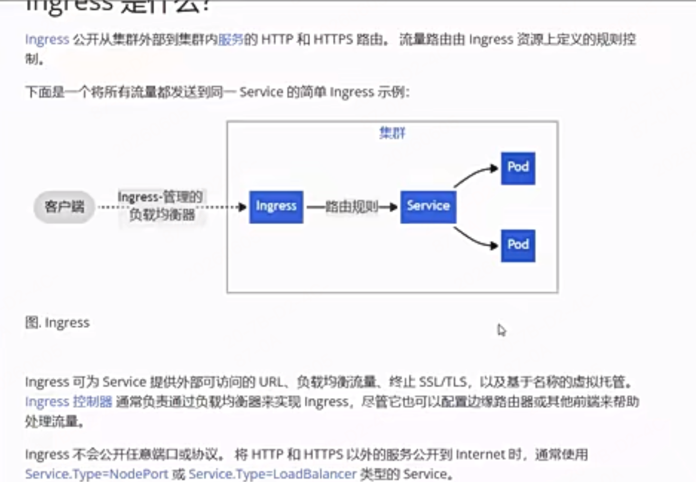
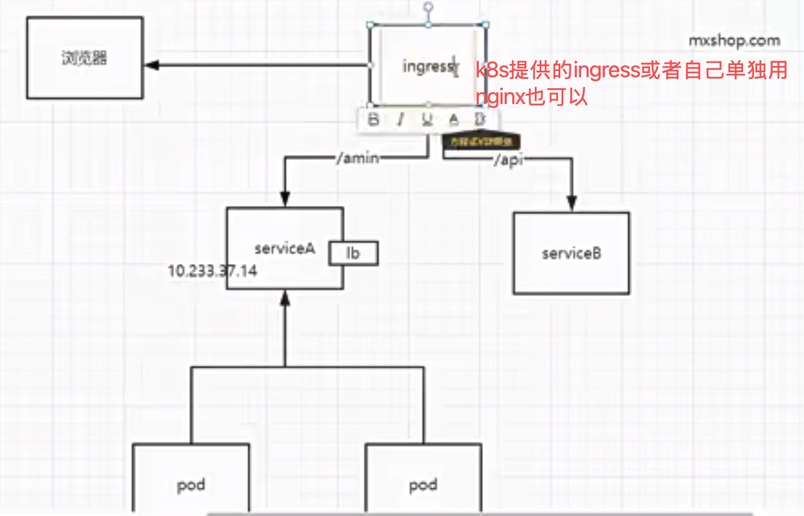
- ingress的配置也是由配置文件生效的，`kind: Ingress`
- ingress及对应的ingress controller作负载均衡的相关概念文档必看
  - https://www.cnblogs.com/xhyan/p/13591382.html
  - https://developer.aliyun.com/article/1353877
  - 重点细节理清：
    - Ingress Controller需要配置对外暴漏的访问模式（NodePort / LoadBalancer / ClusterIP）：
      - 这个只决定流量怎么进到网关，不控制网关内部如何分发到 Pod负载等策略，配置在 Ingress Controller 自身的 Service 里，和 Ingress 路由规则无关。

##### 负载均衡

1. 一般分为4层和7层负载均衡：https://cloud.tencent.com/developer/article/2582842
   1. 4层：典型代表 & K8s 对应
      1. 硬件：F5、A10
      2. 软件：LVS、HAProxy (L4 模式)、K8s Service(kube-proxy)
      3. 场景：数据库、Redis、通用 TCP 服务
      4. 局限：无法按域名、URL、请求头、Cookie 分流；也没法做会话保持（除简单 IP 哈希）、URL 重写、SSL 卸载
   1. 7层：工作流程
      1. 客户端连接 → 七层设备解包解析 HTTP 内容 → 按规则选择后端节点 → 转发请求
      2. 典型代表 & K8s 对应
         1. Nginx、Traefik、Apache、HAProxy (L7 模式)
         2. Ingress Controller 就是是K8s 集群的七层网关
2. Ingress Controller 不止单纯路由，它本身也具备七层负载均衡能力
   1. 基础场景：路由到 Service（最常用）
      1. 标准链路：客户端 → Ingress Controller → Service → Pod
         1. 这里 Ingress Controller 只做「七层路由」：
         2. 根据 Ingress 规则（域名、路径、header、cookie）把请求转发给指定 Service。
         3. 此时Pod 之间的负载均衡，完全由 Service（kube-proxy）负责，Controller 不碰 Pod。
   2. 进阶场景：Ingress Controller 直接负载均衡到 Pod（绕过 Service）--- 生产推荐
      1. Nginx Ingress / Traefik 都支持 Endpoints 直连模式，这是它真正做负载均衡的核心场景。
      2. 原理：Ingress Controller 会直接监听集群 Endpoints 列表（Service 背后所有 Pod IP + 端口），不再转发给 Service，而是七层直连多个 Pod，并自行做负载均衡。，少一层转发、性能更高、支持完整七层负载策略、健康检查
      3. 链路变成：客户端 → Ingress Controller → 直接 Pod
         1. 此时 Ingress Controller 承担的工作：
         2. 路由：按域名 / 路径匹配后端组
         3. 七层负载均衡：在一组 Pod 之间分发请求
         4. 支持策略：轮询、加权轮询、IP 哈希（会话保持）、最少连接等
         5. 健康检查：主动探测 Pod 状态，自动剔除异常实例
         6. 重试、熔断、限流、SSL、URL 重写等网关能力
#### 2-7 k8s的持久卷

- 容器的联合文件系统是临时读写层，数据默认存在容器内部临时存储，存在明显缺陷：
  - 容器崩溃 / 重启，数据全部丢失
    - 容器异常退出、被 kubelet 重启后，会基于原镜像重新创建，内部读写的文件、日志、持久化数据都会清空，回到镜像初始状态。
  - 同一 Pod 内多容器无法共享文件
    - 一个 Pod 里可以运行多个容器，这些容器默认文件系统相互隔离，没法直接读写同一份文件（比如一个容器生成日志、另一个容器收集日志）。
  - 补充：删除 Pod 后，容器临时存储也会彻底销毁，数据永久丢失。
- Volume持久卷 是 K8s 抽象的存储目录，把集群宿主机 / 外部存储的目录 / 设备，挂载到容器内部指定路径。
  - 持久卷专门解决上面两个问题：
    - 数据持久化：数据脱离容器生命周期，容器重启、销毁，Volume 里的数据依然保留。
    - Pod 内多容器文件共享：同一个 Volume 挂载到 Pod 内多个容器的不同路径，实现文件互通。
```bash 
类别	卷类型	核心用途	数据是否持久
临时共享	emptyDir / 内存 emptyDir	Pod 内多容器共享、临时缓存	❌ Pod 删除即清空
节点本地	hostPath / local	挂载宿主机目录、本地磁盘	✅ 绑定当前节点
集群持久	PV+PVC、NFS、iSCSI、云盘外部存储介质	业务核心数据、数据库	✅ 全集群可用
    - 分底层存储类型，绝大多数不在宿主机本地，如公有云盘、NFS 网络存储，也有Local模式等
配置密钥	ConfigMap、Secret	配置文件、密码、证书	✅ 集群永久保存
    - 数据存在集群所有 Master 节点的 ETCD 数据库里，不存任何一台业务宿主机。ETCD 是 K8s 集群核心数据库，集群所有资源（Pod、Service、Ingress、配置、密钥）都存在这里。宿主机重启，Pod漂移到其他节点都不会丢失
    - 容器内只是临时挂载读取，宿主机本地不会持久保存原始数据。
元数据	downwardAPI、projected	读取 Pod 自身信息	❌ 随 Pod 销毁
有状态应用	persistentVolumeClaimTemplate	StatefulSet 专属存储	✅ 持久化


1. PersistentVolume（PV 持久卷）
定位：集群级存储资源，和 Node 节点平级，属于集群公共资源。
创建方式
静态制备：管理员提前手动创建 PV，预先对接 NFS、iSCSI、云盘等底层存储。
动态制备：依靠 StorageClass(存储类)，按需自动创建 PV，无需人工提前维护。
核心特性
生命周期独立于 Pod：Pod 删除、重建、漂移，PV 数据不受影响。
屏蔽底层细节：PVC/Pod 无需关心后端是 NFS、云硬盘还是块存储，只做挂载使用。
本质：实实在在的存储介质。
2. PersistentVolumeClaim（PVC 持久卷申领）
定位：用户 / 业务存储申请单，代表应用需要多少存储、什么权限。
类比理解
Pod 申请 CPU / 内存 → 占用节点资源
PVC 申请存储容量 / 访问权限 → 占用 PV 资源
申请内容
存储空间大小（如 10Gi、50Gi）
访问模式（读写权限规则）
本质：存储需求声明，本身不存储数据。

# ---- 业务常用选项 ------ 
多容器共享临时文件、缓存 → emptyDir
普通配置文件、应用参数 → ConfigMap
密码、密钥、证书等敏感信息 → Secret
挂载宿主机日志 / 本地文件、单机测试 → hostPath
数据库、业务数据、上传文件（需永久保存）→ PVC
```
- PV 与 PVC 工作流程（静态模式）
  - 运维提前创建 PV（指定容量、访问模式、后端存储）
  - 业务创建 PVC（声明需要的容量和cpu、访问模式）
  - K8s 自动匹配：找到容量、访问模式完全契合的空闲 PV，二者一对一绑定
  - Pod 挂载 PVC 实现数据持久化
  - Pod 删除 → PVC 仍保留 → 数据还在；删除 PVC 后，根据回收策略决定 PV 数据是否清除
  - 绑定规则：一旦绑定，PVC 和 PV 永久配对，不能再被其他 PVC 使用。
#### 2-8 k8s的ConfigMap、Secret

配置字典 = ConfigMap：存放明文普通配置
保密字典 = Secret：存放加密敏感数据（密码、密钥、证书、Token）


- 在应用 / 路由中引用（结合你之前的 Ingress、业务 Pod）
  - 场景 1：Pod / 应用挂载配置字典
    - 部署工作负载 → 存储 / 挂载 → 添加挂载，来源选择「配置字典」，指定目录。
    - 容器内对应路径即可读到配置文件。
  - 场景 2：Ingress 引用保密字典实现 HTTPS
    - 创建应用路由 (Ingress) → 开启 HTTPS → 选择已创建的 TLS 类型保密字典，自动绑定证书，实现域名 HTTPS 访问。
  - 场景 3：环境变量引用
    - 编辑容器 → 环境变量 → 来源选择「配置字典 / 保密字典」，选择对应 Key 注入。

**配置使用方式**：
一、ConfigMap 配置字典
1. 键值对形式（零散参数）
  1.1 创建 ConfigMap
```yaml
apiVersion: v1
kind: ConfigMap
metadata:
  name: app-env-config
  namespace: default  # 所属命名空间
data:
  APP_NAME: "demo-app"
  APP_PORT: "8080"
  LOG_LEVEL: "info"
```

  1.2 Pod 引用：注入为环境变量
```yaml
apiVersion: v1
kind: Pod
metadata:
  name: cm-env-pod
spec:
  containers:
  - name: nginx
    image: nginx
    # 环境变量引用 ConfigMap
    envFrom:
    - configMapRef:
        name: app-env-config
  restartPolicy: Always
```

1. 完整文件形式（配置文件，最常用）
    2.1 创建 ConfigMap（存放 nginx.conf / yml 等）
```yaml
apiVersion: v1
kind: ConfigMap
metadata:
  name: nginx-config
  namespace: default
data:
  # key = 文件名，value = 文件内容--------mxshop项目中创建的configyaml文件就是这种方式直接存在对应字段里了
  nginx.conf: |
    server {
        listen 80;
        server_name localhost;
        location / {
            root /usr/share/nginx/html;
        }
    }


# | 是 YAML 语法：块标量（多行文本保留换行）
```

    2.2 Pod 引用：挂载为文件到容器目录
```yaml
apiVersion: v1
kind: Pod
metadata:
  name: cm-file-pod
spec:
  volumes:
  # 声明卷，关联 ConfigMap
  - name: nginx-conf-volume
    configMap:
      name: nginx-config
  containers:
  - name: nginx
    image: nginx
    volumeMounts:
    # 挂载到容器内配置目录
    - name: nginx-conf-volume
      mountPath: /etc/nginx/conf.d
  restartPolicy: Always
```

---

二、Secret 保密字典

自己用时查看相关文档

三、补充要点（必记）
1. **大小限制**
   ConfigMap / Secret 单资源整体不能超过 **1MB**，大文件改用 PVC。

2. **存储位置**
   数据存在集群 `etcd`，**不在宿主机磁盘**，节点重启、Pod 漂移均不丢失。

3. **权限**
   挂载到容器默认**只读**，防止误篡改。

4. 快速区分
   - ConfigMap：明文 → 普通配置
   - Secret：Base64 编码 → 敏感数据
   - TLS Secret：固定类型，专门给 Ingress 做 HTTPS 证书

#### 2-9 k8s的整体架构
K8s 集群分为 控制平面 (Master) 和 工作节点 (Node) 两大部分，所有组件各司其职。
```bash
（一）Master 控制平面（集群大脑，全局管控）
负责接收指令、调度资源、维护集群状态，一般部署多个实现高可用。
1. kube-apiserver
集群唯一入口，所有组件、客户端 (kubectl) 都通过它交互
认证、鉴权、数据校验，所有资源（Pod/Service/Ingress/ConfigMap 等）增删改查都走这里
数据最终持久化到 etcd
2. etcd
集群键值数据库，存储集群所有资源数据、状态、配置
前面学的 ConfigMap、Secret、PV、Ingress 等数据都存在这里
3. kube-scheduler 调度器
新创建 Pod 后，负责选择最优 Node 节点来运行 Pod
考量：资源使用率、亲和性、污点、存储、网络等规则
4. 控制器管理器 kube-controller-manager
包含多种控制器，持续对比「期望状态」和「实际状态」，不断调优对齐
常见控制器：节点控制器、Pod 副本控制器、Service 控制器、Ingress 控制器等
    如Deployment控制器，Deployment 管理的是一组 Pod（容器组），这些 Pod 默认会被kube-scheduler 调度器调度到集群不同 Node 节点上


（二）Node 工作节点（运行业务负载）
真正跑 Pod、执行业务，每个 Node 都会部署下面 4 个核心组件：
1. kubelet（重点：管理 Pod 生命周期）
✅ 对应你原文里 “管理 Pod 生命周期” 的组件
接收 apiserver 指令，本机 Pod 全生命周期管理：创建、启动、停止、重启、健康检查
管理本机容器、Volume 挂载、网络配置
定期上报节点、Pod 状态给 Master
2. kube-proxy（网络 & 服务发现 & 四层负载）
监听集群 Service、Endpoint 变化
在当前 Node 上维护网络规则，实现 Service 负载均衡（四层转发）
集群内部 Pod 访问 Service、跨节点访问，都依赖它
你之前学的 Service → Pod 轮询转发，底层就是 kube-proxy 实现
3. 容器运行时（Container Runtime）
如 Docker、containerd，负责拉取镜像、启动 / 销毁容器
kubelet 最终调用它来运行容器
4. 网络插件（kubenet / Calico / Flannel 等）
kubenet 是官方基础网络插件，负责：节点网络、Pod 之间互通、Pod IP 分配
保证：同节点 / 跨节点 Pod 正常通信


- 请求链路举例：以「用户访问 Nginx Ingress 业务」为例，走一遍全链路：
  运维执行 kubectl apply 创建 Ingress/Service/Pod → 请求发给 kube-apiserver
  apiserver 写入数据到 etcd
  kube-scheduler 为 Pod 选择合适 Node
  目标 Node 上的 kubelet 收到指令，调用容器运行时创建 Pod、挂载 Volume/ConfigMap/Secret
  节点上 kube-proxy 监听 Service 变化，生成转发规则
  外部请求 → Ingress Controller(Nginx L7) → 转发到 Service
  kube-proxy 做四层负载，把流量分发到后端 Pod
  网络插件 (kubenet) 保证跨节点网络连通
```
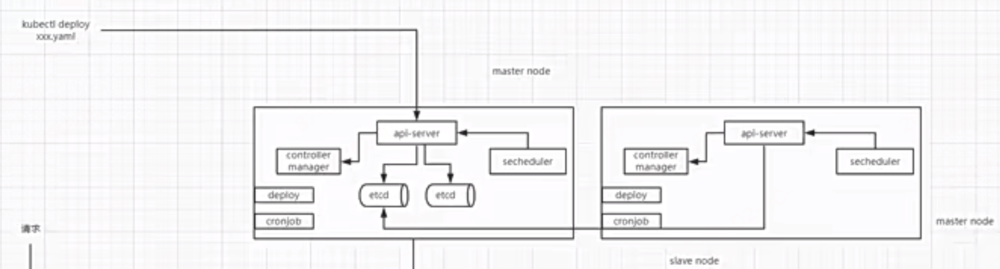
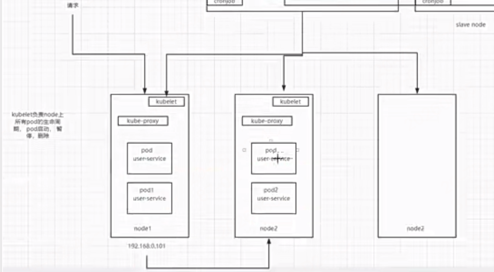
- 控制器，调度器，etcd，apiserver，scheduler，controller-manager
- 每个节点Node下有个kubelet：主要负责Pod的生命周期，部署销毁等
- 每个node还有个kube-proxy：负责node之间的网络通信

#### 2-10 课程总结
**后续个人进一步学习的建议:**；

一、Go 语言进阶（底层原理深挖）
主攻 Go 核心运行机制与并发底层，吃透源码级原理：
并发原理解析：锁实现原理、Channel 底层机制、GMP 调度模型
核心组件原理：Context 上下文机制、GC 垃圾回收原理
二、中间件 & 经典算法
（一）通用架构算法
常用负载均衡算法
熔断、限流核心算法与落地实现
（二）MySQL
事务隔离级别、MVCC 多版本并发控制
索引原理、慢查询与索引调优实战
（三）Redis
Redis-Cluster 集群架构与工作原理
缓存整体架构设计
性能瓶颈解析：单实例内存建议控制在 10GB 以内的核心原因
（四）消息队列 & 搜索引擎
Elasticsearch：LSM-Tree 存储结构原理
RocketMQ、Kafka 核心架构与差异对比
三、Kubernetes（容器编排）
体系化学习 K8s 核心架构、组件、资源对象与运维实战
四、业务架构设计（高并发场景落地）
聚焦互联网典型高并发业务，掌握架构设计思路、痛点与解决方案：
高并发商品系统架构
通用缓存系统架构设计
分布式订单系统架构
秒杀 / 抢购系统架构设计
五、订单系统专项深化
重点攻克订单系统核心难点：
分布式 ID 生成方案
全链路流程、异常处理、分布式问题完整讲解


**其他笔记：**
架构一般都是实际的系统引出的架构体系

面试中只要把这个系统架构讲清楚，如这个订单系统的，如这个订单系统能承受多大容量，我是怎么设计的，怎么去提高分布式事务框架的，怎么去解决订单里的分布式id的，测试时每个机器什么配置，大概能支持多高的并发，你只要说清楚这些，就证明你肯定是做过的，面试说了这些，再说些面试官不懂的，肯定没问题
简历里面：把系统的指标写上，解决的问题，零点就会让面试官眼前一亮


## 学习helm

helm是kubernetes的包管理工具，可以很方便的管理kubernetes的资源，比如deployment、service、ingress、configmap、secret、pvc、pv、hpa、crd等等。

- 博客教程：https://juejin.cn/post/7249753831609499706