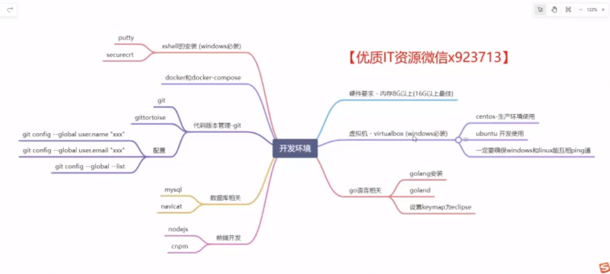
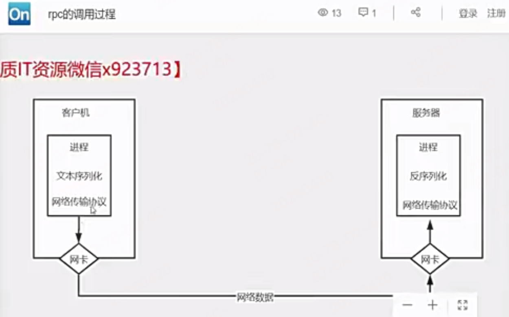

# 笔记

## 1章 开发环境介绍

- x shell是windwos最强的终端工具和远程连接工具mac的话 找对应产品
- 安装虚拟机
  - 安装虚拟机后，一定要确保主机和虚拟机能互相ping通即可。
- 安装docker，nodejs，mysql等

## 2章 rpc核心概念讲解

### 2-1、go path开发模式与gomodules模式对比

- GOROOT：Go 的 “系统目录”，放官方工具和标准库。
  - GOROOT='/usr/local/go'
  - GOPATH='/Users/jinyan1/go'
  - GOENV='/Users/jinyan1/Library/Application Support/go/env'

- GOPATH：你的 “开发目录”，放自己代码和依赖缓存。

go path开发模式下：一定要将代码放到gopath目录下的src或goroot目录下src，还要记得设置GO111MODULE=off，否则import包找不到

- 现代开发：用 Go Modules，基本不用关心 GOPATH，GOROOT 自动管理。
### 2-2&3 go的编码规范

### 2-4&5 什么是rpc

1. rpc：远程过程调用，就是一个节点请求另一个远程节点的服务
   1. 对应的是本地过程调用，函数调用就是最简单的本地过程调用
2. 本地过程调用变成远程过程调用的面临的问题？
   1. 原本的本地函数放到另一个服务器上运行，但是引入了很多新问题
   2. call的id映射
      1. 我们怎么告诉远程机器我们要调用add，而不是sub或者Foo呢?在本地调用中，函数体是直接通过函数指针来指定的，我们调用add，编译器就自动帮我们调用它相应的函数指针。但是在远程调用中，函数指针是不行的，因为两个进程的地址空问是完全不一样的。所以，在RPC中，所有的函数都必须有自己的一个ID。这个D在所有进程中都是唯一确定的。客户端在做远程过程调用时，必须附上这个ID。然后我们还需要在客户端和服务端分别维护一个(函数<-~>CallID)的对应表，两者的表不一定需要完全相同，但相同的函数对应的CalID必须相同。当客户端需要进行远程调用时，它就查一下这个表，找出相应的CallID，然后把它传给服务端，服务端也通过查表，来确定客户端需要调用的函数，然后执行相应函数的代码
   3. 序列化和反序列化
      1. 客户端怎么把参数值传给远程的函数呢?在本地调用中，我们只需要把参数压到栈里，然后让函数自己去栈里读就行。但是在远程过程调用时，客户端跟服务端是不同的进程，不能通过内存来传递参数。甚至有时候客户端和服务端使用的都不是同一种语言(比如服务端用C++，客户端用Java或者Python).这时候就需要客户端把参数先转成一个字节流，传给服务端后，再把字节流转成自己能读取的格式。这个过程叫序列化和反序列化。同理，从服务端返回的值也需要序列化反序列化的过程
   4. 网络传输
      1. 远程调用往往用在网络上，客户端和服务端是通过网络连接的。所有的数据都需要通过网络传输，因此就需要有一个网络传输层。网络传输层需要把CallID和序列化后的参数字节流传给服务端，然后再把序列化后的调用结果传回客户端。只要能完成这两者的，都可以作为传输层使用。因此，它所使用的协议其实是不限的(http,tcp等)，能完成传输就行。尽管大部分RPC框架都使用TCP协议，但其实UDP也可以,而grpc干脆就采用了http2。Java的Netty也属于这层的东西。
      2. rpc间的网络传输，用http和tcp都可以，一般http1.x的缺点是返回结果，链接就断开了，不能保持长链接,而且性能比较低，这种情况tcp链接去封装，性能更好，如果http2.0存在的话解决了http1代的痛点，使用http2.0替代tcp封装也可以。
   5. rpc中最重要的2个点
      1. 网络传输协议
      2. 数据编码协议

### 2-6&7 通过http完成add服务端功能

我们分别写一个服务端和rpc的客户端，见  rpc-http目录