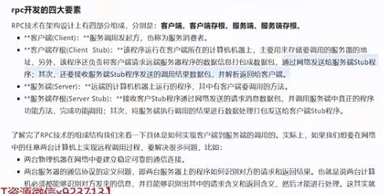
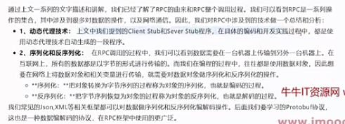

# 笔记

## 概念理清

1. 同步异步网络IO相关
   1. Node.js：所有网络 I/O 天生就是异步、非阻塞的（回调 / Promise）
      1. Node.js 底层是（ 单线程 + 事件循环，不用考虑线程，单线程安全），Node 只有一个主线程，如果网络请求阻塞，整个程序就卡死，所以 被逼无奈，所有 I/O 必须异步，你必须写 callback / async await
   2. Go：所有网络 I/O 天生就是同步、阻塞的（代码一行行走），**同步阻塞的代码风格 + 异步非阻塞的底层效率**
      1. Go 底层是（协程调度，代码极简，没有回调地狱），有轻量级线程（goroutine）
      2. 作为发起请求的客户端：不写go协程关键字，主代码执行是同步阻塞，当前主协程休眠，CPU 立刻去执行其他系统协程，等 TCP 数据返回，主协程自动唤醒，主代码继续往下走，所以代码是阻塞的，但go系统上看是可以跑去其他系统协程或自定义的go协程正常工作的
      3. 作为接收请求的服务端：必须写go关键字才能高并发，因为它是在主线程里一个长期运行的连接程序服务
2. 网络（TCP/IP 协议）只能发 0 和 1（二进制 / 字节）
   1. 网络设备（网卡、路由器、交换机）只认字节流，所以网络传输时，必须要经过不同编解码的协议：字符串 → 打包成字节（encode 编码）
   2. 场景 1：文本协议（你现在的 JSON、HTTP、接口）
      1. 必须 两套都用
      2. 结构化序列化：JSON
      3. 字符编码：UTF-8（只要你数据涉及字符串就一定会涉及文本编解码）
   3. 场景 2：纯二进制协议（Protobuf、游戏、TCP 私有协议）
      1. 不需要字符编码`结构体 → 二进制序列化(Protobuf) → 直接发字节(全程没有「字符串」，自然不需要 encode/decode)`
   4. 举例：网络场景之文本协议jsonrpc
        ```plaintext
        // 发送端：
            Python字典
            ↓
            json.dumps()   【结构化编解码：对象→JSON文本】
            ↓
            .encode("utf-8")【字符编码：字符串文本→二进制字节】
            ↓
            socket.sendall()【TCP只传字节】
        // 接收端：

            TCP读到 bytes 二进制
            ↓
            .decode("utf-8") 【字符解码：字节→文本】
            ↓
            json.loads()     【结构化解码：文本→字典/对象】
        ```


## 1章 开发环境介绍


- x shell是windwos最强的终端工具和远程连接工具mac的话 找对应产品
- 安装虚拟机
  - 安装虚拟机后，一定要确保主机和虚拟机能互相ping通即可。
- 安装docker，nodejs，mysql等

## 2章 rpc核心概念讲解

### 2-1、go path开发模式与gomodules模式对比

- GOROOT：Go 的 “系统目录”，放官方工具和标准库。
  - GOROOT='/usr/local/go'
  - GOPATH='/Users/jinyan1/go'
  - GOENV='/Users/jinyan1/Library/Application Support/go/env'

- GOPATH：你的 “开发目录”，放自己代码和依赖缓存。

go path开发模式下：一定要将代码放到gopath目录下的src或goroot目录下src，还要记得设置GO111MODULE=off，否则import包找不到

- 现代开发：用 Go Modules，基本不用关心 GOPATH，GOROOT 自动管理。
### 2-2&3 go的编码规范

### 2-4&5 什么是rpc

1. rpc：远程过程调用，就是一个节点请求另一个远程节点的服务
   1. 对应的是本地过程调用，函数调用就是最简单的本地过程调用
2. 本地过程调用变成远程过程调用的面临的问题？
   1. 原本的本地函数放到另一个服务器上运行，但是引入了很多新问题
   2. call的id映射
      1. 我们怎么告诉远程机器我们要调用add，而不是sub或者Foo呢?在本地调用中，函数体是直接通过函数指针来指定的，我们调用add，编译器就自动帮我们调用它相应的函数指针。但是在远程调用中，函数指针是不行的，因为两个进程的地址空问是完全不一样的。所以，在RPC中，所有的函数都必须有自己的一个ID。这个D在所有进程中都是唯一确定的。客户端在做远程过程调用时，必须附上这个ID。然后我们还需要在客户端和服务端分别维护一个(函数<-~>CallID)的对应表，两者的表不一定需要完全相同，但相同的函数对应的CalID必须相同。当客户端需要进行远程调用时，它就查一下这个表，找出相应的CallID，然后把它传给服务端，服务端也通过查表，来确定客户端需要调用的函数，然后执行相应函数的代码
   3. 序列化和反序列化：必须使用编解码协议
      1. 客户端怎么把参数值传给远程的函数呢?在本地调用中，我们只需要把参数压到栈里，然后让函数自己去栈里读就行。但是在远程过程调用时，客户端跟服务端是不同的进程，不能通过内存来传递参数。甚至有时候客户端和服务端使用的都不是同一种语言(比如服务端用C++，客户端用Java或者Python).这时候就需要客户端把参数先转成一个字节流，传给服务端后，再把字节流转成自己能读取的格式。这个过程叫序列化和反序列化。同理，从服务端返回的值也需要序列化反序列化的过程
         1. **网络设备（网卡、路由器、交换机）只认字节流，所以网络传输时，必须要经过不同编解码的协议：字符串 → 打包成字节（encode 编码）**
   4. 网络传输：必须网络传输协议
      1. 远程调用往往用在网络上，客户端和服务端是通过网络连接的。所有的数据都需要通过网络传输，因此就需要有一个网络传输层。网络传输层需要把CallID和序列化后的参数字节流传给服务端，然后再把序列化后的调用结果传回客户端。只要能完成这两者的，都可以作为传输层使用。因此，它所使用的协议其实是不限的(http,tcp等)，能完成传输就行。尽管大部分RPC框架都使用TCP协议，但其实UDP也可以,而grpc干脆就采用了http2。Java的Netty也属于这层的东西。
      2. rpc间的网络传输，用http和tcp都可以，一般http1.x的缺点是返回结果，链接就断开了，不能保持长链接,而且性能比较低，这种情况tcp链接去封装，性能更好，如果http2.0存在的话解决了http1代的痛点，使用http2.0替代tcp封装也可以。
   5. rpc中最重要的2个点
      1. 网络传输协议
      2. 数据编码协议


### 2-6&7 通过http完成add服务端功能


我们分别写一个服务端和rpc的客户端，见  rpc-http目录

### 2-8 rpc架构技术要点



常用的术语：




## 3章 go内置rpc开发


1. go内置的rpc包
   1. net/rpc：Go 专属 RPC，Gob 序列化编码协议，使用Gob作为数据交换格式
   2. net/rpc/jsonrpc：跨语言 RPC，使用JSON 编码协议


### 3-1 go快速体验rpc开发

见`/week4-rpc-grpc/part3-go-neizhi-rpc-kaifa/0301`


### 3-2 替换rpc的序列化协议为json

目前go语言中rpc的序列化协议是gob，gob协议是go语言下才有的，能否替换通用的序列化协议，支持跨语言调用

- Go jsonrpc 是纯 TCP 裸流传输 JSON，不是 HTTP！不能用 requests！必须用 socket！
  - Go jsonrpc 底层：基于 TCP Socket 裸流，纯二进制 / JSON 字符串，无 HTTP 头
  - socket是通信工具，网络编程接口，操作系统提供的网络编程统一接口，是一套函数 / API：socket()、connect、send、recv、bind、listen、accept
    - 基于 Socket 可以跑多种协议，TCP Socket，UDP Socket，本地域 Socket（UnixSocket，进程间通信），ICMP、RAW 裸套接字等
      - Go：net.Listen("tcp", ":1234")就是：TCP-Socket 编程
      - sock = socket.socket(socket.AF_INET, socket.SOCK_STREAM) 是python的tcp-socket编程
    - tcp是基于通信工具的通信传输协议，TCP 只是 Socket 最常用的一种，Socket 是「接口」，TCP 是「传输协议」
  - HTTP 协议，带请求头、换行、格式完全不一样

#### python演示跨语言请求go的JSONRPC请求

python涉及socket编程，不是用http.request,http请求不是纯json的，它还有header等文本，不是纯json文本，必须使用socket编程，发起纯json文本的请求
```python
import json
import socket
request = {
    "id": 1,      
    "method": "HelloService.Hello",
    "params": ["bobby"],
}
client = socket.create_connection(("localhost", 1234)) # 创建tcp连接
client.sendall(json.dumps(request).encode())# 把字典 → JSON 字符串，等于 Go 的 json.Marshal()，encode()：字符串 → 字节 bytes
# 获取服务器返回的数据
rsp = client.recv(1024)# 接收最多 1024 字节
rsp = json.loads(rsp.decode())# json.loads:JSON 字符串 → 字典，等于 Go 的 json.Unmarshal()，decode()：字节 → 字符串
print(rsp["result"])


# 还有一种写法使用zero rpc
import zerorpc
def hello():
    yield "Hello World!"
    yield "Hello World2!"
for data in hello():
        print(data)

c = zerorpc.Client()
c.connect("tcp://127.0.0.1:4242")
# python中的生成器和迭代器
c.bobby()  # go中如何实现这个直接调用服务器上的方法名？而不是使用client.Call("HelloService.Hello"
print(c.hello())
```


### 3-3 替换rpc的传输协议为http

- server端：我们不使用net去监听了，因为它可以监听tcp，我们使用http专用的包
- client端：我们使用http的包，去请求server,如跨语言的python写法
  
```python
import requests
request = {
    "id": 1,      
    "method": "HelloService.Hello",
    "params": ["bobby"],
}
rsp = requests.post("http://localhost:1234/jsonrpc", json=request)
print(rsp.text)

```

### 3-4&5 进一步改造rpc调用的代码

- 这节课讲的这些概念，都是有用的，在后面的grpc学习中，都会有对应的概念场景
- 发自灵魂的拷问：server_proxy 和client_proxy 能否自动生成？而且为多种语言生成？
  - 都能满足，这个就是后面 要讲引出的 protobuf  + grpc ==> 完美解决


