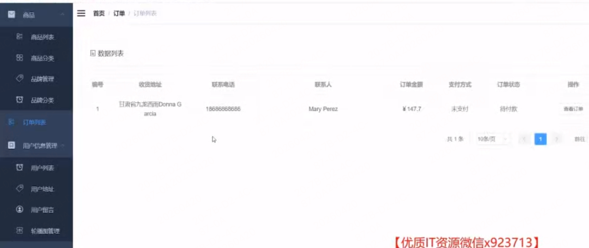
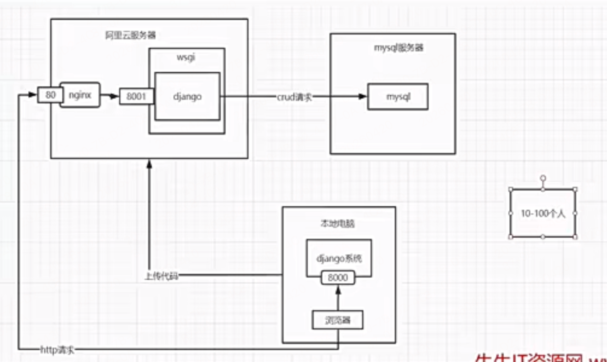
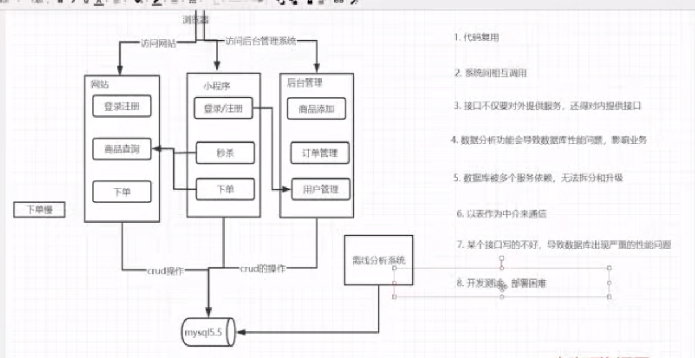
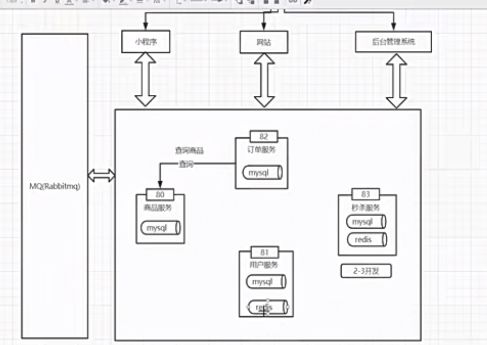
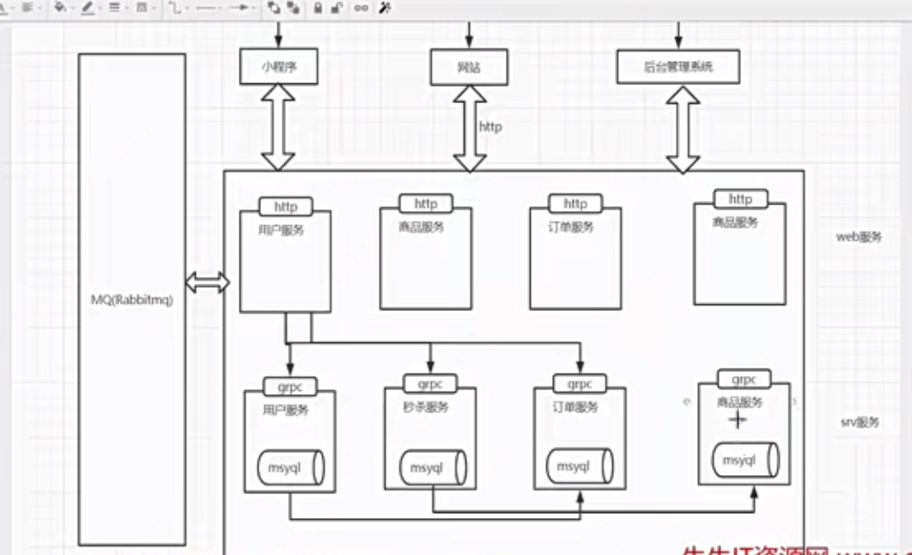
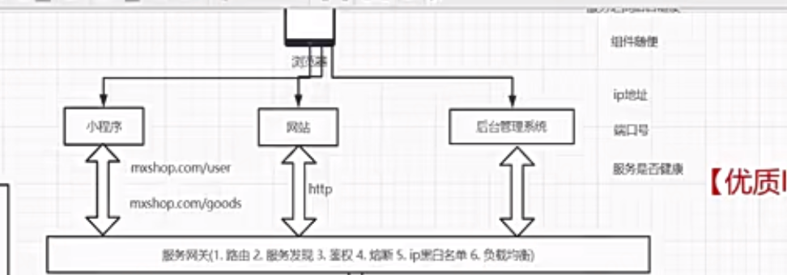
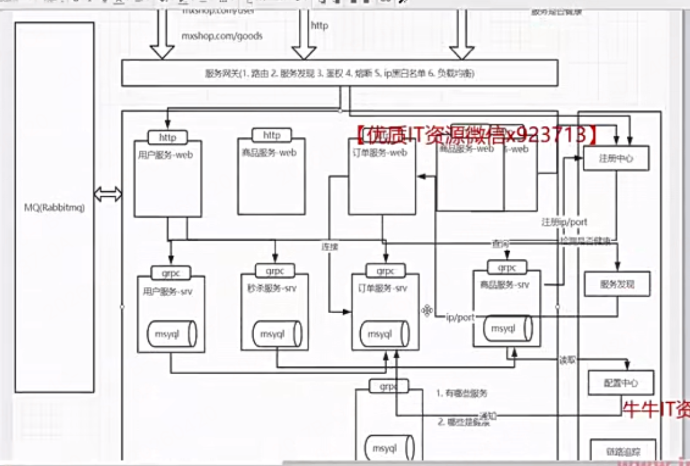
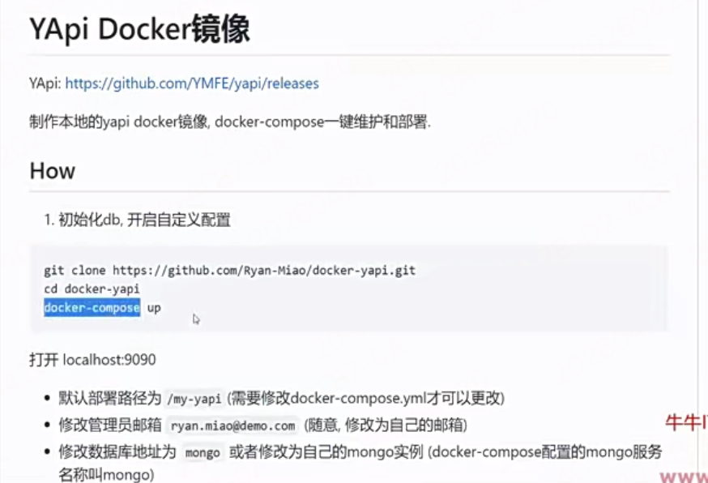

# 第6周 yapi文档管理和gorm详解

- [第6周 yapi文档管理和gorm详解](#第6周-yapi文档管理和gorm详解)
  - [1章：项目需求分析](#1章项目需求分析)
    - [01 如何启动电商系统和后台管理系统](#01-如何启动电商系统和后台管理系统)
    - [02 后台管理系统大致架构](#02-后台管理系统大致架构)
    - [03 电商系统的需求分析](#03-电商系统的需求分析)
  - [2章 单体应用到微服务架构演进](#2章-单体应用到微服务架构演进)
    - [2-1 单体应用如何部署](#2-1-单体应用如何部署)
    - [2-2 单体应用开发痛点](#2-2-单体应用开发痛点)
    - [2-3 单体应用的架构演变](#2-3-单体应用的架构演变)
    - [2-4 服务拆分变动](#2-4-服务拆分变动)
    - [2-5 微服务的基本拆分](#2-5-微服务的基本拆分)
    - [2-6 分层微服务架构](#2-6-分层微服务架构)
    - [2-7 微服务需要解决的问题 --重要](#2-7-微服务需要解决的问题---重要)
  - [3章 yapi的安装和配置](#3章-yapi的安装和配置)
    - [3-1\&2 前后端分离的系统开发演变过程痛点](#3-12-前后端分离的系统开发演变过程痛点)
      - [没 YApi 之前，前后端分离有哪些巨痛](#没-yapi-之前前后端分离有哪些巨痛)
      - [YApi 核心作用 \& 解决的痛点](#yapi-核心作用--解决的痛点)
      - [一句话总结好处](#一句话总结好处)
    - [3-3 yapi的安装和配置](#3-3-yapi的安装和配置)
    - [3-4 yapi的基本功能使用](#3-4-yapi的基本功能使用)
    - [3-5 接口的导入和导出](#3-5-接口的导入和导出)
  - [4章 gorm的快速入门](#4章-gorm的快速入门)
    - [易混记录](#易混记录)
    - [4-1 什么是orm，如何正确看待orm](#4-1-什么是orm如何正确看待orm)
    - [4-2 gorm 链接数据库](#4-2-gorm-链接数据库)
    - [4-3 快速体验automigrate功能](#4-3-快速体验automigrate功能)
    - [4-4 gorm的model的逻辑删除](#4-4-gorm的model的逻辑删除)
    - [4-5 通过NullString解决不能更新零值的问题](#4-5-通过nullstring解决不能更新零值的问题)
    - [4-6 表结构定义细节](#4-6-表结构定义细节)
    - [4-7 通过create方法插入记录](#4-7-通过create方法插入记录)
    - [4-8 批量插入和通过map插入记录](#4-8-批量插入和通过map插入记录)
    - [4-9 通过take，first，last查询数据](#4-9-通过takefirstlast查询数据)
    - [4-10的gorm的基本条件查询](#4-10的gorm的基本条件查询)
    - [4-11 的gorm的更新操作](#4-11-的gorm的更新操作)
    - [4-12 的gorm的删除操作](#4-12-的gorm的删除操作)
    - [4-13 表的关联关系和BelongsTo的关联插入](#4-13-表的关联关系和belongsto的关联插入)
    - [4-14 通过preload和joins关联查询多表](#4-14-通过preload和joins关联查询多表)
    - [4-15 hasmany关系](#4-15-hasmany关系)
    - [4-16 gorm处理多对多的关系](#4-16-gorm处理多对多的关系)
    - [4-17 gorm的表名自定义，自定义beforecreate逻辑](#4-17-gorm的表名自定义自定义beforecreate逻辑)


## 1章：项目需求分析

### 01 如何启动电商系统和后台管理系统

就是有2个前端项目：电商系统和后台管理系统，启动前端项目的方式

### 02 后台管理系统大致架构

- 一共有商品管理，订单管理，用户信息管理 3个大菜单
  - 商品管理：商品列表，商品分类，品牌管理，品牌分类
  - 订单管理：订单列表，订单详情，订单发货
  - 用户信息管理：用户列表，用户地址，用户留言，轮博图管理



### 03 电商系统的需求分析

- 登录注册页面


## 2章 单体应用到微服务架构演进

### 2-1 单体应用如何部署

以 **Python 单体 Web 应用（Django/Flask）** 为例
  - 浏览器→ Nginx（托管前端 dist）→ Nginx 反向代理接口请求→ WSGI(Gunicorn（）)→ Python 后端业务
    - Django 就是「Python 后端业务本身」，处在 Gunicorn (WSGI 服务器) 的里面、被它托管运行
    - 目前单体应用对于并发少时够用，当100个人怎么办，就体现出单体的缺点了。。。。




### 2-2 单体应用开发痛点

略

### 2-3 单体应用的架构演变



1. 单体开发痛点
   1. 新增功能的代码复用
   2. 系统间相互调用
   3. 接口不仅对外提供接口，还得对内提供接口
   4. 离线数据分析功能与业务使用同一个数据库会导致数据库性能下降
   5. 数据库被多个服务依赖，无法拆分和升级
   6. 某个接口写的不好，导致数据库出现严重的性能问题
   7. 开发测试部署困难，需要整体项目功能的全量回归

### 2-4 服务拆分变动

代码复用有2种方式：01 以代码模块化组织方式复用  02 以模块独立服务方式复用
 02更好，01代码拆文件，还是绑在一个单体里，只能自己用。02能力拆成单独服务，全局共享、独立部署、彻底解耦

- 目前还有问题：如果多个独立服务用同一个数据库还是有问题：代码解耦了但数据库强耦合，互相影响、牵制发布、性能互相拖累，失去独立服务拆分的意义

### 2-5 微服务的基本拆分

每个独立服务应该搭配专属自己的数据库和redis缓存服务等，最终要做到服务的完全独立性和解耦。

比如我们现在微服务之间有一些互相消息通知，异步请求调用等等，我们可以使用单独的全局统一服务组件如RabbitMQ组件等，还比如订单服务想去查询商品信息的时候，不能直接去商品服务的数据库查询，而是通过商品服务提供的接口查询， 独立微服务之间必须做到完全解耦，不能互相依赖，只能通过统一暴露的接口去访问。




### 2-6 分层微服务架构


- 问题1：微服务不仅要向外部web提供http的接口访问，还要支持内部接口访问，但是内部使用http接口就没有那么高效，内部得使用rpc接口

- 更好的方式是使用使用分层：每个微服务拆成2层做成2个微服务，一层是web服务层专门负责web接口调用，另一层是service服务层供各个web层调用
  - 层之间调用：上层可以调用各个下层，下层不能调用上层，下层之间可以互相调用
  - web服务层不含数据库，只负责web接口和下层调用，server服务层才包含数据库
- 这种微服务好处：独立性好，独立部署，不限语言




### 2-7 微服务需要解决的问题 --重要





- 微服务需要考虑的问题：下面问题可以用统一的服务注册与发现机制
  - 每个微服务的ip地址
  - 端口号
  - 服务是否健康
- 微服务解决上述问题需要额外引入的组件功能
  - 注册中心：注册我的服务的ip地址和端口号，还有健康检查的功能
  - 服务发现：查询目标服务的地址和端口号
  - 配置中心：把所有服务的配置，从代码里抽出来，统一集中管理、动态下发，不用改代码、不用重启服务就能改配置。
  - 链路追踪：管服务调用链、查接口耗时、排查报错
  - 微服务网关：管统一入口、鉴权、路由、限流、安全
    - 统一入口，屏蔽后端服务
    - 路由配置，决定当前请求是调用哪个微服务内部接口
    - 路由转发：网关根据请求路径，自动转发到对应服务
      - /user/** → 用户服务
      - /order/** → 订单服务
    - 统一认证、登录鉴权：不用每个微服务自己写登录、校验 Token；
    - 限流熔断降级：限制每秒请求量、防止服务被打崩；某个服务挂了，网关直接熔断，避免连锁雪崩。
    - 统一日志、监控、统计：所有请求的日志、耗时、QPS 全在网关统一收集
    - 灰度发布、流量分发：新版本服务上线，网关切一部分流量过去，慢慢放量，不影响全量用户。
    - 没有网关会有什么问题？
      - 前端要记几十个服务地址，维护爆炸
      - 每个服务都要重复写登录、跨域、限流代码
      - 后端服务直接暴露公网，安全风险大
      - 没法统一管控流量、权限、日志
    - 常见微服务网关组件
      - Spring Cloud Gateway（Java 最常用）
      - Nginx + OpenResty
      - Kong
      - APISIX
      - 单纯的nginx是胜任不了的，需要做很多功能，nginx只是一个高性能转发器，缺少微服务高级能力
        - 如动态路由、不用重启，新增服务、改路由规则，专业网关后台配一下就生效；普通 Nginx 要改 conf、重载配置，微服务多了根本扛不住。

## 3章 yapi的安装和配置


### 3-1&2 前后端分离的系统开发演变过程痛点


讲一下前后端分离的接口管理的痛点

#### 没 YApi 之前，前后端分离有哪些巨痛
  - 后端接口没写完，前端没法开工
    - 前端只能干等后端写完接口，才能联调，效率极低。
  - 接口文档靠手写 Word、markdown，容易滞后、没人维护
    - 后端改了参数，不更新文档，前端照着旧文档写，全是坑。
  - 口头约定接口，参数、字段经常对不上
    - 后端说返回 name，前端写 username，联调全是扯皮、返工。
  - 调试接口只能用 Postman，团队不共享
    - 自己导自己的接口，换电脑、换同事都要重新导入，没法统一管理。
  - 接口版本混乱，改了字段没人通知
    - 接口迭代后，前端不知道哪些字段删了、加了，线上容易出 bug。

#### YApi 核心作用 & 解决的痛点

1. 统一接口契约，前后端按文档对齐
后端先在 YApi 定义好接口路径、请求方式、入参、出参、字段含义前后端以 YApi 为唯一标准，不再口头扯皮，从源头解决字段对不上。
1. 提供 Mock 模拟数据，前端不用等后端接口写完
后端只需要在 YApi 定义好接口结构，Yapi可以自动生成假数据前端直接用 Mock 地址开发页面，后端还没写代码，前端就能先行开发，彻底解耦。
1. 接口文档自动维护，实时同步
后端改接口参数、增删字段，直接在 YApi 更新，文档自动更新不用手写 Word/Markdown，文档和代码接口保持一致，永不落后。
1. 在线接口调试，替代 Postman，团队共享
YApi 自带调试功能，直接在平台发请求、看返回、测参数所有接口团队共享，新人入职直接看平台，不用到处发接口文件。
1. 接口版本管理，迭代可追溯
接口改版、字段废弃，YApi 保留版本记录前端能清晰知道哪些接口变了、什么时候改的，减少线上 bug。
1. 支持导入导出，适配多项目
可以从 Postman、Swagger 导入接口，也能导出给其他系统用，迁移方便。

#### 一句话总结好处
YApi 解决了前后端分离最大痛点：接口约定混乱、文档不同步、前端等后端、联调扯皮返工；
统一接口标准、提供 Mock 假数据、前端可并行开发、文档自动维护、团队接口共享调试。


### 3-3 yapi的安装和配置

> 官方文档：https://hellosean1025.github.io/yapi/index.html




- docker启动后，内部会下载依赖的2个镜像，一个是yapi的核心包镜像，一个是mongodb数据库。
- 由于版本更新都不一样，到时候直接按照网上找一个最新的yapi安装教程，安装成功就行了

### 3-4 yapi的基本功能使用

主要是后端开发自己测试接口用-在线运行 和提供给前端mock地址用，自动mock数据 和 作为接口文档用

### 3-5 接口的导入和导出

页面功能操作讲解，后续自己看文档

## 4章 gorm的快速入门

> 笔记代码直接见课件源码吧，不从0写了 GormStart文件夹

gorm 是 Go 语言最流行的 ORM 数据库操作库，专门用来让你用「结构体 / 对象」的方式写数据库，不用手写 SQL。

### 易混记录

1. gorm中定义时间字段不能用 time.Time，因为默认会设置零值，导致数据库插入失败（见ch13）
   1. 可以用sql.NullTime 或 *time.Time

### 4-1 什么是orm，如何正确看待orm

ORM全称是:Object Relational Mapping(对象关系映射)，其主要作用是在编程中，把面向对象的概念跟数据库中表的概念对应起来。举例来说就是，我定义一个对象，那就对应着一张表，这个对象的实例，就对应着表中的一条记录。

orm的优缺点

优点:
1.提高了开发效率。2.屏蔽sq!细节，可以自动对实体Entity对象与数据库中的Table进行字段与属性的映射;不用直接SQL编码
3.屏蔽各种数据库之间的差异

缺点:
1.orm会牺牲程序的执行效率和会固定思维模式
2.太过依赖orm会导致sql理解不够
3.对于固定的orm依赖过重，导致切换到其他的orm代价高


- 如何正确看待orm和sql之间的关系
  - 1.sql为主,orm为辅
  - 2.orm主要目的是为了增加代码可维护性和开发效率

### 4-2 gorm 链接数据库

> https://gorm.io/zh_CN/
> /ch01/main.go

前提是肯定得安装mysql数据库服务，参考 https://gorm.io/zh_CN/docs/connecting_to_the_database.html，链接数据库

### 4-3 快速体验automigrate功能

- 先开启gorm的默认日志：https://gorm.io/zh_CN/docs/logger.html   它会打印慢 SQL 和错误
  - 设置全局logger后，也会在日志中打印出每个orm操作命令对应的sql语句，方便学习和调试

- 参考概述部分，实现了快速入门

```go
package main
import (
  "gorm.io/driver/sqlite" // MySQL 驱动适配器,让 GORM 能连接 MySQL,提供 mysql.Open(dsn)
  "gorm.io/gorm"// GORM 核心包,所有 GORM 功能都在这里：gorm.DB、Create、First、Model、AutoMigrate
)

type Product struct {
  gorm.Model // 这个会自动添加 id, created_at, updated_at, deleted_at
  Code  string
  Price uint
}

func main() {
  db, err := gorm.Open(sqlite.Open("test.db"), &gorm.Config{})
  if err != nil {
    panic("连接数据库失败")
  }

  // 自动建表
  // 你定义了一个结构体 Product
    // GORM 会自动去 MySQL 里创建一张表
    // 表名默认：products
    // 以后结构体加字段，再次执行会自动加列，不用手动改表
  db.AutoMigrate(&Product{})

  // 创建
  // 插入一条数据到 products 表
  db.Create(&Product{Code: "D42", Price: 100})

  // 查询
  var product Product
  // First相当于：SELECT * FROM products WHERE id = 1 LIMIT 1
  // 第一个参数相当于指定表名，第二个参数为查询条件
  db.First(&product, 1) // 查找对应主键的产品，查查到的第一条
  db.First(&product, "code = ?", "D42") // 查找 code 为 D42 的所有产品
  // db.Model(&product)：指定操作哪张表 操作product表
  // 更新 - 将产品价格更新为 200
  db.Model(&product).Update("Price", 200)
  // 更新 - 更新多个字段
db.Model(&product).Updates(Product{Price: 200, Code: "F42"}) // 仅更新非零字段
  db.Model(&product).Updates(map[string]interface{}{"Price": 200, "Code": "F42"})

  // 删除 - 删除产品---- 就是逻辑删除
  db.Delete(&product, 1)
}
```

### 4-4 gorm的model的逻辑删除
```go
  // 删除 - 删除产品---- 就是逻辑删除
  db.Delete(&product, 1)
```

### 4-5 通过NullString解决不能更新零值的问题
```go
import "database/sql"
// 。。。
db.Model(&product).Updates(Product{Price: 0, Code: ""}) // 仅更新非零字段,这个每个类型的零值是设置不进去的，转化时直接过滤了
// 如果我们去更新 Price200时，然后COde设置了零值，那容易会产生bug，零值的为null易产生bug

// 那应该怎么解决，如何设置空值 ？
db.Model(&product).Updates(Product{
	Code: sql.NullString{
		String: "",  // 真正的值
		Valid:  true, // 重点：标记这个字段是有效的，必须更新
	},
    // NullString是设置字符串零值，NullBool是设置布尔零值的结构体方法
})
```

### 4-6 表结构定义细节

- week6-yapi-gorm/GormStart/ch02/main.go

根据文档说明，讲一下文档中的重点细节：

- 约定
  - 主键：GORM 使用一个名为ID 的字段作为每个模型的默认主键。
  - 表名：默认情况下，GORM 将结构体名称转换为 snake_case 并为表名加上复数形式。 For instance, a User struct becomes users in the database, and a GormUserName becomes gorm_user_names.
  - 列名：GORM 自动将结构体字段名称转换为 snake_case 作为数据库中的列名。
  - 时间戳字段：GORM使用字段 CreatedAt 和 UpdatedAt 来自动跟踪记录的创建和更新时间。
- 支持嵌入结构体
  - 匿名的方式嵌入
    ```go
    type Author struct {
    Name  string
    Email string
    }

    type Blog struct {
    Author
    ID      int
    Upvotes int32
    }

    type Blog1 struct {
        ID      int
        Author  Author `gorm:"embedded"` // 👈 关键在这里
        Upvotes int32
    }
    // 执行建表
    db.AutoMigrate(&Blog{})
    // 插入时写法
    db.Create(&Blog{
        Author: Author{
            Name:  "张三",
            Email: "zhangsan@test.com",
        },
        Upvotes: 100,
        })
        // 数据库里会变成：
        name = "张三"
        email = "zhangsan@test.com"
        upvotes = 100
    ```
    - 非匿名方式使用标签方式：`gorm:"embedded"`嵌入结构体
- 字段标签：声明model时，tag是可选的，大小写不敏感，建议使用驼峰命名法
  - 字段标签可以设置表字段的名称、是否为空、是否唯一、是否自增、是否只读、是否隐藏、是否外键等属性。
  - 例如：week6-yapi-gorm/GormStart/ch02/main.go

### 4-7 通过create方法插入记录

> 参考 https://gorm.io/zh_CN/docs/create.html
> 代码笔记见 ch03/main.go

### 4-8 批量插入和通过map插入记录

> 代码笔记见 ch04/main.go

> 参考文档：https://gorm.io/zh_CN/docs/create.html#%E6%89%B9%E9%87%8F%E6%8F%92%E5%85%A5

### 4-9 通过take，first，last查询数据

> 参考文档：https://gorm.io/zh_CN/docs/query.html
> 代码笔记见 ch05/main.go


### 4-10的gorm的基本条件查询

> 参考文档：https://gorm.io/zh_CN/docs/query.html#%E6%9D%A1%E4%BB%B6
> 笔记见 ch06/main.go

- where语句
  - - 总结：查询方式条件有三种 1. string 2. struct 3. map
- or语句，Not条件，子查询，having 语句等
- 等等

```go
SELECT * FROM users WHERE age > (SELECT avg(age) FROM users)
// 这就是括号里的就是子查询
```


### 4-11 的gorm的更新操作

> 参考文档：https://gorm.io/zh_CN/docs/update.html
> 笔记见 ch07/main.go

1. 通过save方法和Update方法更新
2. 如果您想要在更新时选择、忽略某些字段，您可以使用 Select、Omit

### 4-12 的gorm的删除操作

> 参考https://gorm.io/zh_CN/docs/delete.html
> > 笔记见 ch08/main.go

- 删除需要指定主键，否则会触发批量删除

- 大部分API都看文档就可以，重点讲一下软删除
  - 如果你的模型包含了 gorm.DeletedAt字段（该字段也被包含在gorm.Model中），那么该模型将会自动获得软删除的能力！
  - 当调用Delete时，GORM并不会从数据库中删除该记录，而是将该记录的DeleteAt设置为当前时间，而后的一般查询方法将无法查找到此条记录。

### 4-13 表的关联关系和BelongsTo的关联插入

> 文档： https://gorm.io/zh_CN/docs/belongs_to.html
> 笔记见 ch09/main.go

- 提供了4种关联插入方式：
  - Belong To 建立多对1关联
  - Has One 建立1对1关联
  - Has Many 建立1对多关联
  - Many To Many 建立多对多关联

```go
// `User` 属于 `Company`，`CompanyID` 是外键
type User struct {
  gorm.Model
  Name      string
  CompanyID int // 真正数据库保存的外键
  Company   Company // Company 只是用来预加载 / 查询，不会生成数据库字段
}

type Company struct {
  ID   int
  Name string
}
```

### 4-14 通过preload和joins关联查询多表

> 笔记见 ch10/main.go

- 重写外键和重写引用：https://gorm.io/zh_CN/docs/belongs_to.html#%E9%87%8D%E5%86%99%E5%A4%96%E9%94%AE
  - 重写外键：是重写user表的外键名字，但实际对应的字段还是关联表的默认id
  - 重写引用：能实际更改对应的关联表的哪个字段作为外键

### 4-15 hasmany关系

> 笔记见 ch11/main.go

一对多关系，如一个用户有多张信用卡，每个信用卡只属于1个用户


- **重点记录**：一般不建议不用外键约束，只留逻辑外键，数据的一致性由应用层（代码）保证，不由数据库保证
  - 不是不使用外键，而是不用外键约束

### 4-16 gorm处理多对多的关系

> 文档：https://gorm.io/zh_CN/docs/many_to_many.html
> 笔记见 ch12/main.go

多对多关系：如一个用户可以学习多个语言，一个语言也可以被多个用户学习

- **重点记录**：gorm多对多关系，需要使用中间链接表，user表和language表之间，需要使用中间链接表做多对多映射，不需要前面的外键字段来标识
- GORM 的 AutoMigrate 为 User 创建表时，GORM 会自动创建中间连接表，连接表会同时拥有两个模型的外键
- 查询关联方法：单独取出model的关联数据：https://gorm.io/zh_CN/docs/associations.html#%E6%9F%A5%E8%AF%A2%E5%85%B3%E8%81%94

### 4-17 gorm的表名自定义，自定义beforecreate逻辑

> 笔记见 ch13/main.go

我们的表名是根据type结构体的名称后面加复数的形式来完成的。

一些增删改查都有提供对应的钩子，见https://gorm.io/zh_CN/docs/create.html#%E5%88%9B%E5%BB%BA%E9%92%A9%E5%AD%90