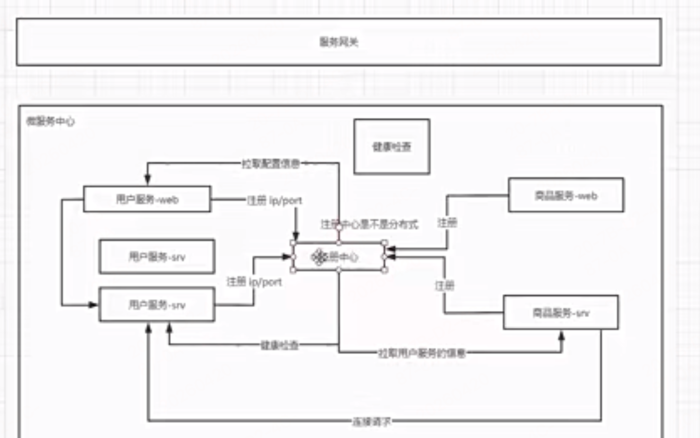
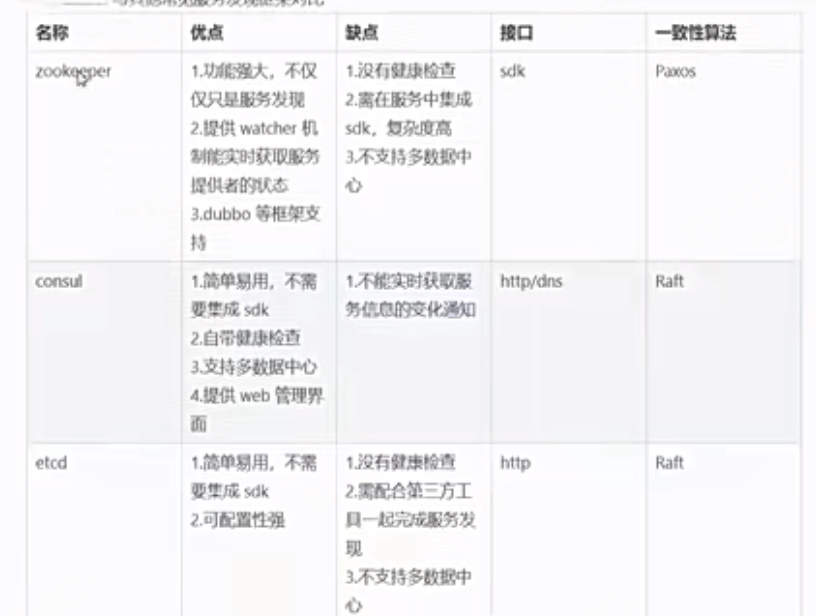
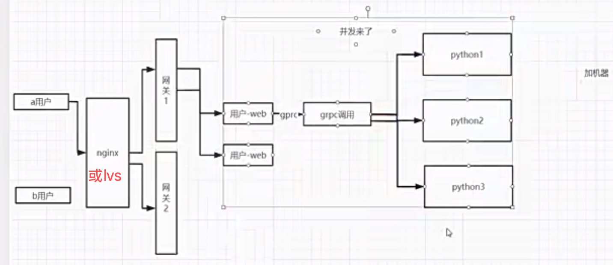
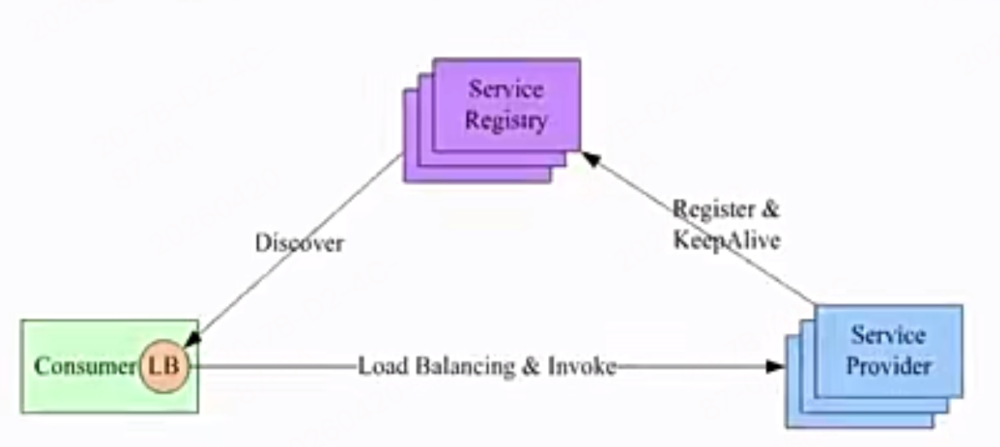
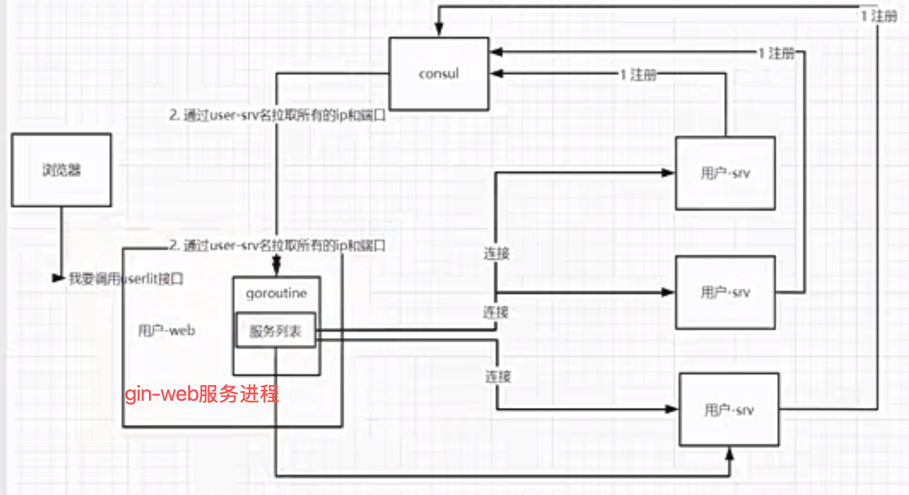
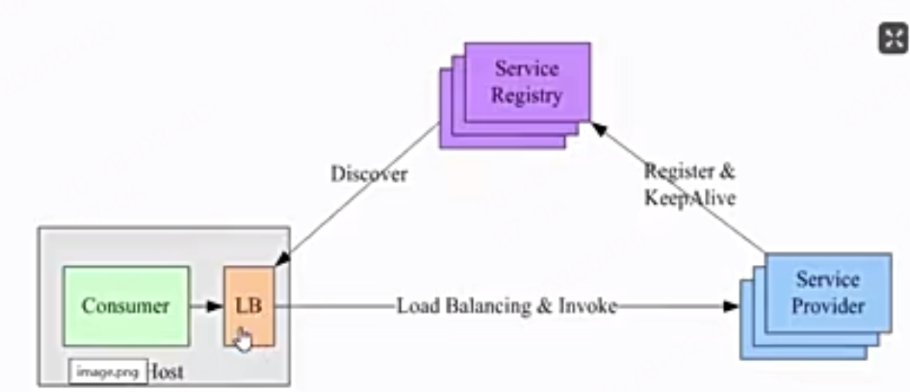
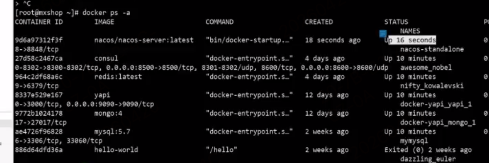
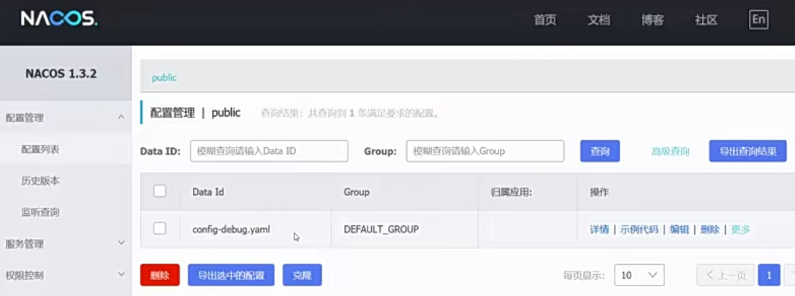

# 阶段3 从0到1实现完整的微服务框架

> 整体课件项目代码就见`mxshop_srvs`

## 8周 用户服务的grpc服务

- 该周只有1章-用户服务的service开发
- 代码见`mxshop_srvs/user_srv`
- grpc服务写好接口，需要调试测试，因为web服务还没有开发，只能自己用tests文件运行测试

### 1-1 定义用户表结构

> 创建`user_src/model`专门存放用户的表结构字段

### 1-2 同步数据库的表结构

> 创建`user_src/model/main`文件夹， 专门用来同步数据库的表结构

下面语句会创建一个user用户信息表，注释不用这个的话，直接上面db.save也会默认创建表
`_ = db.AutoMigrate(&model.User{}) //此处应该有sql语句`

### 1-3 密码字段的md5加密

1. 一般数据库中密码字段，不能存明文密码，一旦数据库丢失，密码就丢了，一般都是密文保存，而且需要密文不可反解
2. 加密算法一般分为以下几种方式：
   1. 对称加密：加密和解密用的是同一把钥匙，这种一把钥匙泄漏风险也很大，也不能满足不可反解的要求
   2. 非对称加密：一般采用非对称加密，加密和解密用不同的钥匙，但是他不能满足密码不可反解的要求
   3. md5 信息摘要算法：最常用的是这个，它不能反解，它严格上说不是加密算法，而是信息摘要算法，但是一般用做密码加密
3. 密码如果不可以反解，用户忘记了密码找回密码怎么办？？
   1. 首先不能反解的话，我们拿到数据库存的密文，也是无法反解的，就算反解了发给用户邮件万一邮件被拦截，万一丢了泄漏了也不安全
   2. 所以一般是给用户一个链接，让用户去重置一个新密码

#### md5信息摘要算法加密

首先哈希算法就是摘要算法，它是大类，md5只是Hash的一种。下面md5的特性就是哈希算法的特性，不可反解。

1. Hash 家族常见成员，全都属于 Hash 摘要算法：
   1. MD5（最老，不安全），值固定32个字符
   2. SHA-1：值固定40个字符
   3. SHA-256：值固定64个字符
   4. SHA-512：值固定128个字符
   5. bcrypt、PBKDF2、Argon2（密码专用哈希）
   6. Hash算法的基本特点：
      1. 任意长度输入 → 固定长度输出
      2. 单向不可逆，不能解密还原原文
      3. 用来做：校验完整性、密码存储、签名
2. md5:摘要算法可以将任意长度的字符串转换成固定长度的16进制字符串
   1. 压缩性：任意长度的数据，算出md5值的长度都是固定的，永远是32个16进制字符
      1. md5的底层就是输出128位二进制串，32位16进制字符串
   2. 容易计算：从原数据计算出MD5值很容易
   3. 抗修改性：对原数据进行任何修改，哪怕1个字节，md5值差异也很大
   4. 强碰撞：想找到2个完全不同的数据，使得它们的MD5值相同，这是不可能的
   5. 相同内容 → 永远相同 MD5，不同内容 → 几乎不可能相同
   6. 不可逆性：不能反解，单向不可逆（不能从密文还原原文）
3. md5盐值加密
   1. 加盐
      1. 通过生成随机数和md5生成字符串进行组合
      2. 数据库同时存储md5值和salt盐值，验证正确性使用salt进行md5即可


- go中md5加密代码示例见：user_srv/model/main/main.go 的 genMd5 函数
- 默认的md5加密，得到的密文是非常不安全的因为是不可反解的，会提前将任意常见密码用md5加密下存下来，相当于md5值和你的密码是一一对应的，因此可以被暴力破解-彩虹表直接反向映射到，所以一般都会加盐加密

### 1-4 md5盐值加密解决用户密码安全问题


- 使用开源库已经封装了密码加密加盐的方法："github.com/anaskhan96/go-password-encoder"
  - 库内部源码，就是这么写的：PBKDF2 本身不是哈希算法，它是一个 “加密框架 / 流程”！它自己不会算哈希，必须靠 HashFunc（SHA512/SHA1）来干活！PBKDF2 只是一个 “重复加密的流程框架”，它需要一个真正的哈希算法来执行每一次加密
    ```go
    derivedKey := pbkdf2.Key([]byte(password), 
        salt, 
        opts.Iterations,  // 迭代次数
        opts.KeyLen,      // 密钥长度
        opts.HashFunc,    // SHA512
    )
    ```
  - 该函数内部自动计算生成一个加密后 的随机盐值和 加密后的密文
    - `salt, encodedPwd := password.Encode("generic password", options)`
  - 验证用法：验证用户的密码对不对  
    - `password.Verify("原始密码", passwordInfo[2]/*盐值*/, passwordInfo[3]/*密文密码*/, options)`
- 问题：有盐值，那这个盐值存在哪里呢，用户登录后用户名密码得到后，咋取到盐值进行校验呢
  - 一般不建议salt存在用户表中，一般是直接存在密文密码中,存储到数据库的密码字符串，格式是：`$pbkdf2-sha512$随机盐值$加密后的密文`
  - 当用户名登录后，用它的原始密码和数据库中的密文密码包含的盐值和密文提取出来进行方法验证对比，如果相同，则验证成功

### 1-5 定义proto接口

> 定义user_srv/proto/user.proto文件

### 1-6 用户列表接口

- 见 user_srv/handler/user.go 文件，来实现proto中的用户列表接口的具体定义
  - 需要引入gorm数据库实例去查询数据
- 建立 user_srv/global/global.go 全局变量，里面定义了数据库连接等公共引用方法使用

### 1-7 通过id和mobile查询用户

- 见 user_srv/handler/user.go 文件，来实现proto中的GetUserByMobile和GetUserByMobile方法的具体定义
	
    // Go 里面几乎所有：
	// gRPC 响应
	// 业务返回值
	// 较大的结构体
	// 全部统一返回指针，不返回值

### 1-8 新建用户接口
- 见 user_srv/handler/user.go 文件的CreateUser方法

### 1-9 修改用户和校验密码接口

- 见 user_srv/handler/user.go 文件的UpdateUser方法

### 1-10 通过flag启动grpc服务

启动这个grpc服务，测试下前面写的grpc的接口

> 见mxshop_srvs/user_srv/main.go文件

1. 使用go语言内置的flag包，来解析命令行参数，解析用户传入的ip和端口号动态启动grpc-server
   1. `ip := flag.String("ip", "0.0.0.0", "ip地址")：`
      1. 第一个参数："ip"，命令行参数的名字 `./program -ip=192.168.1.100`
      2. 第二个参数：默认值
      3. 第三个参数：参数的描述 用 `./program -help` 命令查看参数的描述
   2. `flag.Parse()  // 必须触发执行解析`
   3. `fmt.Println("IP：", *ip)`
      1. 小细节: flag.方法 返回的是 *string 指针,所以使用时要 加 *
   4. 使用时用`main.exe  -ip=192.168.1.100`


### 1-12 测试用户微服务接口

- 见user_srv/tests 文件夹


## 9周 用户服务的web服务

> 整体见 mxshop-api目录

### 1章 web层开发-基础项目架构

#### 1-1 新建项目和目录结构

- 新建mxshop-api/user-web项目 和对应的目录结构合理划分

#### 1-2 go高性能日志库
- 特点
  - 性能极高：比 gin 默认 log 快 10~100 倍
  - 结构化日志：JSON 格式，方便排查问题
  - 可输出到文件：自动写日志文件
  - 可分级：Debug / Info / Warn / Error / DPanic / Panic / Fatal
  - 生产环境标准库：公司 Go 项目几乎都用 zap
```go
// 安装
go get go.uber.org/zap
// 文件使用
package main

import "go.uber.org/zap"

func main() {
	// 生产环境配置
	logger, _ := zap.NewProduction()
	defer logger.Sync() // 刷新缓冲区

	// 打日志
	logger.Info("服务启动成功",
		zap.String("ip", "0.0.0.0"),
		zap.Int("port", 8080),
	)

	logger.Error("数据库连接失败",
		zap.Error(fmt.Errorf("connection timeout")),
	)
}


// ========= 替换 Gin 框架默认日志 ========
router := gin.Default()

// 把 gin 的日志替换成 zap
router.Use(ginzap.Ginzap(log, time.RFC3339, true))
```

- 使用zap库，来替换gin框架自带的日志中间件库，来实现日志的输出
- Gin 默认 Logger 有什么问题？（重点）
    1. 不能输出到文件，只能打印控制台，不能写文件，生产环境没法用。
    2. 格式固定，不能自定义，只能是它那一种格式，不能改成 JSON。
    3. 没有日志级别，没有 Debug / Info / Error 区分，所有日志混在一起。
    4. 性能一般，小项目没问题，高并发下性能不如 zap。
    5. 不能按天切割、不能自动清理，日志越来越大，撑爆磁盘。
    6. 不方便日志收集，不是结构化 JSON，ELK 之类的工具不好解析
- Zap 有两种 logger：
  - Logger（原味，高性能）
    - 调用：logger.Info("msg", zap.String("k", "v"))
    - 特点：最快、无反射、类型安全；但写起来啰嗦。
  - SugaredLogger（加糖，易用,性能略低一点点）
    - 获取：sugar := logger.Sugar() 或 sugar := zap.NewExample().Sugar()
    - sugar.Info("msg", "k", "v")
    - sugar.Infof("name=%s age=%d", "tom", 18)
- 获取全局loagger的简便写法，初始化一次不用子孙传递获取，直接用简写方法就能获取到全局实例
  - zap.S() 相当于logger.Sugar() .简写，直接获取全局的
  - zap.L() 相当于logger.Logger()，简写，直接获取全局的
```go
package main

import "go.uber.org/zap"

func main() {
	// 1. 初始化一次
	logger, _ := zap.NewProduction()
	zap.ReplaceGlobals(logger) // 变成全局
	defer logger.Sync()

	// 2. 直接用！！！
	zap.L().Info("服务启动成功") // L() = 全局 logger
}
```

#### 1-3 zap的文件输出

```go
package main

import (
	"os"

	"go.uber.org/zap"
	"go.uber.org/zap/zapcore"
)

func main() {
	// 1. 创建日志文件（没有会自动创建，有就覆盖）
	logFile, err := os.OpenFile("run.log", os.O_CREATE|os.O_WRONLY|os.O_APPEND, 0644)
	if err != nil {
		panic("日志文件创建失败")
	}

	// 2. 配置日志格式
	encoderConfig := zap.NewProductionEncoderConfig()
	encoderConfig.EncodeTime = zapcore.ISO8601TimeEncoder // 时间格式：2025-01-01 10:00:00
	encoderConfig.TimeKey = "time"                        // 时间字段名

	// 3. 核心：日志输出到【文件】
	core := zapcore.NewCore(
		zapcore.NewJSONEncoder(encoderConfig), // 日志格式：JSON
		logFile,                               // 输出目标：文件
		zap.InfoLevel,                         // 日志级别：Info及以上
	)

	// 4. 创建 logger（带文件名+行号）
	logger := zap.New(core, zap.AddCaller())
	defer logger.Sync() // 程序退出前把日志刷入文件

	// ============== 使用 ==============
	logger.Info("服务启动成功", zap.String("ip", "0.0.0.0"))
	logger.Error("数据库连接失败", zap.Int("code", 500))
}
```

#### 1-4&5 集成zap和路由初始到gin的启动过程

- web服务我们使用gin框架，将gin框架安装到我们项目中
- gin-web服务框架的默认启动用法，就不能用简单的demo方式启动了，需要适配现在的工程化的方式启动，我们需要按照我们的目录结构来
  - gin的初始化单独封装在`initialize/router.go`模块中，暴露Router方法，在main文件中初始时调用`initialize.Routers()`，且自顶向下传递得到的路由实例
  - api的统一放到api目录下分模块见子文件
    - api接口的代码专门存放web-server的接口api逻辑，处理用户的请求，调用grpc的服务端接口，返回结果给前端
    - 先建立`api/user.go文件`
  - router路由相关的专门放到router目录下维护，其他目录下都是服务
    - router是路由入口，负责调用api接口
    - 先建立`router/user.go文件`
- 全局logger初始化也封装在`initialize/logger.go`中，暴露Logger方法，在main文件中初始时调用`initialize.Logger()`

#### 1-6&7 gin调用grpc服务

- 见`mxshop-api/user-web/router/user.go` 和 `mxshop-api/user-web/api/user.go`

- 先实现的api/user.go的GetUserList接口方法

#### 1-8 go的配置文件管理库：viper库

Viper = Go 一站式配置管理工具，遵循 12-Factor，统一管理所有配置源，无需硬编码、无需关心格式。

核心功能（全覆盖）

✅ 多格式支持：YAML、JSON、TOML、HCL、INI、env、properties

✅ 多配置源：配置文件、环境变量、命令行参数、远程配置（etcd/Consul）、默认值

✅ 热加载：监听文件变化，自动重新读取（热更新）

✅ 结构体绑定：Unmarshal 到 Go 结构体，类型安全

✅ 优先级合并：自动按优先级覆盖，无需手动处理

✅ 大小写不敏感：Key 不区分大小写

```js
一、核心特点

多格式兼容支持 YAML、JSON、TOML、INI、HCL、Properties 等主流配置格式，不用改代码随意切换格式。
多配置来源统一管理配置来源全覆盖：本地配置文件、环境变量、命令行参数、内存默认值、远程配置中心（etcd/Consul）。
自动配置优先级内置固定优先级：代码 Set > 命令行 > 环境变量 > 配置文件 > 远程配置 > 默认值高层自动覆盖低层，不用自己手写覆盖逻辑。
支持配置热加载可监听配置文件变化，自动重新加载，不用重启服务就能更新配置。
结构体绑定支持直接把配置 Unmarshal 绑定到结构体，类型安全，告别零散 GetString/GetInt 硬编码。
键名大小写不敏感配置 key 大小写不区分，书写更随意，减少大小写报错。
层级配置支持完美支持嵌套层级配置（如 app.port、db.host），适合复杂项目结构。
零侵入、易集成无复杂依赖，接入简单，所有 Go 项目（单体、微服务、CLI 工具）都能直接用。
```

- Viper 优势：多格式、多来源、自动优先级、热加载、结构体绑定，把 Go 项目配置从「手写硬编码」变成「标准化、优雅、可维护」的统一方案
- viper练习目录见：`viper_test/ch01目录`

#### 1-9 viper的配置环境开发环境和生产环境

- 目录见：`viper_test/ch02目录`
- 必记：
  - 结构体中使用`mapstructure标签`：这是viper库专用的标签，把 yaml 配置文件的 key 映射到结构体字段

#### 1-10 viper集成到gin的web服务中

> 见mxshop-api/user-web

- 创建2个配置文件config-debug和config-pro.yaml，集成到该web项目中
- 支持配置后，`api/user.go`的grpc客户端初始化时下就不用硬编码host和端口号了
- 创建全局配置文件：`mxshop-api/user-web/config/config.go`
- 接着在哪里读取初始化全局配置文件，见单独的模块目录中：`mxshop-api/user-web/initialize/config.go`
  - 在这里封装全局的初始化方法读取全局配置文件，如初始化grpc客户端


### 2章 web层开发-用户接口开发

#### 2-1 表单验证的初始化

1. 接着完成登录接口：`api/user.go`文件的`PassWordLogin`方法
2. 定义全局接口的翻译的初始化文件：`user-web/initialize/validator.go`
3. 在main中导入使用`user-web/main.go`
4. 最后注册登录的路由方法 `mxshop-api/user-web/router/user.go`


#### 2-2 自定义mobile的验证器

- 注册手机号格式自定义验证器：mxshop-api/user-web/main.go
   1. binding.Validator.Engine()------RegisterValidation("mobile", 校验函数)

#### 2-3 登录逻辑的完善

- 表单验证一旦通过之后，就需要完成登录的业务逻辑
- 实现到登录密码校验成功后，剩下如何响应用户登录态？下节讲

**注意**
1. 只有 gRPC 框架返回的错误（是指定用 status.Error 生成的），才能在web-server端被 status.FromError 解析

#### 2-4 session机制在微服务下的问题

- 常见2种方案
  - 1、有状态的session-cookie
    - 
    - 这种方案在单体应用中没啥问题，但是在微服务中，存在问题
      - 首先微服务的数据库是独立的，比如订单服务不能直接去查用户服务的数据库中，微服务是互相隔离不能直接跨服务查表
      - 有2种方案解决
        - 用户服务把session存储在公共的redis服务中，如果要扛高并发还得是redis集群
          - 
        - 使用jwt-toekn机制
  - 2、无状态的jwt-token机制
    - 它服务器中不存储相关的登录态session，它是无状态的。

#### 2-5 jsonwebtoken的认证机制

JWT：JSON Web Token，是无状态的登录令牌，把用户信息加密编码后生成一串字符串，客户端存着，每次请求带上就能鉴权。

- 微服务中
  - 是个加密后的toekn，前端拿到token请求，我的用户服务解密成功就成功
    - 只有微服务用密钥自己能解密，前端解密不了，订单服务，用户服务，商品服务都能解密，用于鉴权
  - 微服务使用 JWT，只需要统一一份加密密钥，所有微服务都拿到同一个密钥，各自独立完成 Token 签名校验，不用共享会话、不用请求转发鉴权。

二、JWT 结构（三部分，用 `.` 分隔）
**Header . Payload . Signature**
1. **Header 头部**：加密算法、令牌类型
2. **Payload 载荷**：存用户信息、过期时间、用户ID等**自定义数据**（Base64编码，可解码，**但是不能存敏感密码**）
3. **Signature 签名**：用**密钥+算法**对前两部分加密签名，**防篡改**
   1. 这个密钥绝不能泄漏，它一定是服务器自己解密使用的，服务端校验逻辑：用同一个密钥 重新算一遍签名，和客户端带的对比
   2. 签名 = 加密(Header + Payload + 密钥)

jwt官网可以在线校验测试

三、工作原理（背诵流程）
1. 用户登录成功，服务端**根据用户信息+密钥**生成 JWT 返回给客户端；
2. 客户端把 JWT 存在 header中，后续每次请求**自动带上**；
   1. 一般token都是放在header中的，一般放在 Authorization 中，**Bearer**开头；
3. 服务端**不存 JWT**，只拿**密钥校验签名**：
   - 服务端校验逻辑：用同一个密钥 重新算一遍签名，和客户端带的对比
   - 签名合法 → 没被篡改，解析出用户信息直接登录；
   - 签名不合法 → 拒绝请求；
4. 无需查数据库、无需查Redis，**直接鉴权**。

四、核心特点
1. **无状态**：服务端**不存储**任何登录信息，不用存Session；
2. **自包含**：Token 内部自带用户信息、角色、过期时间；
3. **跨域友好**：天然支持前后端分离、小程序、APP、微服务；
4. **签名防篡改**：密钥不泄露，别人改不了Token内容；
5. **去中心化**：所有微服务只要有**同一个密钥**，就能自行校验，不用统一查登录中心。

五、优点（必背）
1. **服务端无压力**：不用维护Session、不用Redis共享会话，省内存省存储；
2. **天生适合微服务/分布式**：不用会话共享，各服务独立校验；
3. **跨端跨域好用**：支持浏览器、APP、小程序、第三方登录；
4. **减少数据库/缓存查询**：直接解析Token拿用户信息，不用查表；
5. **扩展性强**：可在载荷里存角色、权限，做接口鉴权。

六、缺点（必背）
1. **无法主动注销**：一旦签发，**没过期前不能作废**，不能像Session一样手动删下线；
2. **令牌一旦泄露，风险大**：有效期内别人可一直冒充登录；
3. **Token 体积大**：自带载荷信息，比Session-ID长，每次请求都带，增加网络开销；
4. **载荷只是编码不是加密**：Payload 可Base64解码，**不能存密码、手机号等敏感信息**；
5. **续签麻烦**：快过期需要前端主动重新申请新Token。

七、JWT vs Session 一句话总结（背诵）
- **Session**：有状态，服务端存数据，安全可注销，**微服务要Redis共享**，占内存；
- **JWT**：无状态，服务端不存，分布式跨域无敌，**不能主动注销、泄露有风险**。

#### 2-6 集成jwt到项目的gin服务中

接着完成登录接口：`api/user.go`文件的`PassWordLogin`方法的登录成功后生成token并返回给前端的逻辑

- 新建2个模块的jwt职责单一化文件
  - `models/request.go` 自定义 JWT 载荷结构体，存放用户信息 + 标准 JWT 声明，用于生成和解析 Token。
    - 放需要存在 Token 里的用户信息, 必须实现 jwt 的 Claims 接口
    - 生成 Token: 把 CustomClaims 结构体 → 加密签名 → 生成 JWT
    - 解析 Token: 把 JWT → 解析 → 还原成 CustomClaims,直接拿到用户 ID、权限、是否过期
  - `middlewares/jwt.go`：JWT 登录认证中间件相关的方法集合，负责 “登录校验、Token 解析、Token 创建、Token 刷新”
    - 整个文件包含 4 个核心功能：
    - JWTAuth() → Gin 中间件，拦截所有需要登录的接口
    - CreateToken() → 登录成功后生成 JWT
    - ParseToken() → 解析前端传过来的 Token，校验是否合法
    - RefreshToken() → 刷新 Token，延长有效期
- 更新全局变量公共文件：将密钥key放在全局变量里使用
- 在登录接口中登录成功后调用这个生成token的方法middlewares.NewJWT()


#### 2-7 给url添加登录权限验证

- 实现如何去验证每一个接口必须登录才能继续访问？
  - 实现middlewares/jwt.go文件的JWTAuth方法
  - 在需要登录的路由接口中添加鉴权中间件：user-web/router/user.go
    - 并在ctx上下文中设置鉴权成功后的用户ID 和 鉴权解析数据
    - 后续，在user-web/api/user.go 接口中，可以上下文中直接获取用户ID
  - 再写一个验证是否是管理员的中间件,并在user-web/router/user.go中添加
    - `mxshop-api/user-web/middlewares/admin.go`


#### 2-8 解决前后端的跨域问题

通过后端的cors解决跨域问题：`middlewares/cors.go`

1. 案例演示：前端页面部署在localhost:8080，后端服务部署在localhost:8888
   1. 浏览器发起ajax请求，现在虽然跨域直接请求后端接口可以成功先不管浏览器同源策略问题，加了beforeSend 请求头，就会发起options预检请求
2. 浏览器在什么情况下会发起options预检请求?
   1. 在非简单请求且跨域的情况下，浏览器会发起options预检请求。Preflighted Requests是CORS中一种透明服务器验证机制，预检请求首先需要向另外一个域名的资源发送一个HTTPOPTIONS请求头，其目的就是为了判断实际发送的请求是否是安全的。
   2. 哪些是简单请求哪些是非简单请求？
3. 关于简单请求和复杂请求:
   1. 简单请求：简单请求需满足以下两个条件
      1. 请求方法是以下三种方法之一:
         1. HEAD
         2. GET
         3. POST
      2. HTTP的头信息不超出以下几种字段
         1. Accept
         2. Accept-Language
         3. Content-Language
         4. Last-Event-ID
         5. Content-Type: 只于 (application/x-ww-form-urlencoded, multipart/form-data, text/plain)
   2. 复杂请求：复杂请求需满足以下条件
      1. 非简单请求即复杂请求，常见的复杂请求如
         1. 请求方法如PUT、DELETE、PATCH
         2. Content-Type字段类型为：application/json, application/xml, text/xml, text/html
         3. 添加额外的请求头：比如x-access-token
4. 跨域的情况下，非简单请求会先发起一次空body的OPTIONS请求，称为“预检”请求，--预检流程如下：
   1. 先自动发 OPTIONS 预检请求 问后端：允许我跨域吗？允许这个方法、这个请求头吗？
   2. 后端返回跨域响应头
   3. 预检通过 → 再发真实业务请求
   4. 预检失败 → 直接拦截，根本不发真实请求
5. 浏览器的预检请求结果可以通过设置Access-Control-Max-Age进行缓存
6. 跨域被浏览器拦截，一定是 OPTIONS 预检失败吗？----> 答案：不一定！分两种
   1. 情况 1：简单请求跨域（GET / 普通 POST、无自定义头）
      1. 不发 OPTIONS
      2. 直接发真实请求
      3. 后端正常返回数据
      4. 浏览器拿到响应后，同源策略校验不通过，直接拦截不报预检错
   2. 情况 2：非简单请求（有自定义头、JSON、PUT/DELETE）
      1. 先发 OPTIONS 预检
      2. 后端没配置跨域头 → 预检失败
      3. 浏览器直接拦截，真实请求都不会发出去
7. 用cors方式解决跨域---- 一定是需要后端返回允许的响应头就行了，不一定跟options响应处理强相关
   1. 简单请求不触发 OPTIONS 没关系，CORS 头照样返回，浏览器看见这些头照样放行；
   2. 非简单请求会触发 OPTIONS，代码里处理一下返回 204 即可。

**回到业务改动**

- 由于我们现在加了token机制，需要前端携带hedar中token发起请求，所以浏览器自动会发送options请求，因为token实现之前浏览器不会触发options请求，所以我们需要在接口中专门添加一个options请求处理响应逻辑
  - 我们创建user-web/middlewares/cors.go 文件
    - 主要负责给所有请求设置允许跨域的响应头
      - 只要加了这个就能避免浏览器的同源策略
    - 顺带处理options请求的正确响应的处理的，options请求返回204状态码

#### 2-9 获取图片验证码

图形验证码没必要走grpc了，直接放在web服务中处理，然后使用`三方库：mojotv`

- 我们专门写一个图片验证码的接口：
  - 写路由的handler：`mxshop-api/user-web/api/chaptcha.go`
  - 路由添加处理 `mxshop-api/user-web/router/base.go`
- 前端在登录界面获取后填写验证码后进行登录接口中验证：`mxshop-api/user-web/api/user.go`的PassWordLogin方法中进行验证


#### 2-10 通过阿里云发送短信

- 开始做用户注册的逻辑，用户注册时候需要手机号接收验证码，先做短信的接口
  - 见`mxshop-api/user-web/api/sms.go`接口实现
  - 使用阿里云短信发送的服务
  - 验证码发送后，需要将验证码和关联的手机号保存到redis中，方便后续验证，redis我们用docker启动
  - 链接docekr中的redis服务
    - 可以用redis-cli命令链接，或者用gui工具：redis-desktop-manager链接后，可以使用redis-cli命令链接redis

#### 2-11 redis保存验证吗

1. 把sms相关的能抽离成配置的，都抽离到配置中去，借助config模块和initialize模块
   1. 作为RedisConfig 和AliSmsConfig 抽离到config模块中
2. 接着在yaml中添加配置项即可
3. go代码中使用redis 链接库：使用该库：`"github.com/go-redis/redis/v8"`

#### 2-12 完成用户注册接口

1. 添加用户注册接口：`mxshop-api/user-web/api/user.go`的Register方法

## 10周 服务注册发现，配置中心，负载均衡

### 1章 注册中心-consul框架


#### 1-1 什么是服务注册和发现及技术选型

搞清楚原来用户微服务中只用自己配置的方式在多个微服务中的缺点，以及引出需要个公共的注册中心

- 微服务单独自行配置的缺点（致命）
  - 耦合爆炸A 服务依赖 B、C、D，每个服务都要在自己配置文件里写别人地址。→ 改一个 IP，全部服务都要改配置。
  - 无法动态扩缩容服务加节点、减节点，其他服务完全不知道。
  - 不知道对方死没死服务挂了，调用方还在疯狂请求，直接报错。
  - 无法负载均衡不知道该调用哪个实例。
  - 运维灾难服务一多，配置文件乱成一锅粥。


- 什么是注册中心？：注册中心：微服务的通讯录 + 健康体检中心。
  - 注册中心：所有微服务启动后主动把 IP / 端口 / 服务名 注册进去；
  - 统一保管所有服务实例地址；
  - 定时健康检查，自动剔除宕机、下线的服务；
  - 给调用方提供服务发现：查某服务有哪些可用实例。
  - 作用：解耦服务、不用写死 IP、支持动态扩缩容、自动剔除坏节点。
- 网关：微服务的统一入口大门 / 门卫。所有前端、第三方请求不直接访问微服务，全部先打到网关；网关统一做：路由转发、鉴权、限流、跨域、日志、灰度、负载均衡。
- 注册中心 + 网关 怎么配合（核心流程）
  - 所有微服务启动 → 主动注册到注册中心；
  - 网关也订阅注册中心，实时拉取所有服务列表、监听上下线；
  - 前端请求只访问网关地址；
  - 网关根据请求路径，去注册中心查对应微服务可用实例；
  - 网关做负载均衡，转发请求到健康的微服务；
  - 某服务宕机 → 注册中心健康检查剔除 → 网关实时感知，不再转发给坏节点。
- 公共注册中心理论上用redis也可以，但是注册中心还有个重要的功能是健康检查，这redis不具备
  - 注册中心必须具备 3 大核心功能：
  - 1. 服务注册
    - 服务启动时，把自己的 IP + 端口 注册进去。
  - 1. 服务发现
    - 其他服务来问：我要调用 user-service，它在哪？注册中心返回实例列表。
  - 1. 健康检查（最关键！你抓到重点了）
    - 心跳检测
    - 自动剔除不健康实例
    - 服务下线自动移除
    - 这是 Redis 做不到的！

- 下图就是注册中心的架构图


- 注册中心一般有2种通信方式
  - 注册中心 HTTP 能力（基于接口 / 服务名调用）
    - 以服务名作为调用标识，不走域名，走HTTP 服务发现。
    - 服务 / 网关通过 HTTP 接口从注册中心拉取：服务名 → 实例IP:端口列表
    - 客户端本地做负载均衡（轮询 / 随机 / 加权）
    - 直连实例 IP 发 HTTP 请求
    - 特点
      - 粒度细：能感知单个实例上下线、健康状态
      - 支持灰度、权重、元数据配置
      - 适合内部微服务互相调用、网关路由转发
      - 主流：Nacos/Eureka/Consul 默认都是这套
  - 注册中心 DNS 能力（域名方式调用）
    - 注册中心内置 DNS 解析，把服务名解析成 IP 列表。
    - 微服务注册后，自动生成一个内部域名，比如：
    - user.service.local
    - 客户端用域名直接请求：http://user.service.local
    - 走标准 DNS 协议，注册中心 DNS 自动返回健康实例 IP
    - 特点
      - 业务无感知：不用改代码、不用引入注册中心 SDK，纯域名调用
      - 适配老系统、非 Java/Go 异构服务，不用接入服务发现框架
      - 负载均衡由 DNS 层做，简单省心
      - 缺点：粒度粗，没法精细灰度、权重控制不如 HTTP 模式灵活
  - 总结
    - HTTP 能力：按服务名手动发现 + 本地负载均衡，功能强、适合微服务内部调用
    - DNS 能力：按内部域名标准 DNS 解析，零侵入、适合老系统 / 异构服务
    - 网关一般用HTTP 服务发现：精准路由、感知实例健康、支持灰度限流
    - 内部老服务、第三方服务可走DNS 模式，直接域名接入，不用改造代码。

- 微服务框架选型

  - zookeeper：zookeeper是java写的，其他语言支持并不好，如果用java语言开发，那么zookeeper是比较好的选择。
  - consul：Go 开发，全功能注册中心，带健康检查 + http/DNS，所有语言通用，微服务首选。
    - 自带：服务注册发现 + 健康检查 + KV 存储 + DNS 解析 + HTTP 接口
    - 优点：功能完整、开箱即用、适合业务微服务
    - 适合：所有语言（Java/Go/Python/JS…）
  - etcd：go写的，Go 开发，强一致 KV 存储，适合 K8s，不适合直接做业务注册中心。
    - 强一致性 KV 存储（类似 ZooKeeper）
    - 自带：强一致性 + KV 存储
    - 缺点：没有自带健康检查、没有服务发现逻辑，要自己实现
    - 适合：K8s、配置中心、服务协调
    - 不适合直接当业务注册中心
  - 三者对外都提供两套通用接入方式：标准 HTTP / DNS 接口 → 任何语言都能调，不用专属 SDK，官方 / 社区 SDK → 各语言都有现成客户端，只不过如zookeeper是java写java生态最成熟的，其他语言支持并不好，如果用java语言开发，那么zookeeper是比较好的选择。
  - 我们最终选型consul
- 注意
  - consul只是负责微服务的注册和发现中心，不负责负载均衡

#### 1-2 consul的安装和配置

- 使用docker安装consul
  - （参考博客：https://www.cnblogs.com/summerday152/p/14013439.html）
  - https://comate.baidu.com/zh/page/iehza1rh6ca
  - 常见端口号：
    - 8300	RPC通信
    - 8301	LAN Gossip
    - 8302	WAN Gossip
    - 8500	HTTP API，webUI界面
    - 8600	DNS服务
- 安装启动后验证安装成功
  - http-web服务验证：打开web界面，默认注册了一个自己的consul服务器，访问http://127.0.0.1:8500
  - dns服务访问验证：(dns服务主要用域名方式实现服务发现，无侵入接入微服务)
    - Consul 默认 DNS 端口：8600，支持标准 DNS 协议，可以用 dig、nslookup 测试
      - dig 是 DNS 测试工具，用来查域名、Consul DNS、SRV 记录。Linux 自带；Windows 默认没有；Mac 自带
        - 语法：`dig [@DNS服务器] [-p 端口] 域名 [记录类型]`
      - cmd 里没有 dig，可以用nslookup ，不过windwos可以通过Bind工具集或gitbash/wsl直接用dig
    - 服务域名规则：`服务名.service.consul`
    - `dig @192.168.1.103 -p 8600 consul.service.consul SRV`
      - @192.168.1.103 ：指定 Consul DNS 服务器地址
      - -p 8600 ：指定 DNS 端口（Consul 默认 8600）
      - consul.service.consul ：默认内置的Consul服务域名
        - 后面接入注册中心的每个微服务，都会分配一个域名：`服务名.service.consul`- 例如：`order.service.consul`，然后网关使用DNS方式实现服务发现
      - SRV ：查询 SRV 记录，返回 服务 IP + 端口
    - Consul DNS 主要用两种dns记录类型：
      - A 记录：只拿 IP，适合端口固定服务
      - SRV 记录：拿 IP+端口，**微服务标准用法**- 测试服务注册成功

##### DNS 常见记录类型 超易懂完整版（学习必背）

DNS 记录就是：**给域名绑定不同类型的数据**，不同记录干不同的事。

---

1. A 记录（最常用）
**全称**：IPv4 Address Record  
**作用**：**域名 → IPv4 地址**  
**查询记录的返回结果**：只给 IP，**不给端口**  
**场景**：网站、普通域名、服务器映射  
示例：
`www.baidu.com` → `180.101.49.11`

2. AAAA 记录
**作用**：**域名 → IPv6 地址**  
和 A 记录一样，只是**适配 IPv6**

3. CNAME 记录
**全称**：Canonical Name 别名记录  
**作用**：**域名指向另一个域名**（域名跳域名）  
**场景**：域名别名、cdn、多域名共用一台服务  
示例：
`www.xxx.com` → `xxx.cdn.com`
优点：后端IP变了，只改目标域名就行，不用改所有域名

4. SRV 记录（微服务重点）
**全称**：Service Location Record  
**作用**：**服务域名 → 优先级、权重、端口、IP**  
**查询记录的返回结果：自带四个关键信息**：
- 优先级
- 权重
- 端口号
- 目标地址
**场景**：Consul/etcd 服务发现、内网微服务、LDAP、邮件服务  
**最大优势**：**带端口**，A记录不带端口，微服务必须用 SRV
示例：`dig @192.168.1.103 -p 8600 order.service.consul SRV +short` → `10 10 8080 192.168.1.20`
`结果字段格式：优先级  权重  端口  服务实例地址`

1. MX 记录
**全称**：Mail Exchange 邮件交换记录  
**作用**：指定**邮件服务器地址**  
**场景**：企业邮箱、域名发收邮件  
带优先级，数值越小优先级越高

1. TXT 记录
**作用**：存**文本字符串**  
**场景**：
- 域名所有权验证
- 配置 SPF 防垃圾邮件
- 存放自定义配置、密钥、说明文本

1. NS 记录
**全称**：Name Server 域名服务器记录  
**作用**：指定**当前域名由哪个 DNS 服务器解析**  
**场景**：域名授权、子域名解析托管

1. PTR 记录（反向解析）
**作用**：**IP 反查域名**  
普通是域名查IP，PTR 是**IP查域名**  
**场景**：邮件服务器、服务器备案、安全审计

1. SOA 记录
**作用**：域名授权起始记录，存放域名管理基本信息
管理员邮箱、刷新时间、过期时间等，**系统自动生成，不用手动配**

---

极简背诵版（必记 6 个就够用）
1. **A**     ：域名映射 IPv4
2. **AAAA** ：域名映射 IPv6
3. **CNAME**：域名别名，指向另一个域名
4. **MX**    ：邮件服务器地址
5. **TXT**   ：存放文本、域名验证
6. **SRV**   ：服务发现，带**IP+端口+权重优先级**（微服务核心）


#### 1-3 服务注册和注销

Consul HTTP API 完整版

1. 注册服务（最常用）
**POST**
```go
http://localhost:8500/v1/agent/service/register


{
  "ID": "user-service-8080",
  "Name": "user-service",
  "Address": "127.0.0.1",
  "Port": 8080,
  // 健康检查：一个微服务实例，检查多个子接口，只要有一个失败，这个微服务实例就检查不通过
  "Checks": [
    {
      "HTTP": "http://127.0.0.1:8080/health",
      "Interval": "10s",
      "Timeout": "5s"
    },
    {
      "HTTP": "http://127.0.0.1:8080/api/user/info",
      "Interval": "15s",
      "Timeout": "5s"
    }
  ]
}

```
作用：把微服务注册到 Consul  
携带 JSON：ID、名称、地址、Tags, 端口、健康检查
（如果没传健康检查配置，则默认不开启健康检查，状态默认显示通过的）

---

1. 注销服务（删除）
**PUT**
```
http://localhost:8500/v1/agent/service/deregister/{服务ID}
```
作用：服务下线时调用

---

3. 健康检查相关

3.1 注册检查（一般和服务注册一起发）
**POST**
```go
http://localhost:8500/v1/agent/check/register

{
  "Name": "user-service-health-check",
  "ID": "user-service-check-8080",
  "HTTP": "http://127.0.0.1:8080/health",
  "Interval": "10s",
  "Timeout": "5s",
  "DeregisterCriticalServiceAfter": "30s"
}
Name：检查名称，自定义
ID：检查唯一 ID，不能重复
HTTP：健康检查接口地址
Interval：间隔多久探测一次 10s/5s
Timeout：请求超时时间
DeregisterCriticalServiceAfter：故障多久自动注销服务（自动下线坏实例，核心功能）


// 同一个微服务实例，可以在注册时写多条 Checks，检查该微服务下多个接口
// 只要任意一个检查失败，整个实例就被标记为 critical 不健康，注册中心会标记下线、网关不再转发流量
```

3.2 查看所有健康检查

**GET**
```
http://localhost:8500/v1/agent/checks
```

---

4. 同一个服务注册多个实例
**同一个 ServiceName，不同 ServiceID 即可**
- ServiceName: `user-service`
- ServiceID: `user-1`、`user-2`、`user-3`

Consul 自动识别为同一服务的多个实例。

---

5. 查询服务（服务发现）

5.1 查询某个服务的所有实例
**GET**
```
http://localhost:8500/v1/health/service/{服务名}
```
返回：**健康实例 + IP + 端口 + 状态**  
网关/微服务调用这个接口做发现。

5.2 查询本机注册的所有服务
**GET**
```
http://localhost:8500/v1/agent/services
```


#### 1-4 go 集成 consul的demo练习

> 单独见consul_test目录

由于该项目是web-servet层和grpc服务层，所以gin-web服务层即要做服务注册和注销又要做为web-server向底层调用时的grpc服务的发现功能

#### 1-5 为项目的grpc服务添加viper和zap

需要先将grpc服务集成到consul中，这样才可以在web的gin服务中去发现底层的grpc服务，所以之前web-gin服务中配置文件写死的地址端口号的调用grpc的方式需要改成从consul中获取并调用注册过的grpc微服务

所以第一步grpc服务目前还没有抽成配置化，正确的步骤是先抽成配置化，再把配置化迁移到consul中，所以先在grpc服务中中添加viper和zap

- 见`jieduan3-0-1shixian-weifuwu-kuangjia/mxshop_srvs/user_srv`中配置抽离，出config-debug.yaml和config-pro.yaml文件

#### 1-6 grpc服务如何进行健康检查？

- 健康检查是consu内部调用你提供的接口判断响应是否成功，因为gin服务是http接口，直接传地址和端口号就行了，但是grpc是rpc接口用的proto协议传输，直接用http调接口去检查肯定调不通
  - gRPC 不是 HTTP，不能用 HTTP: "http://x.x.x.x:port/health"
  - gRPC 有官方标准健康检查协议 → GRPC Check
  - Consul 原生支持 gRPC 健康检查
  - Go 语言 gRPC 官方自带健康检查服务器的方法，直接用就行
- 使用`"google.golang.org/grpc/health/grpc_health_v1" 和 "google.golang.org/grpc/health"` 
  - 它是 gRPC 官方定义的标准健康检查 proto 服务所有支持 gRPC 健康检查的组件（Consul、K8s、Nginx、网关）全都认它。
  - 它里面就 2 个东西：
    - 健康检查接口
    - 服务状态（正常 / 异常）
- 代码改动见：`jieduan3-0-1shixian-weifuwu-kuangjia/mxshop_srvs/user_srv/main.go`
  - 先配置grpc的内置的健康检查服务接口
    - grpc_health_v1.RegisterHealthServer(server, health.NewServer())
  - 再注册服务这个grpc服务到consul中
    - err = client.Agent().ServiceRegister(registration)
    - 注册对象的字段和http的有一些不同

#### 1-7 将grpc服务注册到consul中

- 代码改动见：`jieduan3-0-1shixian-weifuwu-kuangjia/mxshop_srvs/user_srv/main.go`

#### 1-8 gin集成consul

1. grpc微服务-user_srv 中已经向consul注册中心注册过服务了
2. 在`mxshop-api/user-web/initialize/srv_conn.go` 全局初始化模块中，向consul发现服务并链接grpc客户端
   1. 注意这里链接consul的服务进行服务发现，有两种链接方式
      1. 方式1: grpc.Dial("consul://...")：自己内部会去 consul 拿地址、监听变化、做负载均衡
         1. 这得借助grpc的 consul 插件：`github.com/mbobakov/grpc-consul-resolver`
      2. 方式2: client.Agent().ServicesWithFilter(...)：自己写代码去 consul 查 IP、查端口，拿到后自己连
3. 然后在`mxshop-api/user-web/api/user.go`中用全局初始化的grpc客户端变量去调用grpc微服务
4. 本节就只实现了GetUserList方法的示例链接服务重构。

#### 1-9 将用户的grpc链接配置到全局可用

- 见文件`mxshop-api/user-web/global/global.go` 将grpc客户端变量抽离为全局变量：UserSrvClient
- 然后在`mxshop-api/user-web/initialize/srv_conn.go`初始化模块中将grpc客户端变量赋值给全局变量
- 然后在`mxshop-api/user-web/api/user.go`中直接使用全局客户端变量访问grpc微服务

**目前grpc客户端链接抽离全局变量存在的问题**
```go
//1. 后续的用户服务下线了 2. 改端口了 3. 改ip了
// 这个暂时不在这解决，由后面的grpc负载均衡来做
意思：
现在这段代码只管建立连接，不管服务挂了、换 IP、换端口。
这些问题不是这里处理，而是交给：
gRPC 服务发现
gRPC 负载均衡
健康检查
它们会自动感知、自动重连、自动换新节点。
② //2. 当前的好处：已经事先创立好了连接，这样后续就不用进行再次tcp的三次握手
重点：
gRPC 用的是 HTTP/2 长连接！建立一次连接，后面一直复用！
好处：
不用每次请求都 TCP 三次握手
不用每次请求都 TLS 握手
速度极快
性能极高
你现在项目启动时就建好连接，后面所有接口都直接用！
③ //3. 存在的性能问题：一个连接多个groutine共用，性能 - 连接池解决
问题：
一个 gRPC 连接，被 100 个协程同时用会出现：
并发排队
性能瓶颈
高并发下会卡
解决方案（后面做）：
gRPC 连接池（多个连接复用）
负载均衡（多个服务实例分担压力）
```
### 2章 负载均衡


#### 易混点

1. 现代微服务架构是解耦的：
   1. 注册中心和服务发现：只管服务列表（Consul / Nacos / Etcd）
   2. 负载均衡：客户端自己做（gRPC、SpringCloud、RPC 框架）
2. Consul = 服务通讯录 + 健康检查，它只告诉你：哪些服务活着、IP 是多少，它不转发请求、不分配流量、不做负载均衡！
   1. 因为它的定位是：注册中心 / 服务目录
   2. 就像手机通讯录：
      1. 通讯录只存：张三 138xxx、李四 139xxx
      2. 通讯录不会帮你拨号、不会帮你轮流打给不同人
      3. 拨号、轮流打 = 是你自己 / 客户端做的
   3. Consul = 通讯录负载均衡 = 拨号策略

#### 2-1 动态获取可用端口

我就没必要每次都去配置端口了

- 创建`mxshop-api/user-web/utils/addr.go` 文件，定义公共函数
  - 然后在`mxshop-api/user-web/main.go`，设置：如果是本地开发环境端口号固定，线上环境启动获取随机可用端口号
- 然后在grpc-服务层也给他建立个获取随机端口的逻辑，见文件：`mxshop_srvs/user_srv/utils/addr.go`
  - 在`mxshop_srvs/user_srv/main.go`中使用

#### 2-2 什么是负载均衡，负载均衡的部署形态有哪些？

- 负载均衡：把大量请求 / 流量，自动分摊到多台服务器 / 多个服务实例上，不让某一台机器扛全部压力，实现：
  - 不单点崩溃（高可用）
  - 每台机器压力均衡（性能更好）
  - 机器挂了自动切走流量（容错）


- 我们主要考虑的是
  - 微服务集群间的负载均衡调用，一般采用进程内的形态的负载均衡（一般代码 SDK 自带）
  - 用户到网关集群之间的负载均衡一般是运维人员直接通过配置操作的
    - 网关的负载均衡一般用轻量简单的集中式负载均衡的方式，比如nginx或lvs 实现
- 负载均衡两大层级
  - 硬件负载均衡，F5、A10 这种物理硬件设备
  - 软件负载均衡（最常用）：Nginx、LVS、HAProxy、gRPC 内置负载均衡、Consul + 负载均衡


- 负载均衡3种部署形态
  - 集中式：全局一个统一入口，所有流量都经过它再转发，客户端 → 统一 LB 中心 → 转发到后端服务集群。
    - 优点：
      - 统一入口、统一限流、熔断、路由，
      - 不用改业务代码，运维在 Nginx 配置文件里加节点、删节点就行，典型 集中式，运维管控方便
    - 缺点：这个统一入口流量特别大，容易单点瓶颈，要做集群高可用。所有流量都中转，多一层网络开销
    - 代表技术
      - Nginx
      - LVS
      - Kong、APISIX、Spring Cloud Gateway
  - 进程内：负载均衡、服务发现逻辑 内嵌在业务代码 / SDK 里，和你的程序同一个进程。
    - 
    - 
    - 优点：
      - 每个进程内代码层面实现负载均衡，避免了集中式那种统一入口的高流量性能瓶颈
      - 没有 Nginx、没有中间代理，均衡逻辑就在自己程序进程里。
      - 不用额外中间件，直接直连，性能高。无中转，延迟低
      - 架构简单
    - 缺点
      - 每个服务和每个语言服务都要集成 不同语言的SDK、维护服务列表，维护成本高
      - 升级 LB 策略要重启所有服务
    - 代表技术
      - gRPC + Consul resolver（你现在学的就是这个，grpc采用的就是这种模式）
      - Spring Cloud Ribbon
      - Go-Micro 客户端 LB
  - 独立进程：不在业务进程里，单独在本机给每一个业务进程启一个小代理进程（Sidecar），和业务程序同机器、不同进程，其他业务进程不能访问别人的小代理负载均衡进程，解决了集中式的缺点
    - 
    - 作为一种折中的方案，这个方案解决了上一种方案的问题，不需要为不同语言开发客户库，LB的升级不需要服务调用方改代码。但新引入的问题是:这个组件本身的可用性谁来维护?还要再写一个watchdog去监控这个组件?另外，多了一个环节，就多了一个出错的可能，线上出问题了，也多了一个需要排查的环节。
- 所以，很多业务还一般采用进程内的部署形态，grpc就是采用这种


#### 2-3 常用负载均衡算法
1. 轮询 Round Robin
   1. **原理**：请求按顺序挨个分给每台服务实例  
   2. **特点**：平均分配、雨露均沾  
   3. **优点**：简单、公平  
   4. **缺点**：不考虑服务器性能强弱、不考虑请求耗时差异

2. 随机法 Random
   1. **原理**：随机挑选一个实例转发请求  
   2. **特点**：流量天然近似均衡  
   3. **优点**：实现最简单  
   4. **缺点**：节点性能差异大时，负载不均匀；无规律可控

3. 源地址 Hash（IP Hash）
   1. **原理**：对客户端IP做哈希运算，固定映射到同一台实例  
   2. **特点**：**会话保持**，同一用户永远访问同一节点  
   3. **优点**：天然黏连会话，适合需要登录态、长连接场景如websocket等  
   4. **缺点**：某节点挂了，用户会话会断；容易出现流量倾斜
     - 而且如果突然新增机器时，*新增 / 下线机器，哈希会重分配，导致原黏连会话丢失错位
       - 原本固定访问 A 节点的用户，突然跳到 B/C/D会话全部失效、WebSocket 断开、登录态丢失，线上扩容不敢随便加机器，一加全量重分配、大面积断会话
       - 怎么解决这个问题？-- 用 **一致性哈希**
         - 新增 / 下线节点时，只有少量 IP 重新映射
         - 绝大部分用户还留在原来节点
         - 解决了普通 IP Hash 扩容雪崩、会话大面积失效问题
4. 加权轮询 Weighted Round Robin
**原理**：给性能好的节点设更高权重，权重高分到更多请求  
**特点**：按硬件性能配比流量  
**优点**：适配配置不一样的服务器，资源利用率高  
**缺点**：权重配置需要人工评估

1. 加权随机 Weighted Random
**原理**：带权重的随机，权重越高被随机选中概率越大  
**特点**：概率层面分配流量  
**优点**：比普通随机更合理，适配异构机器  
**缺点**：瞬时流量可能不均衡

1. 最小连接数 Least Connections
**原理**：动态挑选**当前活跃连接最少**的节点转发  
**特点**：动态自适应，不按固定规则  
**优点**：适配请求处理时长差异大的场景，负载最均衡  
**缺点**：实现复杂，需要实时统计各节点连接数

---

- 超快记忆口诀
1. **轮询**：挨个发，平均分  
2. **随机**：随便挑，最简单  
3. **IP哈希**：同IP走同一台，保会话  
4. **加权轮询**：配置好的多干活  
5. **加权随机**：好机器概率大  
6. **最小连接**：谁清闲给谁发

- 适用场景速记
  - 机器配置一致 → 用**轮询**
  - 要会话黏连 → 用**IP哈希**
  - 机器配置参差不齐 → 用**加权轮询**
  - 请求耗时差异大 → 用**最小连接数**

#### 2-4 gin快捷从consul中同步服务信息并实现grpc的负载均衡

- demo练习目录见：`grpclb_test`

- grpc的consul插件通信：使用开源库：`github.com/mbobakov/grpc-consul-resolver`
  - 插件（grpc-consul-resolver）本质上就是把「手动调用 Consul API + 维护服务列表 + 交给 gRPC」这件事自动帮你做了。
  - 你不装它，自己写代码调用 Consul API，效果 100% 一样，负载均衡还是 gRPC 做
- 搞清楚职责
  - grpc-consul-resolver Consul /consul 插件：只做【服务发现】
    - （告诉你：user-srv 有哪些 IP + 端口）
    - 去 Consul 查询 user-srv 有哪些实例。拿到：192.168.1.100:8081、192.168.1.101:8081...，把地址列表
    - 给 gRPC，它不负责分发请求，不负责轮询。
  - gRPC 内部：真正做【负载均衡】
    - （轮询、随机、分发请求）
    - 拿到地址列表，根据你配置的 round_robin
    - 第 1 次请求 → 实例 1
    - 第 2 次请求 → 实例 2
    - 第 3 次请求 → 实例 1
    - 第 4 次请求 → 实例 2
    - 这才是负载均衡


#### 2-5 grpc从consul中同步服务信息并负载均衡2

见 mxshop_srvs/user_srv/main.go

1. 前面小节遇到的问题，联通了并且使用了grpc的负载均衡，但是我们目前只注册了一个user-srv服务，没法体验到均衡的效果
   1. 你尝试在多个终端起不同的端口号也不行，在consul中会替换，因为他们的name是一样的
   2. 解决：我们可以使用uuid库，生成唯一的服务注册对象id
      1. 将每次注册的id设成唯一，name可以一样，但是id必须唯一，这时候在consul的服务列表里就会出现 一个服务名字下有2个id实例，端口号也不一样因为加了随机端口号
      2. Consul 判定是不是同一个实例，靠的是：ServiceID（服务唯一 ID）
         1. 如果你不手动指定 ServiceID，不写 ID → 自动用服务名当唯一标识
2. 当给user_srv注册了多个实例时，在调grpclb_test/main.go，时就完成了负载均衡
   1. 可以在getUserList方法中打印一下服务列表，看看是否每个服务进程都均衡的调用次数


#### 2-6 gin集成grpc的负载均衡

1. 开始正式改造我们的user_web项目，实现grpc的负载均衡调用
2. 改造文件`mxshop-api/user-web/initialize/srv_conn.go`的 InitSrvConn2方法重构为InitSrvConn方法
   1. 使用grpc的consul插件访问，并开启grpc的负载均衡


### 3章 分布式配置中心


#### 3-1 为什么需要分布式配置中心

我们现在有一个项目，使用gin进行开发的，配置文件的话我们知道是一个叫做config.yaml的文件。
我们也知道这个配置文件会在项目启动的时候被加载到内存中进行使用的。

- 基于本地配置文件的痛点：考虑3种情况:
  - a.添加配置项
    - i.你现在的用户user_srv服务有10个部署实例，那么添加配置项你得去十个地方修改配置文件还得重新启动，频繁重新启动过程中就有出错的风险
      - i.即使go的viper能完成修改配置文件自动生效，那么你得考虑其他语言是否也能做到这点，其他的服务是否也一定会使用viper?
  - b.修改配置项
    - 大量的服务可能会使用同一个配置，比如我要更改jwt的secrect，这么多实例怎么办?
      - 场景如sectret可能被泄漏了，或者需要定期刷新下
  - c.开发、测试、生产环境如何隔离:
    - 前面虽然已经介绍了viper，但是依然一样的问题，这么多服务如何统一这种考虑因素?
- 理想情况：我希望一个地方发布，所有地方都能生效，把配置抽出来，抽成独立服务，必须支持高并发，因为各个服务都需要拉配置
  - 提供功能：配置回滚，实时推送，集群部署，环境隔离(开发、测试、生产环境)，权限管理等等

#### 3-2 配置中心选型


- 目前最主流的分布式配置中心主要是有spring cloud config、apollp和nacos，都支持http通信协议，可以不限语言使用
  - spring cloud属于java的spring体系，他和spring深度绑定，我们go项目不考虑，
  - 我们就考虑apollo和nacos，apollo与nacos都为目前比较流行且维护活跃的2个配置中心。
  - apollo是协程开源，nacos是阿里开源
    - a.apollo大而全，功能完善。nacos小而全，可以对比成django和flask的区别
    - b.部署nacos更加简单。
    - c.nacos**不止支持配置中心还支持服务注册和发现。**
    - d.都支持各种语言，不过apollo是第三方支持的，nacos是官方支持各种语言
  - 两者都很活跃，不过看得出来nacos想要构建的生态野心更大，不过收费意图明显。
- 我们课程中使用nacos，因为nacos更轻量，而且支持go语言，而且nacos官方维护，社区活跃
  - 我们后面把配置中心和服务注册发现都统一使用nacos，替换掉consul即可

#### 3-3 nacos的安装与配置

- 为了简单点，直接docker一键安装
  - 有单机模式Derby
    - MySQL：独立安装、独立服务、占资源、要账号密码、要配置
    - Derby：内嵌小数据库，像 SQLite 一样，开箱即用，零配置，性能一般生产一般不用
  - 单机模式MySQL
    - Nacos 只是连接你已有的 MySQL，不会自动安装，还要手动先执行 nacos 初始化 sql 建库建表
  - 集群模式



启动后，访问http://127.0.0.1:8848/nacos/index.html

- 这个也是只做配置管理，命名空间功能，服务注册与发现相关，不管负载均衡
- 我们后面把配置中心和服务注册发现都统一使用nacos，替换掉consul即可

#### 3-4 nacos的基本使用

我们主要关注 nacos的配置管理常见功能




1. 命名空间：就是隔离配置集的，将某些配置集放到命名空间下，
   1. 我们的用户相关的微服务，web服务和grpc微服务的可以放到一个用户服务的命名空间中还有商品服务的命名空间等等，我们每个命名空间下可以创建多个dataid
   2. 命名空间一般用来区分微服务的
2. 组
   1. 不同微服务的开发测试生产环境如何来区分？，这个就是可以用组来解决
   2. 如用户服务的命名空间下，配置一个dev组，prod组，test组，
3. dataid - 配置集，如就是对应的创建的每个配置集相当一个于配置文件


#### 3-5 通过api获取nacos的配置和nacos的配置更新

- 我们在项目基础上应该建4个配置集
  - 用户服务--命名空间
    - 开发环境
      - 1.web-server
      - 2.grpc-server
    - 生产环境
      - 3.web-server
      - 4.grpc-server

- 我们在功能上实现能获取到配置，能监听到配置文件修改的
- nacos也是注册中心，也可以把consul替换掉，本项目先不替换了

- 我们先建个专门的demo练习目录：`nacos_test`

#### 3-6 gin的user-web服务层项目正式集成nacos

1. 改造`mxshop-api/user-web/initialize/config.go`文件，将nacos相关的配置还是本地配置成文件，然后链接nacos后获取服务需要的正式服务使用的配置字段

#### 3-7 user-src服务层集成nacos

1. 先在user_srv下的config增加个NacosConfig结构体
2. 然后改造下initialize/config.go文件，将nacos相关的配置还是本地配置成文件，然后链接nacos后获取服务需要的正式服务使用的配置字段