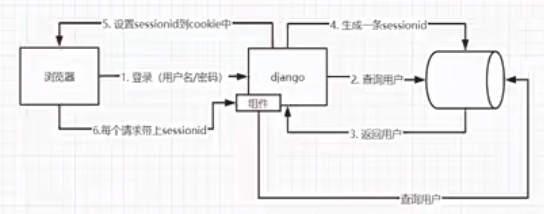
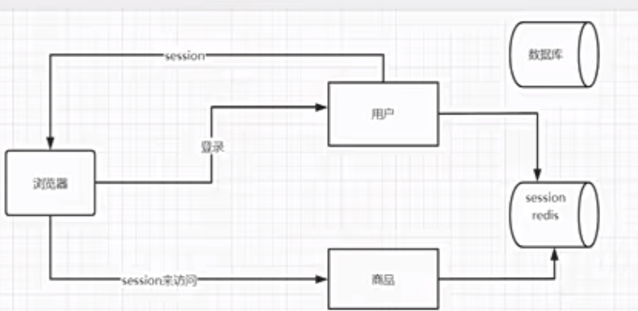

# 阶段3 从0到1实现完整的微服务框架

> 整体课件项目代码就见`mxshop_srvs`

## 8周 用户服务的grpc服务

- 该周只有1章-用户服务的service开发
- 代码见`mxshop_srvs/user_srv`

### 1-1 定义用户表结构

> 创建`user_src/model`专门存放用户的表结构字段

### 1-2 同步数据库的表结构

> 创建`user_src/model/main`文件夹， 专门用来同步数据库的表结构

下面语句会创建一个user用户信息表，注释不用这个的话，直接上面db.save也会默认创建表
`_ = db.AutoMigrate(&model.User{}) //此处应该有sql语句`

### 1-3 密码字段的md5加密

1. 一般数据库中密码字段，不能存明文密码，一旦数据库丢失，密码就丢了，一般都是密文保存，而且需要密文不可反解
2. 加密算法一般分为以下几种方式：
   1. 对称加密：加密和解密用的是同一把钥匙，这种一把钥匙泄漏风险也很大，也不能满足不可反解的要求
   2. 非对称加密：一般采用非对称加密，加密和解密用不同的钥匙，但是他不能满足密码不可反解的要求
   3. md5 信息摘要算法：最常用的是这个，它不能反解，它严格上说不是加密算法，而是信息摘要算法，但是一般用做密码加密
3. 密码如果不可以反解，用户忘记了密码找回密码怎么办？？
   1. 首先不能反解的话，我们拿到数据库存的密文，也是无法反解的，就算反解了发给用户邮件万一邮件被拦截，万一丢了泄漏了也不安全
   2. 所以一般是给用户一个链接，让用户去重置一个新密码

#### md5信息摘要算法加密

首先哈希算法就是摘要算法，它是大类，md5只是Hash的一种。下面md5的特性就是哈希算法的特性，不可反解。

1. Hash 家族常见成员，全都属于 Hash 摘要算法：
   1. MD5（最老，不安全），值固定32个字符
   2. SHA-1：值固定40个字符
   3. SHA-256：值固定64个字符
   4. SHA-512：值固定128个字符
   5. bcrypt、PBKDF2、Argon2（密码专用哈希）
   6. Hash算法的基本特点：
      1. 任意长度输入 → 固定长度输出
      2. 单向不可逆，不能解密还原原文
      3. 用来做：校验完整性、密码存储、签名
2. md5:摘要算法可以将任意长度的字符串转换成固定长度的16进制字符串
   1. 压缩性：任意长度的数据，算出md5值的长度都是固定的，永远是32个16进制字符
      1. md5的底层就是输出128位二进制串，32位16进制字符串
   2. 容易计算：从原数据计算出MD5值很容易
   3. 抗修改性：对原数据进行任何修改，哪怕1个字节，md5值差异也很大
   4. 强碰撞：想找到2个完全不同的数据，使得它们的MD5值相同，这是不可能的
   5. 相同内容 → 永远相同 MD5，不同内容 → 几乎不可能相同
   6. 不可逆性：不能反解，单向不可逆（不能从密文还原原文）
3. md5盐值加密
   1. 加盐
      1. 通过生成随机数和md5生成字符串进行组合
      2. 数据库同时存储md5值和salt盐值，验证正确性使用salt进行md5即可


- go中md5加密代码示例见：user_srv/model/main/main.go 的 genMd5 函数
- 默认的md5加密，得到的密文是非常不安全的因为是不可反解的，会提前将任意常见密码用md5加密下存下来，相当于md5值和你的密码是一一对应的，因此可以被暴力破解-彩虹表直接反向映射到，所以一般都会加盐加密

### 1-4 md5盐值加密解决用户密码安全问题


- 使用开源库已经封装了密码加密加盐的方法："github.com/anaskhan96/go-password-encoder"
  - 库内部源码，就是这么写的：PBKDF2 本身不是哈希算法，它是一个 “加密框架 / 流程”！它自己不会算哈希，必须靠 HashFunc（SHA512/SHA1）来干活！PBKDF2 只是一个 “重复加密的流程框架”，它需要一个真正的哈希算法来执行每一次加密
    ```go
    derivedKey := pbkdf2.Key([]byte(password), 
        salt, 
        opts.Iterations,  // 迭代次数
        opts.KeyLen,      // 密钥长度
        opts.HashFunc,    // SHA512
    )
    ```
  - 该函数内部自动计算生成一个加密后 的随机盐值和 加密后的密文
    - `salt, encodedPwd := password.Encode("generic password", options)`
  - 验证用法：验证用户的密码对不对  
    - `password.Verify("原始密码", passwordInfo[2]/*盐值*/, passwordInfo[3]/*密文密码*/, options)`
- 问题：有盐值，那这个盐值存在哪里呢，用户登录后用户名密码得到后，咋取到盐值进行校验呢
  - 一般不建议salt存在用户表中，一般是直接存在密文密码中,存储到数据库的密码字符串，格式是：`$pbkdf2-sha512$随机盐值$加密后的密文`
  - 当用户名登录后，用它的原始密码和数据库中的密文密码包含的盐值和密文提取出来进行方法验证对比，如果相同，则验证成功

### 1-5 定义proto接口

> 定义user_srv/proto/user.proto文件

### 1-6 用户列表接口

- 见 user_srv/handler/user.go 文件，来实现proto中的用户列表接口的具体定义
  - 需要引入gorm数据库实例去查询数据
- 建立 user_srv/global/global.go 全局变量，里面定义了数据库连接等公共引用方法使用

### 1-7 通过id和mobile查询用户

- 见 user_srv/handler/user.go 文件，来实现proto中的GetUserByMobile和GetUserByMobile方法的具体定义
	
    // Go 里面几乎所有：
	// gRPC 响应
	// 业务返回值
	// 较大的结构体
	// 全部统一返回指针，不返回值

### 1-8 新建用户接口
- 见 user_srv/handler/user.go 文件的CreateUser方法

### 1-9 修改用户和校验密码接口

- 见 user_srv/handler/user.go 文件的UpdateUser方法

### 1-10 通过flag启动grpc服务

启动这个grpc服务，测试下前面写的grpc的接口

> 见mxshop_srvs/user_srv/main.go文件

1. 使用go语言内置的flag包，来解析命令行参数，解析用户传入的ip和端口号动态启动grpc-server
   1. `ip := flag.String("ip", "0.0.0.0", "ip地址")：`
      1. 第一个参数："ip"，命令行参数的名字 `./program -ip=192.168.1.100`
      2. 第二个参数：默认值
      3. 第三个参数：参数的描述 用 `./program -help` 命令查看参数的描述
   2. `flag.Parse()  // 必须触发执行解析`
   3. `fmt.Println("IP：", *ip)`
      1. 小细节: flag.方法 返回的是 *string 指针,所以使用时要 加 *
   4. 使用时用`main.exe  -ip=192.168.1.100`


### 1-12 测试用户微服务接口

- 见user_srv/tests 文件夹


## 9周 用户服务的web服务

> 整体见 mxshop-api目录

### 1章 web层开发-基础项目架构

#### 1-1 新建项目和目录结构

- 新建mxshop-api/user-web项目 和对应的目录结构合理划分

#### 1-2 go高性能日志库
- 特点
  - 性能极高：比 gin 默认 log 快 10~100 倍
  - 结构化日志：JSON 格式，方便排查问题
  - 可输出到文件：自动写日志文件
  - 可分级：Debug / Info / Warn / Error / DPanic / Panic / Fatal
  - 生产环境标准库：公司 Go 项目几乎都用 zap
```go
// 安装
go get go.uber.org/zap
// 文件使用
package main

import "go.uber.org/zap"

func main() {
	// 生产环境配置
	logger, _ := zap.NewProduction()
	defer logger.Sync() // 刷新缓冲区

	// 打日志
	logger.Info("服务启动成功",
		zap.String("ip", "0.0.0.0"),
		zap.Int("port", 8080),
	)

	logger.Error("数据库连接失败",
		zap.Error(fmt.Errorf("connection timeout")),
	)
}


// ========= 替换 Gin 框架默认日志 ========
router := gin.Default()

// 把 gin 的日志替换成 zap
router.Use(ginzap.Ginzap(log, time.RFC3339, true))
```

- 使用zap库，来替换gin框架自带的日志中间件库，来实现日志的输出
- Gin 默认 Logger 有什么问题？（重点）
    1. 不能输出到文件，只能打印控制台，不能写文件，生产环境没法用。
    2. 格式固定，不能自定义，只能是它那一种格式，不能改成 JSON。
    3. 没有日志级别，没有 Debug / Info / Error 区分，所有日志混在一起。
    4. 性能一般，小项目没问题，高并发下性能不如 zap。
    5. 不能按天切割、不能自动清理，日志越来越大，撑爆磁盘。
    6. 不方便日志收集，不是结构化 JSON，ELK 之类的工具不好解析
- Zap 有两种 logger：
  - Logger（原味，高性能）
    - 调用：logger.Info("msg", zap.String("k", "v"))
    - 特点：最快、无反射、类型安全；但写起来啰嗦。
  - SugaredLogger（加糖，易用,性能略低一点点）
    - 获取：sugar := logger.Sugar() 或 sugar := zap.NewExample().Sugar()
    - sugar.Info("msg", "k", "v")
    - sugar.Infof("name=%s age=%d", "tom", 18)
- 获取全局loagger的简便写法，初始化一次不用子孙传递获取，直接用简写方法就能获取到全局实例
  - zap.S() 相当于logger.Sugar() .简写，直接获取全局的
  - zap.L() 相当于logger.Logger()，简写，直接获取全局的
```go
package main

import "go.uber.org/zap"

func main() {
	// 1. 初始化一次
	logger, _ := zap.NewProduction()
	zap.ReplaceGlobals(logger) // 变成全局
	defer logger.Sync()

	// 2. 直接用！！！
	zap.L().Info("服务启动成功") // L() = 全局 logger
}
```

#### 1-3 zap的文件输出

```go
package main

import (
	"os"

	"go.uber.org/zap"
	"go.uber.org/zap/zapcore"
)

func main() {
	// 1. 创建日志文件（没有会自动创建，有就覆盖）
	logFile, err := os.OpenFile("run.log", os.O_CREATE|os.O_WRONLY|os.O_APPEND, 0644)
	if err != nil {
		panic("日志文件创建失败")
	}

	// 2. 配置日志格式
	encoderConfig := zap.NewProductionEncoderConfig()
	encoderConfig.EncodeTime = zapcore.ISO8601TimeEncoder // 时间格式：2025-01-01 10:00:00
	encoderConfig.TimeKey = "time"                        // 时间字段名

	// 3. 核心：日志输出到【文件】
	core := zapcore.NewCore(
		zapcore.NewJSONEncoder(encoderConfig), // 日志格式：JSON
		logFile,                               // 输出目标：文件
		zap.InfoLevel,                         // 日志级别：Info及以上
	)

	// 4. 创建 logger（带文件名+行号）
	logger := zap.New(core, zap.AddCaller())
	defer logger.Sync() // 程序退出前把日志刷入文件

	// ============== 使用 ==============
	logger.Info("服务启动成功", zap.String("ip", "0.0.0.0"))
	logger.Error("数据库连接失败", zap.Int("code", 500))
}
```

#### 1-4&5 集成zap和路由初始到gin的启动过程

- web服务我们使用gin框架，将gin框架安装到我们项目中
- gin-web服务框架的默认启动用法，就不能用简单的demo方式启动了，需要适配现在的工程化的方式启动，我们需要按照我们的目录结构来
  - gin的初始化单独封装在`initialize/router.go`模块中，暴露Router方法，在main文件中初始时调用`initialize.Routers()`，且自顶向下传递得到的路由实例
  - api的统一放到api目录下分模块见子文件
    - api接口的代码专门存放web-server的接口api逻辑，处理用户的请求，调用grpc的服务端接口，返回结果给前端
    - 先建立`api/user.go文件`
  - router路由相关的专门放到router目录下维护，其他目录下都是服务
    - router是路由入口，负责调用api接口
    - 先建立`router/user.go文件`
- 全局logger初始化也封装在`initialize/logger.go`中，暴露Logger方法，在main文件中初始时调用`initialize.Logger()`

#### 1-6&7 gin调用grpc服务

- 见`mxshop-api/user-web/router/user.go` 和 `mxshop-api/user-web/api/user.go`

- 先实现的api/user.go的GetUserList接口方法

#### 1-8 go的配置文件管理库：viper库

Viper = Go 一站式配置管理工具，遵循 12-Factor，统一管理所有配置源，无需硬编码、无需关心格式。

核心功能（全覆盖）

✅ 多格式支持：YAML、JSON、TOML、HCL、INI、env、properties

✅ 多配置源：配置文件、环境变量、命令行参数、远程配置（etcd/Consul）、默认值

✅ 热加载：监听文件变化，自动重新读取（热更新）

✅ 结构体绑定：Unmarshal 到 Go 结构体，类型安全

✅ 优先级合并：自动按优先级覆盖，无需手动处理

✅ 大小写不敏感：Key 不区分大小写

```js
一、核心特点

多格式兼容支持 YAML、JSON、TOML、INI、HCL、Properties 等主流配置格式，不用改代码随意切换格式。
多配置来源统一管理配置来源全覆盖：本地配置文件、环境变量、命令行参数、内存默认值、远程配置中心（etcd/Consul）。
自动配置优先级内置固定优先级：代码 Set > 命令行 > 环境变量 > 配置文件 > 远程配置 > 默认值高层自动覆盖低层，不用自己手写覆盖逻辑。
支持配置热加载可监听配置文件变化，自动重新加载，不用重启服务就能更新配置。
结构体绑定支持直接把配置 Unmarshal 绑定到结构体，类型安全，告别零散 GetString/GetInt 硬编码。
键名大小写不敏感配置 key 大小写不区分，书写更随意，减少大小写报错。
层级配置支持完美支持嵌套层级配置（如 app.port、db.host），适合复杂项目结构。
零侵入、易集成无复杂依赖，接入简单，所有 Go 项目（单体、微服务、CLI 工具）都能直接用。
```

- Viper 优势：多格式、多来源、自动优先级、热加载、结构体绑定，把 Go 项目配置从「手写硬编码」变成「标准化、优雅、可维护」的统一方案
- viper练习目录见：`viper_test/ch01目录`

#### 1-9 viper的配置环境开发环境和生产环境

- 目录见：`viper_test/ch02目录`
- 必记：
  - 结构体中使用`mapstructure标签`：这是viper库专用的标签，把 yaml 配置文件的 key 映射到结构体字段

#### 1-10 viper集成到gin的web服务中

> 见mxshop-api/user-web

- 创建2个配置文件config-debug和config-pro.yaml，集成到该web项目中
- 支持配置后，`api/user.go`的grpc客户端初始化时下就不用硬编码host和端口号了
- 创建全局配置文件：`mxshop-api/user-web/config/config.go`
- 接着在哪里读取初始化全局配置文件，见单独的模块目录中：`mxshop-api/user-web/initialize/config.go`
  - 在这里封装全局的初始化方法读取全局配置文件，如初始化grpc客户端


### 2章 web层开发-用户接口开发

#### 2-1 表单验证的初始化

1. 接着完成登录接口：`api/user.go`文件的`PassWordLogin`方法
2. 定义全局接口的翻译的初始化文件：`user-web/initialize/validator.go`
3. 在main中导入使用`user-web/main.go`
4. 最后注册登录的路由方法 `mxshop-api/user-web/router/user.go`


#### 2-2 自定义mobile的验证器

- 注册手机号格式自定义验证器：mxshop-api/user-web/main.go
   1. binding.Validator.Engine()------RegisterValidation("mobile", 校验函数)

#### 2-3 登录逻辑的完善

- 表单验证一旦通过之后，就需要完成登录的业务逻辑
- 实现到登录密码校验成功后，剩下如何响应用户登录态？下节讲

**注意**
1. 只有 gRPC 框架返回的错误（是指定用 status.Error 生成的），才能在web-server端被 status.FromError 解析

#### 2-4 session机制在微服务下的问题

- 常见2种方案
  - 1、有状态的session-cookie
    - 
    - 这种方案在单体应用中没啥问题，但是在微服务中，存在问题
      - 首先微服务的数据库是独立的，比如订单服务不能直接去查用户服务的数据库中，微服务是互相隔离不能直接跨服务查表
      - 有2种方案解决
        - 用户服务把session存储在公共的redis服务中，如果要扛高并发还得是redis集群
          - 
        - 使用jwt-toekn机制
  - 2、无状态的jwt-token机制
    - 它服务器中不存储相关的登录态session，它是无状态的。

#### 2-5 jsonwebtoken的认证机制

JWT：JSON Web Token，是无状态的登录令牌，把用户信息加密编码后生成一串字符串，客户端存着，每次请求带上就能鉴权。

- 微服务中
  - 是个加密后的toekn，前端拿到token请求，我的用户服务解密成功就成功
    - 只有微服务用密钥自己能解密，前端解密不了，订单服务，用户服务，商品服务都能解密，用于鉴权
  - 微服务使用 JWT，只需要统一一份加密密钥，所有微服务都拿到同一个密钥，各自独立完成 Token 签名校验，不用共享会话、不用请求转发鉴权。

二、JWT 结构（三部分，用 `.` 分隔）
**Header . Payload . Signature**
1. **Header 头部**：加密算法、令牌类型
2. **Payload 载荷**：存用户信息、过期时间、用户ID等**自定义数据**（Base64编码，可解码，**但是不能存敏感密码**）
3. **Signature 签名**：用**密钥+算法**对前两部分加密签名，**防篡改**
   1. 这个密钥绝不能泄漏，它一定是服务器自己解密使用的，服务端校验逻辑：用同一个密钥 重新算一遍签名，和客户端带的对比
   2. 签名 = 加密(Header + Payload + 密钥)

jwt官网可以在线校验测试

三、工作原理（背诵流程）
1. 用户登录成功，服务端**根据用户信息+密钥**生成 JWT 返回给客户端；
2. 客户端把 JWT 存在 header中，后续每次请求**自动带上**；
   1. 一般token都是放在header中的，一般放在 Authorization 中，**Bearer**开头；
3. 服务端**不存 JWT**，只拿**密钥校验签名**：
   - 服务端校验逻辑：用同一个密钥 重新算一遍签名，和客户端带的对比
   - 签名合法 → 没被篡改，解析出用户信息直接登录；
   - 签名不合法 → 拒绝请求；
4. 无需查数据库、无需查Redis，**直接鉴权**。

四、核心特点
1. **无状态**：服务端**不存储**任何登录信息，不用存Session；
2. **自包含**：Token 内部自带用户信息、角色、过期时间；
3. **跨域友好**：天然支持前后端分离、小程序、APP、微服务；
4. **签名防篡改**：密钥不泄露，别人改不了Token内容；
5. **去中心化**：所有微服务只要有**同一个密钥**，就能自行校验，不用统一查登录中心。

五、优点（必背）
1. **服务端无压力**：不用维护Session、不用Redis共享会话，省内存省存储；
2. **天生适合微服务/分布式**：不用会话共享，各服务独立校验；
3. **跨端跨域好用**：支持浏览器、APP、小程序、第三方登录；
4. **减少数据库/缓存查询**：直接解析Token拿用户信息，不用查表；
5. **扩展性强**：可在载荷里存角色、权限，做接口鉴权。

六、缺点（必背）
1. **无法主动注销**：一旦签发，**没过期前不能作废**，不能像Session一样手动删下线；
2. **令牌一旦泄露，风险大**：有效期内别人可一直冒充登录；
3. **Token 体积大**：自带载荷信息，比Session-ID长，每次请求都带，增加网络开销；
4. **载荷只是编码不是加密**：Payload 可Base64解码，**不能存密码、手机号等敏感信息**；
5. **续签麻烦**：快过期需要前端主动重新申请新Token。

七、JWT vs Session 一句话总结（背诵）
- **Session**：有状态，服务端存数据，安全可注销，**微服务要Redis共享**，占内存；
- **JWT**：无状态，服务端不存，分布式跨域无敌，**不能主动注销、泄露有风险**。

#### 2-6 集成jwt到项目的gin服务中

接着完成登录接口：`api/user.go`文件的`PassWordLogin`方法的登录成功后生成token并返回给前端的逻辑

- 新建2个模块的jwt职责单一化文件
  - `models/request.go` 自定义 JWT 载荷结构体，存放用户信息 + 标准 JWT 声明，用于生成和解析 Token。
    - 放需要存在 Token 里的用户信息, 必须实现 jwt 的 Claims 接口
    - 生成 Token: 把 CustomClaims 结构体 → 加密签名 → 生成 JWT
    - 解析 Token: 把 JWT → 解析 → 还原成 CustomClaims,直接拿到用户 ID、权限、是否过期
  - `middlewares/jwt.go`：JWT 登录认证中间件相关的方法集合，负责 “登录校验、Token 解析、Token 创建、Token 刷新”
    - 整个文件包含 4 个核心功能：
    - JWTAuth() → Gin 中间件，拦截所有需要登录的接口
    - CreateToken() → 登录成功后生成 JWT
    - ParseToken() → 解析前端传过来的 Token，校验是否合法
    - RefreshToken() → 刷新 Token，延长有效期
- 更新全局变量公共文件：将密钥key放在全局变量里使用
- 在登录接口中登录成功后调用这个生成token的方法middlewares.NewJWT()


#### 2-7 给url添加登录权限验证

- 实现如何去验证每一个接口必须登录才能继续访问？
  - 实现middlewares/jwt.go文件的JWTAuth方法
  - 在需要登录的路由接口中添加鉴权中间件：user-web/router/user.go
    - 并在ctx上下文中设置鉴权成功后的用户ID 和 鉴权解析数据
    - 后续，在user-web/api/user.go 接口中，可以上下文中直接获取用户ID
  - 再写一个验证是否是管理员的中间件,并在user-web/router/user.go中添加
    - `mxshop-api/user-web/middlewares/admin.go`


#### 2-8 解决前后端的跨域问题

通过后端的cors解决跨域问题：`middlewares/cors.go`

1. 案例演示：前端页面部署在localhost:8080，后端服务部署在localhost:8888
   1. 浏览器发起ajax请求，现在虽然跨域直接请求后端接口可以成功先不管浏览器同源策略问题，加了beforeSend 请求头，就会发起options预检请求
2. 浏览器在什么情况下会发起options预检请求?
   1. 在非简单请求且跨域的情况下，浏览器会发起options预检请求。Preflighted Requests是CORS中一种透明服务器验证机制，预检请求首先需要向另外一个域名的资源发送一个HTTPOPTIONS请求头，其目的就是为了判断实际发送的请求是否是安全的。
   2. 哪些是简单请求哪些是非简单请求？
3. 关于简单请求和复杂请求:
   1. 简单请求：简单请求需满足以下两个条件
      1. 请求方法是以下三种方法之一:
         1. HEAD
         2. GET
         3. POST
      2. HTTP的头信息不超出以下几种字段
         1. Accept
         2. Accept-Language
         3. Content-Language
         4. Last-Event-ID
         5. Content-Type: 只于 (application/x-ww-form-urlencoded, multipart/form-data, text/plain)
   2. 复杂请求：复杂请求需满足以下条件
      1. 非简单请求即复杂请求，常见的复杂请求如
         1. 请求方法如PUT、DELETE、PATCH
         2. Content-Type字段类型为：application/json, application/xml, text/xml, text/html
         3. 添加额外的请求头：比如x-access-token
4. 跨域的情况下，非简单请求会先发起一次空body的OPTIONS请求，称为“预检”请求，--预检流程如下：
   1. 先自动发 OPTIONS 预检请求 问后端：允许我跨域吗？允许这个方法、这个请求头吗？
   2. 后端返回跨域响应头
   3. 预检通过 → 再发真实业务请求
   4. 预检失败 → 直接拦截，根本不发真实请求
5. 浏览器的预检请求结果可以通过设置Access-Control-Max-Age进行缓存
6. 跨域被浏览器拦截，一定是 OPTIONS 预检失败吗？----> 答案：不一定！分两种
   1. 情况 1：简单请求跨域（GET / 普通 POST、无自定义头）
      1. 不发 OPTIONS
      2. 直接发真实请求
      3. 后端正常返回数据
      4. 浏览器拿到响应后，同源策略校验不通过，直接拦截不报预检错
   2. 情况 2：非简单请求（有自定义头、JSON、PUT/DELETE）
      1. 先发 OPTIONS 预检
      2. 后端没配置跨域头 → 预检失败
      3. 浏览器直接拦截，真实请求都不会发出去
7. 用cors方式解决跨域---- 一定是需要后端返回允许的响应头就行了，不一定跟options响应处理强相关
   1. 简单请求不触发 OPTIONS 没关系，CORS 头照样返回，浏览器看见这些头照样放行；
   2. 非简单请求会触发 OPTIONS，代码里处理一下返回 204 即可。

**回到业务改动**

- 由于我们现在加了token机制，需要前端携带hedar中token发起请求，所以浏览器自动会发送options请求，因为token实现之前浏览器不会触发options请求，所以我们需要在接口中专门添加一个options请求处理响应逻辑
  - 我们创建user-web/middlewares/cors.go 文件
    - 主要负责给所有请求设置允许跨域的响应头
      - 只要加了这个就能避免浏览器的同源策略
    - 顺带处理options请求的正确响应的处理的，options请求返回204状态码

## 10周 服务注册发现，配置中心，负载均衡