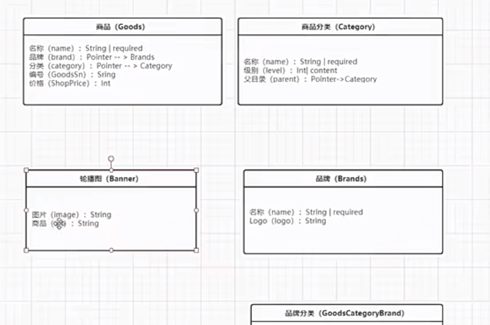
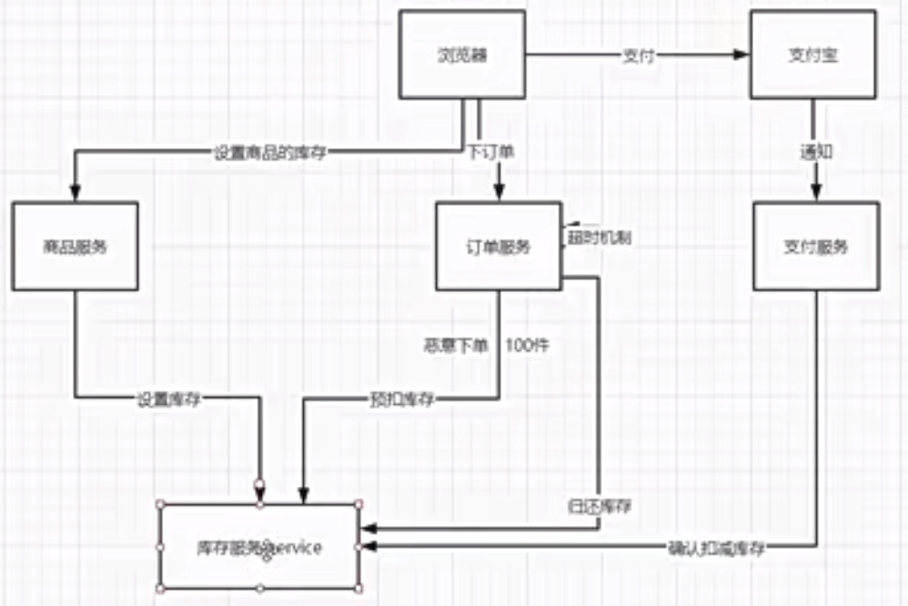
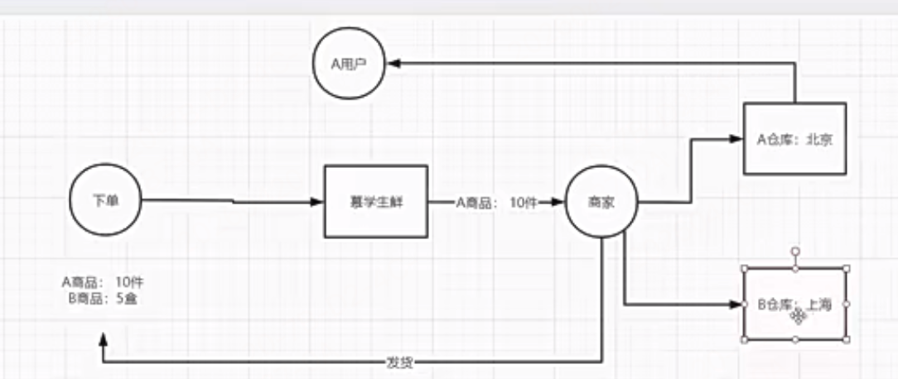
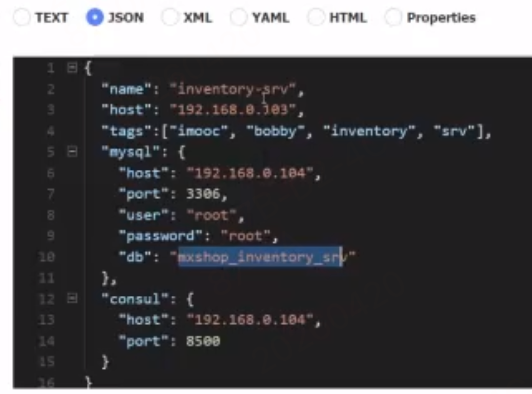

# 阶段4-微服务实现电商系统

## 11周 商品微服务的grpc服务

第一章-商品服务-service服务

- 课件代码见商品的grpc服务：`jieduan3-0-1shixian-weifuwu-kuangjia/mxshop_srvs/goods_srv` 目录
  - 目录结构与用户服务保持一致，能复用的就复用
- grpc服务写好接口，需要调试测试，因为web服务还没有开发，只能自己用tests文件运行测试

### 1-1 需求分析-数据库实体分析

需要分析下需求和前端界面，分析下有哪些数据实体需要纳入到商品微服务中来

通过需求分析商品服务这块大概需要有5张表


1. 轮博图管理实体表
2. 商品分类管理实体表
3. 商品管理信息实体表 -- goods表
4. 品牌表  - log图片和名称
5. 商品分类和品牌关系中间表  -- category_brand_relation表
   1. 品牌也有可能属于多个分类，多对多关系

#### 表结构对应的数据库表数据示例

> 根据jieduan3-0-1shixian-weifuwu-kuangjia/mxshop_srvs/goods_srv/model表文件实际对应的数据库示例
```go
// 1、categories 商品分类表（自关联三级分类）
id	created_at	updated_at	deleted_at	name	parent_category_id	level	is_tab
1	2025-01-01	2025-01-01	NULL	手机	0	1	1
2	2025-01-01	2025-01-01	NULL	安卓	1	2	0
3	2025-01-01	2025-01-01	NULL	小米	2	3	0

// 2、brands 商品品牌表
id	name	logo
1	小米	https://xxx.png
2	华为	https://xxx.png

// 3、goodscategorybrand 分类 <-> 品牌 中间表（多对多）一个分类可以绑定多个品牌，一个品牌可以属于多个分类
id	category_id	brands_id
1	1	1
2	1	2
3	2	1

// 4、goods 商品表
id	name	category_id	brands_id	shop_price	goods_brief	on_sale	ship_free
1	小米 14	3	1	3999	最新小米旗舰	1	1
2	华为 Mate70	2	2	4999	华为旗舰	1	1

// 5、banners 轮博图表
id	created_at	updated_at	deleted_at	image	url	index
1	2026-05-18 10:00:00	2026-05-18 10:00:00	NULL	https://img1.jpg	/goods/1001	1
2	2026-05-18 10:05:00	2026-05-18 10:05:00	NULL	https://img2.jpg	/category/1	2
3	2026-05-18 10:10:00	2026-05-18 10:10:00	NULL	https://img3.jpg	/activity/sale	3
```

### 1-2 需求分析- 商品微服务接口分析

分析下商品相关的需求和前端界面，都有哪些功能，需要提供哪些接口

1. 商品列表页
   1. 通过分类筛选
   2. 通过价格区间筛选
   3. 通过搜索框搜索
   4. 新品筛选
   5. 热卖商品的筛选
   6. 通过品牌筛选
2. 商品详情
3. 批量查询商品的接口
4. 后台管理系统的功能
   1. 添加商品
   2. 修改商品
   3. 删除商品
5. 品牌列表
   1. 后台系统中的增删改查
6. 商品的分类接口
   1. 通过1级分类查询出所有的二级分类
   2. 后台系统的分类增删改查
7. 品牌的分类
   1. 列表 
   2. 后台系统的分类增删改查
   3. 通过分类查找品牌

- 接口注意事项
  - 一旦设计修改数据库都需要必须加上权限校验，查询类的可选鉴权

### 1-3 商品多级分类表结构设计及细节注意
- 设计多级分类表：`jieduan3-0-1shixian-weifuwu-kuangjia/mxshop_srvs/goods_srv/model/goods.go`的Category表结构体定义
  - 重点讲解多级分类表的设计细节和新手避坑的地方
- 重点注意
  - gorm的自关联语法写法
  - GORM 的 AutoMigrate 默认会创建真实数据库外键约束。foreignKey / references 等 tag 是告诉 GORM 关联逻辑的，但并不阻止外键创建。如果不想创建真实外键，需要设置 DisableForeignKeyConstraintWhenMigrating: true。constraint tag 的作用是自定义外键的级联规则，而非控制是否创建外键。
    - foreignKey / references tag 是给 GORM 查询引擎看的；DisableForeignKeyConstraintWhenMigrating 是给 GORM 迁移引擎看的。两者完全独立，互不影响。
  - 但是请注意：**生产项目几乎都禁用 GORM 自动创建外键约束**
    -  性能问题：真实外键约束在每次 INSERT/UPDATE/DELETE 时数据库都要做约束校验，高并发场景下是性能瓶颈。


### 1-4 品牌，轮博图表结构设计

- `jieduan3-0-1shixian-weifuwu-kuangjia/mxshop_srvs/goods_srv/model/goods.go`的brand表和GoodsCategoryBrand表结构体定义
  - GoodsCategoryBrand：多对多关系是另起一张表
  - 注意细节
    - 联合唯一索引的创建：限制数据库中：(CategoryID + BrandsID) 这一组数据，绝对不能重复出现！
      - 防止同一个分类下，重复绑定同一个品牌！比如：手机分类 → 小米品牌，不能再绑定一次手机分类 → 小米品牌，这就是联合唯一索引的作用。
    - 多对多关联的写法
- `jieduan3-0-1shixian-weifuwu-kuangjia/mxshop_srvs/goods_srv/model/goods.go`的Banner表结构体定义

### 1-5 商品表结构的设计


- `jieduan3-0-1shixian-weifuwu-kuangjia/mxshop_srvs/goods_srv/model/goods.go`的Goods表结构体定义
- 细节注意
  - 在gorm表结构体中如何定义数组类型：如用在 Images字段：商品轮播图列表（JSON数组）
    - gorm默认没有数组类型，需要自定义一个gorm的数组类型，见`jieduan3-0-1shixian-weifuwu-kuangjia/mxshop_srvs/goods_srv/model/base.go`的GormList类型自定义
    - 这里用自定义类型GormList---在数据库中存的是字符串类型，或者用官方提供的 datatypes.JSON，支持数组对象，只不过它在数据库中存的是json类型

### 1-6 生成表结构和导入数据

- 见 `jieduan3-0-1shixian-weifuwu-kuangjia/mxshop_srvs/goods_srv/model/main/main.go` 来生成数据库创建新表


### 1-7 定义proto接口

- 建 `jieduan3-0-1shixian-weifuwu-kuangjia/mxshop_srvs/goods_srv/proto/goods.proto`

### 1-8 快速启动grpc服务

快速启动学会用`proto.UnimplementedGoodsServer`方法，进行初期快速连通接口测试

- 先完善`jieduan3-0-1shixian-weifuwu-kuangjia/mxshop_srvs/goods_srv/main.go` 中的启动proto的grpc服务实例
  - `proto.RegisterGoodsServer(server, &handler.GoodsServer{})`
- 接着定义handler层，实现proto接口：`jieduan3-0-1shixian-weifuwu-kuangjia/mxshop_srvs/goods_srv/handler/goods.go`
  - 细节注意：
  - 开发初期：如果你想快速测试接口的连通性，可以用这个自动生成的UnimplementedGoodsServer结构体：使用`proto.UnimplementedGoodsServer` proto自动生成 --- 只是做初期测试用
  - 后面开发：就需要自己实现完整具体的GoodsServer结构体方法
- 添加对应的nacos配置，就可以快速启动了

### 1-9 品牌列表的实现

- 本节实现轮博图和品牌接口的完成
- 先实现`jieduan3-0-1shixian-weifuwu-kuangjia/mxshop_srvs/goods_srv/tests/brands.go` 测试文件进行接口开发测试
  - 由于目前是用UnimplementedGoodsServer快速实现的，接口发现，测试发现会它默认会帮我们自动返回错误的状态码，未实现的错误信息
- 品牌列表细节注意
  - 学习到一个返回品牌分页时，返回分页的数据，总数，总数的获取学习使用gorm的`Count()`方法
    - 文件见`jieduan3-0-1shixian-weifuwu-kuangjia/mxshop_srvs/goods_srv/handler/brands.go`

### 1-10 品牌的其他接口：新建删除更新

- 文件见`jieduan3-0-1shixian-weifuwu-kuangjia/mxshop_srvs/goods_srv/handler/brands.go`

### 1-11 轮播图的增删改查crud

- 文件见`jieduan3-0-1shixian-weifuwu-kuangjia/mxshop_srvs/goods_srv/handler/banner.go`


### 1-12 商品分类的列表接口1

这个需要重点看下关联表 和多级分类的实现

- 见`mxshop_srvs/goods_srv/handler/category.go`
  - 重点实现返回适合前端展示的分类大数组结构，包含子分类（一级分类二级分类）
- 分类列表接口`GetAllCategorysList`：希望返回如下这种嵌套的大json结构给前端，拼装好这种结构我们选择在goods_srv层做，不交给web-服务层做，
  - 因为这种结构用gorm来做是非常简单的，web-服务一般不与数据库交互，自行拼接是很麻烦的
    - goods_srv层做我们返回Data原始结构和JsonData拼好的大json结构
- 先涉及完善分类表结构的自关联语法，子分类切片结构体关联父分类结构体， -- 详见`jieduan3-0-1shixian-weifuwu-kuangjia/mxshop_srvs/goods_srv/model/goods.go`的Category表结构体,自关联外键相关写法
- 完善后，在我们的接口处理函数`GetAllCategorysList`中使用这种表结构
  - 使用Preload预加载语法
- 最后在`jieduan3-0-1shixian-weifuwu-kuangjia/mxshop_srvs/goods_srv/tests/category/category.go`的`TestGetCategoryList`测试文件中测试接口响应

### 1-13 商品分类的列表接口2

- 前面遇到问题：调用分类的接口，接口响应中只能往下加载一级，不能无限递归加载，
  - 解决：正确用Preload预加载语法，使用点号语法`Preload("SubCategory.SubCategory")`
    - 语法：点的数量 = 子分类层数，
    - 如果有 四级分类就写2个点3段：`Preload("SubCategory.SubCategory.SubCategory")`

### 1-14 获取商品分类的子分类

- 实现`mxshop_srvs/goods_srv/handler/category.go`的GetSubCategory接口方法
  - 获取一个分类下的子分类
- 然后在test下测试

### 1-15 商品分类的新建删除和更新

- 实现相关剩余的分类接口

### 1-16 品牌分类相关接口

- 略

### 1-17&18&19 商品列表页接口
- 实现GoodsList接口
  - 涉及多维度筛选，复合查询，分类查询等实现的难点
  - 这个比较重要稍微复杂一些
- 然后tests文件下测试该接口


### 1-20 批量获取商品信息、商品详情接口

- 注意下批量查询时的where语法-见BatchGetGoods方法

### 1-21 新增修改和删除商品接口

- CreateGoods接口方法等
- 删除方法
  - 使用的是逻辑删除

## 12周 商品微服务的gin层和oss图片上传

### 1章 gin完成商品服务的http接口
> 主要完成 `jieduan3-0-1shixian-weifuwu-kuangjia/mxshop-api/goods-web`目录，完成与goods_srv的联调

#### 1-1 快速将用户的web服务复刻出商品的web服务
**重点注意**：
1. 迁移中间件时涉及鉴权功能，这个可能每个服务可能都需要统一的这种代码逻辑 ---- 涉及公共代码的优缺点
##### 公共代码的优缺点
   1. 优点：抽离出来，各个微服务公用，是有好处的，抽离，减少代码量 
   2. 缺点：公共的代码作为多个微服务公用的话，有一个很大的缺点，一旦修改可能会影响其他服务，而且不知道当时有哪些服务在用，不知道影响面，一旦有问题，其他微服务都会受到影响
   3. 解决：公共的代码给大家统一使用，必须要加版本管理，方便风险控制

### 1-2&3 商品列表页接口1&2

- `jieduan3-0-1shixian-weifuwu-kuangjia/mxshop-api/goods-web/api/goods/goods.go` 的List方法

web服务层的接口都是跟业务强相关的，

### 1-4 如何设计一个符合go风格的注册中心接口？

- 我们需要把我们的商品web服务注册到注册中心去，如consul去，但是我们必须统一封装一个适配器，解耦和扩展性，支持扩展后面能随时切换注册中心平台
- 我们建立`jieduan3-0-1shixian-weifuwu-kuangjia/mxshop-api/goods-web/utils/register` 单独的注册中心模块，可以方便扩展
- 这节课重点：不是把商品gin层项目接入注册中心，而是设计一个通用扩展性高的集成注册中心功能
- 然后在`jieduan3-0-1shixian-weifuwu-kuangjia/mxshop-api/goods-web/main.go` 引入（集成注册中心模块）使用它注册到consule中

### 1-5 gin的退出后的服务注销

- 见`jieduan3-0-1shixian-weifuwu-kuangjia/mxshop-api/goods-web/main.go`
- 1. 优雅的退出功能，一定要先把这个Router服务启动放到协程里
- 2. 在系统退出信号中--然后调用前面封装的统一注册中心接口暴露的注销方法register_client.DeRegister
### 1-6 用户的web服务注册和优雅退出

- 给user-web服务也封装统一注册集成接口，添加注册功能和退出注销功能

- 见`jieduan3-0-1shixian-weifuwu-kuangjia/mxshop-api/user-web/main.go`


### 1-7 新建商品

- 完成`jieduan3-0-1shixian-weifuwu-kuangjia/mxshop-api/goods-web/router/goods.go` 的 `goods.New` 相关路由的实现
  - 以及`api/goods/goods.go 的 func New(ctx *gin.Context) 方法`
  - 重点关注
    - 但凡这种post，put改数据库类的请求，在微服务中都是比较重要关注的，稍复杂，因为设计跨微服务的数据库交互，必须要考虑的如最重要的分布式事务问题。。。
    - 如何设置库存 --- 这块是重点后面单独讲，TODO 商品的库存 - 分布式事务

### 1-8 获取商品详情

- 完成`jieduan3-0-1shixian-weifuwu-kuangjia/mxshop-api/goods-web/router/goods.go`的`GoodsRouter.GET("/:id", goods.Detail) //获取商品的详情`handler逻辑
  - handelr中的Detail方法
- 重点细节
  - 只有需要在 gRPC 服务端里拿到 Gin 上下文信息时，才用 WithValue
    - 如 grpc服务端中想获取请求头 token，用户id什么的
      - ginCtx := ctx.Value("ginContext").(*gin.Context)
      - userId := ginCtx.GetInt("userId")
    - 那么webgin层，调用时一定要
      - rsp, err := goodsClient.GetGoodsDetail(
        - context.WithValue(context.Background(), "ginContext", ctx), // 把 gin ctx 塞进去
        - &proto.GoodInfoRequest{Id: int32(i)},
      - )
  - 普通接口、不需要传递信息时，直接用grpc的上下文即可： context.Background ()*

### 1-9 商品删除更新

- 完成路由处理方法：`GoodsRouter.DELETE("/:id",middlewares.JWTAuth(), middlewares.IsAdminAuth(), goods.Delete) //删除商品`
- 再增加一个获取商品库存的接口`GoodsRouter.GET("/:id/stocks", goods.Stocks)   `
  - 目的：此时主要是在gin层留出一个口子，后续在goods_srv中实现苦寻接口
- 完善一个更新路由接口`GoodsRouter.PATCH("/:id", middlewares.JWTAuth(), middlewares.IsAdminAuth(), goods.UpdateStatus)`
  - 更新部分状态，接口-- 部分更新用PATCH方法
  - 使用抽离form表单类型：`forms/goods.go`
- 完善`GoodsRouter.PUT("/:id", middlewares.JWTAuth(), middlewares.IsAdminAuth(), goods.Update)         // 全量更新用PUT方法`
  - 使用抽离的form表单类型：`forms/goods.go`

### 1-10 商品的分类接口

- 分类接口单独拆分文件模块，与商品本身的增删改查不能混在一起

- 新建分类路由接口`jieduan3-0-1shixian-weifuwu-kuangjia/mxshop-api/goods-web/router/category.go`
- **重点注意的**
  - 新建分类时需要新建个form表单类型`forms/category.go`，from里的bool类型必须用指针类型，原因如下：
    - bool 零值 = false，即使前端根本没传这个字段，Gin 也会认为它的值是 false，用户不传 is_tab → 系统以为是 false → 验证通过，验证器没有拦住
    - 用 *bool 指针就完美解决 IsTab *bool `binding:"required"`
      - 因为指针的零值 = nil（空）
  - api下goods和category文件存在公共帮助代码重复使用，可以抽离到api/base.go文件自定义api包名下，直接api包名引用

### 1-11 轮博图接口和yapi的快速测试

1. `jieduan3-0-1shixian-weifuwu-kuangjia/mxshop-api/goods-web/router/banner.go`
2. 建个banner的form类型：`jieduan3-0-1shixian-weifuwu-kuangjia/mxshop-api/goods-web/forms/banner.go`
3. 新建`jieduan3-0-1shixian-weifuwu-kuangjia/mxshop-api/goods-web/api/banners/banner.go`

### 1-12 品牌列表页接口

- 完成`jieduan3-0-1shixian-weifuwu-kuangjia/mxshop-api/goods-web/router/brand.go`
  - 品牌列表的CRUD接口
### 1-13 品牌分类CRUD接口

- 接着完成`goods-web/router/brand.go`品牌分类接口

**例如**
分类1：手机 → 绑定品牌：华为、小米
分类2：电脑 → 绑定品牌：联想、苹果
1 GetCategoryBrandList(ctx *gin.Context)。---- /rpc/category/1/brands接收分类id
[
  { "id": 1, "name": "华为", "logo": "xxx" },
  { "id": 2, "name": "小米", "logo": "xxx" }
]

2 CategoryBrandList(ctx *gin.Context) --- /rpc/category/brands// 调用时不用传参
{
  "total": 4,
  "data": [
    { "category": {id:1,name:"手机"}, "brand": {id:1,name:"华为"} },
    { "category": {id:1,name:"手机"}, "brand": {id:2,name:"小米"} },
    { "category": {id:2,name:"电脑"}, "brand": {id:3,name:"联想"} },
    { "category": {id:2,name:"电脑"}, "brand": {id:4,name:"苹果"} }
  ]
}

### 2章 阿里云的oss服务集成

#### 2-1 为什么要使用阿里云的oss服务

- 之前【单体服务】用户服务 + 商品服务 + 文件上传 → 都在一个项目里，商品，用户，订单模块都可以直接读这个目录，单体这样没问题
- 但是转移在微服务下，立刻就会出一些痛点问题：
  - 需要每个微服务单体机器都独立处理的文件上传存储，这样用户服务就必须得跨服务去商品服务拿图片了，
    - 文件存在各自服务里 → 别的服务拿不到，必须跨服务调用→ 极其麻烦性能差
    - 单个微服务多实例部署，图片不同步：商品服务-1 → 上传图片 → 存在自己机器，商品服务-2 → 根本看不到这张图
  - 解法：独立出一个公共的文件上传存储服务，找第三方的服务

#### 2-2 oss基本概念介绍

略，到时候直接看教程文档

#### 2-3 使用代码控制文件上传

- 学习测试目录见`oss_test/main`

- 用go语言 的sdk客户端安装

#### 2-4 前端直传oss的流程

- 前面是服务端上传，其实更好是前端直接上传，免去服务器中间的中转过程，减少链路延迟，提升性能

一、原生浏览器直传弊端
直接将 **AccessKey、SecretKey** 明文写在前端代码里
1. 浏览器F12、抓包即可轻易窃取密钥
2. 攻击者可随意上传、删除、篡改OSS文件，造成资源滥用、扣费、违规内容风险
3. 权限完全不可控，无时效、无上传限制

**核心痛点：密钥暴露前端，安全彻底失控**

---

二、OSS官方两种安全直传方案

- 阿里云 OSS 官方原生完全支持临时签名上传日常说的「服务端签名直传」，本质就是 OSS 开放的临时授权签名上传机制，是官方标准推荐方案，不是自研逻辑。
  - 核心概念1: Policy： 上传策略后端定义上传规则：允许文件后缀、大小限制、存储目录、签名有效过期时间、访问权限等明文约束条件。
  - 核心概念2: Signature： 签名后端使用 OSS 完整密钥 AccessKeySecret，把 Policy 字符串做加密哈希生成加密串，就是签名。

**方案1：服务端签名直传（最常用）**
1. 核心原理
后端持有完整OSS密钥，**不在前端暴露任何密钥**，由后端根据上传规则生成**临时加密签名**，前端携带临时签名直传OSS。

1. 执行流程
   1. 前端上传前，请求业务服务端获取上传参数
   2. 后端配置上传规则：文件类型、大小限制、上传目录、签名过期时间
   3. 后端用OSS密钥加密生成 `Policy`（上传策略）+`Signature`（签名）
   4. 后端仅返回：OSS域名、文件名、Policy、Signature等**无密钥参数**
   5. 前端携带签名**直接向OSS发起上传请求**，不经过业务服务器
   6. OSS校验签名合法、规则匹配，接收文件并返回文件外网URL
   7. 前端将最终文件URL传给后端，入库保存

2. 优缺点
   - 优点：**不占用业务服务器带宽**、上传速度快、签名有时效、权限可控、安全性高
   - 缺点：后端无法实时校验上传文件内容，仅能限制格式大小

3. 适用场景
商品图片、用户头像、轮播图等**通用静态资源上传**

---

**方案2：Callback回调直传（安全级别更高）**

1. 核心原理

在**服务端签名直传**基础上，新增OSS主动回调机制，文件上传成功后，OSS自动请求业务服务端接口，由后端做**二次校验+业务入库**。

2. 执行流程
   1. 前端向后端获取签名，后端生成签名同时**配置回调地址**
      2. 后端一次性返回前端：policy、signature、callback、callback-var、host、accessKeyId
   2. 前端携带签名直传OSS完成文件上传
   3. OSS接收文件成功后，**主动调用后端预设的回调接口**
   4. 后端接收OSS回调，获取文件信息，校验文件合法性、业务归属
   5. 后端校验通过，完成数据入库，再响应结果给OSS
   6. OSS将后端回调结果返回给前端

3. 优缺点
   - 优点：兼具直传带宽优势 + **后端文件内容二次审核**，防恶意文件、违规资源，业务逻辑更严谨
   - 缺点：流程更长，需要后端单独开发回调接口

4. 适用场景
实名认证照片、资质文件、用户私密资源、需要后台审核的上传文件

---

三、两种方案核心区别
1. **服务端签名直传**
   前端拿签名传OSS → 拿到URL主动传给后端入库，**后端被动接收**
2. **Callback回调直传**
   前端传OSS成功 → **OSS主动推数据给后端**，后端审核后完成入库

---

四、笔记背诵总结
1. 明文密钥前端直传：**极度不安全，禁止使用**
2. 服务端签名直传：后端生成临时时效签名，前端无密钥直传，轻量高效
3. Callback回调直传：签名直传+OSS后端回调，双重校验，安全性最高
4. 微服务项目图片、文件上传优先使用**服务端签名直传**，审核类文件用**回调直传**

#### 2-5 gin集成前端直传文件

根据oss官方的直传和callback教程可以操作

1. 下载go版本的应用服务器代码
   1. 如oss_test/app/appserver.go文件
2. 配置客户端代码
   1. 下载前端源码到本地`oss_test/aliyun-oss-appserver-js-master`
   2. 然后配置serverUrl是 用户获取 '签名和Policy' 等信息的应用服务器的URL，请将下面的IP和Port配置为您自己的真实信息。
      1. serverUrl = 'http://192.168.0.103:8029'
3. 修改cors
4. 体验上传文件

#### 2-6 为什么需要内网穿透

我们现在要测试下回调直传功能，

1. 首先`oss_test/aliyun-oss-appserver-js-master/upload.js`里的callback字段一定设置上
2. callback的url是oss服务要调用的，这个url如果是咱们本机的ip地址，是调不同的，本机ip是局域网的内网地址，但是oss服务是部署在公网的，所以oss服务调不到本机的callback地址，所以需要内网穿透技术---使用第三方的内网穿透工具如续断，花生壳，ngrok等

#### 2-7 内网穿透技术解决直传回调

**流程**
1. 本地启动项目，回调接口地址示例：http://127.0.0.1:8080/api/oss/callback
2. 开启内网穿透，将本地端口映射为公网地址
   1. 只需要：下载一个客户端，解压即可，无需安装
   2. 进入目录，启动续断`xuduan.exe http 8080`
   3. 启动成功后，会给你一个公网域名, 外网能访问你本机 8080 的地址
   4. 例：映射后公网地址 → https://xxx.xuduan.com/api/oss/callback
3. 后端生成 OSS 回调配置时，不再填写本机内网 IP，填写穿透后的公网域名 / 地址
4. 前端直传 OSS 上传文件成功
5. 公网 OSS 通过穿透后的公网地址，成功访问到本地电脑的回调接口
6. 本地接口接收 OSS 回调参数，完成业务逻辑、数据入库

- 项目部署到公网服务器后，直接填写服务器公网域名 / 公网 IP作为回调地址，无需内网穿透，OSS 可直接正常调用。

#### 2-8 将oss集成到gin的服务中

- 我们选择将oss这块专门做成一个微服务，见`jieduan3-0-1shixian-weifuwu-kuangjia/mxshop-api/oss-web`目录

1. oss-web/config/config.go 下新增OssConfig

## 13周 库存服务和分布式锁

### 1章 库存服务

#### 1-1 库存服务的重要性

- 库存本身不提供web-server层，都是grpc微服务来调用
- 创建订单要预扣减库存
  - 超时未支付，要归还库存
  - 订单支付成功，要触发扣减库存
  - 支付失败，要归还库存
- 为什么下订单时，去预扣减库存，而不是直接在支付成功后扣减库存更简单？
      1. 这样对用户体验不好，正准备支付呢，告诉我库存不足了，所以一般选择下订单后提前预扣减库存


#### 1-2 订单微服务的表结构设计

> 首先创建微服务目录`jieduan3-0-1shixian-weifuwu-kuangjia/mxshop_srvs/inventory_srv` 目录

1. 我们先进行表结构设计库存表`inventory_srv/model/inventory.go`
   1. 
   2. 仓库和商品的库存之间是多对多关系，我们设计一个完整的库存表，那这个表还得再加一个仓库表Stock，还得与仓库做多对多关联一个仓库有多个商品的库存，一个商品的库存也可能有多个仓库的库存，本节简单点，先不引入仓库表的复杂度了
   3. 其中：Version int32 `gorm:"type:int"` //分布式锁的乐观锁 ，这个字段很重要，要做分布式锁
   4. 关键字段goods，要加索引，方便后期频繁高性能查询商品对应的库存
2. `model/main/main.go`通过创建数据库，生成表

#### 1-3 proto接口设计

- 完成 `inventory_srv/proto/inventory.proto`

1. 后台界面，商品服务中当保存商品信息时，还应该单独把商品库存信息保存到库存微服务中
   1. 可以在商品的grpc微服务中做，也可以在商品的gin层中做
2. 完成proto接口声明和实现
   1. 超时归还一定要做
   2. 设置库存和获取库存详情是比较简单的，但是扣减和归还是业务逻辑比较复杂的，是后面分布式的重点，后面会重点再讲，现在先简单点

#### 1-4 快速启动库存服务

1. 生产proto文件对应的边编译源码文件
2. 建立nacos配置文件，启动库存服务
   1. 

#### 1-5 设置库存和获取库存接口

- 完善 `jieduan3-0-1shixian-weifuwu-kuangjia/mxshop_srvs/inventory_srv/handler/inventory.go`相关方法

#### 1-6 本地数据库事务解决库存扣减的失败问题

- 先从基本功能上昨晚，后面再从分布式角度优化下，----完成Sell接口
- 从简单实现扣减接口中，发现是有很多漏洞的，**本地事务**都通过不了，更别说**分布式事务**了
- 问题： 没有事务时的漏洞举例子：扣减库存， 本地事务 [1:10,  2:5, 3: 20]，如第一个扣了，第二个库存不足扣减失败，导致异常扣减，数据不一致 --- 只能全部成功或全部失败
  - 解法：数据库基本的一个应用场景：就是数据一致性--- 数据库事务，gorm本身是支持事务的
- 本地事务中gorm的手动事务使用
  - // 开启gorm的手动事务 tx := global.DB.Begin()
  - tx.Rollback() //回滚之前的操作
  - tx.Commit() //提交之前的操作
  - 事务中执行操作 tx.Create(&user)
- 并发场景下，可能会出现超卖，这不是事务来解决的问题，这是**分布式锁**的问题
  - 有2个订单都成功了，但只有一个库存，就超卖了

#### 1-7 订单超时归还的重要性

- 完成Reback方法
  - 触发场景
    - 订单超时
    - 订单创建失败
    - 手动归还
  - 得支持批量归还
  - 可能出现的问题
    - 1、批量归还也肯定有事务的问题，要么全部成功或全部失败
        - 本地事务和分布式事务
    - 2、只要面临并发的场景，肯定就也有分布式锁的问题

#### 1-8测试库存接口

- 见jieduan3-0-1shixian-weifuwu-kuangjia/mxshop_srvs/inventory_srv/tests/inventory/main.go

#### 1-9 为所有的商品添加库存信息

- jieduan3-0-1shixian-weifuwu-kuangjia/mxshop_srvs/inventory_srv/tests/inventory/main.go中测试文件中为每个商品都调用下setInv接口，方便后面使用

### 2章 分布式锁

#### 2-1 并发场景下的库存扣减不正确问题

1. 先在tests/inventory/main.go模拟并发10个请求并发请求对同一个商品进行并发扣减库存复现下扣减库存，数据不一致的问题？
   1. 详见tests/inventory/main.go的main方法

#### 2-2 通过锁解决并发的问题

1. 本节讲了使用go自带的 互斥锁作为全局大锁解决的并发读写数据的问题
   1. 使用var m sync.Mutex // 全局大锁-互斥锁
   2. 重点细节：这个锁的加锁和释放锁一定要写在事务完成即commit之后，才能正确生效
2. 但是这种**原生全局大锁**存在缺点？有很大性能问题
   1. 假设有10万并发，这里并不是请求的同一件商品，10w个并发请求里面可能请求的商品只有1万件，平均10个人读取同一商品，但是这种原生锁的写法是写在事务外的，循环外的，其实只要给对同一商品的10个请求加锁就可以，这种却导致10w个请求都要被动强制加上锁，那性能下降很厉害 --- **锁粒度太大了的问题**
      1. 它目前只能加在事务外，因为在commit之后才能真正释放锁，必须确保事务内不能有锁否则无效
         1. 而事务必须是批量循环之外的，因为事务一般是控制批量的，万一批量中哪一条失败，事务也要保证批量全部失败
      2. 后面讲解分布式锁会自动解决这个问题
   2. 就算解决了锁的粒度大问题，这🀄种全局原生锁在分布式场景下，还是会有问题，下节课细节！


#### 2-3 原生互斥锁的局限与锁粒度优化

- 结合 [`Sell()`](../jieduan3-0-1shixian-weifuwu-kuangjia/mxshop_srvs/inventory_srv/handler/inventory.go#L56) 的注释，这里老师大概率是在继续说明：**问题不只是“有没有锁”，而是“锁的粒度是否合理”**
- 使用全局 [`sync.Mutex`](../jieduan3-0-1shixian-weifuwu-kuangjia/mxshop_srvs/inventory_srv/handler/inventory.go#L53) 确实能解决单进程内的并发安全问题，但它会把所有商品的扣库存请求都串行化
  - 即使两个请求操作的是完全不同的商品，也必须互相等待
  - 这样会导致锁范围大于真实冲突范围，吞吐量下降非常明显
- 这里先把两个概念彻底分开：
  1. **全局大锁**：整个扣库存接口共用一把锁
  2. **每个商品一把锁**：不同商品用不同锁，同一个商品才抢同一把锁
- 举个最简单的单机场景：
  - 请求A买商品 `1001`
  - 请求B买商品 `1002`
- 如果是**全局大锁**：
  - A 先进入后，B 必须等待
  - 因为整个服务里只有一把总锁
  - 不管你操作的是 `1001` 还是 `1002`，都要先抢这一把锁
- 如果是**每个商品一把锁**：
  - A 去抢 `goods_1001` 对应的锁
  - B 去抢 `goods_1002` 对应的锁
  - 因为是两把不同的锁，所以 A 和 B 可以同时执行
- 所以两者的核心区别就是：
  - **全局大锁**：所有商品请求全部串行
  - **每个商品一把锁**：只有同商品请求才串行，不同商品可以并行
- 库存场景里的真实冲突其实只发生在**同一个 goodsId** 上
  - 所以更合理的思路是：**按商品维度加锁**
  - 即：同一商品串行，不同商品并行
- 这一节真正想引出的结论是：
  1. 原生互斥锁只能解决**单机单进程**问题
  2. 全局大锁性能差，锁粒度太粗
  3. 锁应该跟资源走，库存服务的资源标识就是 `goodsId`
- 但即便把思路变成“每个商品一把锁”，Go 原生 [`sync.Mutex`](../jieduan3-0-1shixian-weifuwu-kuangjia/mxshop_srvs/inventory_srv/handler/inventory.go#L53) 依然有**本质局限**：
  - 它只能存在当前进程内
  - 如果库存服务部署成多实例，实例 A 的锁管不到实例 B
  - 所以它不适合微服务生产环境里的多实例部署场景
- 这里容易绕，举一个最具体的例子：
  1. 现在库存服务部署了两台机器，分别是 `inventory_srv-1` 和 `inventory_srv-2`
  2. 商品 `goodsId=1001` 当前库存只剩 1 件
  3. 用户 A 的请求被负载均衡转发到 `inventory_srv-1`
  4. 用户 B 的请求几乎同时被转发到 `inventory_srv-2`
  5. 假设你在两台机器里都写了“每个商品一把本地锁”的逻辑，比如本机内存里有 `map[goodsId]*sync.Mutex`
- 这时会发生什么：
  - 在 `inventory_srv-1` 里，A 请求拿到的是 **机器1内存里的** `goods_1001` 锁
  - 在 `inventory_srv-2` 里，B 请求拿到的是 **机器2内存里的** `goods_1001` 锁
  - 虽然锁名字都叫 `goods_1001`，但它们其实不是同一把锁，而是两台机器内存中的两个不同对象
- 结果就是：
  - A 请求可以在机器1里继续执行：查库存=1，准备扣减
  - B 请求也可以在机器2里继续执行：查库存=1，准备扣减
  - 两边都以为自己已经“加锁成功”了
  - 但实际上它们根本没有互斥到一起
  - 最终就可能两个请求都扣减成功，形成超卖
- 本质原因就一句话：
  - [`sync.Mutex`](../jieduan3-0-1shixian-weifuwu-kuangjia/mxshop_srvs/inventory_srv/handler/inventory.go#L53) 只能锁住**当前 Go 进程里的 goroutine**
  - 它锁不住另一台机器、另一个进程里的请求
- 所以“每个商品一把本地锁”只在下面这种情况下成立：
  - 库存服务只有**一个实例**
  - 所有请求都只会进这一个进程
- 一旦进入微服务常见的部署方式：
  - 多实例
  - 多容器
  - 多机器
  - 前面这种本地锁方案就失效了
- 这也就是为什么后面必须引入 Redis 分布式锁：
  - 因为 Redis 是所有实例都能访问到的公共位置
  - 不管请求落到哪台机器，抢的都是 Redis 里的同一把 `goods_1001` 锁
  - 这样才是真正意义上的“同一商品全局互斥”

#### 2-4 Redis分布式锁实现按商品维度并发控制

- 缺失的视频大概率就是从“单机锁不够”自然过渡到“分布式锁”
- 这一节如果按学习顺序，建议先认识源码里用到的几个库，不然直接看业务代码会很跳：
  1. [`goredislib`](../jieduan3-0-1shixian-weifuwu-kuangjia/mxshop_srvs/inventory_srv/handler/inventory.go#L11)：Go 操作 Redis 的客户端库
  2. [`redsync`](../jieduan3-0-1shixian-weifuwu-kuangjia/mxshop_srvs/inventory_srv/handler/inventory.go#L12)：基于 Redis 实现分布式锁的 Go 库
  3. [`goredis.NewPool()`](../jieduan3-0-1shixian-weifuwu-kuangjia/mxshop_srvs/inventory_srv/handler/inventory.go#L63)：适配器（桥梁），作用：把 go-redis 和 redsync 连起来，因为 redsync 不直接绑定某个 redis 客户端(因为有很多go-redis客户端)，所以需要一个桥接包适配 go-redis
     1. 只有你用 redsync 分布式锁的时候，才需要它！
- 你可以把它们的关系理解成：
  - Redis = 锁真正存放的地方
  - [`go-redis`](../jieduan3-0-1shixian-weifuwu-kuangjia/mxshop_srvs/inventory_srv/handler/inventory.go#L11) = 访问 Redis 的工具
  - [`redsync`](../jieduan3-0-1shixian-weifuwu-kuangjia/mxshop_srvs/inventory_srv/handler/inventory.go#L12) = 基于这个工具再包装出“加锁/解锁”能力
- 所以源码这一小段的阅读顺序应该是：
  1. [`goredislib.NewClient()`](../jieduan3-0-1shixian-weifuwu-kuangjia/mxshop_srvs/inventory_srv/handler/inventory.go#L60) —— 先连上 Redis
  2. [`goredis.NewPool()`](../jieduan3-0-1shixian-weifuwu-kuangjia/mxshop_srvs/inventory_srv/handler/inventory.go#L63) —— 做一层适配
  3. [`redsync.New()`](../jieduan3-0-1shixian-weifuwu-kuangjia/mxshop_srvs/inventory_srv/handler/inventory.go#L64) —— 创建分布式锁管理器
  4. [`rs.NewMutex()`](../jieduan3-0-1shixian-weifuwu-kuangjia/mxshop_srvs/inventory_srv/handler/inventory.go#L90) —— 创建某个商品的锁对象
     1. redsync.NewMutex (第一个参数) → 就是分布式锁的 KEY，value（唯一随机串）由 Redsync 自动生成，不需要你传！
        1. 自动生成的随机value保证防误删：唯一标识当前这一次加锁，防止别人删你的锁，保证锁安全
     2. 这把锁会自动：
        1. 向所有 Redis 主节点并发加锁
        2. 判断是否超过半数成功
        3. 自动用 Lua 脚本保证原子
        4. 自动处理 超时、重试、续期
  5. [`mutex.Lock()`](../jieduan3-0-1shixian-weifuwu-kuangjia/mxshop_srvs/inventory_srv/handler/inventory.go#L91) —— 加锁
  6. [`mutex.Unlock()`](../jieduan3-0-1shixian-weifuwu-kuangjia/mxshop_srvs/inventory_srv/handler/inventory.go#L109) —— 解锁
- 然后再理解 Redis 在这里的角色：
  - Redis 在这里不是拿来存业务库存数据的核心数据库
  - 而是拿来做“所有服务实例都能看到的公共锁状态中心”
- 这节重点应当是：
  1. 微服务多实例时，单机锁失效
  2. 必须引入一个所有实例都能访问的共享锁协调者
  3. Redis 很适合承担这个角色
- 为什么 Redis 适合做分布式锁：
  1. **所有实例都能访问同一个 Redis**
  2. Redis 单线程执行命令，单条命令天然具备原子性
  3. Redis 性能高，做短时间锁竞争开销比较小
  4. Redis 支持给 key 设置过期时间，避免服务异常退出后锁永远不释放
- 再说分布式锁的大致原理，可以先记成下面这个模型：
  - 谁先在 Redis 里成功创建了某个锁 key，谁就拿到锁
  - 后来的请求看到这个 key 已经存在，就说明锁已经被别人占着，要么等待，要么失败返回
  - 业务完成后，持锁者再把这个 key 删除，表示释放锁
- 对应到库存场景：
  - 商品 `1001` 的锁，可以理解成 Redis 里一个 key：`goods_1001`
  - 请求 A 先抢到 `goods_1001`
  - 请求 B 再来抢时，发现 Redis 里已经有这个 key，就知道商品 `1001` 正在被别人处理
- 所以 Redis 分布式锁本质上就是：
  - 用 **Redis 的一个唯一 key** 表示一把锁
  - 用 **创建 key 是否成功** 表示是否拿到锁
  - 用 **删除 key** 表示释放锁
- 如果从 Redis 命令角度粗略理解，最经典语法是：

```bash
SET goods_1001 request_unique_value NX EX 30
```

- 这个命令可以拆开理解：
  - `SET`：设置一个 key
  - `goods_1001`：锁名，也就是哪一个商品的锁
  - `request_unique_value`：当前这次请求的唯一标识，防止误删别人的锁
  - `NX`：只有当 key 不存在时才设置成功返回1，如果存在，则设置失败返回0
    - 这个命令**非常核心，将取值和设置值做成了原子操作，把2步合成一步了**
  - `EX 30`：30 秒过期，避免死锁
- 只要这个命令执行成功，就说明：
  - 当前请求抢锁成功
  - Redis 里已经有了 `goods_1001`
- 如果执行失败，就说明：
  - 这个 key 已经存在
  - 别的请求已经拿到了这把锁
- 为什么 value 不能随便写个 `1`，而要写唯一值：
  - 因为释放锁时，必须确认“这把锁还是不是我自己的”
  - 否则会误删别的请求后来重新加上的锁
- 所以更严谨的释放锁思路是：
  1. 先比较 Redis 中锁的 value 是否等于自己当初写入的唯一值
  2. 只有相等，才允许删除

---
1. redis分布锁三大核心设计
   1. 互斥性：同一时间只有一个客户端能持有锁
   2. 防死锁：给锁设置过期时间，宕机自动释放，避免死锁
   3. 安全性-防误删：锁 value 存客户端唯一标识，只能自己删自己的锁
2. **为什么必须保证原子性操作？？？**
   1. 什么是分步操作（非原子，致命错误）
      1. 错误加锁：两步拆分
      2. GET lock_key 判断锁是否存在
      3. 不存在再执行 SET lock_key
   2. 漏洞：两步中间存在时间窗口
      1. 客户端 A 查询无锁
      2. 还没执行 SET，客户端 B 同时查询也无锁
      3. 两个客户端同时加锁成功，锁彻底失效
   3. 错误解锁：两步拆分
      1. GET lock_key 判断是否自己的锁
      2. 判断通过执行 DEL 删除锁
   4. 漏洞：
      1. 客户端 A 拿到自己锁标识
         1. 锁刚好过期自动释放，客户端 B 抢到锁
         2. A 执行 DEL，直接删掉 B 的锁，造成锁误删
  1. 原子操作解决所有问题
     1. 原子 = 多条命令合并为一步执行，中间无法被插队、无法被打断
     2. 加锁原子：SET NX EX 一条命令完成 判断 + 写入 + 过期，杜绝并发抢锁漏洞
     3. 解锁原子：Lua 脚本一次性完成 查询判断 + 删除，杜绝锁过期误删别人锁

---

- 你可以把 [`redsync`](../jieduan3-0-1shixian-weifuwu-kuangjia/mxshop_srvs/inventory_srv/handler/inventory.go#L12) 暂时理解成一个“帮你封装好了 Redis 分布式锁细节的库”：
  - 你不需要手写 `SET NX EX`
  - 也不需要自己手写 Lua 删除逻辑
  - 它帮你封装成了更像 Go 对象的调用方式
- 锁的命名方式也很关键：
  - 锁名不是写死一把全局锁
  - 而是根据商品 id 动态生成，如 `goods_1`、`goods_2`
  - 这就实现了按商品维度隔离并发
- 这里还要顺手理解一个你现在最容易困惑的点：
  - **为什么 Redis 商品锁可以写在循环内部，而原生全局互斥锁通常写在循环外？**
- 本质原因不是“Redis 锁更高级”，而是：**锁保护的对象范围即锁的粒度不同**
- 先看原生全局锁：
  - 如果你只有一把 [`sync.Mutex`](../jieduan3-0-1shixian-weifuwu-kuangjia/mxshop_srvs/inventory_srv/handler/inventory.go#L53)
  - 那它保护的不是某个商品，而是整个 `Sell` 扣库存流程
  - 因为这把锁没有区分 `goodsId`
  - 所以你只能在进入整个批量扣减逻辑之前先加锁，在全部处理完并提交后再解锁
  - 也就是它只能写在**循环外**
  - 为什么不能把这把“全局锁”写进循环里：**它是全局不能针对单个商品加所有不能放在循环内部**
    - 假设一个订单里有 3 个商品
    - 你在循环第一轮把全局锁加上，处理完商品1就释放
    - 这时另一个请求马上进来，又拿到这把全局锁，开始改商品1、商品2、商品3
    - 这样没有针对商品纬度加锁，每次循环都加锁解锁，相当于无用锁，没有用，锁失效了
- 再看 Redis 商品锁：
  - 它不是一把总锁，而是按商品动态生成锁名
  - 处理商品 `1001` 时，拿的是 `goods_1001`
  - 处理商品 `1002` 时，拿的是 `goods_1002`
  - 也就是说，它保护的是“某一个商品的库存修改”
- 所以 Redis 商品锁就天然可以写在循环内部：
  - 循环到哪个商品，就给哪个商品加锁
  - 当前商品处理完，再释放当前商品锁
  - 下一个商品再拿下一把商品锁
- 你可以这么对比理解：
  1. **全局锁**保护的是“整笔订单扣库存流程”
  2. **商品锁**保护的是“单个商品库存修改动作”
- 因为保护范围不一样，所以放置位置不一样：
  - 保护整段流程的锁，通常写在循环外
  - 保护单个商品的锁，通常写在循环内


---
- 这一节最后通常会顺势引出：
  - 业务层可以用 Redis 分布式锁控制并发
  - 数据库层还可以用悲观锁，比如 MySQL 的 `for update`
  - 所以后面课程直接跳到 `for update`，本质是在讲另一种并发控制方案
##### Redis分布式锁 vs MySQL `for update`

- Redis 分布式锁：业务层先抢锁，再操作数据库
- MySQL `for update`：直接进事务，在数据库层锁行

- Redis 分布式锁
  - 优点：灵活，可跨服务/跨资源，能提前挡住并发
  - 缺点：实现复杂，锁和事务容易边界不一致

- MySQL `for update`
  - 优点：和事务天然一体，代码简单，一致性直观
  - 缺点：只能锁数据库行，热点并发压力集中到 MySQL

- 记忆：
  - 单库库存扣减：优先考虑 `事务 + for update`
  - 跨服务、跨资源协调：更适合 Redis 分布式锁

#### 2-3 和 2-4 的连续学习总结

- `2-2` 讲的是：单机内先用原生互斥锁把并发安全问题控制住
- `2-3` 讲的是：原生锁虽然能用，但锁粒度太粗，而且只能管当前进程
- `2-4` 讲的是：微服务多实例下要升级为按商品维度的 Redis 分布式锁
- 再后面继续讲 MySQL `for update`，就是把并发控制从业务层下沉到数据库层


#### 2-5 mysql的forupdate语句实现悲观锁

1. 悲观锁：先上锁，再干活，怕出事提前防，阻塞等待
   1. SELECT ... FOR UPDATE 就是典型悲观锁
   2. 并发不高、数据一致性要求极高、怕超卖怕出错
   3. --就是将并行变成串行
2. 乐观锁：直接干活，出事再回滚重试，不加锁不阻塞
   1. 高并发流量大、追求性能、能接受少量失败重试

```sql
-- 1. 开启事务
START TRANSACTION;

-- 2. 查询商品库存 + 加悲观锁（锁住该行）
SELECT stock FROM goods_stock WHERE goods_id = 1001 FOR UPDATE;

-- 3. 业务判断 + 扣减库存
UPDATE goods_stock SET stock = stock - 1 WHERE goods_id = 1001 AND stock > 0;

-- 4. 提交事务，锁自动释放
COMMIT;
```

- 使用 SELECT ... FOR UPDATE 悲观锁注意事项：
  - 必须手动开启事务，而且MySQL 默认 autocommit=1，一条 SQL 就是一个事务，自动提交（不用写commit语句）。
    - FOR UPDATE 必须手动开启事务才会生效，否则锁瞬间获取 + 释放，等于没加锁。
  - 这把锁它实际是行锁，它的粒度很细，明确查询条件，只会锁住满足条件的数据，其他数据不会被锁住，否则不利于并发
    - 只判断查询条件内的字段有没有包含索引字段，其他字段有没有索引完全不影响
    - 只有在有索引时才会这样，如果没有索引时，这样做会自动升级成表锁
      - 有索引（主键 / 唯一索引 / 普通索引） → 行锁
      - 无索引 / 索引失效 → 锁全表（表锁）
      - 表锁会导致并发卡死，所有请求互相阻塞
  - FOR UPDATE 是 “排他锁（写锁--排他锁会阻塞所有写操作）”只要你加了，其他事务对这行的：
    - 读（普通查询不受影响，因为是快照读）
    - 修改 / 删除 / FOR UPDATE 查询，全部阻塞！
    - 不是只锁更新语句，所有 “写入、加锁操作” 都会阻塞。
  - 无索引时，哪怕查不到数据即0行匹配，也会锁全表，有索引 + 0 行匹配 → 不锁
  - 行锁只锁命中行，不影响其他行，并发性能高
    - 优点：粒度细、不干涉无关数据，并发性能好
    - 隐患：索引使用不当极易升级为表锁，直接拖垮整体并发

举例子：
```sql
CREATE TABLE stock(
    id INT PRIMARY KEY,       -- 有索引
    goods_id INT,             -- 无索引
    stock INT,                -- 无索引
    create_time DATETIME      -- 无索引
);
-- 场景 1：条件用有索引字段
SELECT * FROM stock WHERE id=1 FOR UPDATE;
-- 场景 2：条件用无索引字段
SELECT * FROM stock WHERE goods_id=1001 FOR UPDATE;
-- 场景 3：多条件组合: id有索引，goods_id无索引
SELECT * FROM stock WHERE id=1 AND goods_id=1001 FOR UPDATE;
```
#### 2-6 gorm实现mysql的forupdate悲观锁

- 官网文档高级查询里有介绍Locking用法介绍
- 见`jieduan3-0-1shixian-weifuwu-kuangjia/mxshop_srvs/inventory_srv/handler/inventory.go`
- 首先数据库中那个autocommit问题，在gorm中，开启事务，开启事务后，数据库的autocommit会自动变为false
  - tx := global.DB.Begin() // 开启事务
  - 只要你不写commit，就不会自动commit
- gorm的forupdate示例写法见
  - 引入"gorm.io/gorm/clause"包
    - clause 是 GORM 用来拼接「SQL 子句，写sql高级语法」的工具包专门帮你写：
    - gorm高级语法写不了，只能原生sql或工具包，如以下语法：
      - FOR UPDATE（悲观锁）
      - ON DUPLICATE KEY UPDATE（存在则更新）
      - UNION / UNION ALL
      - 窗口函数
      - WITH 递归查询
      - 存储过程 CALL
      - EXPLAIN
      - 批量复杂更新
      - GORM 负责普通 CURD，数据库高级语法（锁、合并更新、窗口函数、递归、UNION）都必须用 clause 或原生 SQL！
  - 写`tx.Clauses(clause.Locking{Strength: "UPDATE"}).Where(&model.Inventory{Goods: goodInfo.GoodsId}).First(&inv);`
- 使用 gorm 的 for update 写法实现 MySQL 悲观锁---- 也能解决2-3原生锁和分布式的问题
  - 在单库单表库存扣减场景下，通常可以直接依赖“事务 + 行级悲观锁”解决并发超卖问题，
  - 一般不需要再额外加全局互斥锁或 Redis 分布式锁。
  - 但前提是：查询、判断、更新、提交必须全部放在同一个事务里完成。
  - 但某些场景下，
    - 场景 1：锁不在同一条数据库记录
      - 业务不是只锁商品库存行，锁业务标识不在同一条数据，行锁约束不到
    - 场景 2：锁范围超出数据库事务
      - 业务逻辑包含Redis 缓存读写、MQ 发送、第三方接口调用、本地内存变量这些操作不在 MySQL 事务内，FOR UPDATE管不住，事务锁覆盖不全。

#### 2-7 基于mysql的乐观锁实现分布式并发安全原理

- 通过乐观锁实现分布式锁的逻辑，它不是真正的锁，没有加锁、解锁、等待。它是一种并发冲突检测机制
  - 之前悲观锁性能不高，可以借助乐观锁来提升性能，想提升性能，最好不要加锁，只要加锁，带来的性能影响就是存在的，
  - 乐观锁 性能远高于悲观锁
    - 悲观锁：先加锁 → 再操作 → 释放锁（会阻塞）
    - 乐观锁：无锁操作 → 更新时校验 → 失败重试（无阻塞）
- 乐观锁就是利用版本号来实现，乐观锁 不需要 MySQL 加锁，全程 无事务锁、无行锁、无表锁完全靠 版本号 version 控制并发安全
  - 之前在`inventory_srv/model/inventory.go`中Inventory的模型中，添加了Version字段，用于记录当前记录的版本号，用作分布式乐观锁的实现
- 为什么能实现分布式安全？因为：不管你是1 台服务10 台服务集群，100 台服务分布式部署，更新语句是原子的！MySQL 会保证：只有一个请求能更新成功，其他全部更新失败。这就天然实现了 分布式并发安全


**悲观锁实现流程**：
```sql
-- 步骤1 查询时把版本号一起查出来
SELECT stock, version FROM inventory WHERE goods_id=?

-- 步骤2 更新时把版本号一起更新
UPDATE inventory
SET stock = stock - 1, version = version + 1
WHERE goods_id=? AND version=? -- 这块where条件里的version要和步骤1中查出来的版本号必须一致，若不一致说明源数据更新ju 被别人修改了
-- 步骤 3：判断结果，
-- 影响行数 = 1 → 成功，没人修改
-- 影响行数 = 0 → 失败，说明被别人改了，重试即可
-- 失败了，再重新执行步骤1和2，这时候就是根据新的版本号去更新数据了
```


#### 2-8 gorm实现基于mysql的乐观锁

- 见`jieduan3-0-1shixian-weifuwu-kuangjia/mxshop_srvs/inventory_srv/handler/inventory.go` 的 `Where("goods = ? and version= ?"` 相关使用

- 注意细节用法
  - 使用乐观锁时，外层套个无限循环，专门用于乐观锁失败重试的逻辑，成功了就退出这个循环

#### 2-9 基于redsync 的分布式锁实现同步

- 基于redis实现分布式锁是业务中非常常用的手段
- 实践练习demo见：`inventory_srv/utils/redis_lock/main.go`

#### 2-10 redsync 集成到库存服务中

前面2-3&4已经学过了，略

#### 2-11 redis-redsync分布式锁源码解析

面试常问

原子操作和分步操作的区别

- 原子操作：一步做完，中间不能被打断，要么成功、要么失败，不会出现中间状态。
- 分步操作：分多步执行，中间可以被其他线程插入，会出现数据不一致、超卖、锁失效问题！

- 其余见2-4即可
- 后面的章节2-12到15 都是讲的redsync这个分布式锁的库的源码，都解决了哪些redis分布式锁场景下常见的问题

#### 2-12 redis的redsync分布式锁源码解析过期时间和延长锁过期时间机制

- 问题：如果我的服务挂掉了，删除锁的逻辑执行不了了，那么锁就会一直存在，造成死锁
  - 解法：给锁加自动过期时间，Redsync 默认 8 秒，时间一到，Redis 自动删 key，即使服务挂了，锁也会自动释放
  - 但是：假如锁设置成 8 秒，而业务执行要 10 秒，锁会先过期，业务还没结束，其他实例就可能重新抢到锁
    - 解决：在锁过期之前主动续期，也就是调用 [`Mutex.Extend()`](jieduan3-0-1shixian-weifuwu-kuangjia/mxshop_srvs/vendor/github.com/go-redsync/redsync/v4/mutex.go:157) 或同类刷新方法
    - 这类续期逻辑通常要由业务方自己决定是否开启，而不是 redsync 默认自动后台续期
      - 更准确的原因不是“redsync 自动续期一定会导致锁永久不释放”，而是：
        - **自动续期本身是一种策略选择，不是通用安全默认值**
        - redsync 作为通用库，只负责提供加锁、解锁、续期能力，不替业务决定“什么情况下该一直续、什么时候必须停止续”
        - 是否续期，取决于你的业务是否真的还在健康执行、是否还有必要继续持有锁
      - 场景还原
        - 你业务拿到分布式锁，锁过期时间设为 8s
        - 正常业务 1~2 秒跑完就释放锁
        - 但也可能出现异常：业务线程卡住、死循环、长时间阻塞、外部依赖一直不返回
        - 这时如果存在一个**脱离业务完成状态判断**的自动续期机制，它就可能持续调用 [`Mutex.Extend()`](jieduan3-0-1shixian-weifuwu-kuangjia/mxshop_srvs/vendor/github.com/go-redsync/redsync/v4/mutex.go:157)
        - 结果就是：锁会被不断续命，而真正需要这把锁的其他实例一直抢不到
- 所以，“启动后台协程看门狗 + 每 1/3 过期时间续期 + 业务结束停止协程”这个思路，方向上是对的，但表述要更严谨：
  - 它**降低风险**，但不是绝对地“完全解决一切卡住场景”
  - 它成立的前提是：
    - 看门狗协程的生命周期，和当前业务执行状态严格绑定
    - 业务结束、超时、取消时，续期协程能立刻停止
    - 最好再配合 [`context.Context`](../../../../../../usr/local/go/src/context/context.go:71) 超时控制，而不是只靠协程退出
- 它为什么比“库默认自动刷新”更可控？
  - 因为续期决策权在业务手里，不在 redsync 库里
  - 你可以把续期条件绑定到：
    - 请求上下文是否已取消
    - 业务主流程是否已经结束
    - 本次任务是否已超时
    - 当前持锁者是否仍然健康
  - 也就是说：**不是因为用了协程就天然安全，而是因为续期和业务状态绑定了**
- 更准确的表述应该改成：
  - 如果只是“某个业务 goroutine 阻塞”，看门狗协程**不一定会停止**
  - 如果整个进程崩溃、Pod 被杀、服务实例宕机、运行时彻底失活，那么续期协程才会停止，锁会在 TTL 到期后自动释放
  - 因此，安全续期的关键不是假设“业务一挂续期就停”，而是要让续期受业务上下文、超时和取消信号控制
- 最后可以把这一段结论记成一句话：
  - **Redsync 不默认自动续期，不是因为它不会做，而是因为“是否继续持锁”必须由业务语义决定；安全的看门狗续期，本质上是“业务绑定的有限续期”，不是无条件自动续命。**

#### 2-13 redis-redsync分布式锁源码解析--如何防止锁被其他协程误删

- 分布式锁需要解决的3大问题是1、互斥性，2、死锁，3、安全性

- 安全性是锁只能被自己用户使用和删除持有，不能被其他用户使用和删除
  - 解决：给锁加一个唯一标识
    - mutex := redsync.NewMutex("order_lock_1001")；1参是指定的锁key，value（唯一随机串）由 Redsync 自动生成，不需要你传
      - value就是锁的value唯一标识
  - 原理：
    - Key：商品 ID、业务 ID（goods_1001）
    - Value：全局唯一 ID（UUID，随机串，别人猜不到）
    - `SET lock_goods_1001 我的唯一UUID NX EX 10`

#### 2-14 redis的分布式锁在集群环境下容易出现的问题

- 前面讲的redis分布式锁是只考虑多台微服务实例共享一个redis实例作为分布式锁，还有高级场景：如果redis随着业务体量也上了集群，多个微服务实例要在redis集群中实现分布式锁呢？这该怎么办？
  - 其实`redsync库`内部也帮我们封装好了
- 实际业务中我们一般都会搭建redis主从集群，来提高redis可用性，之前的redis分布式锁在主从集群redis多实例中默认会出现问题
- 场景流程
  - 客户端向主节点执行 set lock key val nx ex 加锁成功
  - 此时主节点还没把锁数据同步给从节点（Redis 主从是异步复制）
  - 刚加完锁，主节点立刻宕机
  - 哨兵 / 集群自动把从节点晋升为新主节点
  - 新主节点没有这条锁数据
  - 其他客户端直接在新主节点重新抢到同一把锁
  - 同一把锁被两个客户端同时持有 → 锁失效，并发乱序、超卖
- 本质原因
  - Redis 主从异步复制，加锁成功不代表数据已经同步从库，主宕机瞬间直接丢锁。
  - redsync库帮我们解决了：Redis 集群主从异步复制，主节点宕机导致锁丢失 **、多个客户端同时持锁的问题！**
    - 它要求使用独立redis主节点，互相独立，无主从关系的部署方式上解决

#### 2-15 redis分布式锁在集群下升级方案：redlock算法

- 概念
  - RedLock：性质：分布式锁算法，作用：解决 Redis 集群 / 主从环境下的锁不安全问题。内容：向多个 Redis 主节点加锁 → 半数成功才算加锁成功
  - Redsync：性质：Go 语言实现的 RedLock 库，底层 100% 按照 RedLock 算法写的
- 官方方案：RedLock 红锁（Redsync 底层原理）（红锁就是抢占锁的地盘）
  - 向集群中半数以上独立 Redis 主节点同时发起加锁 --- **就是抢锁，看谁先抢到半数以上**
    - 准备多台独立 Redis 主节点（互相独立，无主从关系，通常 5 个）。
    - 必须使用多主模式，而不是redis主从模式
      - 因为2-14节讲了主从模式的缺点
  - 并发抢锁：客户端同时向这 5 个节点发起加锁请求（SET NX）。
  - 过半成功：如果在有效时间内，加锁成功的节点数 >= N/2 + 1（比如 5 个节点要 >= 3 个），才算加锁成功！即**抢锁成功**
  - 释放锁时，也批量向所有节点执行 Lua 解锁脚本
  - 解决异步复制丢锁、主节点宕机丢锁问题
  - 缺点：性能低、部署重、资源消耗大
- 上面就是`redsync`的`NewMutex`源码原理 `mutex := redsync.NewMutex("order_lock_1001")`
  - 给我创建一把遵守 RedLock 规则的分布式锁
  - 这把锁会自动：
  - 向所有 Redis 主节点并发加锁
  - 判断是否超过半数成功
  - 自动用 Lua 脚本保证原子
  - 自动处理 超时、重试、续期


##### 细节

NewMutex内部就是对单体redis和redis集群都支持，用法如下

```sql
// 单体Redis
pool := []*redis.Pool{singlePool}
rs := redsync.New(pool)

// 加锁
mutex := rs.NewMutex("lock_key")

------------

// 多个独立主节点（5台、3台都可以）
pool := []*redis.Pool{
    master1,
    master2,
    master3,
}
rs := redsync.New(pool)

mutex := rs.NewMutex("lock_key")
```


## 14周 购物车微服务

电商系统中的订单模块是最核心的业务模块，也涉及分布式事务
### 1章 订单和购物车微服务-service

#### 1-1 需求分析

也基于前端界面和后台管理系统功能需求分析

#### 1-2 订单相关表结构

- 先新建一个订单相关的微服务`order_srv`
  - 见`jieduan3-0-1shixian-weifuwu-kuangjia/mxshop_srvs/order_srv`目录
- 表结构设计见：`order_srv/model/order.go`
- 表分析如下：
----

- 这是 电商系统最核心的三张表：
  - ShoppingCart 购物车表
  - OrderInfo 订单主表
  - OrderGoods 订单商品表 （订单对商品是一对多关系）
    - 为什么一定单独拎出来，如果硬塞进订单表里会存在以下问题？
      - 无法统计每个商品数量
      - 无法单独查某个商品卖了多少
      - 无法统计商品销量
      - 无法展示订单详情
      - 无法做售后、退款
      - 数据库无法索引、查询极慢
  - 它们的关系是：用户 =(加购)=> 购物车 =(下单)=> 订单主表 (OrderInfo) + 订单商品表 (OrderGoods)
- 用户业务流程：
  - 用户浏览商品
  - 加入 ShoppingCart
  - 勾选购物车商品 → 生成 OrderInfo
  - 同时把购物车里的商品复制到 OrderGoods
  - 下单后清空购物车选中项

```sql
----- 购物车表数据示例
id	user	goods	nums	checked
1	10001	5001	2	1
2	10001	5003	1	1
3	10001	5005	3	0
4	10002	5002	1	1
5	10002	5004	5	1

--- 订单主表数据示例
id	user	order_sn	pay_type	status	trade_no	order_mount	pay_time	address	signer_name	singer_mobile	post
1	10001	DDN20260520001	alipay	TRADE_SUCCESS	20260520220014049814123456	399.80	2026-05-20 14:30:20	北京市朝阳区 XX 小区 1 号楼	张三	13800138000	100020
2	10002	DDN20260520002	wechat	PAYING	""	599.50	null	上海市浦东新区 XX 路 88 号	李四	13900139000	200010

--- 订单商品表数据示例
id	order	goods	goods_name	goods_image	goods_price	nums
1	1	5001	夏季纯棉短袖	/img/short1.jpg	89.90	2
2	1	5003	休闲运动短裤	/img/pants1.jpg	220.00	1
3	2	5002	无线蓝牙耳机	/img/headset.jpg	199.90	1
4	2	5004	家用保温杯	/img/cup.jpg	79.92	5
```


- 来生成表：`jieduan3-0-1shixian-weifuwu-kuangjia/mxshop_srvs/order_srv/model/main/main.go`
- 重点关注
  - 冗余字段的合理使用场景

#### 1-3 完成proto的定义

- 就是完成相关的微服务接口类型的定义
- 见`jieduan3-0-1shixian-weifuwu-kuangjia/mxshop_srvs/order_srv/proto`


#### 1-4 启动订单服务
略
#### 1-5 购物车列表和添加商品到购物车接口的实现

- 新建`order_srv/handler/order.go`文件
- 完成`CartItemList`方法
- 完成`CreateCartItem`方法

#### 1-6 更新购物车和删除购物车记录接口

- 完成`UpdateCartItem`方法
- 完成`DeleteCartItem`方法

#### 1-7 订单列表页接口

- 完成`OrderList`方法
  - 这个接口2处用到：
    - 个人前台页面，查看自己的订单
    - 管理员后台页面，查看所有用户订单

#### 1-8 查询订单详情接口

- 完成`OrderDetail`方法

#### 1-9 新建订单接口

- 实现`CreateOrder`方法，这个是最复杂的接口，本节先实现基本功能
- 重点注意
  - 需要2个第三方微服务链接：`order_srv/initialize/srv_conn.go`
    - 库存微服务和商品微服务
    - 具体拨号协议链接见下节细讲
  - 在`ExecuteLocalTransaction`中进行跨服务调用

#### 1-10 订单微服务实现链接库存微服务和商品微服务

- 见`order_srv/initialize/srv_conn.go`
  - 库存微服务和商品微服务

#### 1-11 调用商品微服务批量获取商品信息

- 接着实现`CreateOrder`方法
  - 见 `global.GoodsSrvClient.BatchGetGoods`相关代码处
#### 1-12 调用库存微服务进行库存扣减

- 接着实现`CreateOrder`方法中的接着实现库存的扣减

#### 1-13 通过mysql本地事务确保订单新建过程的顺利

- 接着实现`CreateOrder`方法中的生成订单逻辑
  - 用GenerateOrderSn方法统一生产订单编号
- 生成后，用tx.CreateInBatches批量同步插入orderGoods订单商品信息表
  - 原因：你现在有 一个订单 买了3 个商品，所以要往 ordergoods 表插入 3 条数据
- 最后删除购物车里的记录
  - 使用`tx.Where(&model.ShoppingCart{User: orderInfo.User, Checked: true}).Delete`
  - gorm中也提供了永久删除软删除，批量删除，条件删除方法
- 添加本地事务：包含生成订单-批量同步订单商品信息表-批量删除购物车记录
  - 使用`tx := global.DB.Begin()`
  - 最终成功提交`tx.Commit()`，失败的地方调用回滚`tx.Rollback()`
  - 其他跨服务的事务后面统一交由分布式事务去处理
- 基本功能完成，最终返回消息，事务执行成功了需要返回消息
  - 当回滚了，直接在回滚处return失败的消息，也得处理返回创建失败的逻辑


#### 1-14 更新订单的状态接口

比如支付宝支付以后，支付宝会向我们发起回调，这时候我们就需要更改我们的订单状态了

- 完成`UpdateOrderStatus`方法

#### 1-15 订单服务接口调试1

- 先启动main文件入口-订单服务
- 完成tests测试文件调试测试见`jieduan3-0-1shixian-weifuwu-kuangjia/mxshop_srvs/order_srv/tests/order.go`

#### 1-16 订单服务接口调试2

## 15周 支付宝支付，用户操作微服务


## 16周 用ElasticSearch实现搜索微服务