# 阶段五：分布式系统核心、微服务的部署


## 17周 分布式理论基础，分布式事务解决方案

### 1章 电商系统中的库存归还，超时归还，事务等

#### 1-1 为什么订单会有超时机制？

- 库存有2个方面引起数据不一致：
  - 代码相关：事务性问题，订单服务本地事务自己回滚了，但是库存服务已经扣减了
    - 解法：分布式事务
  - 业务相关：下单不支付，库存一直被扣减状态
    - 解法：订单超时机制
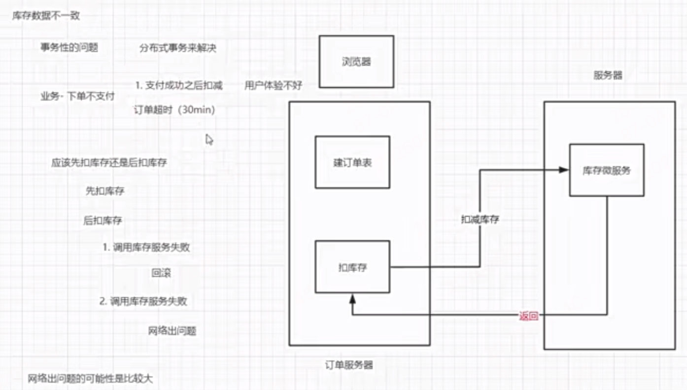


#### 1-2 数据库事务的ACID特性

**一、普通事务（如本地事务）**：
1. 是什么
一组 SQL 打包成一个整体要么全部成功，要么全部失败回滚。
2. 作用
   1. 失败了能回滚
   2. 中间状态别人看不见
   3. 保证数据不出错
3. 事务的标准是ACID（必考）
   1. 原子性：功能不可再分，要么全成，要么全不成
   2. 一致性：操作前后数据合法、完整
      1. 事务执行全程，数据始终保持合法有效状态，中间过渡状态对外不可见，只会存在初始态与最终合法态。
      2. 转账实例拆解
         1. 初始合法态：双方金额无变动
         2. 非法中间态：张三扣款、李四未入账，账面总额失衡
         3. 最终合法态：扣款入账全部完成
      3. 一致性约束效果：其他事务查询时，只能读到状态 1 或状态 3，无法读取到状态 2，规避账面数据错乱。
   3. 隔离性：事务之间互不干扰
      1. 并发事务彼此互不干扰，操作数据相互隔离，不会互相篡改影响。
      2. 并发三类问题
         1. 脏读：读到其他事务未提交的临时数据
         2. 不可重复读：同一事务内，两次查同一条数据结果不一样
         3. 幻读：同一事务内，两次查询数据条数出现增减
      3. 例如数据库mysql的事务隔离级别：并发会产生脏读、不可重复读、幻读三类问题，mysql的四个隔离级别，逐级加高约束、逐步解决问题，代价是并发性能逐步下降。
   4. 持久性：是事务的保证，一旦提交，永久生效，事务提交完成后，数据永久写入磁盘，断电、故障都不会丢失。
4. 转账示例中ACID体现：
   1. 原子性：保障扣款、入账要么全做、要么全撤销
   2. 一致性：保障过程数据合法，异常状态不对外暴露

**二、分布式事务**：
1. 是什么
   1. 一次业务操作，跨了多个数据库、多个服务、MySQL+ES、订单 + 库存 + 支付需要所有服务一起成功 / 一起失败。
   2. 分布式事务顾名思义就是要在分布式系统中实现事务，它其实是由多个本地事务组合而成。
   3. 对于分布式事务而言几乎满足不了ACID，其实对于单机事务而言大部分情况下也没有满足ACID，不然怎么会有四种隔离级别呢?所以更别说分布在不同数据库或者不同应用上的分布式事务了，
2. 为什么需要
   1. MySQL 事务管不到 ES订单服务事务管不到库存服务不保证会出现：钱扣了、库存没扣、订单没生成
3. 解决什么问题
   1. 跨服务、跨数据库、跨数据源的数据一致性比如：
   2. MySQL + ES
   3. 订单 + 库存 + 支付
   4. 微服务之间的数据统一

##### mysql隔离级别概念补充

隔离级别属于数据库事务的特性，它决定了事务的隔离级别，即事务之间如何隔离，以保证数据的一致性。

- 隔离级别的产生原因：事务内修改只在自身会话生效，未提交时，别的会话能不能看见，由隔离级别决定
- 并发会产生脏读、不可重复读、幻读三类问题
  - 不可重复读
    - 同一事务先后两次查单条数据，中途别的事务提交修改，两次查到数值不一样。
  - 幻读
    - 同一事务先后两次按条件查一批数据，中途别的事务增删并提交，查到的数据条数变了。
  - 脏读
    - 事务读到另一事务还没提交的修改数据。

- mysql事务过程中的隔离级别：并发会产生脏读、不可重复读、幻读三类问题，四个隔离级别，逐级加高约束、逐步解决问题，代价是并发性能逐步下降。
   1. 读未提交：可以读到别人事务还未提交的数据
      1. 存在问题：脏读、**不可重复读**、幻读 全都有
      2. 意思：能读到别人事务没提交的数据
   2. 读已提交：
      1. 问题：不可重复读、幻读
      2. 意思：只能读到别人事务已提交的数据（解决脏读）
   3. **可重复读**
      1. MySQL 默认级别
      2. 问题：幻读（理论上有，实际上靠间隙锁缓解）
      3. 意思：事务A修改数据未提交，其他事务查询，**依旧读到修改前旧数据**，不会脏读。
   4. 串行化：不支持并发
      1. 问题：无任何问题
      2. 缺点：完全不支持并发，性能极差
      3. 意思：事务排队执行，像单线程一样

#### 1-3 分布式系统中出现哪些故障会导致数据不一致？

1. 网络问题-硬件故障、网络抖动、网络拥塞（抖动和拥塞概率还是比较高的）
   1. 没有发发送出去
   2. 发送出去了，返回没有收到，导致以为出错了
2. 程序出错
   1. 代码异常
   2. 宕机
   3. 断电
   4. 系统问题·磁盘满了、电脑坏掉等

- 网络抖动
  - 短时间延迟忽高忽低、偶尔丢包
  - 信号干扰：无线穿墙、电磁干扰、周边设备信号争抢
  - 链路切换：路由自动换转发线路，瞬时波动
  - 设备调度：路由器网卡间歇休眠、算力波动
- 网络拥塞
  - 通路数据太多挤住，传输变慢超时
  - 带宽上限固定，同时大量请求扎堆涌入
  - 交换机 / 服务器处理能力饱和，数据包排队积压
  - 跨运营商、跨地域转发，中转节点流量爆满

抖动：小路开车，时不时颠簸打滑

拥塞：早晚高峰马路，车流堵着走不动


最常见的仍然是网络问题，记住经典的话：`只要是网络调用都有可能出问题`!

### 2章 cap理论和分布式事务解决方案

#### 2-1 CAP理论
cap理论是分布式系统的理论基石

1. CAP 理论精简速记
   1. 三大特性
      1. C 一致性：数据更新后，所有节点同一时刻数据完全相同
         1. 更新操作成功井返回客户端后，所有节点在同一时间的数据完全一致，这就是分布式的一致性。一致性的问题在并发系统中不可避免，对于客户端来说，一致性指的是并发访问时更新过的数据如何获取的问题。从服务端来看，则是更新如何复制分布到整个系统，以保证数据最终一致。
         2. 节点之间有个同步时间即核心是存在中间状态，中间状态一旦暴露给用户访问，则会导致数据不一致，解法可以用分布式锁
      2. A 可用性：服务随时可访问，请求能正常响应，无超时失败
         1. 要保证数据一致，就得加锁阻塞等待数据全网同步，期间无法正常受理新请求，可用性下降，但是要保证可用性随时服务，就得保证随时能访问，所以这C和A是互斥的
      3. P 分区容错性：节点间网络断开、分区故障，系统仍可正常运行
         1. 比如consul系统，她就是分布式有多个系统，他们之间若一个出现问题，对外提供的统一接口还是仍然可用
         2. **正常分布式系统，必须满足CP特性**，但是CAP这3点不能同时满足，意味着C和A只能取舍满足
   2. 核心结论
      1. 分布式系统无法同时满足 CAP 三者，P必须满足，意味着C和A只能取舍满足
      2. CP：舍弃可用性，保证数据一致、容忍分区故障，它首先保证的是同步完数据之后你才能访问
         1. 例如：NoSql，MongoDB，HBase，redis
      3. AP：舍弃强一致，保证服务可用、容忍分区故障
         1. 例如：Mysql，Oracle
      4. CA：分布式场景无法实现，网络必然存在分区风险，仅单机数据库无跨节点网络问题，不用考虑分区，不属于分布式范畴


#### 2-2 Base理论

分布式系统中的一致性是弱一致性（它不可能做到强一致性），单体数据库如myslql的一致性是强一致性

BASE是Basically Available (基本可用)、Soft state (软状态) 和Eventually consistent (最终一致性性) 三个短语的9缩写，8ASE理论是对CAP中一致性和可用性权衡的结果，

其来源于对大规模互联网系统分布式实践的总结，是基于CAP定理逐步演化而来的。

8ASE理论的**核心思想**是:即使无法做到强一致性，就把一致性和可用性各退一步，基本达到要求即可，但每个应用都可以根据自身业务特点，采用适当的方式来使系统达到最终一致性。接下来看一下BASE中的三要素:

1. BASE 理论：是 CAP 取舍后的落地设计思想，适配高并发分布式业务
   1. Basically Available 基本可用
      1. 故障时保留核心功能，非核心功能降级，不会彻底瘫痪，绝不等价于系统不可用
      2. 比如:
         1. (1)响应时间上的损失。正常情况下，一个在线搜索引擎需要在0.5秒之内返回给用户相应的查询结果，但由于出现故障，查询结果的响应时间增加了1~2秒
         2. (2)系统功能上的损失:正常情况下，在一个电子商务网站上进行购物的时候，消费者几乎能够顺利完成每一笔订单，但是在一些节日大促购物高峰的时候，由于消费者的购物行为激增，为了保护购物系统的稳定性，部分消费者可能会被引导到一个降级页面
   2. Soft State 软状态
      1. 节点数据允许短暂不一致，存在中间过渡状态
   3. Eventually Consistent 最终一致性
      1. 不追求实时一致，等待数据同步完成后，最终全部统一
2. 实际淘宝中的例子：
   1. 基本可用：双十一大促或故障时，系统不崩，下单付款正常，慢点、少点功能没关系。
      1. 变慢一点：平时搜商品 0.5 秒，双十一可能 1–2 秒才出来，但能搜到。
      2. 部分功能暂时没了：
         1. 高峰期暂时不让你看历史订单、评价、积分详情；
            1. 甚至弹出 “系统繁忙，请稍后再试” 的降级页，但下单、付款还能走。
      3. 核心保住：浏览、加购、下单、支付 ——不能断；次要功能可以暂时关掉。
   2. 软状态：下单了库存没立刻减、付完钱显示处理中，业务中用户看到提示也可以接受并不强希望立即完成 —— 短暂不一致。
   3. 最终一致：显示等待一段时间后，库存、订单、支付状态全部自动对齐。
3. 两者关系
   1. CAP 是理论取舍准则，BASE 是实际业务妥协方案，电商、支付大多遵循 BASE
   2. 一句话BASE才是你最终业务使用践行的归宿，CAP就是告诉你:想要满足C、A、P就是做梦，


#### 2-3 分布式事务-2阶段提交2PC

- 分布式事务基本首要解决问题就是：同时成功或同时失败，这都解决不了那一定不算解决。
- 常见分布式事务解决方案
  - 两阶段提交(2PC, Two-phase Commit)
  - TCC补偿模式
  - 基于本地消息表实现最终一致性
  - 最大努力通知
  - 基于可靠消息最终一致性方案

我们项目中最终选择基于可靠消息最终一致方案，其他方案选择大概讲讲原理即可

**2PC大致原理**：

- 2PC核心定义：把分布式事务拆成准备、提交两个阶段，由协调者统一管控所有参与节点，保证要么全部成功、要么全部回滚。
  - **主要利用数据库自己的事务能力**
- 角色划分：
  - 协调者：统筹全局，下发指令、汇总结果
  - 参与者：各个数据库 / 服务节点，执行业务数据操作
- 阶段一：准备阶段（Prepare）
  - 协调者向所有参与者下发预执行指令
  - 各参与者执行事务操作，锁定资源，暂不正式提交，**主要利用数据库自己的事务能力**
  - 执行无误则回复就绪；执行异常直接反馈失败
- 阶段二：提交 / 回滚阶段
  - 全部参与者都返回就绪
  - 协调者下发提交指令，所有节点正式提交事务，释放资源
  - 任意参与者报错 / 超时无响应
  - 协调者下发回滚指令，所有节点撤销操作，数据恢复原状
- 实操举例（跨库转账）
  - 参与者：A 账户库、B 账户库
  - 准备阶段协调者通知两个库，分别执行扣款、增款操作，锁住数据，不提交，两个库都反馈执行完成
  - 提交阶段协调者确认全员就绪，下令正式提交，双方账目更新生效
  - 中途任一库执行失败，立刻全员回滚，钱款恢复初始状态
- 优缺点
  - ✅ 优点：强数据一致性，逻辑简单标准，实现起来简单
  - ❌ 缺点
    - ❌ 只要我使用了数据库的事务能力，就一定会有锁一定有性能影响，全程锁定资源，并发性能低
      - 加锁这是最重要的缺点，导致业务很少用
    - 协调者宕机，所有参与者卡住不动，事务卡死无法推进
    - 网络超时容易引发数据异常
    - 一旦某个服务发生故障，则整个事务都会卡住
- 适用场景：业务里极少使用，适用低并发


#### 2-4&5 TCC分布式事务实现方案

TCC = Try - Confirm - Cancel就是把一个分布式事务拆成 3 步，自己手动控制，比 2PC 灵活、性能高很多。

- 先预留资源，没问题就确认提交，有问题就撤销回滚。**全程不锁库用业务逻辑层实现锁的效果，性能比 2PC 强太多**！

3 个阶段拆开讲（超级易懂）

1. Try（预留 / 检查）
   1. 做两件事：检查资源 + 预留资源
   2. 检查：库存够不够、钱够不够
   3. 预留：把要用的资源先 “占住”，不真正扣减
   4. 例子：订单要扣 1 件库存 → Try 阶段冻结 1 件库存，不是直接删掉。
2. Confirm（确认提交）
   1. 所有 Try 都成功 → 执行真正提交
   2. 冻结的库存真正扣掉
   3. 冻结的金额真正扣除
   4. 数据正式生效
3. Cancel（取消回滚）
   1. 任意一个 Try 失败 → 全部撤销
   2. 解冻库存
   3. 解冻金额
   4. 数据回到最初状态
4. 生活例子：淘宝下单（最直观）
   1. Try
      1. 你下单 → 系统冻结商品库存、冻结优惠券
   2. Confirm
      1. 你付款成功 → 库存真正扣减、优惠券真正使用
   3. Cancel
      1. 你取消订单 / 超时未付 → 库存解冻、优惠券退回
   4. 这就是 TCC！
5. TCC 优点（为什么不用 2PC 用 TCC）
   1. 不锁数据库，并发性能极高
   2. 自己控制逻辑，灵活度高
   3. 不会像 2PC 那样卡死、阻塞
   4. 互联网公司最常用分布式事务方案
6. TCC 缺点
   1. 代码量多，要写 3 套逻辑（Try/Confirm/Cancel）
   2. 要自己处理幂等、悬挂、空回滚等问题
   3. 实现TCC这3个接口比较简单，但是在调用方保证协调这几个接口不出错还是比较麻烦的，因为只要是网络调用都有可能出问题


- 项目中实际代码演示示例
  - 先在`jieduan3-0-1shixian-weifuwu-kuangjia/mxshop_srvs/inventory_srv/model/inventory.go`的新建个InventoryNew库存表单独演示结构增加一个冻结字段
  - 然后在库存服务`jieduan3-0-1shixian-weifuwu-kuangjia/mxshop_srvs/inventory_srv/handler/inventory.go`接口中相应实现3个方法：
    - 1、预扣减库存服务即冻结库存：Try
    - 2、扣减库存：Confirm
    - 3、解冻库存：Cancel
  - 然后在调用处如订单服务方法去使用这些方法见 `jieduan3-0-1shixian-weifuwu-kuangjia/mxshop_srvs/order_srv/handler/order.go`
  - 实际考虑：并不是所有服务都适合加个冻结的字段模式实现，如仓库服务，只有生成出库单，所以不能使用冻结字段模式实现。
    - 仓库服务：这个表的作用：生成出库单、记录出库单，仓库管理员要拿这个单子去办理出库出货，它不能使用冻结的字段模式实现，不符合业务逻辑
    - 这种服务应该如何考虑数据库表的设计，见`jieduan3-0-1shixian-weifuwu-kuangjia/mxshop_srvs/inventory_srv/model/inventory.go`的Delivery结构体
      - 这种就适合加个状态的字段来适配TCC，status：1. 表示等待支付 2. 表示支付成功 3. 失败------ T阶段改成1，确认时改成2，回滚时改成3

#### 2-6 TCC分布式事务实现方案的实现难点


总结一下，你要玩儿TCC分布式事务的话,完整的解决方案还是很复杂的，要实现事务管理器，最好借助开源框架:
1. 你要自己实现 TCC，必须搞定下面全部难题
   1. 你必须写一个 事务管理器（核心）它要干这些事：
      1. 记录所有参与 TCC 的服务
      2. 记录全局事务状态
      3. 超时了自动触发 Cancel
      4. 宕机重启后恢复事务
      5. 保证 Confirm/Cancel 必须执行成功（最终一致性）
      6. 没有事务管理器 = TCC 直接废了
   2. 必须解决 3 个恶心问题（必踩坑）
      1. ① 空回滚：Cancel 先执行了，Try 还没执行 → 不能报错，要直接忽略
      2. ② 幂等：Confirm/Cancel 可能被重试多次 → 必须保证执行一次和多次结果一样
      3. ③ 悬挂：Try 执行慢，Cancel 已经先回滚完了 → Try 不能再执行
      4. 这三个问题不处理，TCC 数据必乱
   3. 网络超时、服务宕机，你都要兜底
      1. Try 成功了，但服务挂了 → 必须触发 Cancel
      2. Confirm 发出去没响应 → 必须重试
      3. 整个分布式系统断网 → 事务不能丢
2. 首先需要选择某种TCC分布式事务框架，各个服务里会有这个TCC分布式事务框架在运行。
3. 改造成本：你原本的一个接口，要改造为3个逻辑，Try-Confirm-Cancel。
   1. 先是服务调用链路依次执行Try逻辑
   2. 如果都正常的话，TCC分布式事务框架推进执行Confirm逻辑，完成整个事务
   3. 如果某个服务的Try逻辑有问题，TCC分布式事务框架感知到之后就会推进执行各个服务的Cancel逻辑，撤销之前执行的各种操作。
   4. 这就是所谓的TCC分布式事务。

- TCC框架能力实现的终极大招
  - 如果有一些意外的情况发生了，比如说订单服务突然挂了，然后再次重启，TCC分布式事务框架是如何保证之前没执行完的分布式事务继续执行的呢?
    - TCC事务框架都是要记录一些分布式事务的活动日志的，可以在磁盘上的日志文件里记录，也可以在数据库里记录。保存下来分布式事务运行的各个阶段和状态。
  - 万一某个服务的Cancel或者Confirm逻辑执行一直失败怎么办呢?
  - 那也很简单，TCC事务框架会通过活动日志记录各个服务的状态。
  - 举个例子，比如发现某个服务的Cancel或者Confirm一直没成功，会不停的重试调用他的Cancel或者Confirm逻辑，务必要他成功!
    - 当然了，如果你的代码没有写什么bug，有充足的测试，而且Try阶段都基本尝试了一下，那么其实一般Confirm、Cancel都是可以成功的!
  - 当有面试官刁难问，如果一直失败咋办？
    - 首先框架会基于事务日志无限重试 Confirm 或 Cancel 流程，应对网络抖动、临时服务卡顿这类常见故障，绝大多数情况都能重试成功。若持续重试依旧失败，说明遇到数据库损坏、硬件故障、数据错乱等极端异常，系统会触发邮件、短信告警通知运维人员。技术层面不存在百分百绝对成功的事务方案，此时只能人工核对数据、手动修正业务状态，兜底保障最终数据一致。

常见tcc框架：go-seata


##### TCC优缺点
**优点:**
1. 解决了跨服务的业务操作原子性问题，例如组合支付，订单减库存等场景非常实用
2. TCC的本质原理是把数据库的二阶段提交上升到微服务来实现，从而避免了数据库2阶段中锁冲突的长事务低性能风险。
3. TCC异步高性能，它采用了try先检查，然后异步实现confirm，真正提交的是在confirm方法中;
**缺点:**
1. 对微服务的侵入性强，微服务的每个事务都必须实现try，confirm，cancel等3个方法，开发成本高，今后维护改造的成本也高。
2. 为了达到事务的一致性要求，try，confirm、cancel接口必须实现等幂性操作。(定时器+重试)
3. 由于事务管理器要记录事务日志，必定会损耗一定的性能，并使得整个TCC事务时间拉长，建议采用redis的方式来记录事务日志。
4. tcc需要通过锁来确保数据的一致性，会加锁导致性能不高,只不过不是使用数据库的锁
   1. 依靠业务标识、单据状态、冻结标记、订单占用记录做占位锁定，属于业务层逻辑管控


#### 2-7 基于本地消息的最终一致性方案

- 本地消息表方案：比tcc方案性能高，并发更高，虽然一致性方案没有TCC那么强实时一致性，但可以保证最终一致性

- 核心逻辑：借助本地事务，同步完成业务数据操作与消息记录入库；再由定时任务把消息投递到**消息队列**，消费端处理业务并回执确认，生产者收到成功回执后，再清理本地消息表数据。即便消费服务宕机未处理，消息也会留存队列，等待下次重试消费。

- 本地消息表能解决以下问题：
1. 解决业务操作与消息发送原子性不一致问题
业务入库、发消息分属不同操作，常规写法极易出现：业务数据存库成功，消息却因网络、服务异常发送失败；或是消息发出去了，本地业务事务回滚。本地消息表借助本地数据库事务，把业务数据新增修改、消息记录写入绑定在一起，要么全都成功，要么全部回滚，从源头杜绝一边成功一边失败的情况。
2. 解决服务宕机、网络抖动导致的消息丢失
生产者服务突然宕机：消息已经存入本地数据表，重启后定时任务会自动补发，不会凭空丢失
网络瞬间中断：消息不会直接丢弃，留存表中等待网络恢复后重试投递
消费服务中途挂掉：未完成处理的消息留在队列，服务重启后继续消费，不会遗漏业务

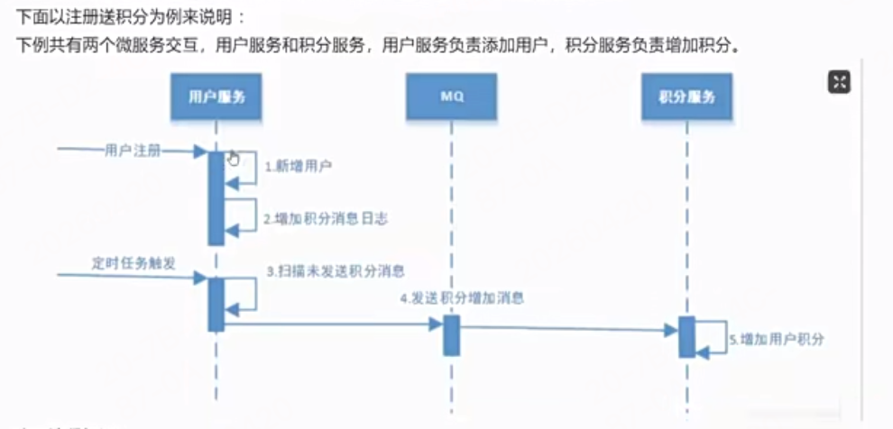
- 启动本地服务会同时启动一个定时服务，定时服务会定时扫描本地消息表日志，表里会记录当初发送消息时有没有成功，记录mq的发送情况，下次服务重启时定时服务启动依然根据本地消息表进行重试发送，-----最终达到最终一致性
  - 隐含的问题：但消费端必须解决消息重复发送的问题，防止重复消费消息，增加好多异常积分，
- 总结:上面方式是一种非常经典的实现，基本避免了分布式事务，实现了“最终一致性”，但是，关系型数据库的吞吐量和性能方面存在瓶颈，频繁的重试读写消息会给数据库造成压力。所以，在真正的高并发场景下，该方案也会有瓶颈和限制的。

#### 2-8 基于可靠消息的最终一致性方案

如果生产者服务宕机、定时任务程序异常、数据库故障，就会出现消息丢失、重试失效、投递不及时等问题。同时轮询扫表也会带来一定的数据库 IO 压力。
- 为什么要抛弃「本地消息表」？
  - 本地业务 + 写消息表 + 发消息，无法做到原子性
    - 而RocketMQ 事务消息：半消息 + 本地事务 + 回查机制做到保证原子性
  - 可能出现：业务成功、消息表写入失败 / 消息表成功、发消息失败
  - 高并发下性能差，还要自己做重试、补偿、定时任务
    - 本地消息表：
      - 频繁读写消息表
      - 定时任务扫表
      - 锁、重试、IO 消耗大
    - RocketMQ 事务消息：
      - 无锁，异步化
      - 支持事务和回滚
        - 明确事务回滚的概念：回滚的是RocketMQ 里MQ发送方时的 “半消息”，是MQ消息half状态的回滚，并不能解决消费消息时执行失败时的反向回滚，不能反向通知MQ发送方让关联的本地事务进行回滚，如订单表创建回滚
      - MQ 天然高吞吐
      - 高并发场景性能差几倍到几十倍。
- 为了解决本地消息表消息不可靠、依赖本地轮询的缺陷，业界进一步优化出了 2-8 基于可靠消息的最终一致性方案，全程依托 MQ 中间件托管消息状态，彻底脱离本地定时任务兜底，可靠性更强、架构更标准。保证两件事必须同时成功 / 同时失败：本地数据库业务执行成功 和 消息一定发送到 MQ，被消费者消费

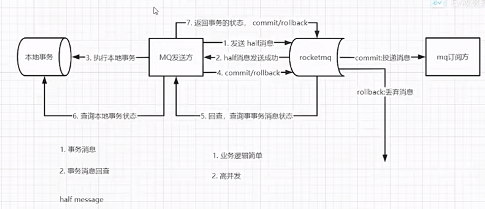

- rocketMQ给我们实现了这套方案，RocketMQ 是阿里开源的分布式消息中间件（MQ），它自带「事务消息」能力，正好解决你前面说的「本地消息表不可靠」的问题。
  - rabbitmq也有事务但是没有rocketmq的事务消息能力完善
  - 明确事务回滚的作用范围，上面已经讲了
- 最终一致性解决的是：本地发送出去的消息是可靠的，不会存在发出去后，本地失败，或者本地执行完了，消息没有发送出去
- 这依然有风险：1. 由于网络抖动，MQ发送方发送commit请求时失败了，---- 也有解法：rocketmq提供了一个回查机制，rabbitmqq就没有
  - 只要下次一启动rocketmq会定时向MQ发送方查询一下你这个消息迟迟状态未变，你到底是要commit还是要rollback，MQ发送方检查下本地数据库的实际业务情况，告诉MQ，如果commit就继续commit这个消息，否则就丢弃这个消息，MQ订阅方无感知
  - 支持高并发，因为它并没有锁的存在
- 需要额外维护rocketMQ服务的稳定性，它也支持分布式

#### 2-9 最大努力通知方案

与可靠消息的方法有点相似

适用场景：第三方支付回调通知这类跨系统对外调用场景，己方无法掌控对方接口稳定性，目标确保支付结果必送达订阅方。

- 在支付宝3方支付场景的支付系统中：保证用户支付以后，一定要保证向订阅方通知成功。通知时会面对一些问题：它就会采用一种策略：最大努力通知。
   - 没有这个接口
   - 接口有异常，或服务挂了
 - 这个策略，会一次一次不停的尝试，因为订阅方的接口是我们控制不了的，是别人开发的接口，只能最大努力去重试，但是这个重试也是有代价的，也会有重试策略，即逐渐的把重试间隔越来越大，它是有次数上限的，如20次之后不再通知了
 - 我还得额外提供一个查询接口，避免消费方的服务突然在某个时间点自己修复好了
 - 最大努力通知方案必须满足3大核心策略：
   - 阶梯重试：重试间隔逐步拉长，设置最大重试次数（例 20 次），超限停止推送
   - 兜底查询：对外提供结果查询接口，供对方主动对账补查
   - 内部通知系统是MQ 异步解耦：依托消息队列做通知缓冲，避免同步阻塞，支持高并发

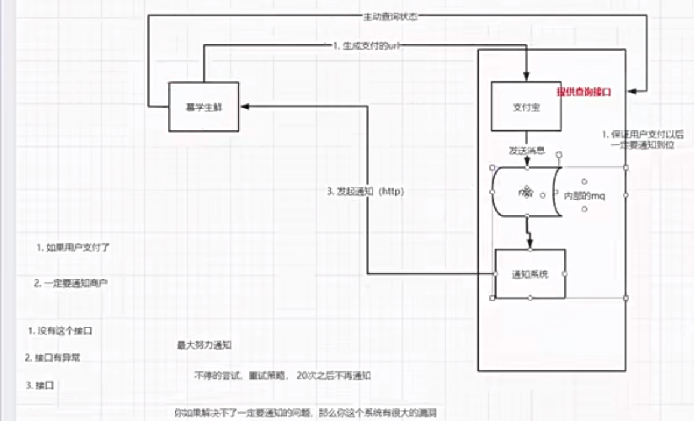


## 18周 学习rocketmq实现幂等性机制

### 1章 MQ的应用场景和选型

#### 1-1 MQ的应用场景

1. 应用解耦
   1. 多系统业务联动，无需硬编码接口调用。上游发消息到 MQ，下游按需消费，新增 / 删减业务方互不影响，降低耦合度。
2. 流量削峰
   1. 秒杀、活动等高并发瞬间请求，存入队列缓冲。平稳匀速消费处理，避免瞬时流量压垮数据库与业务服务。
3. 数据分发
   1. 一份业务数据，同步推送多个下游系统。一份消息多方订阅消费，高效完成数据同步、统计、推送等业务。

- 但是也存在缺点，缺点包含以下几点:
  - 系统可用性降低-
    - 系统引入的外部依赖越多，系统稳定性越差。一旦MQ宕机，就会对业务造成影响。如何保证MQ的高可用?
  - 系统复杂度提高
    - MQ的加入大大增加了系统的复杂度，以前系统间是同步的远程调用，现在是通过MQ进行异步调用。
    - 如何保证消息没有被重复消费?怎么处理消息丢失情况?那么保证消息传递的顺序性?
  - 一致性问题
    - A系统处理完业务，通过MQ给8、C、D三个系统发消息数据，如果B系统、C系统处理成功，D系统处理失败。
      - 处理完成的标准是得到订阅方的回调确认：所有订阅方都正常提交 ACK，代表各方业务全部处理完成，状态达成统一
    - 如何保证消息数据处理的一致性? 这属于分布式事务的范畴了

#### 1-2 MQ消息队列技术选型

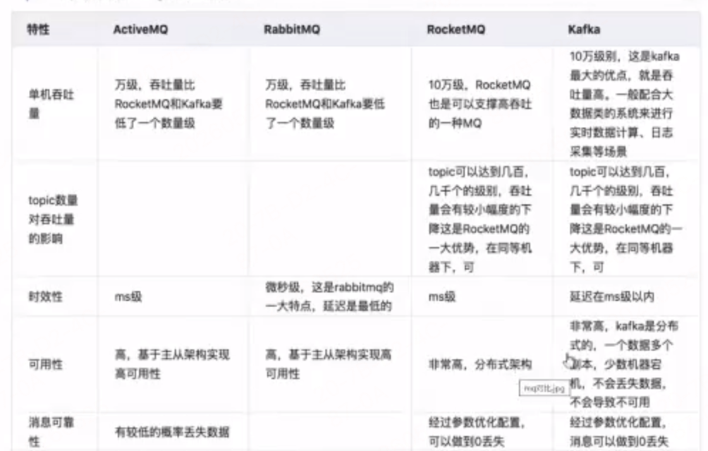
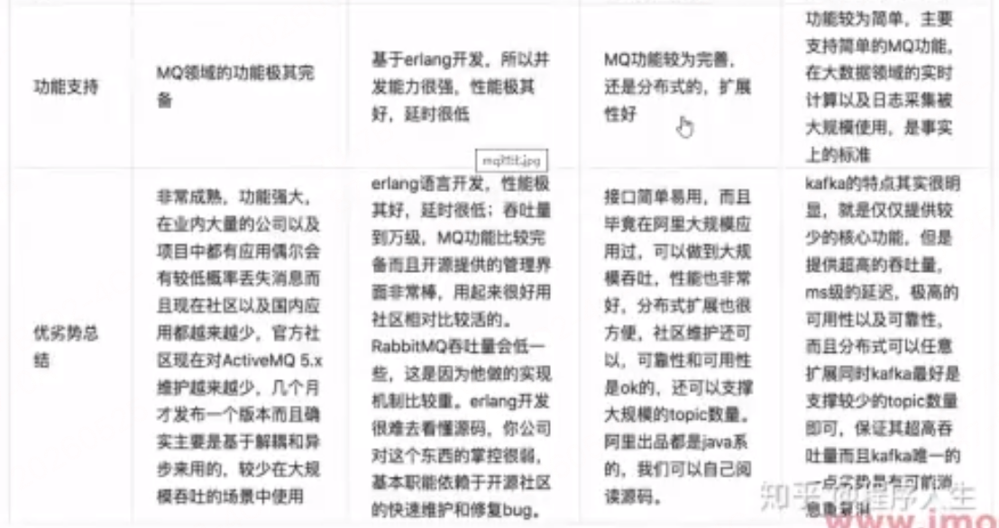

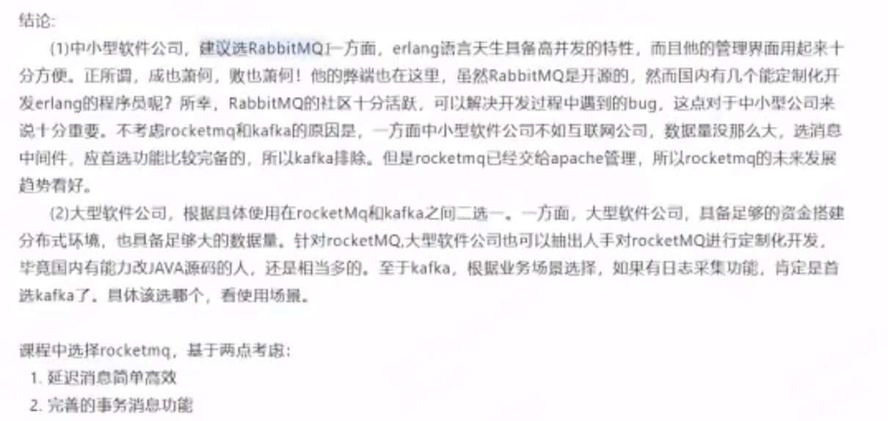

- **总结**：如果做日志，爬虫可以无脑选kafka，
  - Kafka = 大数据 / 流式分析首选（高吞吐、强持久、生态全）；
    - LinkedIn 2011 年开源，为日志 / 事件流而生，目标是高吞吐、持久化、可回溯的数据流管道。
    - 消息模型：纯拉模式，适合流式消费
    - 持久化：日志型存储，可保留数月、支持任意回溯
    - 事务性区别：仅保证消息批量写入原子性，无法绑定本地数据库业务
      - 例如：开启 Kafka 事务：两条消息要么都存进队列，要么都不存
        - 异常断电报错：整条事务回滚，不会出现一条有、一条无
        - 局限：没法保证「数据库订单创建成功」和「消息发出」绑定一致
          - 这个局限恰恰是RocketMQ 的优势所在，可以解决分布式事务问题
  - RocketMQ = 业务交易首选（可靠、事务、顺序、延迟消息）。
    - 阿里 2012 年开源，为电商交易 / 业务消息而生，目标是高可靠、事务、顺序、企业级特性。
    - 消息模型：拉 + 推双模式，业务友好
    - 持久化：队列型存储，默认较短，回溯能力弱
    - 事务性区别：主打本地数据库事务 + 消息发送原子绑定专属半消息 + 事务回查机制
  - 数据分析（日志、埋点、行为、实时计算）普遍选 Kafka，不是因为 RocketMQ 不行，而是 Kafka 天生为 “数据管道 / 流式处理” 设计，更匹配大数据的核心诉求。

### 2章 RocketMQ的快速入门

#### 2-1 rocket的安装和配置

1. 网上找个使用个安装rocketmq的docker脚本使用`docker-compose up` 一键安装相关的依赖组件
   1. 参考教程：jieduan3-0-1shixian-weifuwu-kuangjia/mxshop_srvs/order_srv/install.zip
      1. https://juejin.cn/post/7405786995182436391
      2. https://juejin.cn/post/7247467756246106170
2. 启动后前端管理界面为：
   1. 1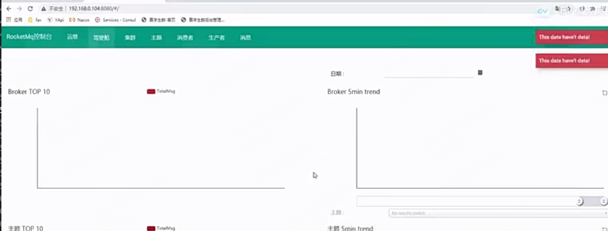
3. 通过前端管理界面，初体验Topic菜单里建立topic，使用该topic发送消息，和在消息菜单里查看消息

#### 2-2 rocketmq的基本概念

首先它是个分布式的消息队列框架

博客教程参考：https://www.seven97.top/microservices/message-queue/rocketMQ-basic.html#%E5%90%84%E8%A7%92%E8%89%B2%E4%BB%8B%E7%BB%8D

1. Producer:消息的发送者;举例:发信者
2. Consumer:消息接收者;举例:收信者
3. Broker:暂存和传输消息;举例:邮局
   1. 这是真正存储消息数据的地方
4. NameServer:管理Broker;举例:各个邮局的管理机构
   1. 相当于微服务中的注册中心consul，主要是管理多个broker之间的配置信息
5. Topic:区分消息的种类;一个发送者可以发送消息给一个或者多个Topic;一个消息的接收者可以订阅一个或者多个Topic消息
   1. Topic相当于公众号，每个人可以订阅不同的公众号，你可以向多个公众号发消息
6. MessageQueue:队列相当于是Topic的分区;用于并行发送和接收消息
   1. 队列（Queue/Partition）归属 Topic，是 Topic 内部的物理存储分区；
   2. 所有发送到该 Topic 的消息，最终都会落地到它下属的队列中排队存储
   3. Topic：逻辑分类，用来区分业务（如订单、日志、支付）；
   4. 队列：物理存储 & 读写单元，Topic 被拆分成多个队列做分片，实现并发与负载
   5. 一个 Topic 至少包含1 个队列，默认会配置多个；消息不会脱离队列单独存在。
   6. 生产者发消息时，MQ 按路由规则（轮询、哈希等）把消息分发到 Topic 下不同队列；消费者也是按队列维度拉取 / 推送数据。
7. 消费者组：队列 → 负责存消息，Group → 负责派人来消费它们之间：至于MQ如何自动完成topic内部多个队列与每个组内消费者的动态分配，这个工作分配关系即消息队列的负载均衡
   1. 负载均衡：把 Topic 下面的 N 个队列，平均分配给同一个 Group 里的 M 个消费者，负载均衡是对每个group纬度下的消费者进行负载均衡，不同 Group 各自独立做负载均衡
      1. 例：Group A、Group B 订阅同一个 Topic，两套分配逻辑互不影响
   2. 形象比喻：
      1. Topic = 一个快递站
      2. 队列 = 快递站里的 4 个货架（负责存放包裹）
      3. Group = 一个派送团队（比如：美团团队），同一个派送团队内的所有消费者进行负载均衡式地平分 Topic 下的所有队列，其他派送团队互不影响
      4. 消费者 = 团队里的派送员（小哥）

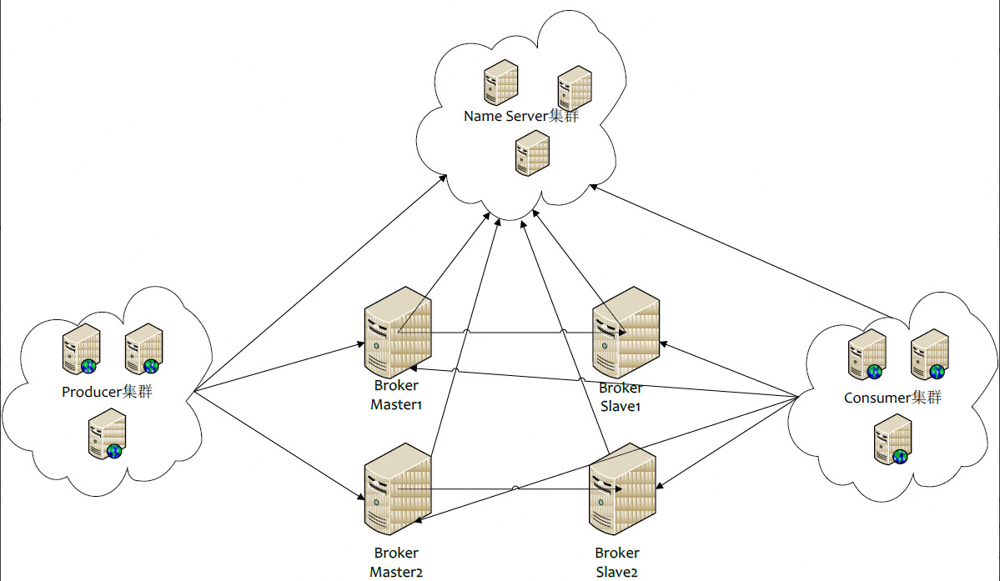
- 我想从获取到消息，肯定是先通过NameServer获取到Broker的地址，然后通过具体的Broker获取到消息

#### 2-3 roccketmq的消息类型

一、按照发送的特点分类:
1. 同步发送
2. 异步发送
3. 单向发送

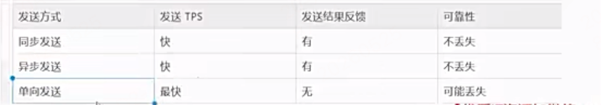

二、按照使用功能特点分类:
1. 普通消息(订阅)
   1. 普通消息是我们在业务开发中用到的最多的消息类型，生产者需要关注消息发送成功即可，消费者消费到消息即可，不需要保证消息的顺序，所以消息可以大规模并发地发送和消费，吞吐量很高，适合大部分场景。
2. 顺序消息
   1. 消息有序指的是可以按照消息的发送顺序来消费(FIFO)。RocketMQ可以严格的保证消息有序，可以分为分区有序或者全局有序。顺序消费的原理解析，在默认的情况下消息发送会采取Round Robin轮询方式把消息发送到不同的queue(分区队列)；而消费消息的时候从多个queue上拉取消息，这种情况发送和消费是不能保证顺序。但是如果控制发送的顺序消息只依次发送到同一个queue中，消费的时候只从这个queue上依次拉取，则就保证了顺序。当发送和消费参与的queue只有一个，则是全局有序；如果多个queue参与，则为分区有序，即相对每个queue，消息都是有序的
   2. 顺序消息分为分区顺序消息和全局顺序消息，全局顺序消息比较容易理解，也就是哪条消息先进入，哪条消息就会先被消费，符合我们的FIFO，很多时候全局消息的实现代价很大，所以就出现了分区顺序消息。分区顺序消息的概念可以如下图所示:
   3. 我们通过对消息的key，进行hash，相同hash的消息会被分配到同一个分区里面，当然如果要做全局顺序消息，我们的分区只需要一个即可，所以全局顺序消息的代价是比较大的。
   4. 这种做法很明显就是并发不高，很多时候除非明确要顺序才会使用顺序消息
3. 延时消息：它主要用来做订单超时，库存归还的
   1. 延迟的机制是在服务端实现的，也就是Broker收到了消息，但是经过一段时间以后才发送服务器按照1-N定义了如下级别:"1s 5s 10s 30s 1m 2m 3m 4m 5m 6m 7m 8m 9m 10m 20m 30m 1h 2h";若要发送定时消息，在应用层初始化Message消息对象之后，调用Message.setDelayTimeLevelint level方法来设置延迟级别，按照序列取相应的延迟级别，例如level=2，则延迟为5s
      1. 实现原理:
         a. 发送消息的时候如果消息设置了`DelayTimelevel`,那么该消息会被丢到`ScheduleMessageService.SCHEDULE_TOPIC`这个Topic里面
         b. 根据DelayTimeLevel选择对应的queue
         c. 再把真实的topic和queue信息封装起来，set到msg里面
         d. 然后每个SCHEDULE_TOPIC_xxXx的每个DelayTimelevelQueue，有定时任务去刷新，是否有待投递的消息
         e. 每10s定时持久化发送进度
4. 事务消息：完全就是前面讲的基于可靠消息的最终一致性方案中的那个流程

#### 2-4 go发送普通消息

- 代码示例见`jieduan3-0-1shixian-weifuwu-kuangjia/mxshop_srvs/order_srv/rocketmq_test/simple`文件夹

#### 2-5 通过pushconsumer消费消息

- 代码示例见`jieduan3-0-1shixian-weifuwu-kuangjia/mxshop_srvs/order_srv/rocketmq_test/consumer`文件夹
- 重点细节
  - 重点理解消费者组 和负载均衡的关系，为什么订阅时要指定消费者组名

#### 2-6 为什么要使用延迟消息解决库存超时归还问题？

- 代码示例见`jieduan3-0-1shixian-weifuwu-kuangjia/mxshop_srvs/order_srv/rocketmq_test/delay`文件夹
- 重点细节：见对应注释

#### 2-7&8 通过TransactionProducer发送事务消息

- 代码示例见`jieduan3-0-1shixian-weifuwu-kuangjia/mxshop_srvs/order_srv/rocketmq_test/transaction`文件夹
- 重点细节：见对应注释
##### 回查细节
- 只要下面任意一种情况发生，MQ 就会启动定时回查：
  - ExecuteLocalTransaction 返回了 UnknowState→ 明确告诉 MQ：我不知道成没成功，你等下问我。
  - ExecuteLocalTransaction 执行超时→ 执行太久没返回。
  - ExecuteLocalTransaction 内部崩溃、宕机、重启→ 根本没返回任何状态。
  - 提交 / 回查请求网络丢包→ MQ 没收到结果。
  - 只要 MQ 没收到明确的 Commit / Rollback→ 立即触发回查机制！
- 就算回查时服务挂了，下次服务重启，回查仍然会继续！为什么？因为 half 消息是持久化存在 MQ 里的！
  - 流程：
    - 发 half → 持久化
    - 服务执行本地事务时直接宕机
    - MQ 回查发现服务不可达
    - 服务重启恢复
    - MQ 继续回查
    - 服务查询 DB → 返回事务状态
    - 最终一致！
- 回查的三个返回值意义（必须记住）
  - CommitMessageState
    - 本地事务成功 → 消息投递
  - RollbackMessageState
    - 本地事务失败 → 消息删除
  - UnknowState
    - 还在执行中 → MQ 会继续回查
- 事务回查的作用：
  - 解决宕机、丢包、超时、异常
  - 保证本地事务和消息最终一致
  - 是分布式事务最可靠的兜底机制


### 3章 基于可靠消息的最终一致性，订单超时归还

#### 3-1 订单新建过程中会出现哪些不可控的因素导致数据不一致的问题？

- 订单新建过程的特点
  - 它要调我们的外部服务如库存服务（不能出现本地订单新建失败，但库存扣减成功了或者本地订单新建成功，但库存扣减失败）
    - 本地的话直接通过数据库事务就能解决，但现在跨服务了，就比较麻烦

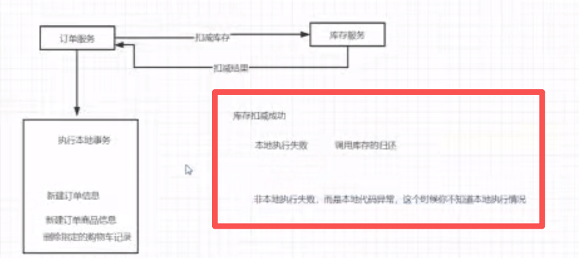

- 这块主要库存扣减成功时，有2种情况会导致数据不一致
  - 本地执行失败：可以自己通过调用库存归还接口解决
  - 非本地代码失败而是本地代码异常，而且程序挂掉了，这时候你也无法去触发调用归还接口了，就会导致不一致
    - 本地服务挂了，如何保证库存及时归还呢？

#### 3-2 先扣减库存和后扣减库存是否能解决数据不一致问题

- 无论你把扣减库存的逻辑放到本地事务前还是本地事务后，还是本地事务中，只要跨服务网络调用，就一定会存在各种网络因素问题
  - 如放在同一个事务中，先执行本地业务逻辑，然后执行扣减库存，正常情况下成功了再统一commit，失败了，就直接本地事务整体回滚，万一网络问题，扣减库存网络请求发出去了，库存已扣减了，但是回调消息时，网络拥塞或抖动或库存服务突然宕机，扣减库存的回调消息没发回来，认为扣减失败，本地事务整体回滚，库存实际扣减成功了，就导致数据不一致

#### 3-3 tcc在解决库存扣减中的问题

目前自己使用tcc，必须要实现tcc事务管理器，才能解决一致性，借助3方库，java中有seatea，但是go版seata实现的不完善，还不支持grpc，自己实现起来比较复杂所以难度比较大

#### 3-4 基于可靠消息最终一致性方案在库存服务上的不足
- 可靠消息方案只解决一件事：生产者 100% 能把消息发出去。
  - 本地事务成功 → 消息一定发
  - 本地事务失败 → 消息一定不发
  - 宕机、重启、丢包 → 靠回查兜底
  - → 保证消息可靠，不丢、不多、不乱
- 但它不保证消费者一定能处理成功
  - 消费者可能：
    - 宕机
    - 异常
    - 超时
    - 业务失败（比如库存不足）
  - 可靠消息不管消费者，只管生产者。
- 先要确定基于可靠消息的事务回滚概念：
  - Rollback即回滚的对象：RocketMQ 里的 “半消息”，只是回滚半消息，方案中并没支持回滚本地数据库事务
- 基于可靠消息方案本质上是解决了一个问题：**只是可靠消息的确保消息可靠**，但是无法确保你消费者能正确消费你这个消息。所以消费者应该自己确保你的消费逻辑没问题（包括服务正常或宕机等）， 所以它最终效果是建立在消费者代码和服务可靠的基础之上的。
  - 普通消费者服务一般问题不大：1. 宕机， 2. 代码有bug，解决了这些问题服务重启只要还没消费确认就能重新消费消息
  - 但是库存服务不太一样
    - 库存资源是有限的，有可能库存不足，不是无上限的，库存不足即失败还得反喂本地事务进行回滚，不像其他普通服务那样，只消费你消息就行，消费逻辑处不处理成功跟发送方没啥关系了，只管能接收到消息就行
    - TCC更适合库存服务这种情况，但是TCC没有解决方案自己实现又麻烦，TCC的并发又没有这个高
  - 我们可以折中一下，在可靠性方案基础上稍微改造一下

#### 3-5 如何通过基于可靠消息实现库存的一致性

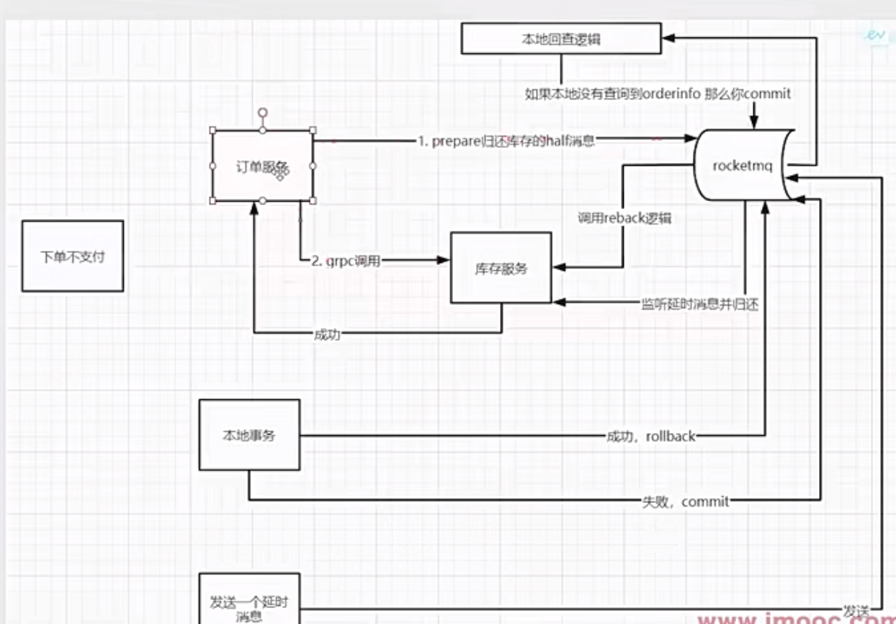

这个方案细节
- 扣减库存服务放在本地事务之前做
- 扣减库存不是通过mq消息来触发的，是自己第2步通过grpc调用的
- 解决了最终一致性的问题，还有个下单不支付的问题应对法：超时机制，通过加个延时消息解决，让库存服务监听这个延时消息，归还处理
- 这个方案从各方面做到了一致
- 后面我们就基于这个方案去集成我们的项目
#### 3-6&7 在CreateOrder中发送事务消息

1. 现在`jieduan3-0-1shixian-weifuwu-kuangjia/mxshop_srvs/order_srv/handler/order.go`中定义MQ的结构体类型`OrderListener` 
2. 在`CreateOrder`方法中使用MQ事务发送消息
3. 实现ExecuteLocalTransaction方法
   1. ExecuteLocalTransaction方法中按照3-5的方案去写逻辑
   2. 一般在本地事务回滚`tx.Rollback()`的时候，都会加上`return primitive.CommitMessageState` 的反向提交事务消息
      1. 其他地方还没有进行数据库增删改操作如`o.Detail = "批量查询商品信息失败"`，可以直接调用
		`return primitive.RollbackMessageState`
4. 这个发送端写完后，后面还得去消费方即库存服务中完善

#### 3-8 本地事务消息回查怎么做


- 具体见`CheckLocalTransaction`方法的实现和注释

#### 3-9 库存扣减服务中表结构的设计

- 消费方即库存服务中完善，服务启动时候应该首先去订阅这个topic，而不是在接口里订阅，然后去消费
- 代码见 `jieduan3-0-1shixian-weifuwu-kuangjia/mxshop_srvs/inventory_srv/main.go`
  - 现在这个服务初始化中，启动订阅topic的服务，---- 监听库存归还的topic消息
  - 收到消息时，直接调用handler.AutoReback方法
- handler.AutoReback方法中
  - 还需要建一张表用来做幂等性和(没有扣减的库存你别归还)，这个表叫 `StockSellDetail`


#### 3-10 gorm定义具备嵌套对象的列

- 即完善StockSellDetail表结构中的GoodsDetailList自定义类型，而是嵌套对象的类型

#### 3-11 库存服务的sell逻辑修改和归还逻辑重构

- 完成`jieduan3-0-1shixian-weifuwu-kuangjia/mxshop_srvs/inventory_srv/handler/inventory.go`中
  - 完成Sell扣减库存方法和AutoSell归还库存方法

#### 3-12 测试库存服务和库存扣减历史记录

启动订单微服务和订单api服务，然后测试下这些接口

#### 3-13 测试rocketMQ的事务回查后的库存归还逻辑

怎么模拟这个错误呢？让执行本地事务时故意让它失败，如在库存构建成功后，创建订单前直接返回一个commit状态，触发失败链路

通过直接返回一个unkown状态，触发了事务回查，等待了一段时间触发了事务回查

#### 3-14 在订单服务中发送延时消息解决订单超时库存归还的问题

1. 我们在成功创建订单后提交事务前，应该发送一个延时消息topic，这个消息也放在事务中做
   1. `jieduan3-0-1shixian-weifuwu-kuangjia/mxshop_srvs/order_srv/handler/order.go`中的`primitive.NewMessage("order_timeout"`相关代码
2. 然后应该在订单下的服务中监听超时的topic：`jieduan3-0-1shixian-weifuwu-kuangjia/mxshop_srvs/order_srv/main.go`
   1. 处理逻辑见`handler.OrderTimeout`
   2. 为什么要在订单服务中监听而不是库存服务？
      1. 因为库存服务根本不知道订单是否支付！不能无脑的收到消息就触发归还逻辑，必须得先校验，所以放在订单中做

#### 3-15 rocketmq中shutdown造成的坑


- 订单接口文件`order_srv/handler/order.go`中，为什么我创建订单时的NewProducer实例p的shutdown，会影响超时发送时实例的shutdown，因为他们内部存储的key是以当前进程id为key，会冲突
  - RocketMQ 客户端内部，默认用【进程 ID】作为唯一标识存储 producer/consumer 实例
  - 同一个进程里创建多个 Producer → 实例互相覆盖、互相干扰！
  - 你 shutdown 其中一个 → 另一个也直接挂掉、无法发送消息！
  - 重点：应该使用全局单例
- 解决：
  - 使用时不要在一个进程中使用多个新producer实例，和随意进行shutdown，shutdown应该放在进程退出信号中
    - 推荐用法：全局单例 Producer：一个进程，只创建一个 Producer，到处复用，不要每次发消息都 New！
  - 创建NewProducer实例传入options参数指定
    - `rocketmq.NewProducer(producer.WithNameServer(ns),producer.WithInstanceName("inventory-producer-2"), // 不同名字)`


### 4章 实现接口的幂等性


#### 4-1 什么是服务雪崩

服务雪崩是非常严重的系统设计问题，

服务雪崩：微服务架构中，一个下游服务故障 / 响应变慢，故障顺着调用链向上扩散，逐级拖垮所有上游服务，最终整个链路、甚至整套系统全部不可用的连锁故障现象。

简单理解：一环崩，环环崩，全线瘫痪。


首要需要解决的是：超时机制

#### 4-2 超时、重试和幂等性机制的关系

他们之间是递进的关系，为什么要超时，因为防止服务雪崩的发生，为什么要重试，因为有超时机制，为什么要幂等，因为有重试请求

- 超时
  - timeout是为了保护服务，避免consumer服务因为provider 响应慢而也变得响应很慢，这样consumer可以尽量保持原有的性能。
- 重试
  - 如果provider只是偶尔抖动，那么超时后直接放弃，不做后续处理，就会导致当前请求错误，也会带来业务方面的损失。对于这种偶尔抖动，可以在超时后重试一下，重试如果正常返回了，那么这次请求就被挽教了，能够正常给前端返回数据，只不过比原来响应慢一点。重试可以考虑切换一台机器来进行调用，因为原来机器可能由于临时负载高而性能下降，重试会更加剧其性能问题，而换一台机器，得到更快返回的概率也更大一些。
- 幂等
  - 举例用户服务api层向用户服务的srv层发送写入用户的请求，如果网络抖动，如果有重试，又接收到了同样的数据过来，结果一次性注册2个客户
  - 因为重试机制，调用多次，数据库中只能正常显示一份，这就幂等了

#### 4-3 哪些情况下需要考虑幂等性问题

1. http请求的类型，更关心post和put方法
   1. get方法不需要
   2. post方法比较常见，会有幂等性问题
   3. put请求：不一定实现幂等性
      1. 如更改商品的价格改为200元，它重试的话，并没有影响 --- 这种情况没有幂等性问题
      2. 如购物车的商品数量，点击+1，就加1个数量，这时如果重试了  --- 这种情况就有幂等性问题
   4. delete操作：一般不具备幂等性要求，因为多次调用都是删除同一个数据

#### 4-4 使用grpc-middleware实现grpc调用的重试

我们基于go-grpc三方中间件社区库提供的重试中间件：`github.com/grpc-ecosystem/go-grpc-middleware`里面的重试中间件`github.com/grpc-ecosystem/go-grpc-middleware/retry`，实现grpc调用的重试，

- 测试代码见`jieduan5-分布式系统核心、微服务的部署/grpc_interpretor`

#### 4-5 常用的幂等性解决方案

1. 唯一索引，防止新增脏数据
   1. 比如: 新建用户的时候将手机号码设置为唯一索引，那么即使你重试，也只会新建一个用户，不会因为重试导致当前用户注册了两个用户
      1. 利用数据库的唯一索引机制
   2. 要点: 唯一索引或唯一组合索引来防止新增数据存在脏数据(当表存在唯一索引，并发时新增报错时，再查询一次就可以了，数据应该已经存在了，返回结果即可)
2. token机制：
   1. 思路：前端自己生成一个唯一 ID（UUID），提交时带上；后端用这个 ID借助redis等缓存库 做幂等 key。不用 “先向后端申请 Token”，前端本地生成即可。
   2. 不用前端额外请求拿 Token（省一次网络请求）
      1. 后端只加几行代码
      2. 能防：连点、网络重试、Nginx 重试
3. 悲观锁
4. 乐观锁
5. 分布式锁
6. select+insert
   1. 并发不高的后台系统，或者一些任务JOB，为了支持幂等，支持重复执行，简单的处理方法是，先查询下一些关键数据，判断是否已经执行过，在进行业务处理，就可以了
   2. 见`jieduan3-0-1shixian-weifuwu-kuangjia/mxshop_srvs/inventory_srv/handler/inventory.go`的Sell方法中
   3. 先查询StockSellDetail表，然后确定这个订单是否已经扣减过库存了，已经扣减过了就别扣减了
   4. 并发时候依然会有漏洞， 同一个时刻发送了重复了多次此时发现都没扣减过--- 这个最终解法还是使用锁，分布式锁
      1. 注意: 核心高并发流程不要用这种方法，有漏洞
7. 对外 API 接口幂等性---- 跟唯一索引类似
   1. 约定请求字段要求调用方必传两个参数：
      1. source：请求来源 / 商户标识，区分不同调用方
      2. seq：调用方本地唯一业务流水号，同一来源下永不重复
   2. 数据库层防重（关键）
      1. 在服务端数据表，对 source + seq 建立联合唯一索引。利用数据库唯一性约束，从底层拦截重复请求，并发场景下也只会执行一次业务逻辑。
   3. 标准执行流程（幂等友好）
      1. 接收请求，取出 source 和 seq；
      2. 优先根据这两个字段查询数据库，判断该请求是否已处理；
      3. 已处理：直接返回历史执行结果，不再执行业务逻辑；
      4. 未处理：执行业务逻辑，同时写入包含 source+seq 的记录，再返回响应。
   4. 注意：禁止不做前置查询直接执行业务，否则重复请求会触发索引冲突报错，同时业务已实际执行，造成数据与返回结果不一致。
8. 网关层统一做幂等性
   1. 在 Nginx / Gateway 层 做统一防重，业务代码完全不用改。
   2. 做法
      1. 网关拦截 POST 写请求
      2. 按 用户ID + 请求URL + body哈希 做 key
      3. Redis 记录：5 分钟内同一 key 只放行一次
   3. 优点
      1. 业务代码一行不改
      2. 统一拦截所有重复提交
      3. 防爬虫、防恶意重试
   4. 缺点
      1. 要改网关配置
      2. body 哈希有一点点性能损耗
   5. 适合：微服务、大型系统、不想改老代码。
## 19周 链路追踪，限流，熔断，降级

### 1章 链路追踪系统技术概述

#### 1-1 为什么我们需要链路追踪？

微服务调用链长、节点多、故障难定位、性能难分析，链路追踪用来串联全链路请求，快速排障、优化性能、梳理调用关系。

- 单体应用：所有代码在一个进程，出问题看日志、查堆栈即可，调用链路简单，无需额外追踪。
- 微服务架构（核心痛点）：一次前端请求，会串行 / 并行调用网关→服务 A→服务 B→服务 C→数据库 / 缓存 / 消息队列，跨多节点、多进程、多机器：
  - 报错不知道哪一个服务 / 哪一段代码出问题；
  - 接口慢，分不清是网络、下游服务、DB 还是缓存拖慢整体耗时；
  - 调用关系复杂，人工梳理依赖、调用顺序成本极高；
  - 出现超时、丢请求、数据不一致，无法还原完整请求路径。

#### 1-2 链路追踪技术选型
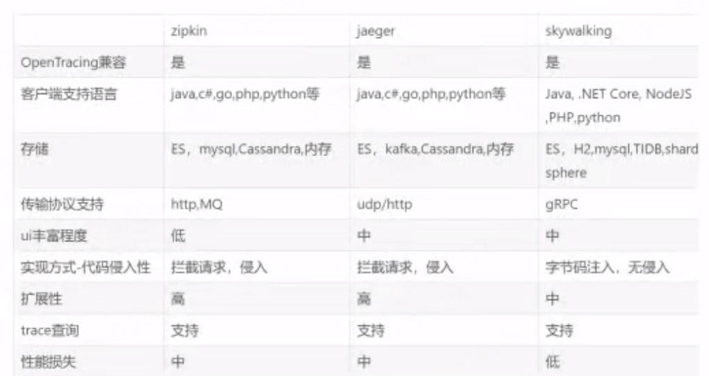

综合考虑，我们使用Jaeger，它就是go语言写的，

#### 1-3 Jaeger的安装和架构介绍

docker安装
```shell
docker run
--rm
--name jaeger \
-p6831:6831/udp \
-p16686:16686
jaegertracing/all-in-one:latest
```

- Jaeger UI 页面链接： http://localhost:16686

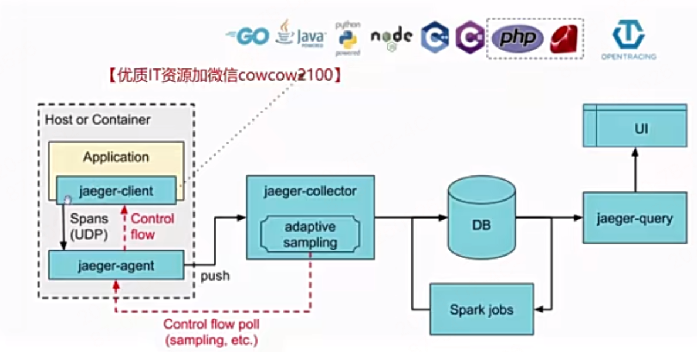


Jaeger 五大核心组件
1. Jaeger Client
符合 OpenTracing 标准的多语言 SDK
应用程序通过它埋点、生成 Trace/Span
按采样策略将追踪数据发给 jaeger-agent
1. Jaeger Agent
部署在每台机器 / 每个容器上的守护进程
接收 Client 发来的数据，批量聚合
转发给 Collector
作用：解耦 Client 和 Collector，屏蔽服务发现细节
1. Jaeger Collector
接收 Agent 发送的 Trace 数据
校验、处理、转换
写入后端存储
无状态，可水平扩展
1. Data Store（存储）
可插拔存储
支持：Cassandra、Elasticsearch
保存所有链路数据
1. Query + UI
Query：接收查询请求，从存储读取 Trace
UI：图形化展示调用链路、服务拓扑、耗时分析
无状态，可多实例部署 + 负载均衡


二、数据流向
```js
应用程序（Client）  
→ 发送给本地 Agent  
→ Agent 批量转发给 Collector  
→ Collector 写入存储（ES/Cassandra）  
→ Query 读取 → UI 展示
```

分布式追踪系统发展很快，种类繁多，但核心步骤一般有三个:代码埋点、数据存储、查询展示

#### 1-4 opentracing的tracer、span、spanContext
OpenTracing 标准的3大核心概念

1. Tracer（追踪管理器）
   1. 作用：整个链路追踪的入口、管理员。
   2. 功能：
      1. 创建 Span
      2. 注入（Inject）上下文到请求头
      3. 提取（Extract）上游传递的上下文
      4. 管理采样、上报数据
   3. 一句话：Tracer = 链路追踪的总控制器，负责创建、传递、结束所有 Span。
   4. 链路追踪的管理者，负责创建、启动、结束 Span。
2. Span（一段调用 / 一个工作单元）
   1. 作用：代表链路中 “一次操作”。比如：
      1. 一次 HTTP 请求
      2. 一次 gRPC 调用
      3. 一次 DB 查询
      4. 一次函数执行
   2. 一个 Span 包含：
      1. SpanID
      2. TraceID
      3. 开始时间、结束时间
      4. 标签（tags：服务名、方法、状态码）
      5. 日志（logs：错误信息、参数）
      6. 父 SpanID（形成父子关系）
   3. 一句话：Span = 一次调用 / 一段耗时的记录。
   4. 代表一次调用 / 一段逻辑，记录耗时、状态、日志、标签。
3. SpanContext（链路上下文）
   1. 作用：在服务之间传递 Trace 信息。它里面只存 3 个东西：
      1. TraceID
      2. SpanID
      3. Baggage（透传字段）
   2. 它的核心功能：
      1. 跨服务透传 TraceID、SpanID
      2. 服务 A → 服务 B 必须靠它才能把链路串起来
      3. 不存储耗时、不存储标签，只传标识
   3. 一句话：SpanContext = 链路的 “身份证”，在服务之间传递，把整条链路串起来。
   4. 链路的上下文，存储 TraceID、SpanID，用于跨服务传递，把多个服务的调用串联成一条完整链路。

##### 重点细节
- TraceID（全局追踪 ID
  - 一条请求链路，只有一个 TraceID，从网关 → 订单服务 → 库存服务，全程不变
  - 作用：把所有服务的日志、Span 串成一条完整链路
  - Tracer：是一个 “工厂 / 管理器”，负责创建 Span、解析上下文、发送数据到 Jaeger Agent。
  - 正确理解：一个请求一个 TraceID，但 Tracer 全局唯一
  - TraceID：是根 Span创建时才生成的（整条链一个）。
- SpanID（片段 ID）
  - 每一个 Span 都有一个唯一的 SpanID
  - 父 Span、子 Span、孙子 Span，全都不一样
  - 作用：标识链路里的每一步操作
- span细节
  - Span 必须记录开始时间 + 结束时间
    - 靠 StartSpan() 和 Finish() 计算耗时。
  - 父子关系靠 ParentSpanID 维系，子 Span 里保存父 Span 的 ID。
  - Span 三大组成细节
    - Tags（标签，KV 结构）
      - 作用：查询、过滤、搜索
      - `span.SetTag("user_id", 1001)`
    - Logs / Events（日志，事件）
      - 作用：记录事件、错误、关键信息
      - `span.LogKV("event", "扣减库存成功")`
    - Baggage（透传字段）
      - 跨服务全局透传的 KV全链路传递
      - 如也可以设置和获取SpanContext（链路上下文）中的`span.SetBaggageItem("user_id", "1001")`


- TraceID = 链路身份证
  - 用来在 Jaeger 里搜索一整条请求。
- SpanID = 每一步的编号
  - 用来构成父子关系、调用顺序、耗时统计。

### 2章 go集成jaeger

整个go项目就使用一个tracer实例，项目每个api如创建订单，获取商品信息，就是对应不同的span，每个api就是span，每个api下有很多子api调用，这些就算做span的子集span

#### 2-1 go通过jaeger-client发送单个span

- 示例代码见`jieduan5-分布式系统核心、微服务的部署/jaeger_test/main.go`
- 代码里开的：LogSpans: true 控制台日志格式
  - Go 客户端打印出来的样子（标准格式）：
  - `2026/05/27 10:00:00 INFO Span reported: traceID:spanID:parentSpanID:flags - operationName`
  - `2026/05/27 10:00:00 INFO Span reported: 2da97aa33839442e:ccb83780e27f016c:0000000000000000:1 - /proto.Greeter/SayHello`

#### 2-2 go发送多级父子嵌套span

- 示例代码见`jieduan5-分布式系统核心、微服务的部署/jaeger_test/main-parent.go`

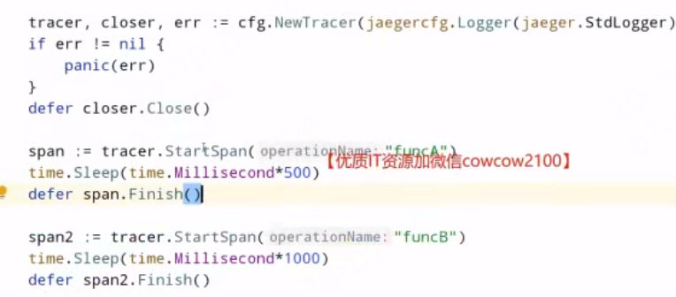
- 有多个defer时，defer的执行顺序是后进先出，当创建多个span时，每个span后都调用了`defer span.Finish()`,它会有个问题，造成最后一个defer 的span先关闭，导致第一个span的时间被迫拉长，第一个span花费了1.5秒，第二个span花费了1秒
  - 解法：当有多个span时，每个span后就不要加defer直接调用`span.Finish()`即可
- 设置父子span后，页面上查看span的调用链路就是多级时间线那种
- 重点细节：
  - TraceID（全局追踪 ID）
    - 一条请求链路，只有一个 TraceID
    - 从网关 → 订单服务 → 库存服务，全程不变
    - 作用：把所有服务的日志、Span 串成一条完整链路
  - SpanID（片段 ID）
    - 每一个 Span 都有一个唯一的 SpanID
    - 父 Span、子 Span、孙子 Span，全都不一样
    - 作用：标识链路里的每一步操作

#### 2-3 go下通过grpc发送span消息

- 使用开源的 gRPC + OpenTracing 集成库（自动帮你处理Inject/Extract/父子Span）三方库
  - 三方库源码包见：`jieduan5-分布式系统核心、微服务的部署/jaeger_test/otgrpc` 目录
- 使用时，本地模拟一个grpc环境，集成这个三方库
  - 先启动 `jieduan5-分布式系统核心、微服务的部署/jaeger_test/server`server服务，再从client触发调用
  - 我们只需要在client端的拦截器中加上otgrpc包提供的拦截器中间件即可
    -  拦截器中间件：`otgrpc.OpenTracingClientInterceptor`，下面为大概内部流程
    -  1. 创建Span
    -  2. 建立父子关系
    -  3. Inject 把追踪信息（trace-id、span-id）放入gRPC Header请求头，发给服务端
       -  具体服务端怎么使用这些元数据，还得去服务端改造集成追踪系统
    -  4. 当每个grpc请求响应完成后，自动计时、自动结束、自动上报
 -  grpc的服务端也需要配合改造
    -  集成服务端的拦截器插件，内部大概流程如下：
    -  1. Extract：从 gRPC 请求头 Metadata 里取出 客户端传过来的 TraceID、SpanID
    -  2. 创建服务端 Span：把客户端 Span 当作父Span，建立 父子关系
    -  3. 把这个 Span 放进 ctx，后续业务代码可以继续用（比如调用DB、Redis）
    -  4. 业务逻辑执行完 → 自动结束 Span、自动计时、自动记录错误、自动上报 Jaeger

#### 2-4 gin中添加拦截器实现jaeger注入

- 讲下将jaeger集成到gin中，上节是集成到grpc中
- 我们在`goods-web`中找个接口做个示例
  - 先写路由的一个追踪的中间件`jieduan3-0-1shixian-weifuwu-kuangjia/mxshop-api/goods-web/middlewares/tracing.go`
    - 借助jaeger配置存到nacos配置中，goods-web/config/config.go
  - 添加到路由注册处,如`mxshop-api/goods-web/router/goods.go`文件
    - 如`GoodsRouter := Router.Group("goods").Use(middlewares.Trace())`
  - 现在有个问题，web层的路由追踪是加上了，还需要把web到grpc-srv的调用链路都串联加上，web层的traceid包括web层和子孙的grpc层链路都完整的追踪，怎么做呢？
  - 解法是在grpc拨号中加`OpenTracingClientInterceptor`
    - 还得在`jieduan3-0-1shixian-weifuwu-kuangjia/mxshop-api/goods-web/initialize/srv_conn.go`中添加一个grpc的专门optrace的拦截器，用来对grpc调用增加监控，但是这有2个问题
      - 1、根级span没有传递给grpc拦截器里
        - 直接利用opentracing提供的方法单独指定父级span：`newCtx := opentracing.ContextWithSpan(context.Background(), span)`
      - 2、tracer目前的实现是每个请求都新建一个tracer，不是全局单例的，所以直接在grpc拨号拦截器传入全局tracer也是不行的对应不上
        - 如果改成下面的全局单例写法，那么就能解决，这个问题就不存在。
        - 如果不改的话，那就只能改2-5里的修改 `otgrpc.OpenTracingClientInterceptor` 源码，去核心兼容从上下文中解析不同的tracer
      - 具体改动见`jieduan3-0-1shixian-weifuwu-kuangjia/mxshop-api/goods-web/api/goods/goods.go`的Trace解法1 和 2
- 搞清概念：
  - Tracer：是一个 “工厂 / 管理器”，负责创建 Span、解析上下文、发送数据到 Jaeger Agent。
  - 正确理解：一个请求一个 TraceID，但 Tracer 全局唯一
  - TraceID：是根 Span创建时才生成的（整条链一个）。

##### 原中间件写法错误具体看文中注释，应该做成下面写法

```go
// 中间件文件：正确写法
package middlewares

import (
	"mxshop-api/goods-web/global"

	"github.com/gin-gonic/gin"
	"github.com/opentracing/opentracing-go"
)

// Trace 全局唯一的 Tracer，在 main 中初始化一次
func Trace() gin.HandlerFunc {
	return func(ctx *gin.Context) {
		// 从全局获取 tracer（只初始化一次）
		tracer := opentracing.GlobalTracer()

		// 开启一个 span，作为当前请求的 根span ---- 这时才会生成traceid
		span := tracer.StartSpan(ctx.Request.URL.Path)
		defer span.Finish()

		// 将 tracer & 父span 存入 gin context
		ctx.Set("tracer", tracer)
		ctx.Set("parentSpan", span)

		ctx.Next()
	}
}

// main.go 文件：全局初始化一次
func InitJaeger() {
	cfg := jaegercfg.Configuration{
		Sampler: &jaegercfg.SamplerConfig{
			Type:  jaeger.SamplerTypeConst,
			Param: 1,
		},
		Reporter: &jaegercfg.ReporterConfig{
			LogSpans:           true,
			LocalAgentHostPort: fmt.Sprintf("%s:%d", global.ServerConfig.JaegerInfo.Host, global.ServerConfig.JaegerInfo.Port),
		},
		ServiceName: global.ServerConfig.JaegerInfo.Name,
	}

	tracer, closer, err := cfg.NewTracer(jaegercfg.Logger(jaeger.StdLogger))
	if err != nil {
		panic(err)
	}

	// 只设置一次
	opentracing.SetGlobalTracer(tracer)

	// 程序退出时关闭一次
	global.JaegerCloser = closer
}
```
#### 2-5 修改grpc_opentracing源码

- 修改 `otgrpc.OpenTracingClientInterceptor` 源码
  - 去核心兼容从上下文中解析不同的tracer
- 改动位置见`jieduan3-0-1shixian-weifuwu-kuangjia/mxshop-api/goods-web/utils/otgrpc/client.go`

#### 2-6 配置订单服务的web层逻辑

1. 也在utils下拷贝`otgrpc`这个三方库源码
2. 等等重复商品服务的相关改动，具体见代码，实现链路追踪集成

#### 2-7 grpc集成opentracing的原理

从`jieduan3-0-1shixian-weifuwu-kuangjia/mxshop-api/goods-web/utils/otgrpc/client.go`入口看下源码
-  

#### 2-8 grpc的server端如何获取客户端的span

先见改动这个订单微服务`jieduan3-0-1shixian-weifuwu-kuangjia/mxshop_srvs/order_srv`

1. 先在`order_srv/utils`下先添加otgrpc三方库开源包
2. 在`order_srv/main` 下 注册服务端的otgrpc拦截器到grpc中
3. 在`jieduan3-0-1shixian-weifuwu-kuangjia/mxshop_srvs/order_srv/handler/order.go`的CreateOrder的ExecuteLocalTransaction本地事务期间
   1. 直接通过`parentSpan := opentracing.SpanFromContext(o.Ctx)`,拿到web服务层传过来的parentSpan
   2. 然后各种数据库，跨服务的相关操作都记录下span时间，关联到这个parentSpan中
4. 现在遇到一个问题，接入后，consul的服务健康检查也会自动追踪，导致频繁有很多trace，咋办，还得去改源码
   1. 见`jieduan3-0-1shixian-weifuwu-kuangjia/mxshop_srvs/order_srv/utils/otgrpc/server.go`的OpenTracingServerInterceptor方法源码修改
5. 最终效果依然是树形的，从web-服务层到grpcsrv层一条链路，很清晰
   1. 注意，grpc方法名：Order/CreateOrder 这个有2个Span，这是支持的，因为客户端装的otgrpc拦截器插件会创建一个，server端的otgrpc拦截器插件也会初始自动创建一个
### 3章 熔断限流sentinel

#### 3-1 什么是限流熔断和降级？

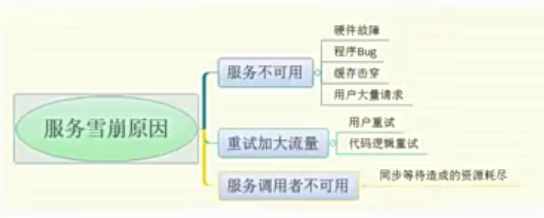

高并发场景下如何来防止服务的雪崩？

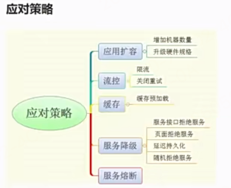

1. 限流
   1. 流量过来2k但是我的服务能力只有1k，所以这个时候多出来的流量怎么办:1.拒绝2.排队等待用户体验不太好:当前访问用户过多，请稍后重试和你的服务直接挂了
2. 熔断
   1. 比如A服务访问B服务，这个时候B服务很慢-B服务压力过大，导致了出现了不少请求错误，调用方很容易出现一个问题:每次调用都超时2k，结果这个时候数据库出现了问题，超时重试·网络2k的流量突然变成了3k这让原本就满负荷的b服务雪上加霜，如果这个时候调用方有一种机制:比如说
      1. 发现了大部分请求很慢-50%请求都很慢
      2. 发现我的请求有50%都错误了
      3. 错误数量很多，比如1s出现了20个错误
   2. 熔断-1.保险丝2.股市熔断1
3. 降级
   1. 用户体验降级了-原本是访问流畅，下单流畅->当前访问用户过多，请稍后重试
   2. 上面的限流和熔断之后，最终都会导致服务降级

#### 3-2 熔断限流技术选型：sentinel 和 hystrix对比

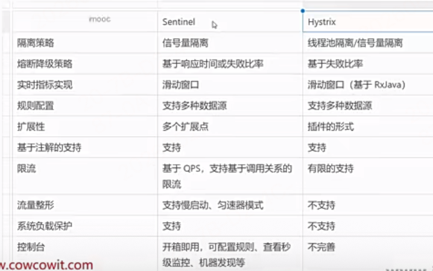
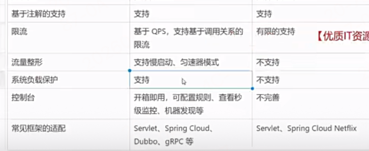

选择sentinel，它也是java写的，阿里开源的

> 官方文档：https://sentinelguard.io/zh-cn/docs/golang/circuit-breaking.html

#### 3-3 sentinel的qps限流

- 使用sentinel-golang开源包
  - 重点介绍流量控制流控规则和熔断降级
- 测试代码课件见：`jieduan5-分布式系统核心、微服务的部署/sentinel_test`目录
  - 流控：分为2种，qps直接限流（固定阈值）和预热冷启动
    - Direct = 直接限流（固定阈值）
    - WarmUp = 冷启动 / 预热限流（慢慢放开流量，怕系统刚启动被冲垮）
  - 熔断：分为3种，错误请求比例，错误请求数量，慢调用比例
#### 3-4 sentinel的预热功能

- 测试代码课件见：`jieduan5-分布式系统核心、微服务的部署/sentinel_test/flow/warm_up`目录

**预热它到底解决什么问题？**：
- 场景：
  - 服务刚启动
  - 缓存是空的
  - JIT / 数据库连接 / 本地缓存都没初始化
  - 流量突然直接冲到 100 QPS
  - → 直接压死！
- WarmUp 做的事
  - 不让流量瞬间冲满！
  - 让流量慢慢涨，给系统预热时间！
- 比如：
  - 0 秒：允许 QPS = 30
  - 3 秒：允许 QPS = 50
  - 6 秒：允许 QPS = 80
  - 10 秒：才放开到 100 QPS
  - 像开车一样，慢慢踩油门，不是直接飙到最大速度！

#### 3-5 sentinel的Throttling配置策略

- 直接拒绝
  - 如设置qps10，每 100ms 放 1 个请求，每秒就处理10个，测试循环遍历12个时，时前10个都通过，第11个拒绝
- 匀速通过：请求扎堆来时，不直接拒绝，而是让它等够qps的时间间隔；等待超时才拒绝
  - 如设置10，每个请求等待间隔就是100ms，结果，第一个通过，后面全部拒绝了
  - 因为循环遍历12个发送，间隔都小于100ms，所以全部拒绝了

#### 3-6 sentinel的熔断机制

- 见`jieduan5-分布式系统核心、微服务的部署/sentinel_test/breaker`目录
- 官方文档：https://sentinelguard.io/zh-cn/docs/golang/circuit-breaking.html
    - 详细概念看文档吧，这里笔记为辅

- 熔断器模型：Sentinel 完全遵循经典熔断器状态机
- 1）CLOSED 关闭（正常）
  - 请求全部放行
  - 持续统计：响应时间、异常比例、异常数
  - 条件：指标没到阈值 → 一直 Closed
- 2）OPEN 打开（熔断）
  - 指标超过阈值 → 切到 Open
  - 所有请求直接拒绝，走降级（Fallback）
  - 持续 timeWindow（熔断时长，如 10s）
- 3）HALF-OPEN 半开（探测）
  - 熔断时间到 → 进入 Half-Open
  - 只放 1 个探测请求，其他仍拒绝
  - 探测成功 → **切回 Closed（恢复正常）**
  - 探测失败 → **切回 Open（继续熔断）**


- Sentinel 提供以下几种熔断策略：
  - 慢调用比例 (SLOW_REQUEST_RATIO)：选择以慢调用比例作为阈值，需要设置允许的慢调用 RT（即最大的响应时间），请求的响应时间大于该值则统计为慢调用。当单位统计时长（statIntervalMs）内请求数目大于设置的最小请求数目，并且慢调用的比例大于阈值，则接下来的熔断时长内请求会自动被熔断。经过熔断时长后熔断器会进入探测恢复状态（HALF-OPEN 状态），若接下来的一个请求响应时间小于设置的慢调用 RT 则结束熔断，若大于设置的慢调用 RT 则会再次被熔断。
  - 异常比例 (ERROR_RATIO)：当单位统计时长（statIntervalMs）内请求数目大于设置的最小请求数目，并且异常的比例大于阈值，则接下来的熔断时长内请求会自动被熔断。经过熔断时长后熔断器会进入探测恢复状态（HALF-OPEN 状态），若接下来的一个请求成功完成（没有错误）则结束熔断，否则会再次被熔断。异常比率的阈值范围是 [0.0, 1.0]，代表 0% - 100%。
  - 异常数 (ERROR_COUNT)：当单位统计时长内的异常数目超过阈值之后会自动进行熔断。经过熔断时长后熔断器会进入探测恢复状态（HALF-OPEN 状态），若接下来的一个请求成功完成（没有错误）则结束熔断，否则会再次被熔断。
- Sentinel 熔断器的三种熔断策略都支持静默期 (规则中通过MinRequestAmount字段表示)。静默期是指一个最小的静默请求数
  - 在统计窗口内，请求数量必须 ≥ 这个值，熔断器才开始判断是否熔断，防止 “少量请求波动” 误触发熔断！


- 熔断器一般用于应用对外部资源访问时的保护措施。这里简单描述一些场景：
  - 分布式系统中降级：假设存在应用A需要调用应用B的接口(特别是一些对接外部公司或者业务的接口时候)，那么一般用于A调用B的接口时的防护；
  - 数据库慢调用的防护： 假设应用需要读/写数据库，但是该读写SQL存在潜在慢SQL的可能性，那么可以对该读写接口做防护，当接口不稳定时候(存在慢SQL)，那么基于熔断器做降级。
  - 也可以是应用中任意弱依赖接口做降级防护（即自动降级后不影响业务核心链路）。

#### 3-7 sentinel的熔断接口--基于错误数
- `jieduan5-分布式系统核心、微服务的部署/sentinel_test/breaker/error_count`
#### 3-8 sentinel的熔断接口--基于错误率和慢请求
- `jieduan5-分布式系统核心、微服务的部署/sentinel_test/breaker`
#### 3-9 gin集成sentinel实现限流


我们在一个接口中做个例子即可，选择在商品列表页接口:`goods-web/api/goods/goods.go`List方法


1. 先在这里初始化sentinel:`jieduan3-0-1shixian-weifuwu-kuangjia/mxshop-api/goods-web/initialize/sentinel.go`
2. 再在商品列表页接口:`goods-web/api/goods/goods.go`List方法中加限流的安检口Entry方法
   1. 易混淆点：它限流使用逻辑是，自定注册个资源名，然后调用资源名，相当于只是个安检口，不需要把你的接口的逻辑写到这个方法里，这个方法只是个安检口，安检口写在你的业务接口中任意地方都可以，只要安检口没通过，直接就返回错误了，业务自行判断退出
3. 后面可以改造下，在全局中间件统一业务限流

##### 总结

- 目前实现的是业务层限流，需要侵入业务代码，手动调用
  - 特点：粒度极细、可结合业务逻辑（用户 / IP），内部接口、需要复杂业务规则限流
- 网关限流：零侵入、统一管控、防刷强，粒度较粗（难到方法级），大部分微服务、对外 API、高并发入口
  - 网关限流的内部也大部分是基于sentinel框架实现的
- 建议：对外、对内的通用限流，放网关；只有需要和业务强绑定的精细限流，才放接口里。

## 20周 api网关，部署

### 1章 kong的安装和配置

#### 1-1 什么是api网关

- 之前web页面访问电商微服务是直接在js中写的多个微服务的端口号，想加个API网关统一管理入口，最开始想到的是nginx
  - 但是nginx有个缺点：无法动态化配置，如果想新增微服务或者改个端口号，必须得重启nginx，缺乏动态化免重启的能力
    - 还不支持服务发现的功能
  - 还需要个统一的限流管理功能
#### 1-2 api网关应该具备的基本功能有哪些
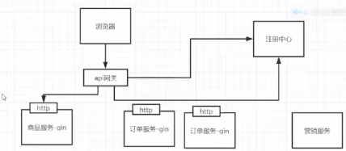
1. 动态路由
2. 限流管理
3. 负载均衡
4. 服务发现
   1. 向注册中心进行服务发现，统一获取所有机器实例
5. 熔断降级管理
6. 流量管理
   1. 黑白名单
   2. 反爬策略

#### 1-3 api网关技术选型

总共有3种生态：
1. go语言开发的
2. java开发
3. 基于nginx的
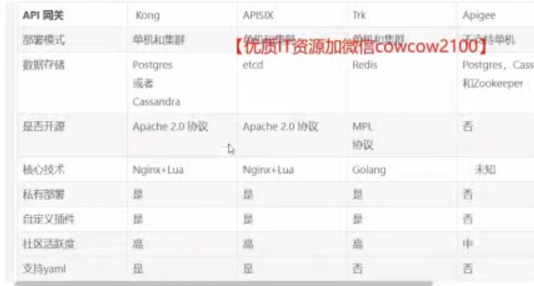

- 补充：
  - Spring Cloud Gateway：基于java-springboot开发的
  - Envoy：基于C++
  - Traefik（Go，K8s ingress）：语言：Go
    - 特点：K8s 自动服务发现、零配置 ingress
    - 适合：K8s 集群内部入口、简单场景、不想复杂配置


- 我们课程中使用的就是kong：基于nginx+lua脚本开发的

#### 1-4 kong的安装

1. 核心定位
   1. Kong 是开源 API 网关，部署在上游业务服务前端。
   2. 所有客户端请求先经过 Kong，再转发到后端服务；可以在转发前统一实现通用能力，不用改后端业务代码。
2. 技术底座
   1. 底层基于 OpenResty（Nginx + LuaJIT）
      1. 继承了 Nginx 高性能、高并发、高稳定的特性，Lua 用来实现动态插件、业务逻辑扩展。
   2. 依赖存储：PostgreSQL / Cassandra
      1. 用来持久化网关配置、路由、插件规则、上游服务信息，集群多节点会共享这份配置。
3. 配置方式
   1. 提供 RESTful API 做全量配置管理，不用改配置文件、不用重启服务，运维便捷。
4. 集群与扩容，支持水平扩展：
   1. 部署多台 Kong 节点，通过前端搭配负载均衡（LVS/NGINX/ 云负载均衡）分发流量到各个微服务Server，轻松应对高并发请求。

**使用docker安装**：
- DB-less（无数据库，简单测试 / 开发推荐）
- PostgreSQL 模式（生产 / 集群推荐）

```yaml
# 这份配置文件，仅供参考AI写的
version: '3.8'

services:
  postgres:
    image: postgres:13
    container_name: kong-database
    networks:
      - kong-net
    environment:
      POSTGRES_USER: kong
      POSTGRES_PASSWORD: kong
      POSTGRES_DB: kong
    healthcheck:
      test: ["CMD-SHELL", "pg_isready -U kong"]
      interval: 5s
      timeout: 5s
      retries: 5
    volumes:
      - postgres_data:/var/lib/postgresql/data

  kong-migrations:
    image: kong:3.7
    container_name: kong-migrations
    depends_on:
      postgres:
        condition: service_healthy
    networks:
      - kong-net
    environment:
      KONG_DATABASE: postgres
      KONG_PG_HOST: postgres
      KONG_PG_USER: kong
      KONG_PG_PASSWORD: kong
    command: kong migrations bootstrap
    restart: on-failure

  kong:
    image: kong:3.7
    container_name: kong-gateway
    depends_on:
      postgres:
        condition: service_healthy
      kong-migrations:
        condition: service_completed_successfully
    networks:
      - kong-net
    volumes:
      # 挂载你的自定义配置文件
      - ./config/kong.conf:/etc/kong/kong.conf
    # 关键：指定用这个配置文件启动
    command: kong start -c /etc/kong/kong.conf
    ports:
      - "8000:8000"
      - "8443:8443"
      - "8001:8001"

networks:
  kong-net:

volumes:
  postgres_data:
```

1. 启动后，先验证下数据库是否启动好，是否能数据库链接工具链接成功，如用navcat链接postgresql
2. 安装kong，用docker安装kong，必须使用到docker的网络，因为要调用很多依赖服务如consul服务，他们都是通过网络来调用的，所以需要使用docker的网络
3. 如果对docker网络不熟的话，建议还是前期先安装在主机上
4. 安装教程可以参考：https://www.cnblogs.com/young-q/p/17177068.html
5. 关闭防火墙，重启docker容器
6. 修改kong的配置文件
   1. 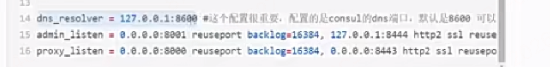
   2. 这块dnsresolver配置用于连接consul的dns链接地址和其他的adminlisten和proxylisten也需要打开，需要也配置
7. 启动kong，指定配置文件启动即可
8. 验证是否启动成功
   1. 访问8001和8000端口，成功返回数据就算启动成功了
9. 最后再安装konga：`docker run -d -p 1337:1337 --name konga pantsel/konga`
   1.  GUI前端管理页面，访问1337端口号即可

### 2章 kong的配置

#### 2-1 kong的8001、8000和1337端口号的关系

1. 8001：kong的admin的端口
2. konga管理页面首次进入时，需要配置kong服务的链接实例，这个实例的链接就是8001端口，一个konga界面可以链接多个kong服务实例
3. 一定要检查info菜单里的dnsresolver是否与配置的一样，否则后面consul集成时会失败

**端口号讲解**：
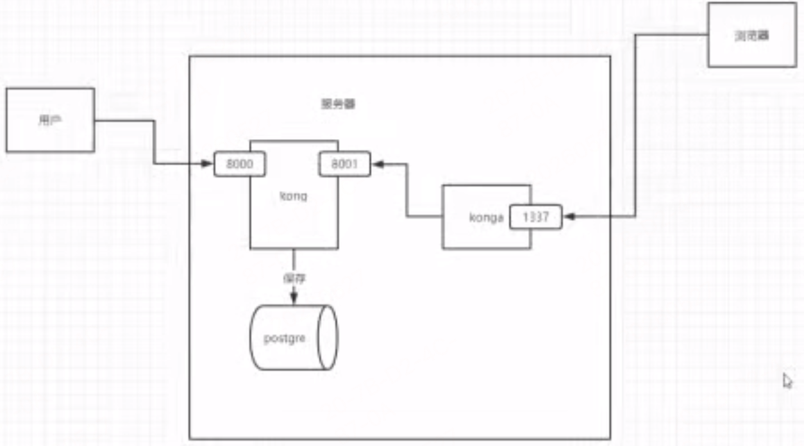
1. 8000 端口（用户 / 前端访问用）
作用：网关入口
用户 / 前端 / 小程序 → 请求 http://localhost:8000/xxx
经过 Kong 转发 → 你的 Gin 服务
这是对外提供服务的端口。
2. 8001 端口（管理员 / 配置用）
作用：Kong 管理 API,给你运维、配置用的端口
你用它添加路由、添加限流、添加服务、查看状态
`curl http://localhost:8001/services`
3. 8443 端口（HTTPS 用）
HTTPS 加密访问
作用：也是网关入口
用户 / 前端 / 小程序 → 请求 https://localhost:8443/xxx
4. 1337：**Konga（Web UI）** 的端口，浏览器访问用


- 后面流程：访问 http://localhost:8001 → 看 Kong 是否启动成功
  - 添加一个 Service（指向你的 Gin 服务）
  - 添加一个 Route（用户访问路径）
  - 开启 限流插件

#### 2-2 基本的路由转发配置即动态路由

- konga中最重要的2个概念：Service（服务）和 Route（路由）
- services:
  - Service顾名思义,就是我们自己定义的上游服务,通过Kong匹配到相应的请求要转发的地方，Service可以与下面的Route进行关联一个Service可以有很多Route,匹配到的Route就会转发到Service中，当然中间也会通过Plugin的处理,增加或者减少一些相应的Header或者其他信息.
    - 一个service可以有多个route
- Routes:Route 路由相当于nginx 配置中的location，Route实体定义匹配客户端请求的规则.每个路由都与一个服务相关联,而服务可能有多个与之相关联的路由.每一个匹配给定路线的请求都将被提交给它的相关服务.
- Service（服务）
  - 代表一个后端服务（比如 user-service）
  - 核心是：我要代理到哪里去
  - 配置方式二选一：
  - 简单：直接写死 host + port（单实例）
  - 集群：host 写 Upstream 的名字（多实例、负载均衡）
  - 可以理解成：给后端服务起个名字、定个入口。
- Upstream（上游）
  - 是一个虚拟主机名，下面挂一堆 Target（IP: 端口），一个service对应一个upstream，一个upstream对应多个某服务的实例
  - 专门负责：负载均衡、健康检查、故障转移
  - 例如：
  - Upstream 名叫 user-upstream
  - Target：192.168.1.10:8080、192.168.1.11:8080
  - 可以理解成：一个负载均衡器，管理一群真实节点。
- 路由和服务的组合(以及它们之间的关注点分离)提供了一种强大的路由机制，可以在Kong中定义细粒度的入口点,从而引导您的访问到不同upstream服务.


- 创建服务的配置弹窗，如创建一个商品的web服务
  - 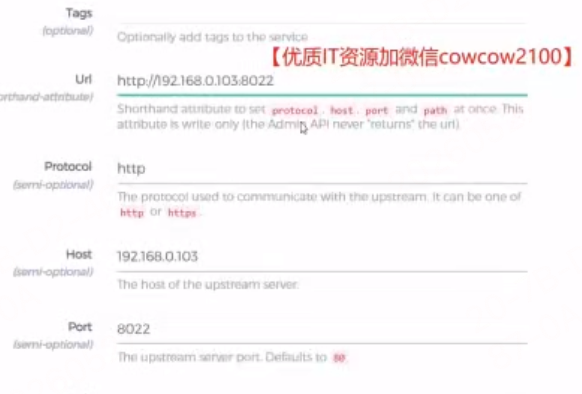
- 创建后，点击进入服务，配置它的routes
  - 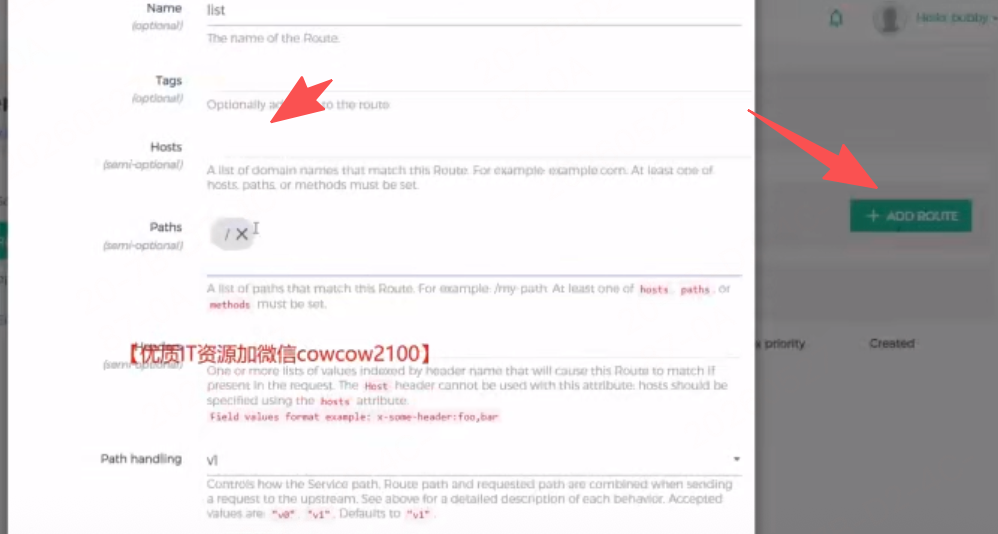
- 配置后，直接访问统一http://localhost:8000/端口就能自动映射到刚才配置的商品web服务里

#### 2-3 kong的service、route和upstream

- service：是一个抽象服务层，用于指向具体的物理服务，也可以指向upstream实现物理服务的负载均衡
  - 一个service对应一个upstream，一一对应关系，一个upstram对应多个物理服务的target
- upstream可以负载均衡，健康检查等，我们之前已经用consul自带的健康检查，所以我们就需要负载均衡，
  - 后面可以考虑upstream如何与consul进行绑定，自动获取所有微服务的地址

#### 2-4 kong集成consul实现服务发现和负载均衡

将consul集成进来
1. 利用到kong中配置的dnsresolver了，Kong 配好 dns_resolver=consul:8600，Service 的 host 直接写consul分配的 `服务名.service.consul`，就能自动做服务发现 + 负载均衡，不需要手动建 Upstream
   1. 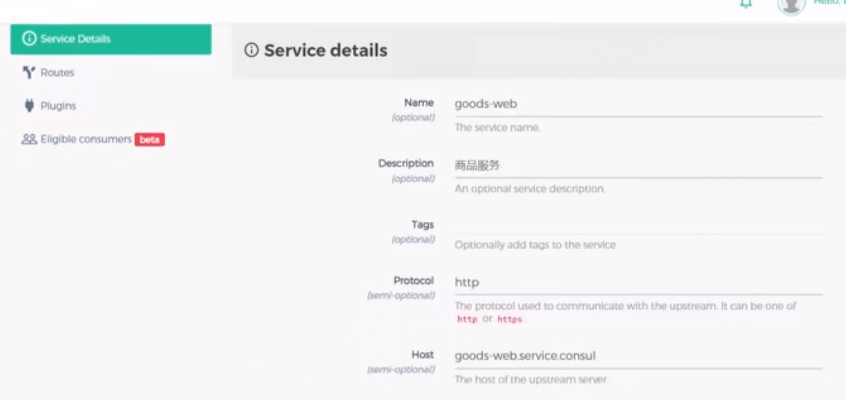
   2. Kong 收到 xxx.service.consul：
   3. 向 Consul DNS 查 SRV 记录 → 拿到所有实例 IP:port
   4. 自动做轮询负载均衡
   5. 实例下线自动摘除（依赖 Consul 健康检查）

#### 2-5 kong配置jwt实现登录校验

利用kong的插件机制官方插件市场中有很多插件，可以增强功能，本节讲下jwt插件的集成，业务的服务就不用再做登录校验了

- **consumer概念**
  - Consumer = 给调用你接口的 “客户端 / 用户”做个标记，只要是向 Kong 发请求的一方，都可以定义成 Consumer
  - 就是：谁在用你的 API，比如：
    - 移动端 APP
    - 网页前端
    - 第三方服务
    - 后台用户
  - 每个 Consumer 对应一个独立身份，方便网关区分 “是谁在调用”
  - 作用背景：
    - 如：普通 APP：10 次 / 秒，管理员后台：100 次 / 秒，第三方合作方：5 次 / 小时
    - **没有 Consumer → 你无法区分谁是谁，只能全部统一限流，非常不灵活。**
  - 必须先创建用户（Consumer），再发卡（JWT 密钥）

**具体jwt例子使用**
1. 先创建一个consumer客户端身份，起个mxshop的名字
   1. 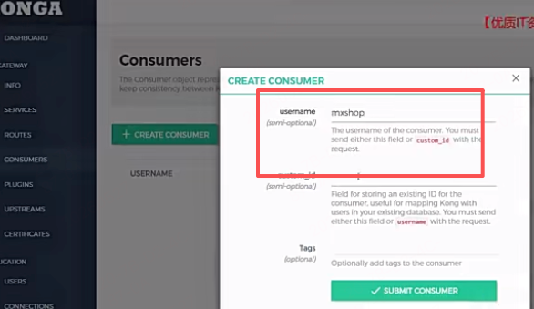
2. 进入该consumer详情中，点击credential模块下，点击创建jwt，只需要自己设置key，密钥它自己生成
   1. 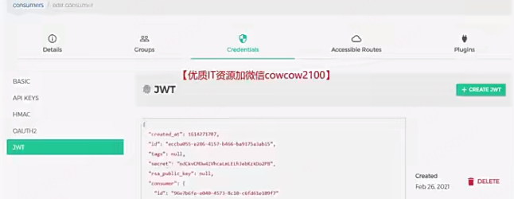
   2. 当你在 Kong 里：创建一个 Consumer（例如 web-user），给这个 Consumer 添加 JWT 凭证时，这个凭证只会应用在这个consumer下
   3. 你给它创建 JWT 凭证时，必须手动填：key = my-shop-key
      1. 这个key就是 JWT 里的 iss参数
      2. Kong 自动基于这个key生成：验签密钥secret = xxxxxx，附加在专属于consumer下的 JWT 凭证里，用于验签
   4. 原理：我发起一个带token的网关请求，它怎么知道我是属于哪个consumer，内部咋对应的？？？
      1. 请求带 Token → 网关 JWT 插件解析
         1. → 拿出 Token 里的 `iss = my-shop-key`
            1. 生成测试token时，也需要带上key去生成
         2. → 去数据库找：哪个 Consumer 的 JWT 凭证 key == my-shop-key
         3. → 找到了！就是 mxshop 这个用户
         4. → 用这个 Consumer 对应的 secret 验签
         5. → 验签通过 → 放行 
3. 配置全局的plugin：去往插件菜单中，添加一个全局插件，添加jwt插件
   1. 插件的配置界面配置个header头如x-token，和我们gin中代码保持一致这个名字
4. 在jwt.io在线生成个token，用于测试
   1. 生成时记得paylaod中添加iss值，和刚才生成的密钥
5. 现在出现个问题，api网关的jwt验证和ginweb-服务也有jwt认证，会出现api网关验证通过了，但是gin-web服务没有验证通过？？
   1. 因为两边的密钥不一致，所以验证不通过： Kong 创建 JWT 时，不要让它自动生成，手动填一个固定 secret
   2. 还有`jieduan3-0-1shixian-weifuwu-kuangjia/mxshop-api/user-web/api/user.go`的`Issuer:"imooc"`, 一定要与api网关中配置一样


#### 2-6 kong配置反爬和ip黑白名单

- 主要使用kong不同插件实现
- 常见插件及作用：认证 / 安全 / 流量 / 转换 / 可观测 / 日志 / 扩展七大块

一、认证鉴权
1. **jwt**：校验JWT令牌，网关统一登录鉴权
2. **key-auth**：API密钥认证，多用于服务间调用
3. **basic-auth**：账号密码简易认证
4. **oauth2**：三方授权登录

二、安全防护
1. **cors**：处理跨域请求
2. **ip-restriction**：IP黑白名单，控制IP / 网段黑白名单 → 访问权限
3. **ACL**：控制用户 / 组（admin/user/third）→ 接口权限
   1. ACL = 访问权限控制，控制哪些 Consumer（用户 / 客户端）能访问哪些服务 / 接口
   2. 用户分组：普通用户 / 管理员 / 第三方应用
   3. 权限隔离：
      1. 管理员 → 可访问所有接口
      2. 普通用户 → 只能访问业务接口
      3. 第三方 → 只能访问开放接口
4. 组合场景：
   2. JWT + ACL：登录后按用户组放行接口
   3. ip-restriction + ACL：
      1. 先 IP 过滤（只允许内网 / 办公网）
      2. 再 ACL 校验（只允许 admin 组）
5. bot-detection（机器人反爬）
   1. 作用：靠 User-Agent 识别爬虫 / 扫描器 / 恶意 Bot
   2. 原理：内置 200 + 规则库，匹配 UA 特征；可自定义黑白名单
   3. 配置
      1. allow：放行（如 Googlebot、Bingbot）
      2. deny：拦截（如 scrapy、sqlmap、curl、python-requests）
      3. 一句话：拦爬虫、扫描器，靠 UA 识别


三、流量管控
1. **rate-limiting**：接口限流，防刷防压
2. **request-size-limiting**：限制请求体大小
3. **proxy-cache**：缓存响应，减轻后端压力

四、请求/响应转换
1. **request-transformer**：增删改请求头、参数（透传用户信息核心插件）
2. **response-transformer**：统一修改返回数据、响应头

五、监控&链路
1. **prometheus**：暴露监控指标，对接监控平台
2. **correlation-id**：生成请求唯一ID，日志链路追踪
3. **zipkin/jaeger**：分布式链路追踪

六、日志
- **file-log / http-log**：请求日志落地、推送至日志平台

七、自定义扩展
- **function**：执行Lua自定义脚本，实现个性化逻辑

##### **实践演示**
1. 配置一个机器人反爬插件，添加到全局插件，也可以添加到consumer级别
   1. 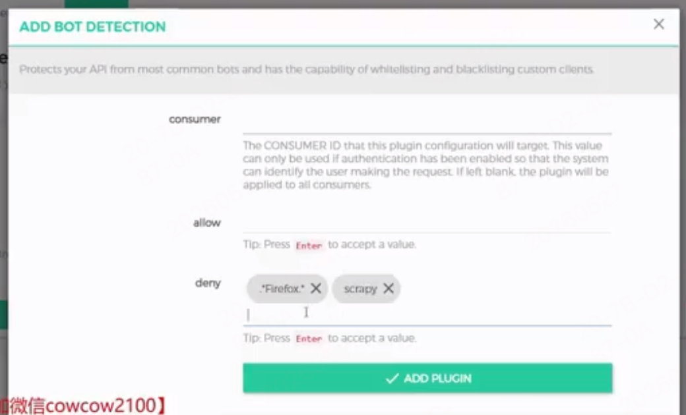
2. ip黑名单插件：
   1. 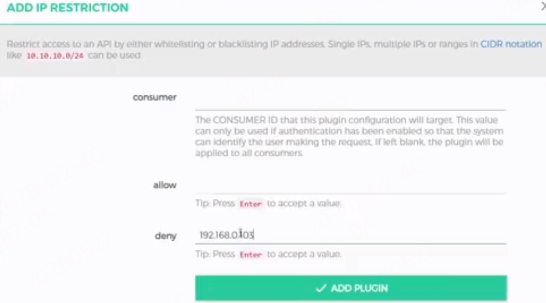

### 3章 jekins入门

#### 3-1 敏捷开发中的持续集成痛点
```js
敏捷开发：需求不固定，摸着石头过河，边做边调整
用户故事：老板只管提功能需求，具体实现全权交给研发
快速迭代：上线效果不佳，立刻调整页面与功能
用户痛点：收到用户投诉，马上针对性优化整改
拥抱变化：需求频繁变动，团队随时适配新想法
持续交付：版本问题不断，高频提测、反复交付，手动编译部署
结对开发：Bug 层出不穷，直接搭档协同现场联调
代码评审：代码交叉审核，问题追溯权责到人
弹性工作：上下班不硬性卡点，Bug 不修完不能下班
```

- Jenkins 诞生背景
  - CI 落地痛点
    - 早期敏捷推行持续集成，但手动编译、打包、测试、部署重复繁琐、效率低、易人为出错；多项目、多分支并行时，人工集成根本跟不上迭代节奏。
  - 前身起源
    - 最早源于 Hudson（Sun 公司开源 CI 工具），用于自动化构建、集成、测试，替代人工操作。
  - Jenkins 诞生
    - 后续社区分裂，开发者基于 Hudson 源码分支出新项目 Jenkins，完全开源、社区活跃、插件生态极强。
  - 核心定位
    - 专门解决持续集成 / 持续交付自动化问题，承接代码拉取、编译、检查、测试、打包、部署全流程，补齐敏捷 CI 环节的工具短板。

#### 3-2 安装jekins和关闭防火墙

- 部署痛点
  - 中小企业无运维，开发自己打包、上传、重启
  - 上线更新必须停服务，影响用户体验
  - 频繁部署，重复劳动多、易出错、效率低
- 为什么用 Jenkins
  - 配置一次，永久自动化
  - 代码提交 → 自动构建、自动部署
  - 不用停服务、不用手动操作
  - 开发省心、用户无感知
  - 非常适合中小企业、无专职运维团队
- 什么是jenkins
  - Jenkins是一个开源的、提供友好操作界面的持续集成(CI)工具，起源于Hudson(Hudson是商用的)，主要用于持续、自动的构建/测试软件项目、监控外部任务的运行这个比较抽象
  - Jenkins用Java语言编写，可在Tomcat等流行的servlet容器中运行，也可独立运行。通常与版本管理工具(git)、构建工具结合使用。常用的版本控制工具有SVN、GIT，构建工具有Maven、Ant、Gradle.
- 安装
  - **安装Jenkins一般都会单独安装在一个独立的虚拟机服务器上，不与业务服务器一起运行。**，给jekins单独配一套服务器。
  - 先安装java运行环境
  - 再下载jekins安装包rpm，进行安装。
    - 安装方式：原生 RPM（推荐，无坑）
    - 使用原生方式安装，先不用docker装，会有个小坑，嫌麻烦直接原生安装
  - 修改jekins配置文件
    - 改端口、用 root 运行避免权限问题
  - 开放防火墙 8080 端口，重启服务器
  - 启动jekins
    - 重新加载配置 + 启动 + 开机自启
    - systemctl daemon-reload
    - systemctl start jenkins
    - systemctl enable jenkins
  - 浏览器访问jekins
    - 获取初始管理员密码：`cat /var/lib/jenkins/secrets/initialAdminPassword`
    - 复制出来 → 粘贴到网页 → 下一步


#### 3-3 jekins构建服务器流程
- 下面解释了为什么jekins需要单独配套一个构建服务器，下面介绍了，构建服务器只管构建集成相关，业务服务器只接收一个镜像或最终包即可
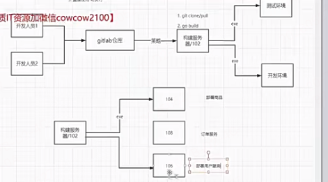


#### 3-x 概念总结
**jekins部署模式：**
1. 单节点模式（单机）
   1. 所有功能：Web 界面、调度、拉代码、编译、打包、部署，全在一台机器上跑。
   2. 又叫：独立节点、单 Master。
2. 分布式模式（主从 Master-Agent）
   1. Master（主节点）：只做 “调度 + 界面 + 管理”，不干活（不编译打包）。
   2. Agent（从节点 / 代理节点）：专门干活：拉代码、编译、测试、打包、部署。
   3. 一个 Master → 可以挂 N 个 Agent（Linux/Windows/macOS/ 容器都行）。------ 相当于gitlab的runner机
3. 延伸（云原生）：K8s 动态 Agent（弹性主从）
   1. Master 对接 K8s，任务来了自动创建 Pod 当 Agent，跑完自动销毁，资源利用率最高。


```js
系统	      单机	                           主从 / 分布式	                                                  核心区别
Jenkins	一个节点：Web + 调度 + 构建	       Master（调度）+ Agent（构建）	                                   主从 =调度和执行分离
GitLab	一个节点：Web+DB + 仓库 + Runner	   1. 服务：Web 集群 + DB 主从 + Gitaly 集群2. CI：GitLab Runner 集群	服务是分层分布式；Runner 才是执行节点
```

1. GitLab CI/CD 的 Runner（才是和 Jenkins Agent专门构建机器 对应的东西）

#### 3-4 安装jekins常用插件

1. 先修改插件下载地址、
   1. 修改default.json文件
      1. `sed -i 's/https:\/\/updates.jenkins.io\/download/http:\/\/mirrors.tuna.tsinghua.edu.cn\/jenkins/g' /var/lib/jenkins/updates/default.json && sed -i 's/http:\/\/www.google.com/https:\/\/www.baidu.com/g' /var/lib/jenkins/updates/default.json`
   2. 然后进入jekins页面的Manage Jenkins → Manage Plugins → Advanced，里将UpdateSite设置为http://mirrors.tuna.tsinghua.edu.cn/jenkins/updates/update-center.json
   3. 重启jekins，只需要在页面中输入http://192.168.0.104:8088/restart 重启
2. 安装常用
   1. 汉化插件
   2. ssh Credentials 插件
      1. 作用：专门用来在 Jenkins 里安全保存 SSH 远程服务器的登录凭证，替代明文写账号、密码、私钥
      2. 统一管理：一台 Jenkins 对接多台服务器时即SSH Credentials 添加一台 / 多台服务器登录信息，凭证只配置一次，所有任务复用。
      3. 后续所有需要 SSH 登录远程机器的插件 / 任务（SSH Plugin、Publish Over SSH 等），都直接引用这里的存储的凭证，不用重复填账号密码。
   3. ssh插件：会 SSH 的命令行工具
      1. 基于 SSH 协议，调用已保存的凭证，远程登录目标服务器，并执行操作，是真正干活的插件。
      2. 主要能力
         1. 远程执行 shell 命令
         2. 简单文件上传（SCP）
      3. 特点
         1. 配置简单、轻量
         2. 没有专门的 “构建后发布” 界面
         3. 不适合复杂的 “打包→上传→部署” 流水线
      4. 典型场景：主要放在「构建步骤」里的命令脚本作为命令使用。
         1. 构建前在远程服务器清个目录
         2. 执行一句简单命令（重启、备份）
         3. 一句话：SSH 插件 = 远程命令工具
   4. Send build artifacts over SSH 插件
      1. 能干啥：基于ssh插件做的封装好的一套发布工作流
         1. 专门做构建产物上传（SFTP/SCP）
         2. 【构建后操作】步骤直接集成这个插件
         3. 传文件 + 执行命令一体化
         4. 全局统一管理多台服务器，项目里直接选
   5. git插件：让 Jenkins 能拉取 / 管理 Git 代码，并支持自动触发构建
3. 大致流程
   1. 开发 push 代码到 GitLab → WebHook 触发 Jenkins。
   2. Git 插件 → 拉取最新代码到 Jenkins 工作空间。
   3. Jenkins 编译 / 打包（如 jar、docker 镜像）。
   4. SSH 插件 → 用 SSH Credentials 凭证登录生产服务器。
   5. 上传包、停止旧服务、启动新服务 → 完成部署。
#### 3-5 通过freestyle构建项目的基本步骤流程

1. 新建自由风格项目即默认简单模式
2. 源码管理配置 Git，绑定仓库与凭证
   1. 在 Jenkins 里，SCM 就是指Source Code Management（源码管理）
   2. 你在页面点构建 →代码自动拉到：`/var/lib/jenkins/workspace/你的项目名/`
3. 设置构建触发器（轮询 / WebHook）
4. 配置构建环境（可选）
5. 添加构建步骤，执行编译 / 打包
   1. 编写shell脚步命令
6. 构建后操作：SSH 上传文件、远程部署到业务服务器上
7. 保存配置
8. 手动触发构建，查看运行结果

#### 3-6 将构建服务器上的代码上传到运行服务器上

- 看下如何把构建好的代码自动上传到运行服务器上并运行
- 主要是在构建后操作这个步骤中去设置
- 需要先安装个插件：`Send build artifacts over SSH`
  - 这个插件是jekins链接linux系统的时候使用的，以下针对插件的每个属性进行说明
- 然后在构建后步骤中选择这个插件的选项，直接配置`ssh server`,
  - `ssh server`的列表默认空，需要单独去另个配置管理页面添加ssh server列表，配置我们的一些业务服务器
  - 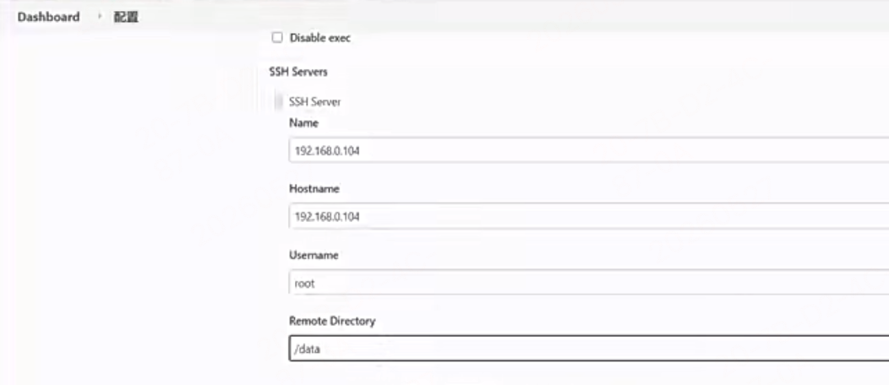
  - 选择后还需要配置`ssh server`的属性
    - name：系统配置里提前配好的远程服务器
    - Source files：你要把 Jenkins 里的哪些文件，传到远程服务器
      - 相对于当前项目的「工作空间」根目录，不需要写绝对路径，只写相对路径！
      - 你的项目在 Jenkins 里的目录是：`/var/lib/jenkins/workspace/你的项目名/`,Source files 就是从这个目录开始找文件！
      - 如前端写法：`dist/**`
    - Remove prefix = 不传目录,只传文件，不传目录结构
      - 如果你传 target/*.jar，但不想在服务器创建 target 文件夹
      - 这里就填：target
    - Remote directory = 服务器路径
      - 最终路径 = 服务器登录后的默认目录 + Remote directory
    - Exec command = 上传完运行


#### 3-7 通过pipline实现持续集成

> pipline模式相比freestyle模式更高级一些门槛高一些。

- 之前安装git插件后，新建任务时，会自带一个流水线pipline出来，我们可以基于这个pipline，实现持续集成
- 把你之前在 Freestyle（自由风格）页面上点来点去的配置，变成一段代码，存进项目里，可版本管理、可复制、可复用。
- 用pipline流水线时，还需要再装一个插件：`pipline`插件

- Jenkins Pipeline 是Jenkins 自己实现的流水线插件，基于 Groovy 实现的 CI/CD 专用 DSL（领域专用语言）
- 主要分两种写法：
  - 1. Declarative Pipeline（声明式，推荐 99% 用这个）,像写配置文件一样（如travis.yml、gitlab-ci.yml）
  - 2. Scripted Pipeline（脚本式，老版本用）
- 优点
  - 1. 代码即配置
    - 构建流程写在代码里，提交到 Git，不会丢失。
  - 1. 可复用、可复制
    - 一个项目的流水线，复制到另一个项目直接用。
  - 1. 流程可视化
    - 每一步构建都能看到：
  - 拉代码→编译→扫描→打包→上传→部署
    - 哪一步错了一目了然。
  - 1. 支持复杂逻辑
    - 多环境、多服务器、并行构建、条件判断……
    - Freestyle 做不到的，Pipeline 都能做。
- 然后点击流水线任务里进去一行行配置，主要是配置流水线的脚本
```groovy
// 例如在pipeline的流水线配置项里选的Pipline script模式，直接在页面里书写配置的
pipeline {
    agent any
    stages {
        stage('拉代码') {
            steps {
               // git插件提供的方法
                git url: 'https://gitee.com/xxx/xxx.git', 
                    branch: 'main', 
                    credentialsId: '你的凭证ID'
            }
        }

        stage('编译') {
            steps {
                sh 'mvn clean package -DskipTests'
            }
        }

        stage('发布') {
            steps {
            // Publish Over SSH插件提供的方法
                sshPublisher(publishers: [sshPublisherDesc(
                    configName: '你的服务器名',
                    transfers: [sshTransfer(
                        sourceFiles: 'target/*.jar',
                        removePrefix: 'target',
                        remoteDirectory: '/opt/app'
                    )],
                    execCommand: '''
                        cd /opt/app
                        pkill -f app.jar
                        nohup java -jar app.jar > run.log 2>&1 &
                    '''
                )])
            }
        }
    }
}
// 这些插件对应的语法，可以直接方便地在jekins转化页面中，通过默认freestyle模式插件输入框输入，生成对应的脚本
```
#### 3-8 通过jekinsfile管理构建pipline脚本


- 直接在项目根目录下创建一个jekinsfile文件，内容与上面的pipeline页面脚本内容一样，
- 然后pipeline的流水线配置项里，选择Pipline Script From SCM，选择SCM为Git，填写项目地址，选择分支，选择jekinsfile文件，保存。


#### 3-9 通过远程和其他工程触发构建

前面的演示中，都是创建任务后，自己手动点击进行构建的，我们这节演示下通过钩子自动触发构建
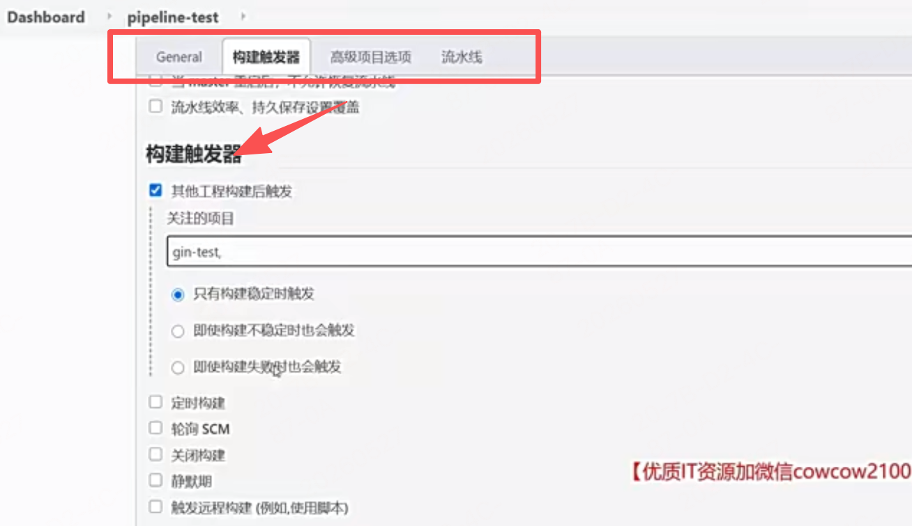

流水线的配置中【构建触发器】，有哪几种类型，下面逐一讲解：
- 1. 通过远程触发
  - 1. 通过 Jenkins API
    - 通过 Jenkins API，可以调用 Jenkins 的 REST API，实现远程触发构建。
  - 1. 通过 Jenkins Webhook
    - Jenkins Webhook 是 Jenkins 提供的一种触发构建的方式，可以将 Jenkins 与外部系统集成，实现远程触发构建。
- 2. 通过其他工程触发构建

#### 3-10 定时构建和轮询scm构建
流水线的配置中【构建触发器】，接着讲剩余2种类型，下面逐一讲解：
1. 定时构建：需要使用专门的定时构建语法编写页面上的配置
2. 轮询scm构建：定时去 Git 检查代码有没有更新，有更新才构建，没更新就不构建。

#### 3-11 参数化pipline构建项目
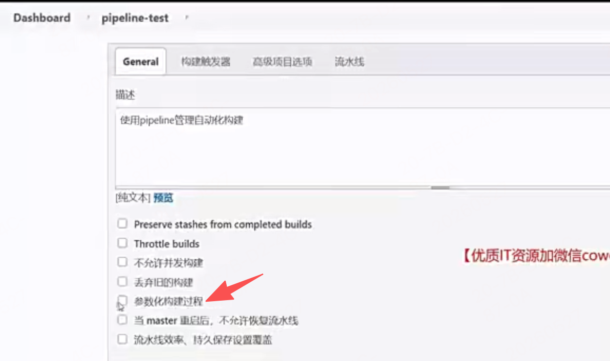
- 勾选后，选择字符参数进行配置，填写key-value
- 相当于设置好流水线json里的环境变量
- 在项目源码的流水线json里使用这些环境变量：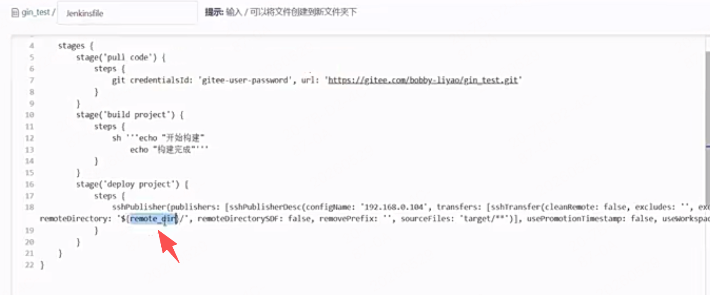
### 4章 通过jekins部署服务

#### 4-1 有哪些服务器我们需要部署？
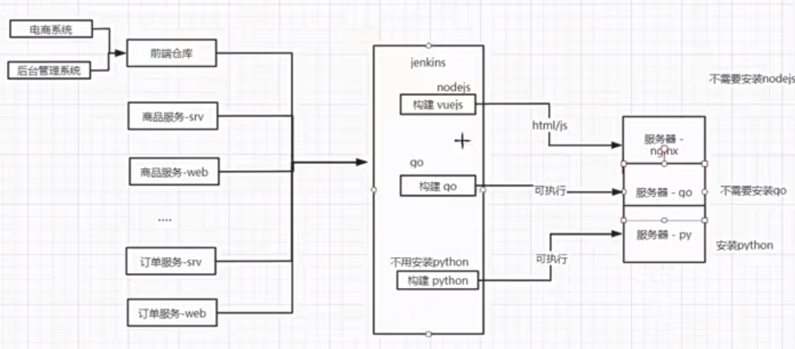
1. 前端服务器一般用nginx提供服务，不需要安装nodejs
2. 后端服务器不用安装go
3. 后端python项目服务器，需要安装python，因为它要在服务器上执行源码

#### 4-2 前端代码上传到git并启动

1. 测试：在构建服务器上git clone我们前端代码，下来并nodejs构建
2. 下节讲如何部署到nginx去

#### 4-3 nginx中部署前端项目

1. 在业务服务器中，用docker安装启动nginx
   1. 把html资源，配置文件，直接挂载到宿主机上，并启动nginx
2. 把前端dist源码部署到上面的nginx资源目录中
   1. 视频中是通过winscp直接上传的
#### 4-4 jekins部署前端项目

- 就是通过jenkins流水线实现自动构建部署到业务服务器中
- 在前端项目仓库下会建个jenkinsfile文件，里面写好构建和部署的脚本

#### 4-5 通过go build构建go微服务

1. 首先需要在jenkins的构建服务器上安装go环境，实现直接使用go能找到命令，中间需要设置linux的环境变量
2. jekins流水线执行时找不到go命令，只能在构建流水线中的shell脚本在显示设置下go的环境变量和环境准备工作，如开启go module模式
3. 然后先构建好目录结构，每个项目对应一个服务器上的目录下，然后必须打开目录文件权限
   1. 因为本地测试中发现直接执行打包好的可执行文件会报错：报找不到配置文件，所以额外给他创建一个目录，并复制配置文件过去，然后可执行文件在这个目录中执行就可以了
4. 准备好了后，执行构建，看构建是否成功
```shell
# shell脚本大致如下
# ======================
# 1. 配置 Go 语言环境变量
# ======================
echo "===== 配置 Go 环境变量 ====="
export GOROOT=/usr/local/go
export PATH=$PATH:$GOROOT/bin

# 验证是否生效
go version

# ======================
# 2. 配置 Go module 代理
# ======================
echo "===== 配置 Go module 代理 ====="
go env -w GO111MODULE=on
go env -w GOPROXY=https://goproxy.io,direct

# ======================
# 3. 准备目录结构 & 赋权
# ======================
echo "===== 准备目录结构 ====="
chmod 777 -R goods_srv/
mkdir -vp goods-web/target/goods-web

# ======================
# 4. 复制配置文件 ---- 因为本地测试中发现直接执行打包好的可执行文件会报错：报找不到配置文件，所以额外给他创建一个目录，并复制配置文件过去，然后可执行文件在这个目录中执行就可以了
# ======================
echo "===== 复制配置文件 ====="
cp goods-web/config-pro.yaml goods-web/target/goods-web/config-pro.yaml

# ======================
# 5. 进入目录编译
# ======================
echo "===== 开始编译 Go 项目 ====="
cd goods-web
go build -o target/goods_web_main
```

#### 4-6 发布go项目到远程服务器上

- 接着前面的操作，配置构建后操作的步骤
- 细节注意点
  - 构建后把代码上传到远程服务器后，会出现权限不足的问题
  - 需要在执行命令配置项中执行：`chmod +x /docker/golang/goods-web/target/goods_web_main`
    - 给上传到远程服务器上的 Go 可执行文件加「可执行权限」
#### 4-7 通过shell脚本启动gin服务

上节遗留的问题，不能直接在构建后执行的命令中，直接启动可执行文件，我们应该在微服务项目中单独维护一个start.sh脚本，然后把可执行文件上传到远程服务器，并执行该脚本，启动服务，因为启动包含了一些逻辑判断，如后台运行，杀死上个进程等等

- 脚本参考`jieduan3-0-1shixian-weifuwu-kuangjia/mxshop_srvs/goods_srv/start.sh`

### 5章 课程总结和未来方向

#### 微服务架构演进路线

单体应用 → 微服务 → 服务网格(Service Mesh) → 云原生(Serverless)

1. 单体应用（All in one）
   1. 所有功能写在一个项目里
   2. 优点：简单、部署快
   3. 缺点：无法扩容、牵一发动全身、大项目卡死
2. 微服务（核心阶段）
   1. 按业务拆分成多个服务
   2. 独立开发、独立部署、独立数据库
   3. 技术栈：Go、Java、gRPC、HTTP、MQ、注册中心、配置中心
3. 服务网格 Service Mesh（基于 K8s）
   1. 把流量治理、限流、熔断、链路追踪从业务代码剥离
   2. 代表：Istio
   3. 特点：无侵入、统一治理、企业级高可用
4. 云原生 & Serverless
   1. 不用关心服务器
   2. 自动扩缩容、按调用收费、极致弹性
   3. 代表：阿里云函数计算、AWS Lambda

#### 课程重点内容
1. grpc
   1. go语言中用的最多，生态最好的rpc框架
2. 分布式问题:
   1. 分布式锁
   2. 分布式事务
   3. 链路追踪等


#### 其他问题

1. 为什么不使用已有的微服务框架
   1. 弄清楚细节
   2. 现有的微服务框架没有像springcloud一样一统的框架
   3. 自己搭建后去学习和使用其他的微服务框架很容易
   4. 课程中用到的组件即使你不是微服务开发也以在你的系统中使用到，比nacos，sentinel,jaeger等都有很大的用途
2. 现有的微服务框架
   1. go-micro:V3版本已经开始往云原生开发了
   2. go-zero
   3. dubbo-go
   4. motan-go
   5. rpcx
   6. 未来微服务形态的框架
      1. istio:多语言，服务网格的框架
      2. dapr:多语言云原生的项目使用多
3. 有缺点
   1. 优点:
      1. a.代码分离，技术栈独立
      2. b.部署独立
      3. c.独立性能优化
   2. 缺点:
      1. a.门槛高
      2. b.引入组件多
      3. c.链路长，性能受损I
      4. d.多出来了分布式系统的问题
      5. e.版本管理问题
      6. f.微服务不等于高性能
   3. 如何选择
      1. a.看情况使用1
      2. b.项目相互依赖，开发人员多，项目大就可以考虑使用
      3. c.项目小就别用了
4. 接下来学习 k8s的优点
   2. 能不侵入代码就解决链路追踪的问题
   3. 能不自己写负载均衡代码
   4. 能不自己写服务注册和发现
   5. 各个微服务能自己用其他语言写