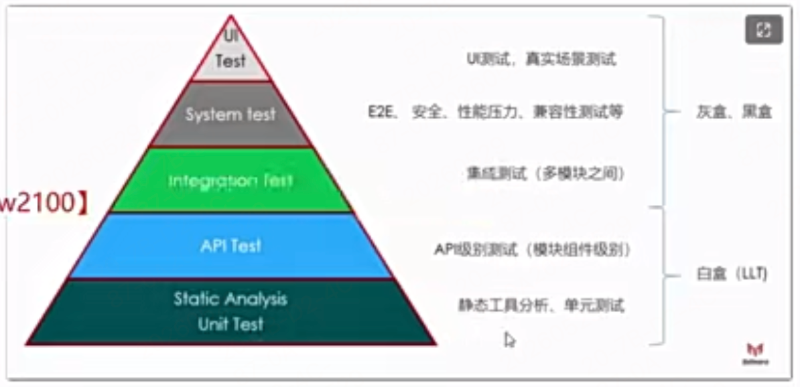

# 阶段6 开发规范设计模式单元测试
## 21周 开发规范和go基础扩展
### 1章 开发规范
#### 1-1 后续学习前的思维介绍

之前算是广度，接下来是重点深度能力，学习工程化思维和技术深度
#### 1-2 课程要用到的基本开发工具说明

1. go在1.18后提供了2个重要的功能：模糊测试和范型，我们后面基于最新版本学习，也会讲新语法

#### 1-3 项目开发有哪些规范要遵守
5. go·微服务代码目录规范
   1. a.微服务项目和单体服务的目录不同点
   2. b.微服务应该如何管理目录
   3. 6.代码发布规范
6. a.go项目的发布步骤
   1. i.静态代码扫描。
   2. i.代码自动格式化
   3. i.代码自动运行单元测试
   4. iv.go vet检查竞态
   5. v.自动编译
   6. vi.镜像上传

#### 1-4 项目开发流程
略
#### 1-5&6 git代码分支管理&commit规范
#### 1-7 go的代码规范

> uber开源的代码规范:https://github.com/xxjwxc/uber_go_guide_cn
- 代码规范一下全部接受不容易，经常看，养成习惯即可
- 规范不代表权威，某个规范自己思考一下，不一定就正确，要结合自己的需求具体情况具体分析
- 简单给大家介绍几个
  - 零值Mutex是有效的
  - erors比较重要，后面有专门的章节讲解
  - 这里有一些我们后面会有专门的章节讲解，所以建议大家学习完课程以后再来看一下这里的规范
- 下吗是uber的代码规范示例：
```go
// 结构体实现接口的代码规范
type Handler struct {}
// 提前用这个赋值语法，判断是否满足接口
// 解释：我要把一个 *Handler 类型的 nil 指针，赋值给 http.Handler 接口，看下是否报错
var _ http.Handler = (*Handler)(nil) // *Handler是指针类型，后面的括号：是类型强转语法，将nil转化类型为*Handler，跟int(64)一样
func (h *Handler) ServeHTTP(w http.ResponseWriter,r http.Request){}
```

#### 1-8 go目录规范

很多目录规范是随着某个框架而确定的，并不是语言本身可以决定目录规范，比如python中的django目录，java的spring目录规范，但是go目前还没有出现spring一样一统天下的框架，所以目录规范也并不统一，但是在某种程度上还是有大家的共识的，
> 我们以uber的目录规范来做一下说明。参考: https://github.com/golang-standards/project-layout/blob/master/README_zh.md

1. Go 项目根目录下不要自己建 /src，那是 Java 习惯，在 Go 里会乱掉路径和工具链。
   1. Go 原本工作区就有`$GOPATH/src/`,项目里再搞一个 src就不合适
#### 1-9 微服务该采用monorepo还是多个repo？
#### 1-10 微服务的项目目录规范
```js
项目根目录
├── api          # 专门放所有服务对外暴露的接口,接口定义：proto 文件、API 文档、swagger
├── app          # 所有微服务的核心业务代码（每个服务一个文件夹）
│   ├── order    # 订单服务
│   ├── user     # 用户服务
│   └── pkg      # 服务内部公共包
├── build        # 构建脚本：Dockerfile、构建配置
├── cmd          # 项目启动入口（main 函数所在），每个服务一个启动入口
├── configs      # 配置文件：yaml、toml、json
├── docs         # 文档：设计文档、接口文档
├── internal     # 【全局私有包】整个项目能用，不是开源给外部用的，外部不能引用 import
├── init         # 系统初始化脚本：systemd 脚本
├── pkg          # 全局公共库，公共的（外部可 import）（所有服务都能使用），工具、通用组件，希望开源 / 给别人用
├── scripts      # 运维脚本：启动、停止、部署、打包
├── test         # 测试文件：压力测试、集成测试
├── third_party  # 第三方依赖、私有库，不通过 go mod 管理的私有包
├── tools        # 工具类：代码生成、脚本工具
├── examples     # 示例代码
└── go.mod        # Go Module 依赖管理
```

#### 1-11 govet进行代码检测

- go内部官方提供的静态代码分析工具是`go vet ./main.go` go vet 专门检查 编辑器 / 编译器 检查不出来 的错误
- 静态：静态分析（go vet）
  - 不运行代码
  - 只扫描代码文本
  - 编译前 / 编译中检查
  - 发现潜在风险
  - 速度极快
#### 1-12 golangci-lint进行代码检测
golangci-lint = Go 语言的静态代码检查集成工具，比go vet 更加强大，类似于eslint

- 特点：
  - 不运行代码 → 纯静态分析
  - 集成了几十种 linter
    - go vet
    - golint
    - staticcheck
    - errcheck
    - unused
    - 等等...
  - 速度快、配置简单、可自定义规则
  - 企业级 Go 项目标配
- 看下如何集成到编辑器本地环境和项目中
  - 可以在编辑器中的save保存文件时的钩子中设置运行golangci-lint，到时候自己搜
  - 本地项目中创建.golangci.yml文件，编辑器钩子和项目中运行时都基于项目级配置运行
### 2章 go基础知识扩展

主要讲下go开发中容易犯的错 和一些新特性

#### 2-1 map初始化容易犯的错

```go
// 错误代码
var course map[string]string
course["name"]="go体系课"


// var course map[string]string 只声明了 map，值是 nil（空指针）
// 对 nil map 赋值 直接 panic：assignment to entry in nil map
// slice 可以不用 make 直接用（自动扩容），但 map 必须手动 make 初始化
// 1. 必须 make 初始化 map，slice不用初始化
course := make(map[string]string)
// 2为什么？
// map 本质是个指针，只要经过 make 初始化，就不再是空指针！，它会变成一个指向真实哈希表内存的有效指针
// slice 本质是结构体，零值合法，append 能自动扩容。
```
#### 2-2 常见错误：结构体的空指针
```go
type User struct {
    Name string
}

func main() {
    // 只声明指针，没初始化 → u = nil----- 直接变成空指针，使用就报错
    var u *User

    // 错误！空指针访问字段 → 直接崩溃！
    u.Name = "张三"
}

// u 是 nil 指针，没有指向任何内存
// 你让它去找 Name 字段 → 找不到 → 程序直接挂！
 // 正确 2：字面量初始化
    u2 := &User{}
```

- 空指针不能点，一点就崩溃！
- map 要 make，结构体指针要 new！
- 只有 slice 特殊，nil 也能 append！
#### 2-3 常见错误-使用对循环迭代器变量的引用

```go
// 错误场景1:
package main
import "fmt"
func main() {
	var out []*int
	// for循环的临时变量会复用
	for i := 0; i < 3; i++ {
		out = append(out, &i) // 把 i 的地址存进去
	}
	for _, value := range out {
		fmt.Println(*value) // 打印出来全是 3！
	}
}
// 运行结果: 3 3 3 ---- 严重的错误！！！
// 正确写法：
package main
import "fmt"
func main() {
	var out []*int
	for i := 0; i < 3; i++ {
		// 关键：创建一个新临时变量，每次都分配新地址
		x := i
		out = append(out, &x)
	}
	for _, value := range out {
		fmt.Println(*value)
	}
}

// 原因：for 循环里的变量 i 只有一个，地址永远不变，每次循环只是修改它的值！
// 你存的永远是同一个地址，最后 i=3 退出循环，所以打印全是 3。

// 错误场景2: 如果直接在协程里用，所有协程都会读到最后一个值！
for _, id := range goodsID {
	// 错误！直接在闭包里用循环变量 id
	go func() {
		fmt.Println("正在查询商品:", id)
	}()

    // 正确解法1:传参形式
	go func(id uint64) {
		fmt.Println(id)
	}(id)


    // 正确解法2：临时变量形式
	// 关键：循环内新建临时变量！
	newID := id  
	go func() {
		// 直接用 newID，完全安全！
		fmt.Println(newID)
	}()
}

```

#### 2-4&5 什么是范型
go的1.18版本开始，go支持泛型。

跟ts一样，go中的范型传参语法是用[]中括号包裹的，ts是<>包裹的

- 代码详见`jieduan6-开发规范设计模式单元测试/generics/main.go`
```go
package main

import "fmt"

func Add[T int | float64](a, b T) T {
	return a + b
}

func main() {
	// 自动推导出 T=int，
	fmt.Println(Add(1, 2)) 
    // 也可以指定参数类型
    fmt.Println(Add[int](1, 2))

	// 自动推导出 T=float64
	fmt.Println(Add(1.1, 2.2)) 
}


// 这是范型出现之前的老版麻烦写法
func IAdd(a, b interface{}) interface{} {
	switch a.(type) {
	case int:
		return a.(int) + b.(int)
	case int32:
		return a.(int32) + b.(int32)
	case float32:
		return a.(float32) + b.(float32)
	case float64:
		return a.(float64) + b.(float64)
	}
	return nil
}

func main() {
	fmt.Println(IAdd(1, 2))
	fmt.Println(IAdd(1.1, 2.2))
}
```

#### 2-6 范型的常见用法

范型不仅用在函数中，也可以用在其他类型中

- 代码详见`jieduan6-开发规范设计模式单元测试/generics/ch02`
#### 2-7 范型的错误用法

- 代码详见`jieduan6-开发规范设计模式单元测试/generics/ch02`中的错误用法常见约束

## 22周 设计模式和单元测试

### 1章 设计模式

#### 1-1 为什么需要函数选项模式

- 见`jieduan6-开发规范设计模式单元测试/pattern/ch01/main.go`

1. Go 语言确实不支持像 Python、C++ 或 JavaScript 那样直接在函数签名中写默认值的语法
   1. Go 语言设计哲学的一部分。Go 的设计者（如 Rob Pike）认为，显式优于隐式,隐含的默认值导致代码行为难以预测
2. 在 Java 或 Python 中，我们可以通过方法重载或默认参数来解决构造函数参数过多的问题。但在 Go 中：
   1. 没有构造函数重载：你不能写多个同名但参数列表不同的 NewXXX 函数。
   2. 没有默认参数：函数签名必须固定。
3. 函数选项模式就是为了解决这个问题而生的。

#### 1-2 kratos和grpc中如何使用函数选项模式

就是讲了下他们俩源码中如何用函数选项实现的功能

#### 1-3 如何实现函数选项模式

- 见`jieduan6-开发规范设计模式单元测试/pattern/ch01/main.go`
#### 1-4 单例模式和sync.Once原理

- 见`jieduan6-开发规范设计模式单元测试/pattern/ch02/main.go`
#### 1-5 简单工厂模式
- 见`jieduan6-开发规范设计模式单元测试/pattern/ch03/main.go`
#### 1-6 抽象工厂模式
- 见`jieduan6-开发规范设计模式单元测试/pattern/ch03/main.go`
#### 1-7 责任链模式
- 见`jieduan6-开发规范设计模式单元测试/pattern/ch03/main.go`
gin中的洋葱中间件模式执行的行为，就是一个最简单的责任链模式
### 2章 单元测试

#### 2-1 测试金字塔是什么


- unit Test:单元测试(最容易被忽略，也是最重要的，核心业务逻辑一定要写完善的单测用例，非核心业务看你心情吧)
- API Test:比如测试商品查询接口(yapi点一点，或者写个http代码工具，或者写个grpc的client脚本)集成测试:下单接口除了需要数据写入以外还需要查询商品，查询用户等大量接口(这是集成，一般也可以写一些脚本)
- UI测试:简单暴力的人工点击查看(有条件的写selenium脚本去检测页面元素和值一般只针对稳定的业务)

- 一般小公司中粗糙的测试方式：
  - API级别的测试(通过yapi进行接口测试)
  - 页面上点几下(UITest)
- 实际上很多隐含的问题需要在unit Test下进行，也就是单元测试，单元测试能发现90%的问题，这些问题有部分在api级别很难发现。

- 上线前的准备工作：
  - 每次上线，是不是心惊胆战:
    - a.我的新功能不会有bug吧
    - b.我改的代码不会影响原来的正常业务吧(这个是最怕的谁来帮你保证原来的业务逻辑没有问题:当然是你以前写过的测试用例，不管是单元测试还是集成测试，所以上线前你要经历测试用例跑一遍，但是跑用例也分两种情况:
    - 跑部分用例还是所有用例都跑一遍。所有用例都跑一遍是“回归测试”，但是跑一遍费时费力，所以具体情况要具体分析，开发人员得自己评估
  - 代码上线需要经过一系列的CI工作
    - 代码分析:
      - golangci-lint
      - go format 代码格式化
      - data race竞态检查
    - 代码测试
      - 单测代码跑一下
      - 集成测试跑一下
      - 回归测试跑一下
      - 自动生成一份测试报告
        - 比如测试用例没有通过，代码覆盖率不足等都可以打回不跑接下里的逻辑
    - 打镜像：通过dockefile打镜像
- 开发者测试，利在当下赢未来
#### 2-2 简单回顾下测试用例

- 见`jieduan6-开发规范设计模式单元测试/utest`

#### 2-3 如何写出方便测试的代码

- 见`jieduan6-开发规范设计模式单元测试/utest/ch01/main.go`

比如gin的用户服务中，想测试下UserServer模块中CreateUser创建用户的方法逻辑，原来的写法耦合外部依赖比较严重，比如直接在方法里面用全局变量获取的gormDB客户端对象，----- 这样不方便测试和解耦不好，可以采用代码分层和依赖注入解耦的方式去实现业务函数，同时方便单元测试

```js 常见逻辑分层
业务层（UserServer）
   ↑
数据接口层（UserData）
   ↑
数据实现层（MySQL / Redis / Mock）
```

- 这种分层解耦的业务方法进行单元测试优势
  - 不依赖真实数据库，测试速度极快、稳定
  - 可自定义返回数据，覆盖正常 / 异常场景
  - 不污染生产数据
#### 2-4 通过gomock进行测试用例编码

- 见`jieduan6-开发规范设计模式单元测试/mock/user.go`

1. 先安装 gomock工具
   1. go get -u github.com/golang/mock/gomock
      1. gomock 是代码里 import 的库 → 用 go get
   2. go install github.com/golang/mock/mockgen
      1. mockgen 是生成 mock 代码的命令工具 → 用 go install
2. 当我们在user.go里定义了业务层和数据接口层后，就可以直接使用gomock生成mock代码了
   1. mockgen方法主要自动生成这个相关的接口类型对应的鸭子类型方法实现，能进行调用响应mock结果
3. `mockgen -source user. go -destination=./mock/user. go -package=mock`
   1. 就在`jieduan6-开发规范设计模式单元测试/mock/mock`中生成了user.go mock文件。
   2. 我们就可以基于这个写测试文件：`user_test.go`
4. 易混淆细节
   1. 真正做单元测试时，是测你的业务逻辑，这个mock数据功能只是对你的外部依赖的一个mock，你还得拿这个mock的数据继续进行真正的业务逻辑测试才对
      1. mock的外部接口的响应数据只是你后续单元测试的一个参数，你得拿这个数据进行真正的业务逻辑测试才对

#### 2-5 通过sqlmock对gorm进行单元测试

1. 安装`go get github.com/DaTa-DOG/go-sqlmock`
2. 接着见`jieduan6-开发规范设计模式单元测试/mock/mysql/user.go`
3. 然后用`jieduan6-开发规范设计模式单元测试/mock/mysql/user_test.go`进行gorm的mock
   1. 对gorm数据库sqlmock，需要考虑怎么写期望，这个不能简单的写期望业务函数的输入输出期望了，还得写对sql的期望，下节讲怎么写sqlmock期望

#### 2-6 通过ExpecctExec()和assert判断测试结果
1. 继续完善`jieduan6-开发规范设计模式单元测试/mock/mysql/user_test.go`进行gorm的mock
2. 有一个专门用来做断言的包：`github.com/stretchr/testify/assert`
   1. 省去了，手写`if err != nil {`ifelse的结果判断

#### 2-7 如何对grpc，redis和rocketmq进行mock测试

1. 对http服务进行mock：用yapi服务mock即可
2. grpc服务，在proto生成编译后的源码时会自动帮我门生成grpcClient客户端的接口，我们只要用`mockgen`对这个接口进行mock生成即可
   1. 这是对grpc服务的mock，mock下grpc服务数据，真正做单元测试时，是测你的业务逻辑，mock数据只是对你的外部依赖的一个mock
3. redis测试，也有专门redis的mock工具`go-redis/redismock`,用法和gorm的sqlmock类似，到时候直接查阅
4. rocketmq和kafka等外部依赖，如果没有专门的mock工具，我们可以自己抽象下接口，用mockgen生成测试

#### 2-8 gofuzz模糊测试
go1.18才出的功能模糊测试

- 见`jieduan6-开发规范设计模式单元测试/fuzz/fuzz_test.go`

#### 2-9 解决模糊测试发现的bug及testData目录用途
有点没听懂，需要再回顾
#### 2-10 通过gomonkey进行单元测试

- 这是一种动态mock的技术，不会事先生成代码,解决了一些前面mockgen的不足，
  - 前面mockgen方法不足：只能自动mock接口实现，不能mock任何内部函数
  - 不需要mockgen那样事先生成代码，对目前代码没有侵入性
- 代码示例见`jieduan6-开发规范设计模式单元测试/monkey/monkey.go`

monkey这个猴子补丁（运行时补丁）概念：可以允许我对任何函数和接口和全局变量进行mock，不用去必须实现函数的接口

- 核心原则
  - 接口优先（gomock），非接口兜底（monkey）
  - 新代码一律接口化、gomock；老代码 / 第三方用 monkey
- monkey 强规范（防止滥用）
  - 范围最小化：只 mock 必须 mock 的那个函数 / 方法，不搞全局替换
  - 必须 Unpatch：每个用例 defer guard.Unpatch()，避免交叉污染
  - 禁止并行：带 monkey 的用例 t.Parallel() 必须关掉
  - 不校验交互：monkey 只改返回值，不指望用它断言调用次数 / 顺序（这是 gomock 的事）
  - 文档标注：用 monkey 的地方加注释，说明 “为什么不能用接口”
#### 2-11 ginkgo 测试框架快速入门

- 之前写的测试用例都属于下面的TDD，有些局限性：
```js
TDD表格驱动测试
- table-driven（表格驱动测试）：把所有用例放进一个切片里，循环执行

当涉及复杂的业务相关的单元测试, 此时

用例复杂, 输入可能是多层嵌套的struct, 某一层的某个变量的值影响输出
用例数量多, 某个函数可能有5个以上的用例
由于table-driven（表格驱动测试）的表达能力有限:


如何复用输入结构体? (当前情况开发会复制粘贴过去改)
name过于简单不被重视, 导致单元测试失败时难以快速阅读

最终带来的问题是:

单个用例构造复杂, 可能是十几行甚至是几十行;
用例和用例之间没有复用, 基本基于复制粘贴;
难以区分用例之间的差异
用例过多导致难以维护, 不能明确知道每个用例的目的, 用例和用例之间的差别;
单个测试集过大, 可能有几百行测试代码;
```
- **Table-Driven（表格驱动测试） 只适合 “数据驱动” 的用例，
  - 不适合 “mock 复杂、行为不同” 的用例！**
  - 你的业务：
  - 每个用例要写不同的 mock.EXPECT().Xxx().Return()
  - 每个用例依赖不同的打桩
  - 每个用例是不同的业务场景
  - 表格驱动根本不适合这种场景！强行用，就会变成你说的：构造复杂、复制粘贴、分不清差异、难以维护
- BDD 就是为了解决 表格驱动搞不定的复杂测试 而生的！，解决上面痛点，发展出了一个BDD规范的测试框架
  - BDD = 用自然语言写测试 → 结构化、可复用、易读、易维护
    - 更注重测试用例的结构化分层，分类
    - BDD 是一套通用规范，所有语言的测试框架都长这样！
      - Ginkgo 的语法就是借鉴了 Node.js 里的 Jest / Mocha / Chai！几乎是一模一样的 BDD 风格！
        - Go：Ginkgo
        - Node.js：Jest, Mocha
        - Java：JUnit 5, Cucumber
        - Python：pytest-bdd
  - goconvey
  - ginkgo

- 示例代码见 `jieduan6-开发规范设计模式单元测试/ginkgo/ginkgo_test.go`
  - 示例代码它完美融合了三大工具：
    - Ginkgo = BDD 测试框架
      - 结构化
      - 可复用
      - 易读
      - 易维护
    - gomock = 接口 Mock（主力）
    - gomonkey = 非接口 Patch（补充）
- 测试演进
  - 测试层面：原生单测 → Table-Driven → Ginkgo (BDD) + gomock + monkey
  - 解决：复杂构造、复用、可读性、维护性。
#### 测试总结

- 原生 testing：Go 的“出厂标配”
  - 核心定位：Go 语言标准库自带的测试框架，遵循“少即是多”的哲学2。
  - 核心特点：
    - 零依赖：无需安装任何第三方包，go test 命令开箱即用4。
    - 表格驱动测试：官方极力推荐的写法，通过定义测试用例的结构体切片，能非常优雅地覆盖各种边界条件（正常值、零值、负数、异常输入等）4。
    - 功能全面：除了基础的单元测试（TestXxx），原生支持基准测试/压力测试（BenchmarkXxx）、模糊测试（FuzzXxx）以及生成可视化的代码覆盖率报告2。
    - 适用场景：绝大多数中小型项目、公共库、工具函数、算法逻辑的测试，以及对执行速度和内存占用有极致要求的场景9。
- 🔵 BDD 风格（Ginkgo）：企业级的“活文档”
  - 核心定位：行为驱动开发（BDD）框架，通常搭配 Gomega 断言库一起使用1。
  - 核心特点：
  - 语义化极强：使用 Describe（描述模块）、Context/When（描述场景/前置条件）、It（描述具体行为）来组织代码1。测试代码读起来就像自然语言写的产品需求文档，非技术人员也能看懂。
  - 强大的生命周期管理：提供了非常丰富的钩子函数，如 BeforeEach、AfterEach（每个用例前后执行）、BeforeSuite、AfterSuite（整个测试集前后执行一次），非常适合处理复杂的资源初始化和清理（如启动/关闭数据库连接、Mock HTTP 服务等）1。
  - 丰富的扩展功能：原生支持异步测试与超时控制、测试用例的聚焦（FIt）与跳过（XIt）、并发随机执行等高级特性1。
  - 适用场景：大型复杂的企业级项目、业务逻辑错综复杂的微服务、需要大量 Mock 外部依赖的集成测试，以及团队成员包含产品经理或测试人员的协作场景1。