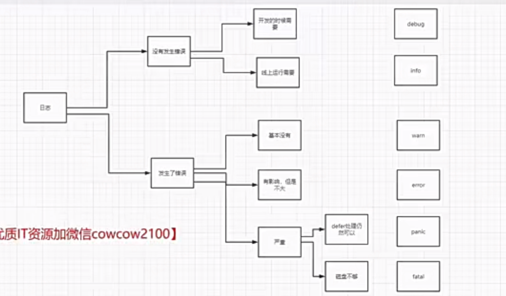
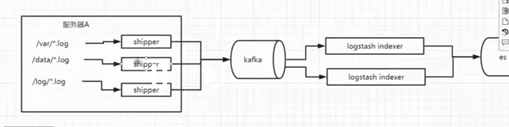
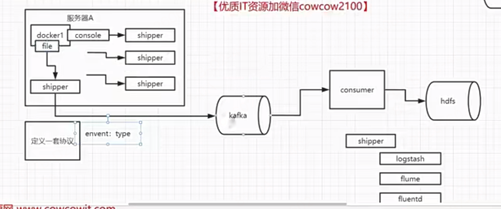

# 阶段8 深入底层库封装-ast代码生成方案

## 24周 log日志包设计

- 本周章节主要在`jieduan8-深入底层库封装-ast代码生成方案/log`这个目录下完成

### 1章 如何设计日志包

#### 1-1为什么需要自己去设计日志包
- 见`jieduan8-深入底层库封装-ast代码生成方案/log/main/main.go`
- 自己封装的日志包的重要性
#### 1-2 go-zero和kratos中日志的处理
- go-zero 日志：全局内置统一logger，强集成、高性能、开箱即用（基于 zap）
  - 核心组件
  - logx：底层日志库（封装 zap）
  - logc：带 context 的封装（自动注入 traceid）
- kratos 日志：接口化、可插拔、弱绑定（适配器模式）
  - 核心设计（四大角色）
  - Logger（接口）：底层适配（zap/slog/ 自定义）
    - 只定义行为，不绑定实现。依赖注入的logger机制
  - Helper：业务代码调用（log.Info）
  - Filter：脱敏、过滤
  - Valuer：动态注入字段（traceid、时间）

#### 1-3 全局logger和传递参数的logger的用法

- 主要是讲我们在设计logger时，我们可以考虑2种：
  - 全局内置统一logger
    - 如果我们不考虑某个模块拿出来做开源项目，全局大家都依赖同一个logger，项目启动时就初始化好logger，后续所有地方直接引用它即可
  - 依赖注入的logger机制
    - 如果想要开源一部分代码，就把logger这块设计成一个内部通用接口，由外界自己根据要求的接口类型实现并注入logger实例即可

#### 1-4 日志包的基本需求
- 见`jieduan8-深入底层库封装-ast代码生成方案/log/main/main.go`
- 我们最终基于zap封装

#### 1-5 日志debug、Info，error等级别的使用场景
```js
/*
		log使用经验
			1. if分支的时候可以打印日志
			2. 写操作要尽量写日志 gorm， 要记录数据
			3. for循环打印日志的时候要慎重， for循环会运行上万次
			4. 错误产生的原始位置打印日志 A(这里打印行不行)->B->C(error, 应该在此处打印日志) 所有error一律采用记录stack同时采用fail fast
		debug：
			我们为了方便排查错误很多时候会在很多地方使用debug， debug往往很多， 上了生产如果开启debug会导致性能受影响，在上线的时候尽量关闭到debug

		info:
			关键的地方打印一些信息， 这些信息数据可以交给大数据进行分析，info量来说相对比较适中。如果你发现了你的info使用量特别大，你就该考虑是不是可以换成debug

		warn:
			warn往往不会导致一个请求失败，但是我们还是应该关注的一些数据， 这是一种爬虫行为

		error：预期内的错误,不会崩溃,函数返回，自己判断处理,业务代码 99% 都用 error
        数据库查询失败,调用第三方接口超时,参数不对,用户名密码错误
			这就是程序失败， 我们的函数没有做好错误兼容， 由于业务运行过程中的bug， 请求第第三方资源，创建数据集记录，这种错误一定要关注

		panic:代码写坏了 → 程序崩溃,启动时可以用（连不上数据库、配置错误 → 直接 panic 退出）
			panic会导致整个系统直接挂掉，我们一开始项目启动的时候会连接数据库，可以使用panic去结束掉程序， panic是可以被recover住的，
			有一些情况比如slice越界 2/0, 业务中遇到这种panic你的程序挂了这就要命了
            程序崩溃，抛出堆栈信息
            可以被 recover 捕获（虽然业务不应该这么做）
            会执行 defer 语句
            代表：我出错了，但我留了一线生机
            如：数组下标越界,空指针调用,除数为 0,断言失败 --- 会导致panic
        log.Fatal
            内部直接调用 os.Exit(1)，完全不能捕获，不执行 defer
            直接退出进程
            代表：立刻死，马上死，不要救我
            最高级别的错误， 当你使用这个方法的时候你心里应该清楚，这个错误不应该被原谅，就应该导致程序挂掉
            适用场景：日志系统初始化失败
                - 你连日志都打不出来了，只能用 Fatal 强行退出！
	*/
```


#### 1-6 日志打印的注意事项
```js
/*
		写日志的注意事项
			1. 日志中不能记录敏感数据，不能写密码，token
			2. 日志必须写清楚：在哪里 + 做什么 + 错在哪 log.Warnf("[getDB] init database: %v", err)
			3. 如果可以，每一条日志尽量和请求的id关联起来，每条日志必须带 trace_id /request_id
			4. info和error不要乱用，很常见

		实践
			1. 好的日志不可能一开始就设计的很好， 这是一个演进的过程，日志打印要重视
			2. 日志不是越多越好，越少越好，关键要打印
			3. 日志要兼容本地打印
                本地：控制台彩色、格式简单
                线上：JSON 格式、文件切割、上报
			4. 能否支持动态调整日志级别
                线上默认 info
                出问题时，不重启服务，直接改成 debug！----
                curl http://localhost/debug/log?level=debug。这是线上排查神器！
	*/
```

#### 1-7 生产环境中的日志系统架构

在每个服务器上会装一个shiper工具，它会定期收集服务器上存储的各种日志文件，做后续日志处理，我们处理日志最终目的：是要落到搜索分析的

```js
业务服务(Go/Java) → 本地日志文件/stdout → Filebeat(Shipper采集端) → Kafka(缓冲层) → Logstash/Flink(清洗) → Elasticsearch(存储索引) → Kibana(查询看板)
```

 - 生产环境日志一般分两条路：
    - 运维链路（ELK/EFK）
      - 都是日志收集存储方案，只是存储检索组件不同
        - ELK = Elasticsearch + Logstash + Kibana
        - EFK = Elasticsearch + Fluentd + Kibana
      - 目的：线上查问题、链路追踪、告警
      - 路径：应用 → Filebeat → Kafka → Logstash → ES → Kibana
      - 
    - 大数据中心链路（入数据湖 / 数仓）
      - 目的：离线分析、报表、用户行为、风控、审计
      - 路径：应用 → Filebeat → Kafka → Flink/Spark → HDFS/Hive/ 数仓 → BI 报表
      - 核心：Kafka 是两条链路的共用枢纽，一份日志，两端消费
      - 
    - Filebeat 只统一发送1 个原始公共 topic（原始全量日志），Kafka 消费端分流：
      - 消费组 A → 运维链路（ES/Loki）
      - 消费组 B → 大数据链路（Flink+Hive）
      - Filebeat = 轻量级日志采集 Shipper
        - 每台机器装一个，负责读日志、发远端，它是整个日志架构的入口！

- 在实时推荐系统中比较常用举个例子，比如刷抖音时，停留时间超过10秒，就会记录一个日志，这个日志也是写上，由shiper采集推送到大数据日志链路，然后分析后推送到推荐系统，然后触发用户侧马上推荐下一条视频还出类似的视频

**分层拆解**
```js
常规分层：
    1、应用层：业务程序
        程序按规范输出 JSON 日志到磁盘文件或容器标准输出 (stdout)；
        遵循规范：携带traceId、服务名、日志级别、耗时，脱敏敏感字段；
        不直接远程投递日志（避免网络抖动阻塞业务）。
    2、Shipper 采集层（你说的服务器安装采集工具）
        主流：Filebeat（轻量 Shipper，占用 CPU 内存极低，标配）
        部署：每台机器 / 每个容器部署一个，常驻进程
        工作逻辑：
            实时监听日志文件变化（滚动切割的日志也能续读，记录 offset 断点）；
            实时读取新增日志，简单过滤无用日志；
            批量压缩后发送到中间件 (Kafka)。
            作用：就近采集，不占用应用性能，这就是生产 Shipper 的定位。
    3、缓冲层：Kafka（必备）
        Filebeat 不直连 ES，先投递 Kafka；
        削峰：瞬间日志暴涨时缓存数据，防止 ES 被打崩；
        解耦：采集、清洗、存储各司其职，扩容互不影响。
    4、日志清洗层：Logstash/Flink
        从 Kafka 消费日志，统一处理：
        字段拆分、格式标准化；
        数据脱敏（手机号 / 身份证屏蔽）；
        过滤无效垃圾日志。
    5、存储检索层：Elasticsearch (ES)
        结构化存储全量日志，提供全文检索、聚合统计，按天自动创建索引、自动过期删除。
        有很强的检索能力
        有一个性能强可选替代工具：loki
    6、可视化：Kibana
        自定义检索语句、筛选 traceId 全链路日志；
        配置告警规则（ERROR 突增、接口报错飙升触发钉钉 / 短信告警）；
        绘制 QPS、错误率大盘。

轻量化变种（小集群常用）：
    EFK：Filebeat → Elasticsearch → Kibana
    省略 Logstash，把简单清洗下沉到 Filebeat，机器少、日志量小时使用。

云原生新方案：因为此时都处于docker容器环境中
    容器环境不用落文件：应用日志输出 stdout → Filebeat 采集容器日志 → 同上链路。

```


##### loki更好的替代es

一、为什么现在很多公司用 Loki 替代 ES（核心原因）
一句话：ES 太重太贵，Loki 轻量便宜，云原生更适配。
- ES（ELK）痛点
  - 全文索引：每条日志都分词、建倒排索引 → 存储通常是原始日志的 1.5～3 倍。
  - 资源爆炸：CPU、内存、磁盘消耗巨大，集群运维复杂（分片、副本、JVM 调优）。
  - 查询浪费：线上排障大多是 “按服务 / 时间 / 错误 grep”，很少用复杂全文检索。
- Loki 核心优势（Grafana 出品，日志版 Prometheus）
  - 只索引 Label（标签）：如 service=order, level=error, trace_id=xxx，正文不索引。
  - 存储极低：正文高压缩，存储约为 ES 的 1/10，接近原始日志大小。
  - 资源极省：写入只做压缩，查询先按标签过滤再 grep，CPU / 内存开销很小。
  - 云原生 + Grafana 一体化：和 Prometheus 共用标签，监控→日志一键跳转，一套 UI。
- 关键区别（面试常问）
  - ES：全文索引 → 强搜索、高成本、重运维。
  - Loki：标签索引 → 轻量、低成本、适合排障 + 可观测性。

- es的前端页面叫kibina，loki的前端页面叫grafana，loki是基于prometheus的
  - Prometheus 是 Go / 云原生 / 微服务 领域最主流的【监控系统】，专门用来收集、存储、查询【指标数据（Metrics）】。
    - 它只收数字类型的指标，不收集日志
- 与其他日志系统的关系
  - Prometheus：存指标（数字） → 监控、大盘、告警
  - Loki / ELK：存日志（文本） → 查问题、排错
  - Jaeger：存调用链 → 追踪慢请求

#### 1-8 自定义log的options

- 见`jieduan8-深入底层库封装-ast代码生成方案/log/options.go`
  - 基于zap封装的，自定义zap用的NewOptions方法，得到自定义的配置对象
    - 支持从命令后启动参数中读取
- 大致文件使用关系
    ```go
    // 1. 加载/创建配置
    opts := log.NewOptions()
    opts.AddFlags(...)  // 绑定命令行
    opts.Validate()     // 校验

    // 2. 根据配置创建日志实例
    logger := log.New(opts)  // ✅ 这里就是两个文件的连接点！

    // 3. 业务使用
    logger.Info("hello")
    ```
#### 1-9 自定义log接口
- 见`jieduan8-深入底层库封装-ast代码生成方案/log/log.go`，基于zap实现自定义logger封装
- 实现log的New方法和不同级别的日志打印接口

#### 1-10 自定义的logger如何实现解耦的

- 见 `jieduan8-深入底层库封装-ast代码生成方案/log/app/app.go`自定义logger的使用方式

使用中：我们自己封装了一个options，用于隔开zap.Config
		日志初始化，Init(options),
		整个过程中调用法看不到zap的信息，就是整个开发过程解耦

#### 1-11 导入已经开发好的log日志包

- 源码包见`jieduan8-深入底层库封装-ast代码生成方案/log1`

## 25周 ast代码生成工具开发

### 1章 如何设计errors错误包

#### 1-1 go的error和其他语言的trycatch的区别
- 代码见`jieduan8-深入底层库封装-ast代码生成方案/error/main.go`
- go的设计理念确实有道理，错误和异常不是一回事
  - error 是业务逻辑正常、语法正常情况下的 “业务失败”
    - 预期内会发生
    - 不影响程序继续跑
    - 必须手动判断、处理
    - 属于正常流程的一部分
  - error 是业务逻辑正常、语法正常情况下的 “业务失败”
    - 预期内会发生
    - 不影响程序继续跑
    - 必须手动判断、处理
    - 属于正常流程的一部分
- 因为：try/catch 会把业务错误和程序异常混在一起，代码乱、难维护
  - Java/Python/JS 里：
    - 密码错 → 抛异常
    - 查询失败 → 抛异常
    - 空指针 → 抛异常
  - → 全部混在 catch 里，分不清是业务错还是程序崩了
  - Go 明确分开：
  - 业务错 → 返回 error，必须判断，也能避免混乱的try-catch混在一起，
    - 所以它设计的函数返回的2参是专门error错误用的
  - 程序崩 → panic，用 recover 抓

#### 1-2 常用的errors、fmt和pkgerrors错误处理包

1. go原生自带的errors包、  
   1. errors 包是 Go 专门用来创建、处理、判断业务错误（error） 的标准库。
   2. Go 自带的 errors 包功能太弱，只能存字符串，没有堆栈、没有错误码、没有调用链，无法定位问题。所以大家必须用第三方库。
2. fmt.Errorf（标准库，日常最常用）
   1. 创建格式化错误 + 支持包装错误（% w）
   2. ✅ 优点
      1. 标准库、无依赖
      2. 支持 % w 包装，可被 errors.Is/As 解析
      3. 日常业务 90% 场景够用
   3. ❌ 缺点
      1. 依然没有堆栈：线上排查还是难
      2. 只能包装，不能记录调用链位置
   4. fmt.Errorf 能包装错误！而且是 Go 官方标准的错误包装方式！
      ```go
        // 原始错误
        var ErrTimeout = errors.New("timeout")

        // 包装！
        err := fmt.Errorf("连接CDP失败: %w", ErrTimeout)
        // 这就叫 包装错误（Wrap Error）,包装错误有什么用？---- 可以用 errors.Is / `errors.As`` 解开！
        // 判断是不是超时错误
        if errors.Is(err, ErrTimeout) {
            fmt.Println("真的是超时！")
        }
        // 能解开，✅ 能保留原始错误
        // 解包错误 = 解包后可以用 errors.Is/errors.As 判断根源
      ```
3. github.com/pkg/errors（第三方经典）
   1. github地址：https://github.com/pkg/errors/tree/master
      1. 没有错误码的功能
   2. 自动带堆栈 + 强包装能力
   3. pkg/errors.Wrap 也能包装错误，而且带完整堆栈，还有Unwrap解包错误
##### 包装概念
用fmt.Errorf的包装方法举例
```go
// 原始错误（我们自己的）
var myErr = &withCode{code: 110001, msg: "用户不存在"}

// 包装一层
err1 := fmt.Errorf("第一层包装: %w", myErr)

// ======== 包装后真实结构 ========
// 原始错误结构
&withCode{
    code: 110001,
    msg:  "用户不存在",
}
// 包装一层 err1，原始错误嵌套在内部字段里
&wrapError{
    msg: "第一层包装: 用户不存在",
    err: &withCode{110001, "用户不存在"}, // 👈 把原始错误藏在这里
}

// 你现在拿到的是 最外层 err1，它的类型是：
// *fmt.wrapError
// 不是你的 *withCode
// 直接原生断言方式：肯定断言失败
w, ok := err2.(*withCode)  
// ❌ 失败！因为外层是 wrapError，不是 withCode
// ------ 必须用包装方法配套的深层断言方法，fmt好像没有直接提供As方法，只提供了Unwrap解包方法，只能手动循环解包自行判断类型，也可以用errors提供的As方法：如果断言成功，直接赋值到w变量中，w就不是nil了
var w *withCode
errors.As(err2, &w) // ✅ 成功
```


#### 1-3 使用pkgerrors打印调用栈

- 代码示例见`jieduan8-深入底层库封装-ast代码生成方案/error/main.go`

#### 1-4 使用pkgerrors的wrap包装和打印error错误栈

- 代码见`jieduan8-深入底层库封装-ast代码生成方案/error/ch02/main.go`
- pkgerrors包还提供了一下方法
  - Wrap() 函数在已有错误基础上同时附加堆栈信息和新提示信息
  - WithMessage() 函数在已有错误基础上附加新提示信息
  - WithStack() 函数在已有错误基础上附加堆栈信息。在实际中可根据情况选择使用
#### 1-5 通过is和as方法判断error的值，是不是我关心的那个error
- 代码继续见`jieduan8-深入底层库封装-ast代码生成方案/error/ch02/main.go`
- 如链接数据库的error，我想关心是否数据库底层的错误是否等于某个错误类型，如超时错误等？
  - 给我们提供了As，is方法：
    - As断言方法： 判断是否是某个错误即w变量的类型
      - 如果断言成功，直接赋值到w变量中，w就不是nil了
    - Is是否是某个错误： 关心错误的值
      - 他们底层判断原理，都是利用了解包功能
#### 1-6 http响应应该全部返回200还是标准的httpcode

```js
/*

		http状态码：2xx 3xx 4xx 5xx
		错误码， 错误码应该可以转换成http状态码？ 但是手动转化可维护性很差，要是自动完成内部状态码自动转成http状态码，那不就就好了？

		错误码设计的原则 ，http响应的策略：
			1. 不论是否成功还是失败，http状态码一律200, facebook就是这样用的
	 			{
					"code": 101010,
					"msg": "internal error",
					"status": 1,0, // 通过0 1区分接口响应成功或失败
					"data":{}
				}
			但是1这样用有个问题：如果我现在想要引入一个第三方监控系统，protmetheus， 由于你的所有响应都是200，无法完成主动监控， 因为一般监控系统都会去适配主流的http状态码的，不能一律设成200，下面是策略2
	    2. 内部错误我们可以转换成对应的http状态码，HTTP 状态码 + 业务错误码 同时使用，大厂现在主流方案 --- 我们主要采用这种
				twitter
				http code
				{
					"code": 101010,
					"message": "internal error",
					"reference":"http://"
				}
*/
```

#### 1-7 如何设计错误码更加科学
```js
code设计思路：
			1. code不能和http的code，通过这些code可以看出来错误码是来自哪个项目，来自哪个模块
			2. 请求错误了， 我们不要去通过code判断。应该通过http的code来判断
			3. 最好是能有文档对每个错误码描述， 手动维护还是自动维护？
			4. 错误码可以直接返回到前端http响应， 所以msg不能包含敏感信息，
			5. 数据返回应该是标准
		错误码设计的重要性
			net/http 状态码不够
			采用数据 100111  6位错误码设计：AABBCC
      AA（2 位）= 服务编号
      10 = API 网关 / 通用服务
      11 = 商品服务
      12 = 订单服务
      13 = 用户服务
      最多支持 100 个服务
      BB（2 位）= 模块编号
      00 = 通用模块
      01 = 数据库
      02 = 认证 / Token
      03 = 加解密 / 编解码
      11 = 商品模块
      每个服务最多 100 个模块
      CC（2 位）= 具体错误
      00~99
      每个模块最多 100 个错误
    例如：
		10： 服务 api服务，mxshop后台管理系统服务， 最多可以有100个服务
		01： 代表服务下的某个模块 商品管理 商品分类管理 每个服务可以有100个模块
		11： 商品查询不到，商品已经下架 每个模块下支持100个错误码

		错误码一般映射到以下http状态码，就差不多够了
			404 400
			200 执行成功 get
			201 post数据 新增成功
			401： 认证失败
			403： 权限不足
			404： 资源找不到
			400： 参数错误
		500： 服务器错误

		有一些公共的和业务无关的状态码我们就可以先行创建好
		10  00 通用错误
		10  01 01 02 通用-数据库错误
		10  02 通用-认证失败
		10  03 通用- 编解码错误
		11  01 00商品模块 - 商品不存在，商品新建失败

		错误统一采用大写开头
		msg应该尽量简介 不要暴露过多的信息
```

#### 1-8 如何自定义错误码

- 自定义错误码具体实现见`jieduan8-深入底层库封装-ast代码生成方案/error/code/code.go`
- 后续项目中，还可以将不同根模块维护在单独的文件管理，便于维护
```js
code/
  ├── code.go              # 公共定义：结构体、HTTP映射函数
  ├── common.go            # 10xxxx 通用错误（参数、未知、公共）
  ├── db.go                # 1001xx 数据库错误
  ├── auth.go              # 1002xx 认证、token、权限错误
  ├── crypto.go            # 1003xx 加解密、编解码错误
  ├── goods.go             # 1101xx 商品服务错误
  ├── order.go             # 1201xx 订单服务错误
  └── user.go              # 1301xx 用户服务错误
```

#### 1-9 errors实现withcode模式和实现code的注册

- errors源码包见`jieduan8-深入底层库封装-ast代码生成方案/error/pkg/errors`
  - 网上找的源码：`https://github.com/JoyZF/errors`
  - 这个源码主要是基于开源的pkg/errors基础上扩展增加了自定义错误码的code的实现
    - `pkg/errors/errors.go` 中新增了 `withCode` 结构体和 `WithCode`、`WrapC` 方法
    - `pkg/errors/code.go` 中新增了 `Coder` 接口、全局注册表和 `Register`/`MustRegister`/`ParseCoder`/`IsCode`

##### pkg/errors 源码提供的核心 API（基于本地源码）

**`pkg/errors/code.go`** - 注册表和接口：

```go
// Coder 接口 - 每个错误码必须实现这4个方法
type Coder interface {
    HTTPStatus() int   // 映射的HTTP状态码
    String() string    // 面向用户的错误描述
    Reference() string // 参考文档链接
    Code() int         // 业务错误码（6位）
}

// 全局注册表（内部 map[int]Coder）
var codes = map[int]Coder{}

// Register 注册错误码（覆盖已存在的）
func Register(coder Coder)

// MustRegister 注册错误码（已存在则panic，更安全）
func MustRegister(coder Coder)

// ParseCoder 从 error错误 中解析出 Coder错误码
// 原理：用 errors.As 将 err 断言为 *withCode，取出 code 字段，再从全局 codes map 中查找
func ParseCoder(err error) Coder

// IsCode 判断 error 链中是否包含指定错误码（递归 cause 链）
func IsCode(err error, code int) bool
```

**`pkg/errors/errors.go`** - withCode 模式：

```go
// withCode 结构体 - 带错误码的error
type withCode struct {
    err   error  // 错误信息
    code  int    // 业务错误码
    cause error  // 原始错误（链式）
    *stack       // 调用栈
}

// WithCode 创建一个带错误码+堆栈的全新 error（不包装其他error）
func WithCode(code int, format string, args ...interface{}) error

// WrapC 包装已有 error，附加错误码+新消息+堆栈（保留原始error链）
func WrapC(err error, code int, format string, args ...interface{}) error
```

##### 实践步骤

**第一步：定义错误码常量**（`code/code.go` + `code/goods.go`）

```go
// code/code.go - 通用服务错误码
const (
    ErrSuccess      = ServiceCommon + ModBase + iota // 100000
    ErrUnknown                                       // 100001
    ErrParamInvalid                                  // 100002
)

// code/goods.go - 商品服务错误码
const (
    ErrGoodsNotFound = ServiceGoods + ModGoodsBase + iota // 110100
    ErrGoodsSoldOut                                        // 110101
)
```

**第二步：实现 Coder 接口并注册到全局表**（`code/code-registry.go`）

```go
package code

import (
    "net/http"
    "mxshop/pkg/errors"
)

// coder 实现 errors.Coder 接口
type coder struct {
    code int
    http int
    ext  string
    ref  string
}

func (c coder) Code() int         { return c.code }
func (c coder) HTTPStatus() int   { return c.http }
func (c coder) String() string    { return c.ext }
func (c coder) Reference() string { return c.ref }

// register 快捷注册方法
func register(code, httpStatus int, message, ref string) {
    errors.MustRegister(coder{code: code, http: httpStatus, ext: message, ref: ref})
}

// init 包初始化时自动注册所有错误码到 pkg/errors 的全局 map
func init() {
    register(ErrSuccess, http.StatusOK, "OK", "")
    register(ErrUnknown, http.StatusInternalServerError, "未知错误", "")
    register(ErrGoodsNotFound, http.StatusNotFound, "商品不存在", "")
    register(ErrUserNotFound, http.StatusNotFound, "用户不存在", "")
    // ... 所有错误码都在这里注册
}
```

**第三步：业务中创建带错误码的 error**

```go
import "mxshop/app/pkg/code"
import "mxshop/pkg/errors"

// 方式1：WithCode - 创建全新的带码error（不包装其他error）
err := errors.WithCode(code.ErrUserNotFound, "user %s not found", username)

// 方式2：WrapC - 包装底层error，同时附加错误码
dbErr := gorm.ErrRecordNotFound
err := errors.WrapC(dbErr, code.ErrDatabaseRecordNotFound, "query user failed")
```

**第四步：解析 error 获取错误码信息**

```go
import _ "mxshop/app/pkg/code"  // ⚠️ 空导入！触发 init() 注册所有错误码
import "mxshop/pkg/errors"
// 模拟业务函数：返回错误（err 就是从这里来的！）
func GetUser(id int64) (*User, error) {
	// 1. 业务判断：用户不存在
	if id == 0 {
		// 2. 抛出 业务错误（这就是 err 的来源！）--- 创建一个带错误码的错误对象
		return nil, errors.WithCode(code.ErrUserNotFound, "user %s not found", username)
	}

	// 正常返回
  return &User{ID: id, Name: username}, nil
}
func main() {
  // 👇 这里调用业务函数，拿到 err
  _, err := GetUser(0)
  if err != nil {
      coder := errors.ParseCoder(err) // ParseCoder 从 error错误 中提取 错误码Coder，进而获取错误码对应的 HTTP 状态码和描述
      fmt.Println(coder.Code())       // 110200 (ErrUserNotFound)
      fmt.Println(coder.HTTPStatus()) // 404
      fmt.Println(coder.String())     // "用户不存在"
  }

  // IsCode 判断error链中是否包含指定错误码
  if errors.IsCode(err, code.ErrUserNotFound) {
      // 处理用户不存在的情况
  }
}

```

**第五步：gRPC 场景中使用（ch03 示例）**

- gRPC 转换方法已在本地实现，见 `jieduan8-深入底层库封装-ast代码生成方案/error/pkg/errors/grpc.go`
- `ToGrpcError`：将 withCode error 序列化为 gRPC error（业务码+消息 JSON 化到 message 字段，HTTP 状态码映射为 gRPC codes）
- `FromGrpcError`：从 gRPC error 的 message 中反序列化出业务码，重建 withCode error

```go
// server 端：创建 withCode error 并转为 gRPC error 返回
e := errors.WithCode(code.ErrUserNotFound, "user not found")
return nil, errors.ToGrpcError(e)
// 内部：序列化为 gRPC status，code=NotFound，message={"code":110200,"message":"user not found"}

// client 端：从 gRPC error 还原
s := errors.FromGrpcError(err)  // 反序列化 JSON，重建 withCode error
coder := errors.ParseCoder(s)   // 从全局注册表查找 Coder
fmt.Println(coder.Code())       // 110200
fmt.Println(coder.HTTPStatus()) // 404
fmt.Println(coder.String())     // "用户不存在"
```

##### 关键点总结

1. **空导入触发注册**：使用方必须 `_ "mxshop/app/pkg/code"` 空导入，触发 `init()` 将所有错误码注册到全局 codes map
2. **ParseCoder 能工作的前提**：错误码必须已经通过 `MustRegister` 注册过，否则返回 `unknownCoder`
3. **WithCode vs WrapC**：
   - `WithCode(code, msg)` → 创建全新 error（无 cause）
   - `WrapC(err, code, msg)` → 包装已有 error（保留 cause 链）
4. **gRPC 传输**：`ToGrpcError`/`FromGrpcError`（见 `pkg/errors/grpc.go`）负责 withCode error 与 gRPC error 的互转
   1. 这块内容下节课程具体讲，本节只是讲最基本的错误码和错误相互转换逻辑，错误码解析生成错误，错误反向解析错误码

##### AST 自动生成注册代码的设计意图

当前 `code-registry.go` 是手动编写的，但作者的原始设计意图是：**通过 AST 解析注释，自动生成注册代码**。后续小节会讲

注释约定格式（见 `code/code.go`）：
```go
// ErrBind - 400: 请求体解析失败.
ErrBind
```

格式规则：`// 常量名 - HTTP状态码: 错误描述.`

**AST 自动生成流程**：

1. **解析源文件**：用 `go/parser` 解析 `code/code.go`、`code/goods.go` 等文件的 AST
2. **遍历常量声明**：找到所有 `const` 块中的 `iota` 常量
3. **提取注释**：对每个常量，用正则解析关联注释 `// ErrXxx - HTTP状态码: 描述.`
   - 常量名 → 错误码变量名
   - HTTP状态码 → `httpStatus` 参数
   - 描述 → `message` 参数
4. **计算常量值**：根据 iota 基准值（如 `ServiceCommon + ModBase`）+ 偏移量算出实际数值
5. **生成代码**：输出 `code-registry.go` 文件，内容为 `init()` 中的 `register(...)` 调用

**生成前（输入 - code.go 注释）**：
```go
// ErrBind - 400: 请求体解析失败.
ErrBind
```

**生成后（输出 - code-registry.go）**：
```go
register(ErrBind, 400, "请求体解析失败", "")
```

这样的好处：
- 开发者只需在定义常量时写好注释，无需手动维护 `code-registry.go`
- 注释即文档，注释即注册数据源，单一数据源
- 通过 `go generate` 一键重新生成
- 这就是第2章"通过 AST 自动生成代码"要实现的核心能力


#### 经验小节
1. gubrak：Go 版 Lodash，内置Includes()，支持任意类型切片、可选起始索引。(github.com/novalagung/gubrak)
   1. 字符串包含原生有`strings.Contains("hello go", "go") // true ✅ 最常用`
   2. 切片包含（int/string 等）:Go 没有内置函数，必须自己写循环，或者用第三方库（如 gubrak）
      1. 如`gubrak.Includes([]int{1,2,3}, 2)      // true`
      2. 如`gubrak.Includes("abc", "b")          // true`
#### 1-10 grpc中的error处理
- 具体示例代码见：`jieduan8-深入底层库封装-ast代码生成方案/error/ch03/rpc`
- 本节主要先讲原始grpc中的默认生成grpc错误和grpc客户端解析自己的错误码是如何使用的，和如何相互转化的
  - 服务端用：`status.Error(codes.NotFound, "user not found")`生成错误
  - 客户端用：`status.FromError(err)`解析错误
    - FromError解析grpc错误码原理与前面的`自定义的errors.ParseCoder(err)`原理大致一样
- 后续讲下如何将grpc内置的error-code体系结合前面自定义的error-code体系，相互串联，希望全程用我的自定义error作为主线，传给grpc使用，得到grpc错误结果时，还能反解出我自定义的错误码信息，

#### 1-11 自定义的error放入grpc返回造成的不兼容怎么办

1. 想实现上节说的串联效果，我尝试直接在grpc服务端中返回我们自定义的错误结构，会怎么样？要是正常响应，那就可以直接用了，
   1. gRPC 服务端直接返回,`return nil, errors.WithCode(code.ErrUserNotFound, "user %s not found", username)`
   2. 但实际测试，grpc服务端返回自定义的错误结构，grpc客户端解析响应的时候会报错，只要你直接返回自定义 error，客户端一定报：code = Unknown
2. 为什么报Unknown错误？
   1. gRPC 底层只认一种错误：`google.golang.org/grpc/status.Status`
   2. 你的自定义 error 不是它！所以 gRPC 底层会自动把不认识的错误强行包装成：code = Unknown (未知错误)
   3. 业务错误码直接丢失！客户端永远拿不到你定义的 110200 这种码。

#### 1-12 增加fromerror解决grpc转换为内部error

 这节主要讲：**gRPC 传输**：`ToGrpcError`/`FromGrpcError`（见 `pkg/errors/grpc.go`）负责 withCode error 与 gRPC error 的互转

- 我们需要兼容的话，在我们自定义的`jieduan8-深入底层库封装-ast代码生成方案/error/pkg/errors/grpc.go`中增加兼容方法
  - `ToGrpcError`：将我们自定义error转化成grpc认识的error
  - FromGrpcError方法
#### 1-13 kratos框架中如何实现的errors？
### 2章 通过ast自动生成代码

