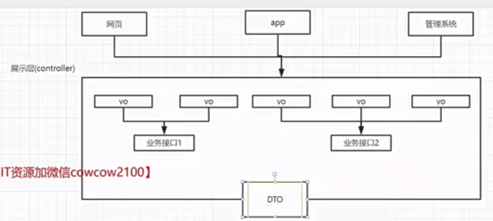
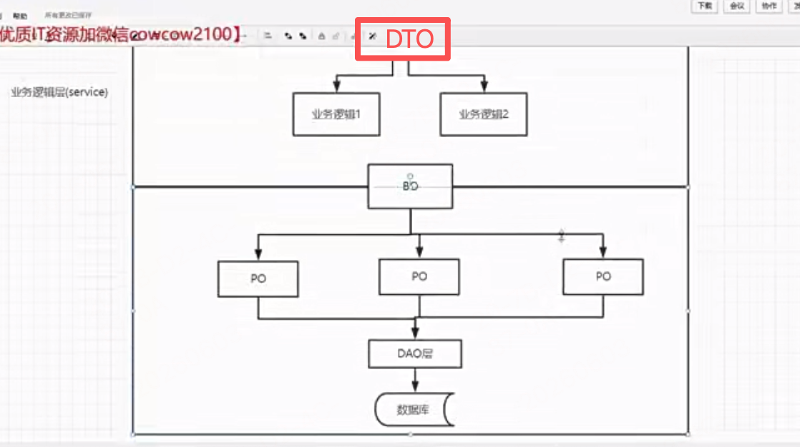

# 阶段9-自研微服务框架-gmicro

- 代码目录见`jieduan9-自研微服务框架-gmicro/mxshop`

- 讲解目的是：将原来的grpc微服务和客户端的原生对接写法改成这种mvc分层写法，并使用微服务标准目录划分架构
  - 如app下的user用户微服务，服务端使用mvc模式，最终还是会注册到grpc-proto构建提供的`.RegisterUserServer`中
    - 客户端还是使用grpc-proto提供的`NewUserClient`去链接服务端的controlle层的方法

## 26周 三层代码结构

- 课件演示代码目录见`jieduan9-自研微服务框架-gmicro/mxshop/app/user/srv`
1章 3层代码结构规范

### 1-1 导入common和app包
见`jieduan9-自研微服务框架-gmicro/mxshop/pkg`下的common和app公共包，可以在mxshop/app应用目录各个微服务应用中快速引入初始化项目
### 1-2 通过app启动配置文件映射和flag映射
### 1-3 重构app启动项目
### 1-4 app启动的原理
### 1-5 已有代码存在哪些耦合

我们前面开发的mxshop_srvs项目和mxshop-api项目，每个handler中逻辑内部有很多耦合地方，handler直接依赖的grpc的代码，耦合了很多模块硬编码直接用：下面想换哪一个都得全量改代码

- RPC 想换（zRPC → 其他）
- ORM 想换（GORM → 原生 SQL / 其他）
- Web 框架想换（Gin → go-zero/kratos）
- 注册中心想换（Consul → Nacos/K8s）
- 缓存想换（Redis → 内存 /memcache）
- 一句话终极解决方案：你缺的是：接口抽象 + 依赖倒置（DI）+ 分层架构
- 只要把底层全部抽成接口，上层只依赖接口，不依赖具体实现 → 想换啥换啥，一行业务代码不改！
### 1-6 三层代码结构降低代码耦合
```js
controller层（参数校验，调用servicec接口）
    接收 HTTP / RPC 请求
    参数校验
    组装请求 → 传给 service
    返回统一响应
    只和前端交互
    暴露结构：VO (View Object) 视图对象 (Request/Response)，专门给页面接口展示用，美化、聚合、格式化数据
service层（具体的业务逻辑）
    真正的业务逻辑
    事务
    调用 data 层（DB/RPC/Cache）
    组合多个 data 数据源
    完全不关心底层用什么 GORM/RPC/Redis
    暴露结构：DTO / BO（Business Object）跨层传输数据，前端请求、接口返回都用它。
data层（数据库的接口）
    DB 操作（GORM / 原生 SQL）
    RPC 调用（zRPC/grpc）
    缓存（Redis）
    只做数据读写，无业务逻辑
    暴露结构：DO (Data Object)，和数据库表一一对应，纯粹存数据。
// 每层的对外暴漏的数据接口类型是不一样的
```

- 我们以原来的user服务和对应的user-web服务，为例，重构到当前的规范微服务目录架构`app/user`下
- 如在我们实际的微服务项目下`jieduan9-自研微服务框架-gmicro/mxshop/app/user`微服务下，首先分成srv和client两个大目录,每个目录就按照3层结构进行目录划分
- api目录下只放接口文档，如proto文件，swagger文档等，还可以加个版本号，作为二级目录（因为有可能不同的服务依赖我们不同的接口版本）

### 1-7 service层和data层的解耦

- 继续完善`jieduan9-自研微服务框架-gmicro/mxshop/app/user`服务的重构迁移，本节重点：将service层和data层的代码分离

- service层最终是要调data层，data下也是建个v1

### 1-8 DO、DTO、VO这些概念是什么




- 这些概念基于上面的3层结构进行划分的。
  - controller层主要负责接收请求和返回结果：前端请求进入系统时通常先绑定成 Request DTO，service处理完成后既可以返回 Response DTO 给 controller，再由 controller 转成 VO 响应给前端；也可以在简单项目里由 service 直接返回 VO。
  - service层内部主要使用 BO 承载业务语义和聚合数据，然后与 data 层通过 BO 转成 DO 或 PO 进行交互
  - data 层内部主要基于 DO 或 PO 最后再与外部依赖数据库服务进行 DAO 对接

1. DTO = 数据传输对象（跨层）
   1. Controller ↔ Service 跨层之间传输
   2. 请求 DTO：前端传过来的参数，controller 接收后传给 service
   3. 响应 DTO：service 返回给 controller 的数据，controller 再决定是否转成 VO 返回前端
   4. 更广义上，服务与服务之间的 RPC / HTTP 请求和响应对象，也都可以算 DTO
2. VO = 调用方展示专用
   1. 给前端页面看、给调用方展示”。它一般用于响应结果
3. BO（Business Object）业务对象
   1. 给谁用：Service 层（核心业务）
   2. 作用：承载业务逻辑、事务、聚合数据
   3. 特点：真正的业务核心，与前端 / 数据库无关
   4. 例子：商品 + 库存 + 价格 = 订单 BO
4. DAO（Data Access Object）数据访问接口
   1. 给谁用：DAO 层（数据访问层）
   2. 作用：定义数据库操作接口
   3. 特点：接口，不关心实现（可换 MyBatis/JPA/GORM）
5. DO（Data Object）数据对象
   1. 给谁用：DAO 实现层
   2. 作用：与数据库表一一对应
   3. 特点：纯数据库映射
6. PO 一般指 Persistent Object，DO 一般指 Data Object：在很多项目里两者都表示持久化层对象，通常和数据库表结构对应，实际常常不严格区分。区别更多取决于团队命名规范，而不是统一标准。为了避免混乱，项目里最好只保留一种命名
   1. 如果你们团队已经有 OrderDO，就别再来一个 OrderPO；如果已经叫 UserPO，那就统一都叫 PO

#### 一个经典业务场景：创建订单时整条链怎么流转

**整体流转概览**
```
前端JSON入参 → CreateOrderReqDTO
        ↓(Service查库补全、业务计算，拆4个BO)
OrderBaseBO订单主BO + OrderItemBO订单商品BO + OrderCouponBO优惠券核销BO + OrderPayBO订单支付BO（4类业务BO --- 对应5个DO ）
        ↓(BO→DO，入库生成orderId后回填外键)
OrderDO(主单)、OrderItemDO(明细)、OrderAddrDO(收货地址)、OrderCouponDO(优惠核销)、OrderPayDO(支付预记录) 【5DO对应5张表】
        ↓
CreateOrderRespDTO → OrderVO
```

##### 1、前端入参 + 请求DTO（不变，原始入参）
```json
{
  "user_id":1001,
  "address_id":88,
  "coupon_id":10,
  "pay_type":1,
  "items":[{"goods_id":20001,"num":2}]
}
```
```go
type CreateOrderReqDTO struct {
	UserID    int64                `json:"user_id"`
	AddressID int64                `json:"address_id"`
	CouponID  int64                `json:"coupon_id"`
	PayType   int                  `json:"pay_type"` // 1微信 2支付宝
	Items     []CreateOrderItemDTO `json:"items"`
}
type CreateOrderItemDTO struct {
	GoodsID int64 `json:"goods_id"`
	Num     int   `json:"num"`
}
```

##### 2、DTO → 拆分4组BO（Service查数据、算金额、补全业务字段，无OrderID）
```go
// BO1：订单主体基础BO（用户、金额汇总、收件人信息）
type OrderBaseBO struct {
	UserID         int64
	AddressID      int64
	CouponID       int64
	ReceiverName   string
	ReceiverMobile string
	AddressDetail  string
	GoodsTotal     int64  // 商品原价合计
	CouponDeduct   int64  // 优惠券抵扣
	Freight        int64  // 运费
	RealPay        int64  // 实付金额
	PayType        int    // 支付方式
}

// BO2：商品明细BO（多条商品循环生成）
type OrderItemBO struct {
	GoodsID   int64
	GoodsName string
	SellPrice int64
	BuyNum    int
	LeftStock int  // 当前商品剩余库存
	ItemSub   int64 // 单品小计
}

// BO3：优惠+支付附属BO（拆成两个子业务BO，合并为一组业务域）
// 优惠券核销业务BO
type OrderCouponBO struct {
	CouponID    int64
	DeductMoney int64
	CouponRule  string // 优惠规则描述：满300减20
}
// 订单预支付BO（下单预创建支付单）
type OrderPayBO struct {
	PayType    int
	NeedPayAmt int64
	ExpireTime int64 // 支付超时时间戳
}
```
> 关键：**所有BO阶段无OrderID**，主键入库生成后才注入DO。

##### 3、4BO → 5DO（一一映射5张数据库表，入库后补OrderID外键）
##### 对应数据表
`t_order(主单)、t_order_item(明细)、t_order_receive_addr(订单收货地址)、t_order_coupon_record(优惠券核销记录)、t_order_pay_record(支付预订单)`
```go
// DO1：t_order 订单主表
type OrderDO struct {
	ID             int64 `db:"id"` // 入库自增orderId
	UserID         int64
	GoodsTotal     int64
	CouponDeduct   int64
	Freight        int64
	RealPay        int64
	PayType        int
	OrderStatus    int // 1待支付
}

// DO2：t_order_item 商品明细表
type OrderItemDO struct {
	ID        int64 `db:"id"`
	OrderID   int64 `db:"order_id"` // 后置填充
	GoodsID   int64
	GoodsName string
	SellPrice int64
	BuyNum    int
	ItemSub   int64
}

// DO3：t_order_receive_addr 订单收货地址快照表
type OrderAddrDO struct {
	ID             int64 `db:"id"`
	OrderID        int64 `db:"order_id"`
	ReceiverName   string
	ReceiverMobile string
	AddressDetail  string
}

// DO4：t_order_coupon_record 优惠券核销记录表
type OrderCouponRecordDO struct {
	ID          int64 `db:"id"`
	OrderID     int64 `db:"order_id"`
	CouponID    int64
	DeductMoney int64
	CouponRule  string
}

// DO5：t_order_pay_record 支付流水预订单
type OrderPayDO struct {
	ID         int64 `db:"id"`
	OrderID    int64 `db:"order_id"`
	PayType    int
	PayAmount  int64
	ExpireTime int64
	PayStatus  int //0未支付
}
```

##### 4、入库执行逻辑（事务内分步）
```go
// 1. BaseBO→OrderDO，插入主单，拿到生成orderId
orderDO := base2OrderDO(baseBO)
db.Insert(&orderDO) // 操作DAO数据库接口
orderId := orderDO.ID

// 2. 剩余全部DO统一回填OrderID
// 明细
itemDOList := itemBO2ItemDO(itemBOList)
for _, item := range itemDOList {item.OrderID = orderId}
// 地址快照
addrDO := base2AddrDO(baseBO)
addrDO.OrderID = orderId
// 优惠记录
couponDO := couponBO2CouponDO(couponBO)
couponDO.OrderID = orderId
// 支付预单
payDO := payBO2PayDO(payBO)
payDO.OrderID = orderId

// 3. 同一事务批量插入剩余4类DO，任意失败整体回滚
batchSave(itemDOList,addrDO,couponDO,payDO)
```

##### 5、出库返回：RespDTO → VO
```go
// Service层：内部响应DTO
type CreateOrderRespDTO struct {
	OrderID     int64
	RealPay     int64
	GoodsTotal  int64
	DeductAmt   int64
	PayExpireTs int64
	Status      int
}
// controller层： ---> 前端展示VO（状态码转文案、按需裁剪字段）
type OrderVO struct {
	OrderID     int64  `json:"order_id"`
	TotalPrice  int64  `json:"total_price"`
	PayPrice    int64  `json:"pay_price"`
	StatusText  string `json:"status_text"` //待付款
	PayDeadline string `json:"pay_deadline"`//格式化时间
}
```

#### 总结：你最该记住的不是定义，而是“职责变化”

这几个对象不是为了显得高级，而是为了让每一层只管自己的事：
- DTO 只关心“传进来什么”
  - 前端 → 后端（大而全）
  - 一个dto拆成多个业务域BO
- BO 只关心“业务怎么算、怎么执行”
  - 业务领域对象（按业务拆分）
  - 1 个 BO = 处理一块完整业务
  - 1 个 BO = 对应多张表
- DO 只关心“数据库怎么存”
  - DO：数据库表映射（一张表一个 DO）
- VO 只关心“前端怎么展示”
- DAO 操作库的统一抽象接口
```js
// 举例：
DTO（前端大对象）
↓ 拆分
ShopBO（店铺 BO）
ProductBO（商品 BO）
↓ 再拆分入库
ShopDO（店铺表）
ShopExtDO（店铺扩展表）
ProductDO（商品表）
ProductSkuDO（商品 SKU 表）
ProductDetailDO（商品详情表）
```

1. **新增一个业务BO → 一般新增1~2张表→新增对应DO**
   例：加「发票BO」→ `t_order_invoice` → InvoiceDO；加「物流BO」→`t_order_delivery`→DeliveryDO
2. **BO按业务域拆分，DO严格按数据表拆分**，这是分层设计核心
3. BO只关心业务规则、数据补全；DO只关心库表映射、外键关联

- 为什么要分这么多层？（你最关心）
  - 解耦！解耦！解耦！
  - 换数据库 → 主要改 DO
  - 换 ORM → 主要改 DAO
  - 换前端展示 → 主要改 VO
  - 改业务规则 → 主要改 Service / BO
  - 接口参数变 → 主要改 DTO
  - 分层的价值不是“业务逻辑永远不动”，而是“改动范围尽量可控”

### 1-9 service层的代码如何做到可测试性？

`jieduan9-自研微服务框架-gmicro/mxshop/app/user/srv/service/v1/user.go`文件中List方法为例，如何关于指定数据层的响应结果来做到可测试性

- 想做到可测试性，就不能固定调用数据操作接口，返回单一的数据层响应结果，而是应该将数据操作接口定义为一个抽象的接口类型，数据data层可以设计不同鸭子类型实现这个接口，这样就可以在测试的时候，自由地选择使用不同鸭子类型数据操作方法，来模拟数据库响应结果
  - 所以在data层先实现一个抽象接口，不要直接暴露写死的结构体如：`jieduan9-自研微服务框架-gmicro/mxshop/app/user/srv/data/v1/user.go`文件
  - 然后在data/v1下根据这个接口实现不同的结构体如见：`db/user.go目录文件和mock/user.go目录文件`，这样通过接口的机制外界动态注入mock和db的接口实现就做到了可测试性
  - `service/v1/user.go`文件中去使用抽象接口userStore类型，和注入具体的实现结构体方法mock的或真实db的，具有可测试性
  - `service/v1/user_test.go`: 测试用例就可以直接动态注入mock类型

### 1-10 controller层如何减少对service层的依赖？

- `jieduan9-自研微服务框架-gmicro/mxshop/app/user/srv/service/v1/user.go`文件中，对controller层仍然是暴露的是抽象的接口interfce
  - 即`type UserSrv interface {`
- 在controller层中使用这个UserSrv interface，它就不用在对外暴漏接口了（因为它已经是最顶层了），它直接实现具体方法就行了
  - `jieduan9-自研微服务框架-gmicro/mxshop/app/user/srv/controller/user/user.go`中使用
- 最终实际消费controller层的是初始化注册gprc服务时消费的`jieduan9-自研微服务框架-gmicro/mxshop/app/user/srv/wire_gen.go`

### 1-11 使用copier简化do和dto之间的拷贝转换

- copier库的使用demo见:`jieduan9-自研微服务框架-gmicro/cp`目录
- copier 就是结构体自动复制工具，同名字段自动复制，不同名用标签指定，你的 DTO/BO/DO 转换全靠它！
  - Copier 几乎能拷贝 Go 里 99% 你在 DTO/BO/DO 中会用到的类型：数字、字符串、bool、结构体、切片、指针、嵌套结构、兼容类型转换 全部支持！

- 核心用法：`copier.Copy(&目标, &源) // 将2参 拷贝到 1参，务必传指针！`,


使用demo文件中代码展示的 copier 8 大核心功能你必须记住！
1. 同名字段自动拷贝
   1. Name → Name
   2. Age → Age
2. 字段别名拷贝 copier:"别名"
   1. User.EmployeeCode → Employee.EmployeeId
   2. 靠 copier:"EmployeeNum" 关联
3. 忽略字段 copier:"-"
   1. Salary 不拷贝
4. 方法 → 字段 自动拷贝
   1. User.DoubleAge() → Employee.DoubleAge
   2. 方法名 = 目标字段名
5. 字段 → 方法 自动调用
   1. User.Role → 自动调用 Employee.Role(role string)
6. must 必须拷贝
   1. copier:"must"：拷贝不到直接报错
7. 结构体 ↔ 切片 自动转换
   1. struct → slice
   2. slice → slice
8. map ↔ map 自动类型转换
   1. map[int]int → map[int32]int8


#### 原理和性能问题

- Copier 本质就是：利用 Go 反射（reflect）遍历结构体字段，自动赋值。
- 工作流程：
  - 传入 源结构体 + 目标结构体（都是指针）
  - 使用 reflect 获取两者的类型、字段、方法
  - 遍历每一个字段
  - 名字相同 → 拷贝
    - 有 copier:"xxx" 标签 → 按标签匹配
    - 有 copier:"-" → 跳过
- 性能数据（真实对比）以单个结构体拷贝为例：
  - 手写赋值 a=b：最快，0 分配内存
  - Copier：较慢一点，因为反射 + 遍历 + 内存分配
- 如果未来你做超高并发，可以换：
  - gomap
  - structs
  - 代码生成工具（go generate）
  - 手写赋值（最快）

## 27周 grpc服务封装更方便的rpc服务

## 28周 深入grpc的服务注册与负载均衡原理
## 29周 基于gin封装api服务

## 30周 可观测的终极解决方案

## 31周 系统监控核心

