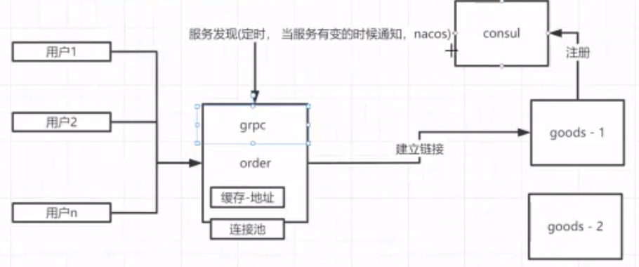
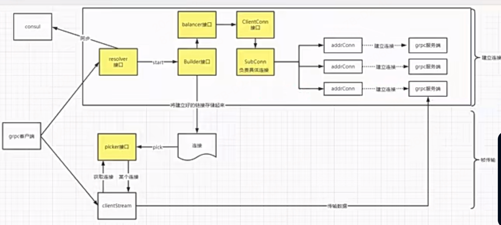

# 阶段9-自研微服务框架-gmicro

- 代码目录见`jieduan9-自研微服务框架-gmicro/mxshop`

- 讲解目的是：将原来的grpc微服务和客户端的原生对接写法改成这种mvc分层写法，并使用微服务标准目录划分架构
  - 如app下的user用户微服务，服务端使用mvc模式，最终还是会注册到grpc-proto构建提供的`.RegisterUserServer`中
    - 客户端还是使用grpc-proto提供的`NewUserClient`去链接服务端的controlle层的方法

## 26周 三层代码结构

- 课件演示代码目录见`jieduan9-自研微服务框架-gmicro/mxshop/app/user/srv`
1章 3层代码结构规范

### 1-1 导入common和app包
见`jieduan9-自研微服务框架-gmicro/mxshop/pkg`下的common和app公共包，可以在mxshop/app应用目录各个微服务应用中快速引入初始化项目
### 1-2 通过app启动配置文件映射和flag映射
### 1-3 重构app启动项目
### 1-4 app启动的原理
### 1-5 已有代码存在哪些耦合

我们前面开发的mxshop_srvs项目和mxshop-api项目，每个handler中逻辑内部有很多耦合地方，handler直接依赖的grpc的代码，耦合了很多模块硬编码直接用：下面想换哪一个都得全量改代码

- RPC 想换（zRPC → 其他）
- ORM 想换（GORM → 原生 SQL / 其他）
- Web 框架想换（Gin → go-zero/kratos）
- 注册中心想换（Consul → Nacos/K8s）
- 缓存想换（Redis → 内存 /memcache）
- 一句话终极解决方案：你缺的是：接口抽象 + 依赖倒置（DI）+ 分层架构
- 只要把底层全部抽成接口，上层只依赖接口，不依赖具体实现 → 想换啥换啥，一行业务代码不改！
### 1-6 三层代码结构降低代码耦合
```js
controller层（参数校验，调用servicec接口）
    接收 HTTP / RPC 请求
    参数校验
    组装请求 → 传给 service
    返回统一响应
    只和前端交互
    暴露结构：VO (View Object) 视图对象 (Request/Response)，专门给页面接口展示用，美化、聚合、格式化数据
service层（具体的业务逻辑）
    真正的业务逻辑
    事务
    调用 data 层（DB/RPC/Cache）
    组合多个 data 数据源
    完全不关心底层用什么 GORM/RPC/Redis
    暴露结构：DTO / BO（Business Object）跨层传输数据，前端请求、接口返回都用它。
data层（数据库的接口）
    DB 操作（GORM / 原生 SQL）
    RPC 调用（zRPC/grpc）
    缓存（Redis）
    只做数据读写，无业务逻辑
    暴露结构：DO (Data Object)，和数据库表一一对应，纯粹存数据。
// 每层的对外暴漏的数据接口类型是不一样的
```

- 我们以原来的user服务和对应的user-web服务，为例，重构到当前的规范微服务目录架构`app/user`下
- 如在我们实际的微服务项目下`jieduan9-自研微服务框架-gmicro/mxshop/app/user`微服务下，首先分成srv和client两个大目录,每个目录就按照3层结构进行目录划分
- api目录下只放接口文档，如proto文件，swagger文档等，还可以加个版本号，作为二级目录（因为有可能不同的服务依赖我们不同的接口版本）

### 1-7 service层和data层的解耦

- 继续完善`jieduan9-自研微服务框架-gmicro/mxshop/app/user`服务的重构迁移，本节重点：将service层和data层的代码分离

- service层最终是要调data层，data下也是建个v1

### 1-8 DO、DTO、VO这些概念是什么


- 这些概念基于上面的3层结构进行划分的。
  - controller层主要负责接收请求和返回结果：前端请求进入系统时通常先绑定成 Request DTO，service处理完成后既可以返回 Response DTO 给 controller，再由 controller 转成 VO 响应给前端；也可以在简单项目里由 service 直接返回 VO。
  - service层内部主要使用 BO 承载业务语义和聚合数据，然后与 data 层通过 BO 转成 DO 或 PO 进行交互
  - data 层内部主要基于 DO 或 PO 最后再与外部依赖数据库服务进行 DAO 对接

1. DTO = 数据传输对象（跨层）
   1. Controller ↔ Service 跨层之间传输
   2. 请求 DTO：前端传过来的参数，controller 接收后传给 service
   3. 响应 DTO：service 返回给 controller 的数据，controller 再决定是否转成 VO 返回前端
   4. 更广义上，服务与服务之间的 RPC / HTTP 请求和响应对象，也都可以算 DTO
2. VO = 调用方展示专用
   1. 给前端页面看、给调用方展示”。它一般用于响应结果
3. BO（Business Object）业务对象
   1. 给谁用：Service 层（核心业务）
   2. 作用：承载业务逻辑、事务、聚合数据
   3. 特点：真正的业务核心，与前端 / 数据库无关
   4. 例子：商品 + 库存 + 价格 = 订单 BO
4. DAO（Data Access Object）数据访问接口
   1. 给谁用：DAO 层（数据访问层）
   2. 作用：定义数据库操作接口
   3. 特点：接口，不关心实现（可换 MyBatis/JPA/GORM）
5. DO（Data Object）数据对象
   1. 给谁用：DAO 实现层
   2. 作用：与数据库表一一对应
   3. 特点：纯数据库映射
6. PO 一般指 Persistent Object，DO 一般指 Data Object：在很多项目里两者都表示持久化层对象，通常和数据库表结构对应，实际常常不严格区分。区别更多取决于团队命名规范，而不是统一标准。为了避免混乱，项目里最好只保留一种命名
   1. 如果你们团队已经有 OrderDO，就别再来一个 OrderPO；如果已经叫 UserPO，那就统一都叫 PO

#### 一个经典业务场景：创建订单时整条链怎么流转

**整体流转概览**
```
前端JSON入参 → CreateOrderReqDTO
        ↓(Service查库补全、业务计算，拆4个BO)
OrderBaseBO订单主BO + OrderItemBO订单商品BO + OrderCouponBO优惠券核销BO + OrderPayBO订单支付BO（4类业务BO --- 对应5个DO ）
        ↓(BO→DO，入库生成orderId后回填外键)
OrderDO(主单)、OrderItemDO(明细)、OrderAddrDO(收货地址)、OrderCouponDO(优惠核销)、OrderPayDO(支付预记录) 【5DO对应5张表】
        ↓
CreateOrderRespDTO → OrderVO
```

##### 1、前端入参 + 请求DTO（不变，原始入参）
```json
{
  "user_id":1001,
  "address_id":88,
  "coupon_id":10,
  "pay_type":1,
  "items":[{"goods_id":20001,"num":2}]
}
```
```go
type CreateOrderReqDTO struct {
	UserID    int64                `json:"user_id"`
	AddressID int64                `json:"address_id"`
	CouponID  int64                `json:"coupon_id"`
	PayType   int                  `json:"pay_type"` // 1微信 2支付宝
	Items     []CreateOrderItemDTO `json:"items"`
}
type CreateOrderItemDTO struct {
	GoodsID int64 `json:"goods_id"`
	Num     int   `json:"num"`
}
```

##### 2、DTO → 拆分4组BO（Service查数据、算金额、补全业务字段，无OrderID）
```go
// BO1：订单主体基础BO（用户、金额汇总、收件人信息）
type OrderBaseBO struct {
	UserID         int64
	AddressID      int64
	CouponID       int64
	ReceiverName   string
	ReceiverMobile string
	AddressDetail  string
	GoodsTotal     int64  // 商品原价合计
	CouponDeduct   int64  // 优惠券抵扣
	Freight        int64  // 运费
	RealPay        int64  // 实付金额
	PayType        int    // 支付方式
}

// BO2：商品明细BO（多条商品循环生成）
type OrderItemBO struct {
	GoodsID   int64
	GoodsName string
	SellPrice int64
	BuyNum    int
	LeftStock int  // 当前商品剩余库存
	ItemSub   int64 // 单品小计
}

// BO3：优惠+支付附属BO（拆成两个子业务BO，合并为一组业务域）
// 优惠券核销业务BO
type OrderCouponBO struct {
	CouponID    int64
	DeductMoney int64
	CouponRule  string // 优惠规则描述：满300减20
}
// 订单预支付BO（下单预创建支付单）
type OrderPayBO struct {
	PayType    int
	NeedPayAmt int64
	ExpireTime int64 // 支付超时时间戳
}
```
> 关键：**所有BO阶段无OrderID**，主键入库生成后才注入DO。

##### 3、4BO → 5DO（一一映射5张数据库表，入库后补OrderID外键）
##### 对应数据表
`t_order(主单)、t_order_item(明细)、t_order_receive_addr(订单收货地址)、t_order_coupon_record(优惠券核销记录)、t_order_pay_record(支付预订单)`
```go
// DO1：t_order 订单主表
type OrderDO struct {
	ID             int64 `db:"id"` // 入库自增orderId
	UserID         int64
	GoodsTotal     int64
	CouponDeduct   int64
	Freight        int64
	RealPay        int64
	PayType        int
	OrderStatus    int // 1待支付
}

// DO2：t_order_item 商品明细表
type OrderItemDO struct {
	ID        int64 `db:"id"`
	OrderID   int64 `db:"order_id"` // 后置填充
	GoodsID   int64
	GoodsName string
	SellPrice int64
	BuyNum    int
	ItemSub   int64
}

// DO3：t_order_receive_addr 订单收货地址快照表
type OrderAddrDO struct {
	ID             int64 `db:"id"`
	OrderID        int64 `db:"order_id"`
	ReceiverName   string
	ReceiverMobile string
	AddressDetail  string
}

// DO4：t_order_coupon_record 优惠券核销记录表
type OrderCouponRecordDO struct {
	ID          int64 `db:"id"`
	OrderID     int64 `db:"order_id"`
	CouponID    int64
	DeductMoney int64
	CouponRule  string
}

// DO5：t_order_pay_record 支付流水预订单
type OrderPayDO struct {
	ID         int64 `db:"id"`
	OrderID    int64 `db:"order_id"`
	PayType    int
	PayAmount  int64
	ExpireTime int64
	PayStatus  int //0未支付
}
```

##### 4、入库执行逻辑（事务内分步）
```go
// 1. BaseBO→OrderDO，插入主单，拿到生成orderId
orderDO := base2OrderDO(baseBO)
db.Insert(&orderDO) // 操作DAO数据库接口
orderId := orderDO.ID

// 2. 剩余全部DO统一回填OrderID
// 明细
itemDOList := itemBO2ItemDO(itemBOList)
for _, item := range itemDOList {item.OrderID = orderId}
// 地址快照
addrDO := base2AddrDO(baseBO)
addrDO.OrderID = orderId
// 优惠记录
couponDO := couponBO2CouponDO(couponBO)
couponDO.OrderID = orderId
// 支付预单
payDO := payBO2PayDO(payBO)
payDO.OrderID = orderId

// 3. 同一事务批量插入剩余4类DO，任意失败整体回滚
batchSave(itemDOList,addrDO,couponDO,payDO)
```

##### 5、出库返回：RespDTO → VO
```go
// Service层：内部响应DTO
type CreateOrderRespDTO struct {
	OrderID     int64
	RealPay     int64
	GoodsTotal  int64
	DeductAmt   int64
	PayExpireTs int64
	Status      int
}
// controller层： ---> 前端展示VO（状态码转文案、按需裁剪字段）
type OrderVO struct {
	OrderID     int64  `json:"order_id"`
	TotalPrice  int64  `json:"total_price"`
	PayPrice    int64  `json:"pay_price"`
	StatusText  string `json:"status_text"` //待付款
	PayDeadline string `json:"pay_deadline"`//格式化时间
}
```

#### 总结：你最该记住的不是定义，而是“职责变化”

这几个对象不是为了显得高级，而是为了让每一层只管自己的事：
- DTO 只关心“传进来什么”
  - 前端 → 后端（大而全）
  - 一个dto拆成多个业务域BO
- BO 只关心“业务怎么算、怎么执行”
  - 业务领域对象（按业务拆分）
  - 1 个 BO = 处理一块完整业务
  - 1 个 BO = 对应多张表
- DO 只关心“数据库怎么存”
  - DO：数据库表映射（一张表一个 DO）
- VO 只关心“前端怎么展示”
- DAO 操作库的统一抽象接口
```js
// 举例：
DTO（前端大对象）
↓ 拆分
ShopBO（店铺 BO）
ProductBO（商品 BO）
↓ 再拆分入库
ShopDO（店铺表）
ShopExtDO（店铺扩展表）
ProductDO（商品表）
ProductSkuDO（商品 SKU 表）
ProductDetailDO（商品详情表）
```

1. **新增一个业务BO → 一般新增1~2张表→新增对应DO**
   例：加「发票BO」→ `t_order_invoice` → InvoiceDO；加「物流BO」→`t_order_delivery`→DeliveryDO
2. **BO按业务域拆分，DO严格按数据表拆分**，这是分层设计核心
3. BO只关心业务规则、数据补全；DO只关心库表映射、外键关联

- 为什么要分这么多层？（你最关心）
  - 解耦！解耦！解耦！
  - 换数据库 → 主要改 DO
  - 换 ORM → 主要改 DAO
  - 换前端展示 → 主要改 VO
  - 改业务规则 → 主要改 Service / BO
  - 接口参数变 → 主要改 DTO
  - 分层的价值不是“业务逻辑永远不动”，而是“改动范围尽量可控”

### 1-9 service层的代码如何做到可测试性？

`jieduan9-自研微服务框架-gmicro/mxshop/app/user/srv/service/v1/user.go`文件中List方法为例，如何关于指定数据层的响应结果来做到可测试性

- 想做到可测试性，就不能固定调用数据操作接口，返回单一的数据层响应结果，而是应该将数据操作接口定义为一个抽象的接口类型，数据data层可以设计不同鸭子类型实现这个接口，这样就可以在测试的时候，自由地选择使用不同鸭子类型数据操作方法，来模拟数据库响应结果
  - 所以在data层先实现一个抽象接口，不要直接暴露写死的结构体如：`jieduan9-自研微服务框架-gmicro/mxshop/app/user/srv/data/v1/user.go`文件
  - 然后在data/v1下根据这个接口实现不同的结构体如见：`db/user.go目录文件和mock/user.go目录文件`，这样通过接口的机制外界动态注入mock和db的接口实现就做到了可测试性
  - `service/v1/user.go`文件中去使用抽象接口userStore类型，和注入具体的实现结构体方法mock的或真实db的，具有可测试性
  - `service/v1/user_test.go`: 测试用例就可以直接动态注入mock类型

### 1-10 controller层如何减少对service层的依赖？

- `jieduan9-自研微服务框架-gmicro/mxshop/app/user/srv/service/v1/user.go`文件中，对controller层仍然是暴露的是抽象的接口interfce
  - 即`type UserSrv interface {`
- 在controller层中使用这个UserSrv interface，它就不用在对外暴漏接口了（因为它已经是最顶层了），它直接实现具体方法就行了
  - `jieduan9-自研微服务框架-gmicro/mxshop/app/user/srv/controller/user/user.go`中使用
- 最终实际消费controller层的是初始化注册gprc服务时消费的`jieduan9-自研微服务框架-gmicro/mxshop/app/user/srv/wire_gen.go`

### 1-11 使用copier简化do和dto之间的拷贝转换

- copier库的使用demo见:`jieduan9-自研微服务框架-gmicro/cp`目录
- copier 就是结构体自动复制工具，同名字段自动复制，不同名用标签指定，你的 DTO/BO/DO 转换全靠它！
  - Copier 几乎能拷贝 Go 里 99% 你在 DTO/BO/DO 中会用到的类型：数字、字符串、bool、结构体、切片、指针、嵌套结构、兼容类型转换 全部支持！

- 核心用法：`copier.Copy(&目标, &源) // 将2参 拷贝到 1参，务必传指针！`,


使用demo文件中代码展示的 copier 8 大核心功能你必须记住！
1. 同名字段自动拷贝
   1. Name → Name
   2. Age → Age
2. 字段别名拷贝 copier:"别名"
   1. User.EmployeeCode → Employee.EmployeeId
   2. 靠 copier:"EmployeeNum" 关联
3. 忽略字段 copier:"-"
   1. Salary 不拷贝
4. 方法 → 字段 自动拷贝
   1. User.DoubleAge() → Employee.DoubleAge
   2. 方法名 = 目标字段名
5. 字段 → 方法 自动调用
   1. User.Role → 自动调用 Employee.Role(role string)
6. must 必须拷贝
   1. copier:"must"：拷贝不到直接报错
7. 结构体 ↔ 切片 自动转换
   1. struct → slice
   2. slice → slice
8. map ↔ map 自动类型转换
   1. map[int]int → map[int32]int8


#### 原理和性能问题

- Copier 本质就是：利用 Go 反射（reflect）遍历结构体字段，自动赋值。
- 工作流程：
  - 传入 源结构体 + 目标结构体（都是指针）
  - 使用 reflect 获取两者的类型、字段、方法
  - 遍历每一个字段
  - 名字相同 → 拷贝
    - 有 copier:"xxx" 标签 → 按标签匹配
    - 有 copier:"-" → 跳过
- 性能数据（真实对比）以单个结构体拷贝为例：
  - 手写赋值 a=b：最快，0 分配内存
  - Copier：较慢一点，因为反射 + 遍历 + 内存分配
- 如果未来你做超高并发，可以换：
  - gomap
  - structs
  - 代码生成工具（go generate）
  - 手写赋值（最快）

## 27周 grpc服务封装更方便的rpc服务

### 1章 通用微服务框架需求

- 这章我们主要开发通用微服务框架代码目录见`jieduan9-自研微服务框架-gmicro/mxshop/gmicro` 
  - 这个作为通用微服务框架，mxshop这个业务微服务项目作为上层应用，基于这个通用微服务框架扩展开发
- gmicro框架-一句话：把每个微服务都要重复写的“启动样板代码”收敛掉。
  - 比如一个微服务进程，本来都要自己处理：
    - 启动 gRPC/HTTP
    - 绑定端口
    - 注册到 consul
    - 记录服务实例地址
    - 监听 SIGTERM / SIGINT退出前反注册
    - 优雅停机
    - 这些通用动作，gmicro 统一封装在 gapp.New() 和 Run() 里。
  - 例如 Run() 做的就是：
    - 组装实例信息 buildInstance()
    - 启动 REST / RPC server
    - 注册到注册中心
    - 监听系统信号
    - 出现错误或收到信号时触发 Stop()
    - 反注册并通知各 server 优雅退出
  - 使用上，一个微服务的创建就实例化一次gmicro进行快速初始化微服务的一些基础功能，一个 Run() 一般对应 一个微服务实例进程。
    - 如user 服务一个 Run()，goods 服务一个 Run()

#### 1-1 为什么需要自己开发微服务框架？

- 文档见`jieduan9-自研微服务框架-gmicro/mxshop/gmicro/doc.go`

为什么不用开源的go-zero，kratos，而是要自己开发一个

1. Go 生态暂无类似 Java Spring 的大一统标准框架，Kratos、go-zero、Kitex 等多框架并行发展，技术路线尚未定型。项目若重度绑定某一款开源框架，后续框架迭代停滞、架构改版时，业务系统迁移改造风险与成本极高。
2. 规避内部技术栈分裂风险：若团队无统一底座约束，不同开发人员会依据个人习惯选用 Kratos/go-zero 等不同框架，造成各服务技术规范割裂、组件依赖不一致、运维成本陡增。自研框架可统一公司内部技术标准。
3. 摆脱开源框架组件绑定约束：Kratos、go-zero 为一体化框架，内置日志、监控、配置、数据组件，存在强框架绑定；框架自带组件无法适配企业定制化需求时，替换、改造原有组件成本高昂，难以落地公司个性化基建方案。
4. 适配业务定制化能力：现有开源框架为通用化设计，无法贴合公司特有业务、运维需求（例如定制日志落盘至 Eger、自研全链路埋点、内部监控规范、特殊中间件适配等个性化能力）。
5. 守住团队底层架构自研能力：开源框架可作为技术参考，但不能全盘依赖；长期直接使用封装完备的框架，会逐步丧失自主搭建、改造底层基建的技术储备，遇到疑难底层故障无自主排障能力。
6. 以自研驱动团队吃透底层原理：从零基于 Gin+gRPC 搭建框架，是熟悉 RPC 通信、HTTP 中间件、日志链路、注册发现、限流熔断等底层细节最有效的落地方式，可按需定制能力（如自定义日志输出到 Eger）。
7. 规避开发人员能力固化：多数研发直接使用成熟框架时，依赖框架封装能力，疏于研读底层源码、理解实现原理，长期沦为仅能编写 CRUD 的业务开发人员；自研框架倒逼研发深挖原理，提升团队整体技术深度。
8. 最终落地方案：以 Gin 承载 HTTP 网关 / 对外接口、gRPC 实现内部微服务通信，在二者基础上封装公司统一微服务底座，整合统一配置、日志、链路追踪、异常处理、注册中心、中间件封装等基础能力

#### 1-2 微服务框架应该具备的功能
- 课件文档见`jieduan9-自研微服务框架-gmicro/mxshop/gmicro/app/doc.go`
- **微服务框架:**
   - 抽取出公共的服务，可以让我们快速的启动项目，当我们需要某些功能的时候通过配置文件或者具体的实现接口，
   - 微服务框架抽取出来的是业务无关的功能，很难做到和具体业务相关

- 框架到底做什么
  - 快速初始化项目
    - 一套脚手架即可快速创建服务，统一目录结构、统一启动模式、统一规范。
  - 提供可插拔的通用能力
    - 所有功能通过配置文件或实现标准接口即可启用，无需关心底层实现。
    - 例如：日志、配置、链路追踪、监控、限流、熔断、鉴权、服务注册发现、数据库连接、Redis 连接、消息队列等。
  - 统一技术规范与标准
    - 统一错误码、统一返回格式、统一中间件机制、统一部署规范。
- 最重要的边界：框架只做「业务无关」
  - 微服务框架抽取的是与业务无关的通用能力
- 框架提供的是 “能力”，不是 “业务流程”
  - 正因为无关业务，框架才能在所有微服务中通用，才能支撑公司所有业务线。


- 一、微服务框架技术栈
  - HTTP 服务：Gin
  - RPC 服务：gRPC
  - 整体模式：支持 HTTP + gRPC 双端口同时启动
  - 定位：轻量级、业务无关、可插拔、非强绑定
- 二、微服务框架启动时即app入口启动时必须做的事情（核心流程）
  - 启动 gRPC 服务
    - 注册服务实现
    - 配置监听地址
    - 加载拦截器（链路、日志、限流、鉴权）
  - 启动 HTTP (Gin) 服务
    - 注册路由
    - 加载全局中间件（recovery、请求日志、跨域、鉴权）
  - 内置 pprof 性能分析接口
    - 方便线上性能排查
    - 可配置开关
  - 自动暴露 Metrics 监控接口
    - 监控指标接口（Prometheus 友好）
    - 无需业务人员关心
  - 自动注册健康检查接口（Health）
    - HTTP /health
    - gRPC Health Check
    - 给 K8s / 网关 / 注册中心使用
  - App 核心与 Gin/gRPC 解耦
    - 不直接强依赖框架
    - 提供统一启动接口
    - 便于未来替换底层 HTTP/RPC 框架
  - 可选：自动服务注册
    - 注册到 etcd/consul/nacos
    - 支持开关控制
  - 优雅退出（Graceful Shutdown）
    - 监听退出信号
    - 先停止流量
    - 再关闭服务
    - 最后释放资源
  - 启动日志全流程打印
    - 服务启动成功 / 失败
    - 端口、模式、环境、配置来源
    - 便于快速排查问题
  - 系统信号处理
    - 监听 SIGINT、SIGTERM 等退出信号
    - 退出前可写入进程状态、日志、打点
    - 信号策略交给使用者决定
- 三、启动服务必须考虑的细节（关键点）
  - 服务启动顺序必须可控
  - 组件初始化失败应直接退出
  - 双端口（HTTP + gRPC）要能同时启动与关闭
  - 中间件必须可插拔
  - 监控、健康检查、pprof 必须自动注入
  - 优雅关闭要保证不丢请求
  - 配置文件变更可以热加载（可选）
  - 错误统一输出，便于定位
  - 框架不侵入业务代码
  - 所有能力可通过配置开关

#### 1-3 通过函数选项模式启动app

- 代码见`jieduan9-自研微服务框架-gmicro/mxshop/gmicro/app/app.go`
  - 作为框架的入口文件
- 加个函数选项模式单独文件：`jieduan9-自研微服务框架-gmicro/mxshop/gmicro/app/options.go`
#### 1-4 实现服务注册的抽象
- 代码继续见`jieduan9-自研微服务框架-gmicro/mxshop/gmicro/app/app.go`
1. 实现监听退出信号
2. 实现注册服务逻辑
   1. 定义了服务注册接口，不具体硬编码consul的注册逻辑，而是抽象接口先行，
      1. 见`jieduan9-自研微服务框架-gmicro/mxshop/gmicro/registry/registry.go`
#### 1-5 服务注册的监听实现原理

- 前面实现服务注册的接口，还得配套实现一个服务发现的抽象接口
  - 代码见`jieduan9-自研微服务框架-gmicro/mxshop/gmicro/registry/registry.go`
  - 服务发现接口必须有一个`Watch`方法：
    - 因为不可能每次来一个请求，都去临时去服务发现中获取服务列表，太耗时，正常情况下，需要有一个Watcher监听服务发现系统的服务列表状态变化，监听到变化缓存到本地中，下次来请求直接从缓存中读取
      - Watcher逻辑：它不是事件回调 / 事件订阅模式！它是阻塞式获取 + 循环调用 Next () 的模型
    - 还有每次来请求从缓存读取后，也不是临时去向注册的服务地址建立链接，一般会提前建立起长链接，本地维护一个链接池，来请求直接快速调用到对方
    - 
- 接着实现`jieduan9-自研微服务框架-gmicro/mxshop/gmicro/app/app.go`下的stop方法

#### 1-6 如何封装rpc和http服务？

主要是引出`jieduan9-自研微服务框架-gmicro/mxshop/gmicro/app/options.go`的restServer和rpcServer两个配置选项字段，通过外界配置的服务方法，我们直接调用即可，不需要将具体逻辑写死在app中

字段对应的类型具体方法实现下面章节讲

### 2章 开发通用的rpc服务
- rpc服务和http服务封装的代码新建见`jieduan9-自研微服务框架-gmicro/mxshop/gmicro/server`
  - rpc服务模块需要rpc服务端和rpc客户端都在这个目录中一起实现
#### 2-1 rpc的server数据模型设计

- 主要先实现最基本的rpc的server结构体设计，见：`jieduan9-自研微服务框架-gmicro/mxshop/gmicro/server/rpcserver/server.go`


#### 2-2 rpc服务启动过程中的拦截器和rpc接口反射等功能
- 继续实现见：`jieduan9-自研微服务框架-gmicro/mxshop/gmicro/server/rpcserver/server.go`
**重点掌握**
- 默认加的拦截器们中的grpc全链路追踪官方拦截器
  - 之前的课程中使用的是开源的 gRPC + OpenTracing 集成库`otgrpc`（自动帮你处理Inject/Extract/父子Span）三方库
      - 只包含Tracing能力
  - 本节我们使用otelgrpc库 是新的 OpenTelemetry（推荐），后面都用这个
    - 包含Trace + Metrics + Logs3大能力
- `google.golang.org/grpc/reflection`grpc的反射功能：`reflection.Register(srv.Server)`
  - 作用：允许客户端在运行时动态查询服务端注册了哪些 Service、Method，以及对应的 Message 类型和字段定义，而无需预先持有 .proto 文件或生成客户端代码
    - 反射就是在服务启动时，将编译好的 .proto 描述符（FileDescriptor）加载到服务端的内存中，构建出一个内存注册表。
      - 当你调用 reflection.Register(s) 时，gRPC 框架会遍历当前进程中所有已经注册的 gRPC Service，自动提取它们底层的 Protobuf Schema 信息（包含服务名、方法签名、消息结构等），并将这些元数据缓存起来
      - 当外部工具（如 grpcurl）需要获取接口信息时，本质上就是发起了一次普通的 gRPC 远程调用
    - 列举服务列表
    - 列举所有 RPC 方法
    - 获取参数 / 返回值结构
    - 直接调用接口
  - 如果不开启反射，gRPC 天生是强契约协议，不开启反射 → 必须用 .proto 文件才能查看 / 调用服务。
    ```go
    // 如官方推荐的grpcurl命令行工具
    grpcurl \
      -import-path . \       # proto 文件所在目录
      -proto user.proto \    # 指定你的 proto 文件
      -d '{"id":1}' \        # 请求参数
      192.168.1.103:8088 \   # 服务地址
      user.UserService/GetUser  # 服务名/方法名
    ```
- `mxshop/api/metadata`拷贝的kratos的metadata功能,元数据服务
  - Kratos 团队为了解决“gRPC 反射功能无法通过 HTTP 直接访问”这一痛点而设计的方案。它将原生 gRPC 的二进制反射能力，映射成了标准的 RESTful API
  - 必须依赖服务端先开启 gRPC 反射（Reflection）才能正常工作
#### 2-3&4缺失
#### 2-5 service的timeout的拦截器实现原理
- 继续实现见：`jieduan9-自研微服务框架-gmicro/mxshop/gmicro/server/rpcserver/server.go`
  - 集成到`append(unaryInts, srvintc.UnaryTimeoutInterceptor(srv.timeout))`方法中
- 添加超时控制拦截器 --- 直接照搬的go-zero框架的内部拦截器实现
  - 拦截器源码见`jieduan9-自研微服务框架-gmicro/mxshop/gmicro/server/rpcserver/serverinterceptors/timeoutinterceptor.go`

#### 2-6 app中如何启动gmicro的rpc服务
我们将刚才封装的基本通路给mxshop项目app层调用，并启动rpc服务，流程串联起来
1. 我们首先mxshop业务项目运行入口的是cmd目录 ，cmd运行后会进入到app目录执行，如执行的user服务，就会到app/user/srv
   1. `cmd模块`：jieduan9-自研微服务框架-gmicro/mxshop/cmd/user/user.go
      1. 执行"mxshop/app/user/srv"的`NewApp("user-server").Run()`
         1. `run(cfg)`：cfg就是mxshop/app/user/srv/config初始化的配置
            1. `initApp`(传入相关配置option)
               1. `NewUserRPCServer`（使用配置）
               2. `NewUserApp`（使用配置）
2. 我们只需要在run方法中集成我们gmicro框架功能即可，集成后才会真正启动gmicro运行时微服务，重点是内部的`NewUserApp`方法内部流程如下：
   1. 先引入gmicro包：`gapp "mxshop/gmicro/app"`
   2. 需要1. 初始化日志系统（根据配置加载日志）
      1. 其中还需要`jieduan9-自研微服务框架-gmicro/mxshop/configs/user/srv.yaml`写一个user专用的配置文件，如配置了log的配置，则需要将log的配置写到user的srv.yaml中
      2. 后续从docker文件启动时会传入这个配置内容，`jieduan9-自研微服务框架-gmicro/mxshop/app/user/srv/config/config.go`中会调用log库的命令行解析配置功能
      3. 配置内容在run方法的行参中传进来的
   3. 集成使用gmicro包的方法，组装并创建应用实例 `return gapp.New(`
      1. 作用：把 服务名、RPC服务具体方法、注册服务具体方法 传进New方法进行执行创建
      2. 具体rpc服务和注册服务具体方法不是直接写在NewUserApp这里，是上层调用链实参传进来的。
         1. rpc服务：在单独的文件`./rpc.go`封装下NewUserRPCServer方法，由初始化方法`app/user/srv/wire_gen.go`调用`NewUserApp`传参传进来使用
            1. 其中的对应的配置选项单独维护在`jieduan9-自研微服务框架-gmicro/mxshop/app/pkg/options/server.go`
               1. 配置一些最上层的ip地址和端口号之类的

## 28周 深入grpc的服务注册与负载均衡原理
就一章：服务注册、服务发现和负载均衡

### 1-1 配置-服务注册配置

1. 先在`jieduan9-自研微服务框架-gmicro/mxshop/app/pkg/options/registry.go`，在入口层单独维护注册中心的配置文件，未来传入这个配置参数
2. 再统一在`mxshop/app/user/srv/config/config.go`中调用专门解析配置文件的配置方法，配置这个registry的配置
   1. 后续run方法中就会自动接受到这个解析好的配置参数 
### 1-2 kratos对consul服务注册的封装

- 基于gmicro框架定义的服务注册接口，解耦封装上层用的服务注册功能
  - 我们这里直接拷贝kratos的consul源码，并修改成适配我们的接口
  - 熟悉下consul中的调用链路
  - 对外只暴漏个`New`方法，返回一个服务注册实例

- 见`jieduan9-自研微服务框架-gmicro/mxshop/gmicro/registry/consul`

### 1-3 将服务注册到consul中

前面封装好了consul，看下在gemicro中如何使用这个consul，将微服务注册进来
- 然后在`NewUserApp`方法中集成注册consul服务
  - 主要在`jieduan9-自研微服务框架-gmicro/mxshop/app/user/srv/app.go`实现NewRegistrar方法
    - 在调用方手动创建consul-api客户端实例传进前面封装的框架提供的consul注册的`New`方法,返回一个服务注册实例
  - 然后在`NewUserApp`的`gapp.New(`中注入这个服务注册实例
### 1-4 客户端封装的数据结构设计

- 主要开始封装`jieduan9-自研微服务框架-gmicro/mxshop/gmicro/server/rpcserver/client.go` rpc的客户端逻辑，之前讲的都是rpc服务端逻辑
  - 先定义客户端的基础配置结构体：`clientOptions`,包含rpc服务端地址，拦截器，服务发现，负载均衡名字，自定义日志等配置
    - 这里的自定义log参数不能直接传递默认log.logger,系统里面自带的logger含锁逻辑，参数值传递，直接就失效了，log可以只传限定的几个打印方法即可，通过gemicro的log库，暴漏一个log抽象接口，调用方只需传打印方法的接口实现即可

- 重要细节
  - 客户端逻辑中，会引用`gmicro/registry/registry.go`提供的服务发现接口和逻辑

### 1-5 封装dial方法进行客户端生成

- 主要封装Dial即客户端的拨号方法，分为安全链接和不安全链接的拨号方法
- 代码见`jieduan9-自研微服务框架-gmicro/mxshop/gmicro/server/rpcserver/client.go`的`DialInsecure(`法和`Dial(`方法
### 1-6 封装client端的imeout拦截器

- 前面封装好dial后，在`jieduan9-自研微服务框架-gmicro/mxshop/app/user/client/client.go`客户端代码进行链接测试
- 接着实现一个client的timeout拦截器
- （拦截器这块基本都是借箭参考的`go-zero`源码，的包括后续的tracing，熔断，普罗米修斯拦截器等）
### 1-7 grpc的服务发现的resolver接口
- 讲解下client端的服务发现内部调用原理
- 原来的项目中是直接引用的`grpc-consul-resolver`，实现的服务发现
  - 我们分析下这个包的源码实现，内部是如何解析协议的，实现一个什么样的接口
    - 它内部是基于grpc官方api：`"google.golang.org/grpc/resolver"`实现的consul版的服务发现
  - 见`jieduan3-0-1shixian-weifuwu-kuangjia/mxshop-api/goods-web/initialize/srv_conn.go`
  - 后面我们脱离consul解耦，基于`"google.golang.org/grpc/resolver"`实现自己通用解耦的服务发现
#### grpc服务发现相关原理概念

- gRPC 只定义了【服务发现接口】，没有内置任何现成实现！你必须自己实现，或者用第三方库！
  - 因为：服务发现组件太多，如下面协议
    - direct://       → 自己实现
    - consul://       → 第三方 grpc-consul-resolver 实现
    - etcd://         → 第三方 etcd resolver 实现
    - k8s://          → 第三方 k8s resolver 实现
  - gRPC 不可能内置所有，让框架可扩展，让开发者自定义，gRPC 只提供接口，不提供实现！
  - RPC服务发现底层只提供了 3 个接口让用户自己去封装吧！：
    - resolver.Builder   // 构造器（注册协议）
    - resolver.Resolver  // 解析器（去拿地址、监听变化）
    - resolver.ClientConn// 回调（把地址还给 gRPC）
- gRPC客户端拨号服务发现时的原理：`grpc.Dial("consul://127.0.0.1:8500/user-srv")`
  - 内部流程：
    - 解析 URL：scheme=consul、authority=127.0.0.1:8500、endpoint=user-srv
    - gRPC 全局 map 里找 scheme=consul 的 Builder实例
    - 调用 Builder.Build() 生成一个 Resolver
      - 归属：google.golang.org/grpc/resolver
      - 作用：服务发现
      - 干什么：通过协议（direct/consul/discovery）找到服务地址列表
      - 返回：Resolver
    - Resolver 负责：
      - 去 调用 外部registry.Discovery 抽象 --> 拉服务列表 (解耦)
        - 调用 registry.Discovery 抽象 -> 当前具体实现是客户端配置项传入的consul.Registry 注册服务具体实现
      - 持续 watch 变化
      - 把地址列表通过 cc.UpdateState() 喂给 gRPC
  - 核心就三个接口
      ```go
      // 1. Builder：工厂，注册 scheme
      type Builder interface {
          // 改成你想要的协议名，如 nacos、etcd。
          Scheme() string
          // 解析 target.Authority（注册中心地址）
          // 初始化你自己的注册中心客户端
          Build(target Target, cc ClientConn, opts BuildOptions) (Resolver, error)
      }

      // 2. Resolver：长连接监听
      type Resolver interface {
          ResolveNow(ResolveNowOptions) // 强制刷新
          Close()                         // 停止
          update() // 调用你的注册中心 API 获取服务实例列表
          watch() // 核心watch监听
      }

      // 3. ClientConn：回调，把地址塞给 gRPC
      type ClientConn interface {
          UpdateState(State) // State 里有 []Address
      }
      ```


### 1-8 自定义实现directBuilder实现服务发现器

我们脱离consul解耦，基于`"google.golang.org/grpc/resolver"`实现自己通用解耦的服务发现器

- gemicro中自定义服务发现器，代码见`jieduan9-自研微服务框架-gmicro/mxshop/gmicro/server/rpcserver/resolver` 
  - 客户端链接服务发现的两种连接方式：
    - 直连：客户端 → 写死 IP:Port → 服务端，让 gRPC 客户端不用注册中心，直接用地址连接具体的微服务地址
      - 如`direct:///127.0.0.1:8080`
        - 将原来的地址加上一个协议头和没有认证信息的话就三个斜杠，如：`direct:///127.0.0.1:8078`
        - 正常情况下非直连时authority是要写成注册中心地址即ip端口号地址的，直连的话它不需要 authority（不需要额外注册中心地址），只把 path 当成最终要连的地址，所以写成3个斜杠
      - **直连其实就是grpc没有集成服务发现的最原始链接模式，直接传入一个微服务地址**
        - 如：`jieduan2-dianshangxiangmu-weifuwu/week4-rpc-grpc/part4-grpc/grpc_test/client/client.go`
    - 注册中心响应：客户端 → 注册中心查询地址 → 服务端
      - 如`consul://127.0.0.1:8500/user-srv?wait=14s`
- 实现后，在`jieduan9-自研微服务框架-gmicro/mxshop/app/user/client/client.go`客户端代码进行直连模式的链接测试
  - 用法与`jieduan3-0-1shixian-weifuwu-kuangjia/mxshop-api/goods-web/initialize/srv_conn.go`类似
### 1-9 grpc的服务发现和负载均衡的原理



- grpc客户端有2条线，上面是链接resolver进行服务发现，下面的picker接口进行负载均衡
```go
ClientConn
  ↓（注册 scheme）
Resolver（consul/dns/direct）→ 拿到地址列表 [ip1, ip2, ip3]
  ↓ 把地址列表交给
Balancer（round_robin/pick_first/自定义）
  ├─ 为每个地址建 SubConn（长连接）
  ├─ 监控每个 SubConn 状态（READY/IDLE/TRANSIENT_FAILURE）
  └─ 生成 Picker接口
       ↓
每次 RPC → 调用 Picker.Pick() → 选出一个 SubConn 发请求
```
- Resolver：给地址列表
  - 归属：google.golang.org/grpc/resolver
  - resolver的Builder接口
    - 作用：服务发现
    - 干什么：通过协议（direct/consul/discovery）找到服务地址列表
    - 返回：Resolver
- Balancer：把所有地址变成可用连接，输出一个Picker接口
  - balancer.Builder （负载均衡用的）
    - 归属：google.golang.org/grpc/balancer
    - 作用：负载均衡
    - 干什么：管理连接、创建 SubConn、生成 Picker
    - 返回：Balancer
- Picker：每次请求，选一个连接（真正负载均衡，负载均衡算法本体）
- 架构里的位置上下层关系
  - 上层：resolver.Builder → 造 Resolver（服务发现）
    - 输出：地址列表 [ip1, ip2, ip3]
  - 下层：balancer.Builder → 造 Balancer（负载均衡）
    - 输入：地址列表
    - 输出：Picker（选连接）
### 1-10 通过WithResolvers显示指定resolver

现在接着实现自定义服务发现器的注册中心响应模式：客户端 → 注册中心查询地址 → 服务端

见`jieduan9-自研微服务框架-gmicro/mxshop/gmicro/server/rpcserver/resolver/discovery`

1. 本小节先使用`grpc.WithResolvers()`先给【本次 Dial 客户端】单独注册一个 `自定义的discovery的resolver 解析器`, 只给当前这一个 client 连接使用，支持可以动态传入注册中心客户端
   1. 不能使用原来直连模式的全局注册解析器的写法了，因为全局注册解析器是单例的，不能动态可扩展传入注册中心客户端
   2. 见`jieduan9-自研微服务框架-gmicro/mxshop/gmicro/server/rpcserver/client.go`中

- 所以这里不能再走全局单例注册，而是要在每次 [`grpc.DialContext()`](jieduan9-自研微服务框架-gmicro/mxshop/gmicro/server/rpcserver/client.go:166) 前，通过 [`grpc.WithResolvers()`](jieduan9-自研微服务框架-gmicro/mxshop/gmicro/server/rpcserver/client.go:144) 给“当前这一次连接”单独挂一个 resolver builder
- 这样每个 client 连接都可以有自己的 discovery 实现、自己的 consul/nacos 客户端、自己的超时配置，互不污染

核心流程：

```go
if options.discovery != nil {
	grpcOpts = append(grpcOpts, grpc.WithResolvers(
		discovery.NewBuilder(
			options.discovery,
			discovery.WithInsecure(insecure),
		),
	))
}
```

- 上面这段代码的关键点在于：[`discovery.NewBuilder()`](jieduan9-自研微服务框架-gmicro/mxshop/gmicro/server/rpcserver/resolver/discovery/builder.go:40) 返回的是一个“带状态的 builder”，里面保存了当前传入的 [`registry.Discovery`](jieduan9-自研微服务框架-gmicro/mxshop/gmicro/registry/registry.go:16)
- 当 gRPC 真正开始解析类似 `discovery:///user-srv` 这种目标地址时，会回调 [`builder.Build()`](jieduan9-自研微服务框架-gmicro/mxshop/gmicro/server/rpcserver/resolver/discovery/builder.go:55)
- 在 [`Build()`](jieduan9-自研微服务框架-gmicro/mxshop/gmicro/server/rpcserver/resolver/discovery/builder.go:55) 里，不是直接写死 consul，而是统一通过 [`b.discoverer.Watch()`](jieduan9-自研微服务框架-gmicro/mxshop/gmicro/server/rpcserver/resolver/discovery/builder.go:66) 创建 watcher
- 也就是说：resolver 层只依赖 discovery 抽象，不依赖 consul 具体实现

### 1-11 通过观察者模式实现服务发现

- 见 [`jieduan9-自研微服务框架-gmicro/mxshop/gmicro/registry/consul/registry.go`](jieduan9-自研微服务框架-gmicro/mxshop/gmicro/registry/consul/registry.go)、[`service.go`](jieduan9-自研微服务框架-gmicro/mxshop/gmicro/registry/consul/service.go) 和 [`watcher.go`](jieduan9-自研微服务框架-gmicro/mxshop/gmicro/registry/consul/watcher.go)
- 这一层真正实现了“观察者模式”
  - 被观察者：[`serviceSet`](jieduan9-自研微服务框架-gmicro/mxshop/gmicro/registry/consul/service.go:10)，内部维护某个服务名当前的实例列表，以及所有 watcher 订阅者
  - 观察者：[`watcher`](jieduan9-自研微服务框架-gmicro/mxshop/gmicro/registry/consul/watcher.go:9)，每个 resolver 拿到的就是一个 watcher
  - 事件通知：[`serviceSet.broadcast()`](jieduan9-自研微服务框架-gmicro/mxshop/gmicro/registry/consul/service.go:17)，实例变化后把事件投递给所有 watcher
- 当客户端调用 [`Registry.Watch()`](jieduan9-自研微服务框架-gmicro/mxshop/gmicro/registry/consul/registry.go:159) 时：
  1. 先找到或创建当前服务名对应的 [`serviceSet`](jieduan9-自研微服务框架-gmicro/mxshop/gmicro/registry/consul/service.go:10)
  2. 再创建一个当前连接专属的 [`watcher`](jieduan9-自研微服务框架-gmicro/mxshop/gmicro/registry/consul/watcher.go:9)
  3. 把这个 watcher 注册进 [`serviceSet.watcher`](jieduan9-自研微服务框架-gmicro/mxshop/gmicro/registry/consul/service.go:12)
  4. 如果当前已经有缓存实例，立即给 watcher 推一个初始事件，避免第一次阻塞
  5. 如果这个服务之前还没人监听，则启动 [`resolve()`](jieduan9-自研微服务框架-gmicro/mxshop/gmicro/registry/consul/registry.go:197) 后台协程轮询 consul
- [`resolve()`](jieduan9-自研微服务框架-gmicro/mxshop/gmicro/registry/consul/registry.go:197) 做两件事：
  - 首次从 consul 拉一次全量实例
  - 后台基于 consul index 持续阻塞查询，发现变化后调用 [`broadcast()`](jieduan9-自研微服务框架-gmicro/mxshop/gmicro/registry/consul/service.go:17)
- 而 resolver 侧的 [`discoveryResolver.watch()`](jieduan9-自研微服务框架-gmicro/mxshop/gmicro/server/rpcserver/resolver/discovery/resolver.go:27) 会一直调用 [`w.Next()`](jieduan9-自研微服务框架-gmicro/mxshop/gmicro/registry/registry.go:28)
- 一旦 watcher 收到通知，就从 [`serviceSet.services`](jieduan9-自研微服务框架-gmicro/mxshop/gmicro/registry/consul/watcher.go:25) 里拿最新实例，再交给 [`r.update()`](jieduan9-自研微服务框架-gmicro/mxshop/gmicro/server/rpcserver/resolver/discovery/resolver.go:47) 转成 gRPC 可识别的地址列表
- 最终通过 [`cc.UpdateState()`](jieduan9-自研微服务框架-gmicro/mxshop/gmicro/server/rpcserver/resolver/discovery/resolver.go:76) 通知 gRPC 连接池刷新可用节点

#### discovery 与 consul 的关系

可以按“分层职责”理解：

- [`registry.Discovery`](jieduan9-自研微服务框架-gmicro/mxshop/gmicro/registry/registry.go:16) 是抽象接口，定义“怎么查服务、怎么订阅服务变化”
- [`consul.Registry`](jieduan9-自研微服务框架-gmicro/mxshop/gmicro/registry/consul/registry.go:81) 是这个抽象的一种具体实现，它底层用 consul 完成服务查询与监听
- [`resolver/discovery`](jieduan9-自研微服务框架-gmicro/mxshop/gmicro/server/rpcserver/resolver/discovery) 是 gRPC 适配层，负责把 discovery 返回的服务实例列表翻译成 gRPC 地址

所以关系不是“discovery 和 consul 谁包含谁”，而是：

```text
客户端 Dial
  -> gRPC discovery resolver
      -> 调用 registry.Discovery 抽象
          -> 当前具体实现是 consul.Registry
              -> consul 查询服务实例 / 监听变化
                  -> 返回 ServiceInstance 列表
      -> resolver 转成 gRPC 地址
  -> gRPC 与服务端建立连接
```

一句话：**discovery 是接口能力层，consul 是 discovery 的一种实现，resolver/discovery 是把这套能力接到 gRPC 上的桥接层。**

### 1-12 测试consul的服务发现功能
- 见`jieduan9-自研微服务框架-gmicro/mxshop/app/user/client/client.go`
### 1-13 grpc的负载均衡架构原理

- 为什么要自定义实现？---- 首先封装一个gemicro微服务框架肯定要支持可扩展性，不能内置写死
  - gRPC 官方自带的负载均衡：`grpc.WithDefaultServiceConfig({"loadBalancingPolicy": "round_robin"})`
    - 启用 gRPC 官方自带的简陋负载均衡策略
    - 官方不能运行时动态切换负载均衡算法
    - 官方无法传递节点元数据（权重、区域、机房、版本）
    - 官方 balancer 不易做高级策略
      - 权重轮询
      - 同机房优先
      - 流量染色
      - 服务版本路由
      - 自定义熔断、降级、限流
      - 官方完全不支持！
  - 我们自定义的selector目录，就是为了 替换 掉这个官方 round_robin策略！
    - 可自定义任意扩展（随机、轮询、权重、一致性哈希、同机房优先）
    - 能拿到服务实例元数据
    - 微服务生产级必备

前面的架构图可以看到，自定义实现负载均衡重点是要实现`picker`和`banlancer`2大接口

- 先看文档说明：`jieduan9-自研微服务框架-gmicro/mxshop/gmicro/server/rpcserver/selector/doc.go`
  - Builder接口返回一个Balancer，与之前resolver的Builder返回一个Resolver，不要混
- 我们要自行实现解耦的这个banlancer
  - 源代码见`jieduan9-自研微服务框架-gmicro/mxshop/gmicro/server/rpcserver/selector/`
    - 和 单独的封装文件 `jieduan9-自研微服务框架-gmicro/mxshop/gmicro/server/rpcserver/balancer.go`
  - 主要在客户端中使用见：`jieduan9-自研微服务框架-gmicro/mxshop/app/user/client/client.go`
      - selector.SetGlobalSelector(random.NewBuilder()) // 1. 定义用【随机】算法
      - rpc.InitBuilder()                               // 2. 把自定义 selector 注册给 gRPC
      - 然后你们使用：rpc.WithBalancerName("selector")
        - 它内部`jieduan9-自研微服务框架-gmicro/mxshop/gmicro/server/rpcserver/client.go`就是`grpc.WithDefaultServiceConfig({"loadBalancingPolicy": "` + options.balancerName + `,
          - 还是grpc设置默认负载均衡的写法，换上自定义的策略名字
      - 最终效果：**gRPC 不再使用官方的 round_robin而是使用你们自研的、可随时切换算法的 selector！**
- 


### 1-14 grpc负载均衡源码分析

- 略，需要再看
- 豆包总结如下：
  1. resolver 从 Consul 拿到节点列表
  2. 交给 gRPC 内部 balancer
  3. balancer 调用你们的 Build()
  4. 把节点转换成你们的 Node
  5. 每次请求 → 调用 Pick()
  6. Pick() → 调用你们自己的 Select()
  7. 选择一个节点 → 发起请求
### 1-15 pickfirst和roundrobin源码分析

- 略，需要再看
- 源码文件在源码里的`roundrobin.go`

### 1-16 kratos负载均衡源码分析

- 我们直接从kratos框架源码中搬运过来的相关的源码实现，课程中老师直接提供好的压缩包 
  - 压缩包包含：搬运后，稍微改下适配下当前项目的引用路径
- 解压在`jieduan9-自研微服务框架-gmicro/mxshop/gmicro/server/rpcserver`下多2个文件
  - selector目录
  - balancer.go文件（详细原理见文件注释）
- 这一块本质上是：**复用 gRPC 自己的连接管理能力，只把负载均衡算法策略这件事替换成我们自己的策略**
  - 实现后对外暴漏的入口文件有2个：`rpcserver/balancer.go`和具体算法对象
  - 本质上入口文件就是`rpcserver/balancer.go`,主要做的就是基于`"google.golang.org/grpc/balancer"`官方模块进行扩展出自定义的复杂均衡器
    - 核心就是完成将自定义的balancer和balancerName注册到grpc的balancer集合里：`balancer.Register(b)`
    - image-3架构图中Resolver到Builder接口这条路，Builder.Build()时返回具体的Balancer时，就能根据配置的自定义的balancerName，返回对应的我们自定义的balancer
- 源码实现也就是把 kratos 的 selector / balancer 思路搬过来，挂到当前 gmicro 的客户端调用链里

#### 零、先看各个文件之间的关系

先记 5 个角色：

- `client.go`：客户端入口，决定本次连接用什么负载均衡的名字
- `balancer.go`：把自定义负载均衡适配接到 gRPC 上 --- 这相当于是入口文件
  - 把你们自己写的 【selector 负载均衡算法】，完美包装成 gRPC 官方要求的 Picker，让 gRPC 原生框架可以直接使用
- `selector/selector.go` + `selector/balancer.go`：定义负载均衡核心接口
  - 真正的默认实现是在 `default_selector.go` 里的 `Default.Select()`
- `default_selector.go` + `default_node.go`：负责把“原始服务节点”一步步组装成“可被算法挑选的节点”
  - `default_node.go` 先把服务发现拿到的实例，转成最基础的 Node
    - 这个文件只在`balancer.go`中使用
  - `default_selector.go` 再把这些 Node 交给 NodeBuilder 包装成 WeightedNode
    - 这个文件只在具体算法中使用
    - 然后再把 WeightedNode 交给具体 Balancer 去选
      - 这里的 Balancer 指的是 `selector` 体系里的算法对象，不是外层 `rpcserver/balancer.go`
      - 比如 p2c、random、wrr 这些，都是这里说的 Balancer
      - 也就是说这里的意思其实就是：把“带权重的节点列表”交给具体选路算法做最终决策
  - 调用关系：具体算法对象是入口，嵌套default_selector的类型，负责调用选择方法，选择具体的WeightNod节点
- `node` 目录负责节点权重模型
- `p2c`、`random`、`wrr` 这些目录负责具体算法

---

- 总结：对外暴露给客户端的入口是，只要从这2个文件入手实现即可
  - `balancer.go`
  - `p2c`、`random`、`wrr`的DefaultBuilder方法， 这些目录负责具体算法

先把这层关系记住，后面看原理就不容易乱。


**完整链路可以理解成：**

```text
客户端发起 RPC
  -> discovery resolver 从注册中心拿实例列表
  -> gRPC 为每个实例维护 SubConn
  -> 自定义 balancer即`rpcserver/balancer.go` 把 SubConn 包装成 selector.Node
  -> selector即`具体的算法策略`, 根据 P2C + EWMA或其他策略算法 选出一个最佳节点
  -> gRPC 使用该节点对应的 SubConn 发请求
  -> 请求结束后把错误/耗时/返回元数据传回 done 回调
  -> EWMA 更新该节点的延迟、成功率、并发统计
  -> 下一次请求继续基于新状态做选择
```

这就是典型的“服务发现 + 连接管理 + 动态负载均衡”组合。

一句话：**resolver 负责“发现节点”，selector 负责“挑节点”，gRPC适配层 负责“连节点”。**

#### 五、这套实现最重要的设计价值

重点不是某个算法公式，而是这几个设计思想：

1. **职责拆分清晰**
   - resolver 只管发现
   - selector 只管选择
   - gRPC 只管连接

2. **面向抽象编程**
   - 通过 [`selector.Builder`](jieduan9-自研微服务框架-gmicro/mxshop/gmicro/server/rpcserver/selector/selector.go:28)、[`BalancerBuilder`](jieduan9-自研微服务框架-gmicro/mxshop/gmicro/server/rpcserver/selector/balancer.go:14)、[`WeightedNodeBuilder`](jieduan9-自研微服务框架-gmicro/mxshop/gmicro/server/rpcserver/selector/balancer.go:35) 解耦算法与框架
   - 以后想换成随机、加权轮询、最小连接数，都可以继续复用这套骨架

3. **负载均衡不是静态配置，而是动态反馈系统**
   - 节点好不好，不靠人工配置死权重
   - 而是根据真实调用结果持续修正

4. **用最小侵入方式接管 gRPC**
   - 没有推翻 gRPC 内部机制
   - 只是把“挑连接”的策略替换成自己的实现

一句话总结：**kratos 这套源码的核心价值，不在于某个具体公式，而在于它把“节点选择”从 gRPC 默认轮询里抽离出来，做成了一套可插拔、可反馈、可演进的动态负载均衡框架。**
### 1-17 负载均衡使用测试
1. 在`jieduan9-自研微服务框架-gmicro/mxshop/app/user/client/client.go`中使用配置
2. 进入`jieduan9-自研微服务框架-gmicro/mxshop/cmd/user/user.go`将这个微服务启动起来
   1. 运行命令：`run ./user.go --server.port=8881 --server.http-port=6881`
   2. app/mxshop 是 HTTP服务层，其他同级目录是RPC服务层，server.http-port这个配置主要用于HTTPWeb服务层使用，后面讲
## 29周 基于gin封装api服务
就一章：基于gin封装通用的restserver

- 主要实现：`jieduan9-自研微服务框架-gmicro/mxshop/gmicro/server/restserver`
### 1-1 设计restserver的通用结构

- 第一步就是定义入口文件和入口方法`NewServer`和返回主Server结构体：`jieduan9-自研微服务框架-gmicro/mxshop/gmicro/server/restserver/server.go`
  - 实现目标就是把gin给它封装进来
### 1-2 通过函数选项模式完成NewServer

- 主要完成入口文件server.go 的`NewServer`方法
  - `./options.go` 实现函数选项模式，和中间件的读取默认值设置

### 1-3 完成restserver的start方法核心逻辑

- 自定义日志打印格式
- 先重点完成mobile的验证器
  - 验证器额外实现见：`jieduan9-自研微服务框架-gmicro/mxshop/gmicro/server/restserver/validation/mobile.go`
- 完成`"net/http/pprof" // Go 官方性能分析库`性能分析的路由
  - `pprof`库，非常有用！是 Go 服务线上出问题的【终极排查神器】，没有之一。
  - CPU 100%、内存暴涨、goroutine 泄漏、死锁、接口慢 ——全靠它定位。
  - 如：直接看到哪一行代码吃 CPU！哪个函数、哪个方法、耗了多少 CPU 百分比。
    - 哪一行代码在分配大量内存、没有释放！等等
    - 具体使用单独查文档
- 设置不信任代理服务器：`s.SetTrustedProxies(nil)`
- 启动服务时要忽略这 3 种都叫 优雅关闭时的错误，它门算正常错误可以忽略
  - Ctrl+C
  - kill <pid>
    - kill -9 的算强杀
  - 代码主动 Shutdown()
  - 它们全部返回：http.ErrServerClosed
  - 你们代码里都会忽略这个错误，不打印错误日志，平滑退出。
- 8. 什么是优雅退出：即最关键：server.Shutdown (ctx) 到底做什么？
  - 温柔版关闭流程：
    - 不再接受新连接
    - 已经进来的请求继续跑完
    - 跑完后再退出
    - 如果 ctx是一个超时上下文， 超时（比如 5 秒），就强制关闭
      - 5 秒内优雅关闭完 → 正常退出
      - 5 秒还没关闭完 → 强制退出
  - 对比暴力关闭：
    - server.Close() → 直接断开所有请求，用户报错

### 1-4 封装验证翻译器
- 见`jieduan9-自研微服务框架-gmicro/mxshop/gmicro/server/restserver/translator.go`
- 在`jieduan9-自研微服务框架-gmicro/mxshop/app/pkg/translator/gin/translator.go`在pkg目录下存放一些公共代码包文件与业务无关的，抽象一些翻译器的方法
  - pkg公共代码，业务无关的，可以背外部import，intercal目录：私有代码，外部不能import，放业务逻辑，服务内部代码
- 接着实现Stop方法
  - Gin 默认的 s.Run () 不支持优雅关闭！，只有自己创建 http.Server，才能用 Shutdown () 实现优雅退出！
  - 所有启动gin服务必须得用`s.server.ListenAndServe()`
- 目前已基本实现完成，下节集成到jieduan9-自研微服务框架-gmicro/mxshop/gmicro/app的启动链路中
### 1-5 gemicro在app中分别启动rest和rpc服务
- 目前已基本实现完成，现在集成到jieduan9-自研微服务框架-gmicro/mxshop/gmicro/app的启动链路中
  - 见`jieduan9-自研微服务框架-gmicro/mxshop/gmicro/app/options.go`添加restserver配置参数
  - 有考虑的点需要注意：不能简单的直接两行语句启动2个server，应该同时成功同时失败取消
    - 下节课介绍用errorgroup实现
### 1-6 errorgroup解决一组task启动的问题
- golang自带的："golang.org/x/sync/errgroup"
  - 同时跑一组 goroutine，并统一收集错误、联动取消。它可以看成是 sync.WaitGroup 的增强版
  - errorgroup的示例demo见：`jieduan9-自研微服务框架-gmicro/eg`
### 1-7 通过errgroup完善rpcserver和rest/server
- `jieduan9-自研微服务框架-gmicro/mxshop/gmicro/app/app.go`中使用errorgroup创建2个服务的同时启动
- 其中可以搭配waitgroup 实现
  - errgroup (eg.Go / eg.Wait)
    - 作用：等所有服务【跑完、关掉、退出】，用来等协程结束，只要有一个服务挂了，全部取消
    - 最后主 goroutine 调用 eg.Wait() 一直阻塞到所有服务都停了
  - sync.WaitGroup (wg.Add/Done/Wait)
    - 作用：等所有服务【已经真正开始运行】
    - 用来等协程真正被调度、启动了
    - 确保服务已经调用 Start()
    - 防止主流程跑得太快，导致：→ 服务还没启动，就去执行注册服务、打印启动成功等逻辑
### 1-8 restserver启动并测试

- `jieduan9-自研微服务框架-gmicro/mxshop/app/mxshop`这个目录专门与其他微服务的目录不一样，这个目录专门用来测试restserver的代码，来调用restserver服务的。
  - 用gemicro自己实现的框架启动的resthttp服务

- 建立restserver的客户端代码,详见：`jieduan9-自研微服务框架-gmicro/mxshop/app/mxshop/admin/app.go`
- 然后创建`jieduan9-自研微服务框架-gmicro/mxshop/configs/admin/admin.yaml`配置文件
- 创建`jieduan9-自研微服务框架-gmicro/mxshop/cmd/admin/admin.go`进行cmd入口，`go run ./admin.go -c 上面的配置文件` 测试运行
  - 启动后，也可以通过postman进行接口测试我们这个用gemicro框架启动的resthttp服务

### 1-9 优雅退出如何通知到rpc-server和rest-server
- jieduan9-自研微服务框架-gmicro/mxshop/gmicro/app/app.go
```go
// 主要是将上下文的cancel回调，保存结构体对象全局上， 后续服务stop时，可以调用cancel()来优雅取消所有服务
ctx, cancel := context.WithCancel(context.Background())
a.cancel = cancel
eg, ctx := errgroup.WithContext(ctx)

// Stop中：
a.cancel()
```
### 1-10 基于restserver封装middleware

- `jieduan9-自研微服务框架-gmicro/mxshop/app/mxshop/admin/http.go`中传入中间件配置参数的
### 1-11 basic认证，cache认证和jwt认证的需求

我们把这些认证过程也加到中间件中，我们先讲下其他没讲过的常用认证方式：

- 之前的jwt认证是无状态的，特别适合分布式，但是对于一些特殊需求也有缺点：如黑名单的功能，主动失效，单点登录功能，jwt很难满足，这种场景适合用jwt搭配cache缓存认证（如redis实现）的有状态认证
  - 具体原理见`1-13的cache源码解析`
- HTTP Basic认证：https://juejin.cn/post/6844903586405564430
  - https://juejin.cn/post/6844904089718013965
  - 由于只是base64编码，传输不安全，一般用于公司内部系统，简单web服务认证

### 1-12 如何集成basic认证，cache认证和jwt认证服务

- `jieduan9-自研微服务框架-gmicro/mxshop/gmicro/server/restserver/middlewares/auth.go`
  - 先定义认证的统一接口抽象和结构体抽象，面向接口编程
  - 我们只要让用户自己去实现具体基于jwt或cache的AuthStrategy接口，注册进我们维护的实例化结构体即可解耦抽象
  - `middlewares/auth`这个目录就是面向接口实现的各种认证逻辑，我们看源码了解逻辑

### 1-13 basic认证，cache认证和jwt认证源码解析

1. 原始jwt认证方式流程
      ```yml
      用户登录
          ↓
      账号密码正确
          ↓
      生成 JWT（Header + Payload + 签名）
          ↓
      返回给前端
          ↓
      前端每次请求带上 JWT
          ↓
      服务端自己存储的密钥，重新对Header + Payload 进行签名验证：
        1. 签名是否正确
        2. 是否过期：取出 Payload 里的 exp 过期时间：当前时间 < 过期时间 → 有效，当前时间 > 过期时间 → 过期，拒绝
          ↓
      验证通过 → 允许访问接口
      ```
2. cache认证：jwt+缓存的方式
3. basic大致原理
4. 纯jwt方式：借用`github.com/appleboy/gin-jwt/v2"`可以完成大部分工作
5. auto方式：兼容判断当前是jwt还是basic

## 30周 可观测的终极解决方案

就一章：opentelemetry实现链路追踪


### 1-1 opentelemetry的前世今生


## 31周 系统监控核心

